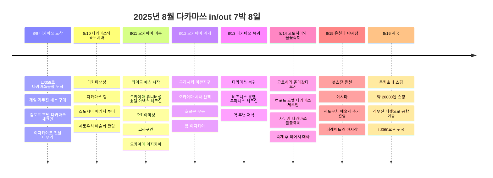
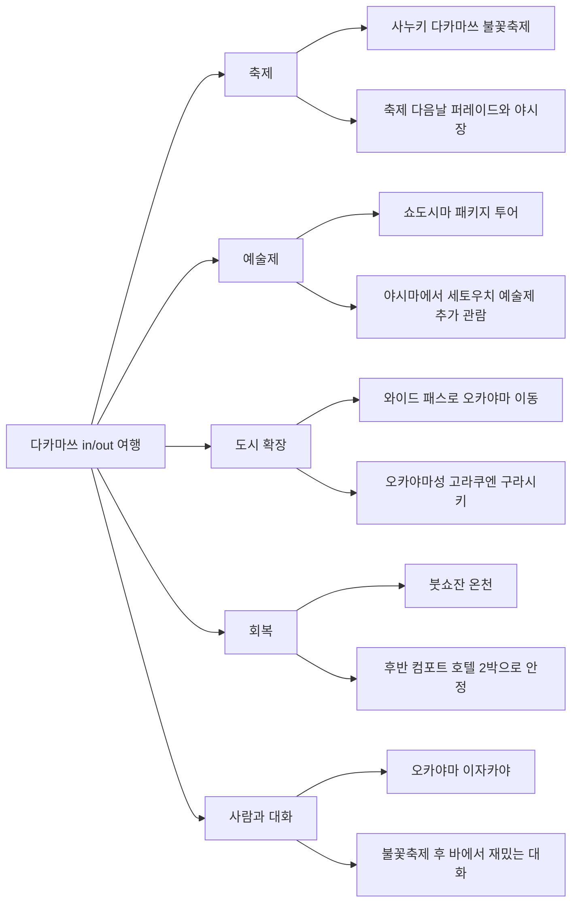

# 2025년 8월 다카마쓰·오카야마 세토우치 예술제 여행

2025년 8월 9일에 다카마쓰로 들어가 8월 16일에 다시 다카마쓰공항으로 나오는 7박 8일 일정. 중심은 세토우치 예술제, 쇼도시마 패키지 투어, 오카야마와 구라시키, 고토히라, 사누키 다카마쓰 불꽃축제, 붓쇼잔 온천, 야시마, 축제 다음날 퍼레이드와 야시장이다.

이 일정은 꽤 괜찮다. 한 도시 왕복으로 항공은 단순하게 두고, 중간에는 와이드 패스로 오카야마를 넓게 쓰고, 다시 다카마쓰로 돌아와 고토히라와 축제, 온천과 야시장으로 후반을 닫았다. 숙소 이동이 많아 보이지만, 오카야마에서 다카마쓰로 돌아오는 중간에 역 앞 1박을 둔 덕분에 복귀 동선이 끊기지 않는다.

## 여행 개요

- 기간: 2025년 8월 9일 ~ 8월 16일
- 형태: 다카마쓰 in/out, 7박 8일
- 항공: 진에어 LJ359, LJ360로 다카마쓰 왕복
- 교통: 다카마쓰공항에서 레일 & 리무진 패스 구매, 3일차부터 와이드 패스 활용
- 핵심: 세토우치 예술제, 쇼도시마, 오카야마, 구라시키, 고토히라, 사누키 다카마쓰 불꽃축제, 붓쇼잔 온천, 야시마, 퍼레이드와 야시장
- 음식 기억: 첫날 이자카야, 오카야마 이자카야, 호르몬 우동, 축제 후 바, 야시장

## 교통권과 항공 메모

| 항목 | 기록 금액 | 근거/메모 |
|------|----------|----------|
| 레일 & 리무진 패스 | 3,800엔 | 다카마쓰공항 한정 세트권. 고토덴 리무진버스 승차권 2장과 고토덴 전철 1일 승차권 2장 |
| 와이드 패스 | 12,000엔 | 다카마쓰, 오카야마, 구라시키를 묶은 패스 후보. 공식 현재 가격 기준이라 실제 영수증 확인 시 조정 |
| 진에어 다카마쓰 왕복 | 금액 미확인 | 현재 다카마쓰공항 공개 시간표에서도 LJ359, LJ360 조합이 확인됨 |

## 숙박 흐름

| 구간 | 숙소 | 박수 | 의도 |
|------|------|------|------|
| 초반 | 컴포트 호텔 다카마쓰 | 2박 | 도착 직후 다카마쓰 시내와 쇼도시마 투어 베이스 |
| 중반 | 오카야마 유니버셜 호텔 아넥스 | 2박 | 오카야마성, 고라쿠엔, 구라시키를 편하게 보기 위한 베이스 |
| 복귀일 | 비즈니스 호텔 루파니스 | 1박 | 오카야마에서 다카마쓰로 돌아오는 중간 완충, 역 앞 동선 |
| 후반 | 컴포트 호텔 다카마쓰 | 2박 | 고토히라, 불꽃축제, 붓쇼잔 온천, 야시마 후반 일정 베이스 |

## 일정 요약

| 날짜 | 베이스 | 시간 배분 | 주요 일정 | 포인트 |
|------|--------|----------|----------|--------|
| 8/9 | 다카마쓰 | 오후 도착, 저녁 식사 | LJ359 도착, 레일 & 리무진 패스 구매, 컴포트 체크인, 이자카야 | 무리하지 않고 시작 |
| 8/10 | 다카마쓰 | 오전 시내, 낮 섬 투어 | 다카마쓰성, 다카마쓰 항, 쇼도시마 패키지 투어 | 세토우치 예술제 첫 축 |
| 8/11 | 오카야마 | 이동, 오후 관광, 밤 식사 | 와이드 패스 시작, 오카야마성, 고라쿠엔, 이자카야 | 다카마쓰에서 오카야마로 확장 |
| 8/12 | 오카야마 | 낮 근교, 밤 음식 | 구라시키 미관지구, 오카야마 밤, 호르몬 우동 | 도시 분위기 전환 |
| 8/13 | 다카마쓰 | 복귀, 체크인, 저녁 | 다카마쓰 복귀, 루파니스 체크인, 역 주변 저녁 | 오카야마에서 축제권으로 복귀 |
| 8/14 | 다카마쓰 | 낮 원정, 밤 축제 | 고토히라 올라갔다 오기, 컴포트 체크인, 사누키 다카마쓰 불꽃축제, 축제 후 바 | 여행의 밤 하이라이트 |
| 8/15 | 다카마쓰 | 온천, 전망, 밤 축제 | 붓쇼잔 온천, 야시마, 세토우치 예술제 관람, 퍼레이드와 야시장 | 회복 후 다시 축제 |
| 8/16 | 다카마쓰 | 쇼핑, 공항 이동 | 돈키호테 쇼핑, 리무진 티켓으로 다카마쓰공항 복귀, LJ360 귀국 | 쇼핑 후 깔끔한 out |

## 일정 타임라인

## 관점 포인트

## 8/9 - 다카마쓰 도착과 첫 이자카야

첫날은 진에어 LJ359로 다카마쓰공항에 들어와서 레일 & 리무진 패스를 산 날. 고토덴 리무진버스 승차권 2장과 고토덴 전철 1일 승차권 2장이 묶인 3,800엔 세트라, 시작부터 공항 이동과 시내 전철 이동의 큰 틀이 잡혔다.

숙소는 컴포트 호텔 다카마쓰. 첫날에는 무리해서 관광지를 많이 넣기보다 짐을 풀고 이자카야로 끝낸 게 좋다. 8월 더위와 이동 피로를 생각하면 첫날은 이렇게 가볍게 여는 편이 다음 날 쇼도시마 투어에 더 맞다.

## 8/10 - 다카마쓰성과 쇼도시마 패키지 투어

둘째 날은 다카마쓰 시내와 섬을 같이 쓴 날. 다카마쓰성을 먼저 보고, 다카마쓰 항을 통해 쇼도시마 패키지 투어로 이어지는 흐름이다.

쇼도시마는 세토우치 예술제와 가장 잘 맞는 카드다. 혼자 대중교통과 배 시간을 맞추는 것보다 패키지 투어를 쓴 덕분에 여름철 이동 피로가 줄었을 가능성이 크다. 이 날은 바다, 섬, 예술제를 한 번에 열어준 초반 하이라이트다.

## 8/11 - 와이드 패스로 오카야마 이동

셋째 날부터 와이드 패스를 쓰며 다카마쓰에서 오카야마로 넘어간다. 숙소는 오카야마 유니버셜 호텔 아넥스 2박.

사용 기억은 카가와 와이드 패스에 가깝지만, 다카마쓰와 오카야마를 함께 커버하는 현재 공식 상품 기준으로는 Kansai WIDE Area Pass 5일권 12,000엔이 가장 가까운 후보다. 실제 영수증이나 바우처가 나오면 이름과 금액은 그쪽으로 맞추면 된다.

오카야마성, 고라쿠엔을 묶은 건 정석이면서도 좋은 선택이다. 다카마쓰와 쇼도시마의 바다 느낌에서, 오카야마의 성과 정원으로 분위기가 바뀐다. 밤에는 오카야마 이자카야를 넣어서 이동일이 밋밋하지 않게 마무리된다.

## 8/12 - 구라시키 미관지구와 오카야마 음식

오카야마 2박의 장점은 구라시키를 무리 없이 넣을 수 있다는 점이다. 미관지구는 낮에 산책하기 좋고, 운하와 오래된 건물 분위기 덕분에 다카마쓰나 쇼도시마와는 완전히 다른 장면이 생긴다.

오카야마에서 먹은 호르몬 우동이 맛있었다는 기억도 중요하다. 이 여행은 예술제와 축제뿐 아니라, 지역 음식을 따라가는 재미가 꽤 살아 있다.

## 8/13 - 다카마쓰 복귀와 루파니스 1박

오카야마에서 다카마쓰로 돌아와 비즈니스 호텔 루파니스에 1박을 둔 날. 다카마쓰역 앞에 숙소를 잡아두면 오카야마 2박 뒤 동선이 끊기지 않고, 다음날 고토히라와 축제로 넘어가기 전 베이스를 다시 다카마쓰 쪽으로 당겨올 수 있다.

이 날은 축제 하이라이트 직전의 정리일로 두는 편이 자연스럽다. 오카야마권을 닫고, 다카마쓰 시내로 돌아와 다음날 고토히라와 불꽃축제를 받을 준비를 한 날이다.

## 8/14 - 고토히라와 사누키 다카마쓰 불꽃축제

다시 컴포트 호텔 다카마쓰로 돌아와 후반 2박을 시작한다. 이 날은 고토히라를 다녀온 뒤, 밤에는 사누키 다카마쓰 불꽃축제를 보러 간 날로 정리한다.

고토히라는 체력을 쓰는 코스라 8월에는 오전 중심으로 잡는 게 맞다. 대신 밤에 불꽃축제가 들어오면서 이 날은 여행의 가장 선명한 하루가 된다. 낮에는 계단과 신사, 밤에는 항구 쪽 불꽃과 사람들, 이후 바에서 이어진 대화까지 장면 전환이 좋다.

불꽃축제 자체도 좋지만, 더 기억에 남는 건 축제 끝나고 들른 바에서 재밌는 대화를 많이 나눴다는 점이다. 여행 기록으로 보면 이건 단순한 술 한잔이 아니라, 축제가 사람과 만남으로 이어진 장면이다. 나중에 바 이름이나 위치가 떠오르면 이 날의 밀도가 확 올라갈 것 같다.

## 8/15 - 붓쇼잔 온천, 야시마, 퍼레이드와 야시장

여행 후반에 붓쇼잔 온천을 넣은 건 아주 좋다. 7박 8일 여행에서 계속 걷고 이동하면 후반 피로가 쌓이는데, 온천이 회복 역할을 한다.

야시마에서 세토우치 예술제를 더 관람한 것도 좋은 마무리다. 쇼도시마에서 섬 예술제를 봤고, 야시마에서 다시 세토내해를 바라보며 예술제의 결을 이어간 셈이라 여행 주제가 흐트러지지 않는다.

그리고 저녁에는 축제 다음날 이어진 퍼레이드와 야시장까지 갔다. 이 덕분에 축제가 8/14 불꽃 한 번으로 끝나지 않고, 다음날 거리 분위기와 먹거리, 사람 구경까지 이어진 2일짜리 경험으로 남는다.

## 8/16 - 돈키호테 쇼핑 후 다카마쓰공항으로 복귀

마지막 날은 돈키호테에서 약 20,000엔어치 쇼핑을 하고, 처음에 사둔 리무진 티켓으로 다카마쓰공항에 돌아간다. 시작할 때 산 레일 & 리무진 패스가 마지막 이동까지 닫아주는 구조라, 전체 동선이 깔끔하다.

돈키호테 쇼핑은 이 여행의 마지막 소비 기록으로 따로 남겨둔다. 금액이 확인된 항목이라 `expenses`에도 20,000엔 쇼핑으로 기록했다.

## 일정 평가

전체적으로 좋은 일정이다. 다카마쓰 in/out이라 항공은 단순하고, 중간에 오카야마를 넣어 여행 권역을 넓혔고, 다시 다카마쓰로 돌아와 고토히라, 불꽃축제, 온천, 퍼레이드와 야시장으로 마무리했다. 특히 후반부는 낮에는 회복하거나 이동하고, 밤에는 축제 분위기를 받는 식으로 리듬이 살아 있다.

아쉬운 점을 굳이 꼽으면 8월 더위 속에서 쇼도시마, 오카야마, 구라시키, 고토히라까지 꽤 많이 움직였다는 점이다. 그래도 붓쇼잔 온천과 마지막 컴포트 2박이 있어서 후반 회복 장치가 있다. 다시 짠다면 큰 틀은 유지하고, 고토히라 날만 오전 출발과 낮 휴식을 더 명확히 잡으면 된다.

## 다음에 채울 내용

- 항공권 실제 결제액과 예약 메일 기준 출도착 시간
- 사누키 다카마쓰 불꽃축제의 정확한 관람 위치
- 축제 후 들른 바 이름과 위치
- 쇼도시마 패키지 투어의 세부 코스
- 오카야마 호르몬 우동 식당 이름
- 와이드 패스 실제 구매명과 영수증 금액
- 돈키호테에서 산 품목

## 참고 링크

- [세토우치 트리엔날레 2025 공식 사이트](https://setouchi-artfest.jp/en/)
- [다카마쓰공항 레일 & 리무진 패스 안내](https://www.takamatsu-airport.com/campaign/article/railandlimousinepass2023)
- [JR-WEST Kansai WIDE Area Pass](https://www.westjr.co.jp/global/en/ticket/pass/kansai_wide/)
- [다카마쓰공항 국제선 시간표](https://www.takamatsu-airport.com/timetable/int.php)
