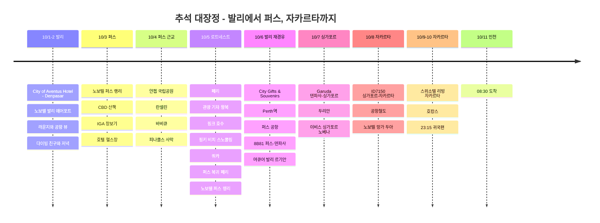

# 추석 대장정: 발리에서 퍼스, 자카르타까지

이번 추석 연휴에는 남들 다 가는 곳 말고 조금 특별한 루트로 떠났다. 발리에서 잠시 숨을 고르고, 호주 퍼스에서 자연과 도시를 천천히 보고, 싱가포르 두리안과 자카르타 호캉스로 마무리한 긴 이동 여행이었다.

## 여행 개요

- **기간**: 2025년 10월 1일 ~ 11일
- **경로**: 인천 → 발리 → 퍼스 → 발리 → 싱가포르 → 자카르타 → 인천
- **숙소**: City of Aventus Hotel - Denpasar, 노보텔 발리 에어포트, 노보텔 퍼스 랭리, 머큐어 발리 르기안, 이비스 싱가포르 노베나, 노보텔 자카르타 망가 두아, 스위소텔 리빙 자카르타
- **테마**: 레이오버 힐링, 퍼스 자연 투어, 로트네스트 쿼카, 두리안, 자카르타 호캉스
- **항공권 결제**: 442,763원 + Rp 3,710,011
- **숙박비 결제**: 951,594원
- **로트네스트 페리**: AUD 118.71 (약 110,400원)
- **피나클스 투어**: 172,142원
- **싱가포르 두리안**: 55,000원
- **자카르타 공항철도**: Rp 65,000 (약 5,800원)
- **현재 입력한 확정 결제**: 1,621,499원 + AUD 118.71 + Rp 3,775,011
- **전체 대략 원화 환산 합계**: 약 2,067,700원
- **총경비**: 남은 식비와 현지 교통비까지 확인 후 업데이트 예정

## 항공권 결제 기록

| 구간 | 항공사/편명 | 일정 | 결제금액 |
|------|-------------|------|----------|
| 인천 → 덴파사, 덴파사 → 싱가포르, 자카르타 → 인천 | Garuda Indonesia | 10/1, 10/7, 10/10-11 | 361,763원 |
| 덴파사 → 퍼스 → 덴파사 | 8B80, 8B81 | 10/3 09:05-12:55, 10/6 13:55-17:40 | Rp 3,710,011 |
| 싱가포르 → 자카르타 | ID7150 | 10/8 | 81,000원 |

## 숙박비 결제 기록

| 날짜 | 숙소 | 객실/박수 | 결제금액 |
|------|------|-----------|----------|
| 10/1 | City of Aventus Hotel - Denpasar | 1박 | 36,000원 |
| 10/2 | 노보텔 발리 응우라 라이 에어포트 | 1박 | 119,975원 |
| 10/3-6 | 노보텔 퍼스 랭리 | 이그제큐티브 스위트룸 3박 | 414,154원 |
| 10/6 | 머큐어 발리 르기안 | 1박 | 76,214원 |
| 10/7 | 이비스 싱가포르 노베나 | 1박 | 120,471원 |
| 10/8 | 노보텔 자카르타 망가 두아 스퀘어 | 1박 | 67,193원 |
| 10/9 | 스위소텔 리빙 자카르타 메가 쿠닝안 | 1박 | 117,587원 |
| 합계 |  | 9박 | 951,594원 |

## 교통·액티비티 결제 기록

| 날짜 | 항목 | 결제금액 | 원화 환산 |
|------|------|----------|-----------|
| 10/4 | 피나클스 사막 노을과 별빛투어 | 172,142원 | 172,142원 |
| 10/5 | 퍼스-로트네스트 섬 왕복 페리 | AUD 118.71 | 약 110,400원 |
| 10/8 | 자카르타 공항철도 | Rp 65,000 | 약 5,800원 |

## 식비 결제 기록

| 날짜 | 항목 | 결제금액 |
|------|------|----------|
| 10/7 | 싱가포르 두리안 | 55,000원 |

## 일정 요약

| 날짜 | 지역 | 주요 일정 |
|------|------|----------|
| 10/1-2 | 발리 | City of Aventus Hotel - Denpasar, 노보텔 발리 에어포트, 라운지, 다이빙 친구와 저녁 |
| 10/3 | 퍼스 | 퍼스 도착, 노보텔 퍼스 랭리 체크인, CBD 산책, IGA 장보기 |
| 10/4 | 퍼스 근교 | 얀쳅 국립공원, 란셀린, 바비큐, 피나클스 사막 |
| 10/5 | 로트네스트 | 퍼스 출발 페리, 관광 기차 왕복, 올리버 힐 요새, 핑크 호수, 핑키 비치 스노쿨링, 쿼카, 퍼스 복귀 페리, 노보텔 퍼스 랭리 1박 |
| 10/6 | 퍼스→발리 | City Gifts & Souvenirs, Perth역, 퍼스 공항, 8B81편으로 발리 복귀, 머큐어 발리 르기안 1박 |
| 10/7 | 발리→싱가포르 | Garuda Indonesia 직항, 싱가포르 두리안, 이비스 노베나 1박 |
| 10/8 | 싱가포르→자카르타 | ID7150편, 공항철도, 노보텔 망가 두아 1박 |
| 10/9-10 | 자카르타 | 스위소텔 리빙 자카르타 호캉스, 23:15 귀국편 |
| 10/11 | 인천 | 08:30 인천 도착 |

## 일정 타임라인

## 인트로

이번 여행의 하이라이트는 한 장면으로 끝나지 않는다. 로트네스트 섬에서 쿼카와 숨바꼭질하듯 마주친 순간, 퍼스 선셋 페리 위에서 본 도심 풍경, 강 위를 떠다니듯 지나가던 포일보드, 그리고 싱가포르에서 먹은 진한 두리안까지. 추석 연휴를 꽉 채운 긴 대장정이었다.

## 발리에서의 레이오버

첫 목적지는 발리였다. 사실 퍼스로 가기 전 잠시 머무는 구간이라, 첫날은 City of Aventus Hotel - Denpasar에서 가볍게 쉬고 다음 날 공항 안에 있는 노보텔 발리 에어포트로 옮겼다. 라운지에서 케이크와 간단한 음식을 먹고, 창밖으로 보이는 공항 뷰를 보니 이제야 여행 온 게 실감났다.

도착해서는 다이빙 마스터 친구를 만났다. 비행 전후로 다이빙을 하기는 어려워서 이번에는 고기만 같이 먹고, 조만간 다시 만나 발리 바다에 들어가자고 약속했다. 다음번에는 발리 바다 속 영상도 같이 담아보고 싶다.

## 퍼스 입성

드디어 호주 퍼스에 도착했다. 이번 숙소는 노보텔 퍼스 랭리의 스위트룸. 거실과 방이 분리되어 있어서 긴 이동 뒤 쉬기에 정말 쾌적했다.

체크인 후 퍼스 시내를 걸어봤는데, 건물과 바다, 거리 분위기가 모두 예뻤다. 공기부터 다르게 느껴지는 도시였다.

## 퍼스에서 살아남기

여행자에게 중요한 건 역시 물가다. 근처 IGA 마트에 들러 아이스크림, 과일, 코코넛 워터, 샌드위치 같은 것들을 둘러봤다. 아이스크림은 비싼 편이었지만 과일은 품질이 좋았고, 특히 딸기가 마음에 들어 두 팩이나 사 먹었다.

코코넛 워터도 빠질 수 없다. 여행 갈 때마다 꼭 사 먹는 편인데, 퍼스에서 마신 코코넛 워터도 만족스러웠다. 소고기나 햄 같은 식재료는 한국보다 저렴하게 느껴져서, 샌드위치 하나 사 들고 바다 보며 먹기 딱 좋았다.

숙소로 돌아오니 웰컴 기프트로 와인과 물이 준비되어 있었다. 아코르 플래티넘 멤버 혜택으로 받은 작은 대접인데, 이런 순간들이 긴 이동의 피로를 싹 풀어준다. 호텔 헬스장 뷰도 좋아서 낮에는 바다를 보며 운동할 수 있었다.

## 얀쳅, 란셀린, 피나클스

퍼스 근교 투어로는 얀쳅 국립공원, 란셀린, 피나클스 사막을 묶었다. 얀쳅에서는 코알라를 보고, 란셀린에서는 바다와 강이 만나는 절경을 감상했다.

저녁에는 가이드님이 준비해주신 바비큐를 먹었다. 캠핑장 무료 그릴로 구운 소고기가 생각보다 훨씬 좋았고, 자연 속에서 먹는 저녁이라 더 기억에 남았다.

투어의 하이라이트는 피나클스 사막이었다. 모래가 깎여나가며 드러난 사암 기둥들이 끝없이 서 있는 풍경은 정말 다른 행성 같았다.

## 로트네스트 섬과 쿼카

가장 기대했던 날은 로트네스트 섬에 가는 날이었다. 페리를 타고 섬으로 향하는데, 도심 경관이 보이는 그 여유가 너무 좋았다.

섬에서는 관광 기차를 왕복으로 타고 과거 요새였던 구역을 둘러봤다. 중간에 핑크 호수도 지나갔는데, 시기가 잘 맞아야 진한 핑크색을 볼 수 있다고 한다. 웅장한 대포와 한국에서는 보기 어려운 호주의 생물, 섬 특유의 지형까지 눈을 뗄 수 없는 풍경이 이어졌다.

핑키 비치에서는 스노쿨링도 했다. 로트네스트 섬의 맑은 물빛을 직접 보고 나니, 쿼카만 보러 가는 섬이 아니라 바다까지 같이 즐기는 곳이라는 느낌이 더 강하게 남았다.

그리고 드디어 만난 섬의 주인공, 쿼카. 웃는 얼굴이 매력적이지만 만지면 벌금이 있으니 눈으로만 예뻐했다. 그래도 가까이에서 보는 것만으로 충분히 귀여웠다.

섬 일정이 끝난 뒤에는 다시 페리를 타고 퍼스로 돌아와 노보텔 퍼스 랭리에서 한 번 더 묵었다. 로트네스트는 하루 왕복 코스로 다녀온 일정이라, 다음 이동은 섬에서 바로 발리로 간 게 아니라 퍼스 시내로 복귀한 뒤 하루 쉬고 움직이는 흐름이었다.

## 안녕 퍼스, 그리고 싱가포르 두리안

퍼스에서의 여정을 마치고 돌아가는 길, 페리 위에서 선셋을 즐겼다. 저 멀리 포일보드를 타는 사람이 보였는데, 물 위로 떠서 지나가는 모습이 신기했다.

10월 6일에는 퍼스 City Gifts & Souvenirs에서 기념품을 사고, Perth역에서 공항으로 이동했다. 이후 퍼스 공항에서 8B81편을 타고 다시 발리로 돌아왔다. 이 날은 머큐어 발리 르기안에서 1박하며 하루 쉬어가고, 10월 7일 Garuda Indonesia 직항으로 싱가포르에 도착했다.

싱가포르에서는 이비스 싱가포르 노베나에서 1박했다. 물가는 호주보다 세게 느껴졌지만, 여기에는 내가 좋아하는 두리안이 있다. 싱가포르 두리안은 좋은 품질만 들어와서 그런지 향도 부담이 덜하고 당도가 진했다. 가격은 55,000원이라 웃음이 나왔지만, 맛만큼은 확실히 기억에 남았다.

## 마지막 여정, 자카르타

마지막 도시는 자카르타였다. 10월 8일 ID7150편으로 싱가포르에서 자카르타로 이동했고, 공항에서는 공항철도를 이용했다. 생각보다 인프라가 정말 잘 되어 있었다. 청결하고 안락해서 이동 자체가 꽤 편했다.

첫날은 노보텔 자카르타 망가 두아에서 1박을 하고, 다음 날은 스위소텔 리빙 자카르타로 옮겼다. 대리석 인테리어와 거실, 방이 분리된 스위트룸 덕분에 긴 여행의 마지막을 제대로 호강하며 마무리했다.

10월 10일 밤 23:15에는 Garuda Indonesia 직항으로 자카르타를 떠났고, 10월 11일 아침 08:30 인천에 도착했다. 길고 긴 추석 대장정의 진짜 마침표였다.

## 에필로그

현재 입력한 항공권은 Garuda Indonesia 3구간 361,763원, 발리-퍼스 왕복 Rp 3,710,011, 싱가포르-자카르타 81,000원이다. 숙박비는 9박 합계 951,594원, 피나클스 투어는 쿠폰 적용 172,142원, 로트네스트 왕복 페리는 AUD 118.71, 싱가포르 두리안은 55,000원, 자카르타 공항철도는 Rp 65,000으로 정리했다. 대략 환산하면 페리는 약 110,400원, 공항철도는 약 5,800원 정도다. 나머지 현지 교통과 식비는 카드 내역과 영수증을 한 번 더 확인한 뒤 총경비에 반영할 예정이다.

숙박을 미리 잡고, 대중교통을 적극적으로 이용하고, 외식을 줄인 덕분에 긴 이동 거리와 기간에 비해 꽤 가성비 좋은 여행이었다.

개발자로 일하다 보면 번아웃이 올 때도 있는데, 이렇게 한 번씩 세상 밖으로 나와 새로운 장면을 보는 게 다시 코드를 짤 수 있는 원동력이 된다. 퍼스의 바람, 로트네스트의 쿼카, 싱가포르의 두리안, 자카르타의 편안한 마지막 밤까지 오래 기억에 남을 추석 여행이었다.
