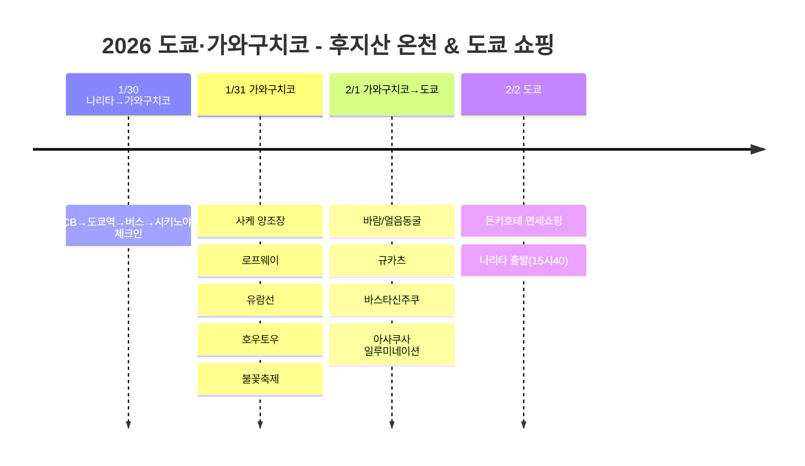

# 2026 도쿄·가와구치코: 후지산 온천 & 도쿄 쇼핑

후지산이 보이는 가와구치코 온천 료칸에서 힐링하고, 동굴 탐방, 불꽃축제, 도쿄 아사쿠사에서 겨울 일루미네이션과 맛집 탐방!

## 📍 여행 개요

- **기간**: 2026년 1월 30일 ~ 2월 2일 (3박 4일)
- **경로**: 나리타 IN → 도쿄역 → 가와구치코 (2박) → 신주쿠 → 아사쿠사 (1박) → 나리타 OUT
- **테마**: 온천 힐링 + 후지산 전망 + 동굴 탐방 + 도쿄 쇼핑
- **교통**: 렌트 없이 대중교통으로!

## 🗓️ 일정 요약

| 날짜 | 지역 | 주요 일정 |
|------|------|----------|
| 1/30 | 나리타→가와구치코 | LCB→도쿄역→버스→**시키노야도 체크인** |
| 1/31 | 가와구치코 | 사케 양조장, 로프웨이, 유람선, 호우토우, **불꽃축제** |
| 2/1 | 가와구치코→도쿄 | **바람/얼음동굴**, 규카츠, 바스타신주쿠, **아사쿠사 일루미네이션** |
| 2/2 | 도쿄 | **돈키호테 면세쇼핑**, 나리타 출발(15:40) |

## 일정 타임라인

## 💰 교통비 정리

| 구간 | 교통편 | 비용 |
|------|--------|------|
| 나리타 → 도쿄역 | LCB 버스 | 1,500엔 |
| 도쿄역 → 가와구치코 | 고속버스 (15:30) | 2,300엔 |
| 가와구치코 역 → 숙소 | 주유버스 | 180엔 |
| 2일 버스 패스 + 로프웨이 + 유람선 | 세트 패스 | 3,300엔 |
| 바람동굴 + 얼음동굴 | 세트 입장권 | 600엔 |
| 가와구치코 → 바스타 신주쿠 | 고속버스 (사전예약) | 2,000엔 |
| 도쿄 지하철 | 24시간권 | 800엔 |
| 아사쿠사 → 나리타 | 나리타 엑세스 특급 (24시간권 활용) | 1,000엔 |

> 📌 **주유버스 정보**: https://www.fujikyubus.co.jp/shuyu

## 🗻 하이라이트

### 시키노야도 (1/30-2/1, 2박)
- 가와구치코 온천 료칸
- 대욕탕 & 족욕 힐링
- 주유버스로 180엔에 이동

### 이데 사케 양조장 투어 (1/31)
- 오전 9:30 투어 시작 (1,500엔)
- 후지산 지하수로 만든 사케 시음

### 로프웨이 & 유람선 (1/31)
- 2일 버스 패스 세트로 가성비 좋게!
- 카치카치야마에서 후지산 파노라마 전망

### 호우토우 맛집 (1/31)
- 甲州ほうとう小作 河口湖店
- 니쿠 호우토우 + 뎀푸라 세트
- 대기 약 30분 (인기 맛집!)

### 가와구치코 불꽃축제 (1/31)
- 오후 8시~8시 20분
- 후지산을 배경으로 펼쳐지는 환상적인 불꽃놀이
- 푸드트럭에서 야키소바 먹으면서 관람

### 바람동굴 & 얼음동굴 (2/1)
- 오전 9:18 첫차 (그린라인) 이용
- 세트 입장권 600엔
- 얼음동굴에서 블루라인으로 복귀

### 규카츠 맛집 - 甲州家 (2/1)
- 별점 높은데 줄이 없어서 바로 입장
- 규카츠 진짜 맛있었음!

### 아사쿠사 일루미네이션 & 우시미츠 (2/1)
- 도쿄 서브웨이 24시간권으로 이동
- 센소지, 일루미네이션 구경
- 우시미츠에서 소고기 덮밥으로 저녁

## 💡 팁

1. **가와구치코 패스**: 2일 버스 패스 + 로프웨이 + 유람선 세트 3,300엔이 가성비 최고!
2. **동굴 세트권**: 바람동굴 + 얼음동굴 세트 600엔 (각각 사면 700엔)
3. **고속버스 예약**: 사전예약하면 더 저렴해요
4. **불꽃축제**: 추우니까 핫팩 필수! 푸드트럭도 있어요
5. **귀국 교통**: 나리타 엑세스 특급이 저렴하고 빠름

---

후지산 아래 온천, 동굴 탐방, 불꽃축제, 그리고 도쿄 맛집까지! 🗻✨
