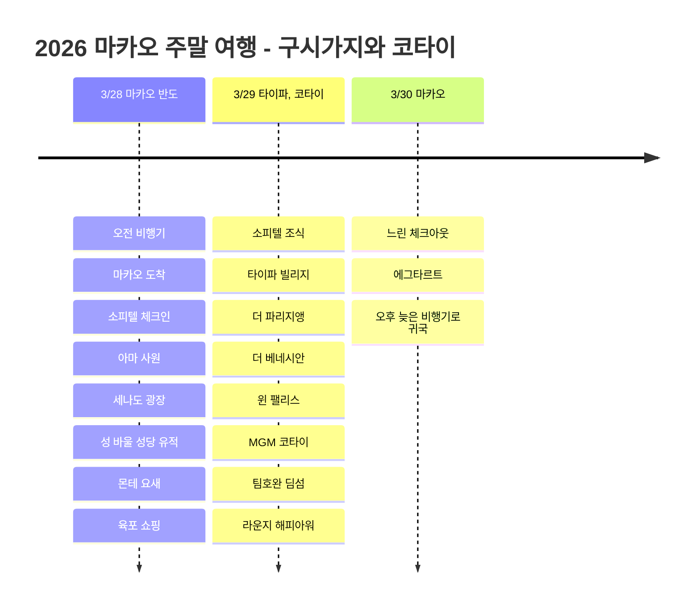

# 2026 마카오 주말 여행: 구시가지와 코타이

3월 말, 에어마카오 오전 비행기로 떠난 2박 3일 마카오 여행. 숙소는 소피텔 마카오 앳 폰테16로 잡고, 첫날은 마카오 반도 구시가지, 둘째 날은 타이파와 코타이 리조트 구역을 보는 흐름으로 채웠다.

## 여행 개요

- 기간: 2026년 3월 28일 ~ 30일
- 항공: 에어마카오
- 숙소: 소피텔 마카오 앳 폰테16
- 혜택: 아코르 플래티넘 조식과 라운지 해피아워
- 경로: 인천 -> 마카오 -> 인천

## 일정 요약

| 날짜 | 지역 | 주요 일정 |
|------|------|----------|
| 3/28 | 마카오 반도 | 오전 비행기, 마카오 도착, 소피텔 체크인, 아마 사원, 세나도 광장, 성 바울 성당 유적, 몬테 요새, 육포 쇼핑 |
| 3/29 | 타이파, 코타이 | 소피텔 조식, 타이파 빌리지, 더 파리지앵, 더 베네시안, 윈 팰리스, MGM 코타이, 팀호완 딤섬, 라운지 해피아워 |
| 3/30 | 마카오 | 느린 체크아웃, 에그타르트, 오후 늦은 비행기로 귀국 |

## 일정 타임라인

## 3/28 - 오전 비행기로 마카오 도착

에어마카오 오전 비행기로 출발해서 점심 무렵 마카오에 닿는 일정. 공항에서 마카오 반도 쪽으로 이동해 소피텔 마카오 앳 폰테16에 짐을 두고, 첫날은 호텔 주변 구시가지를 중심으로 천천히 걸었다.

소피텔은 세나도 광장과 성 바울 성당 유적 쪽으로 이동하기 좋은 위치라 짧은 2박 3일 일정에서 효율적인 베이스가 된다. 아코르 플래티넘 혜택으로 조식과 라운지 해피아워를 챙길 수 있어 일정 중간에 쉬어가기에도 괜찮은 숙소였다.

첫날 코스는 아마 사원에서 시작해 세나도 광장, 성 바울 성당 유적, 몬테 요새로 이어지는 마카오 반도 산책. 포르투갈풍 바닥 무늬와 오래된 성당 유적, 좁은 골목이 이어져 마카오에 왔다는 느낌이 바로 잡히는 구간이다. 세나도 광장 근처에서는 거이케이 육포 같은 간식 쇼핑도 가볍게 넣기 좋다.

## 3/29 - 타이파와 코타이 리조트 투어

둘째 날은 소피텔 조식으로 시작해 타이파 빌리지로 넘어갔다. 타이파 빌리지는 에그타르트와 작은 가게들을 보며 걷기 좋고, 코타이 리조트 구역과 가까워 동선을 이어 붙이기 편하다.

오후에는 더 파리지앵 마카오, 더 베네시안 마카오, 윈 팰리스, MGM 코타이를 돌며 코타이 스트립의 큰 리조트들을 구경했다. 구시가지의 낮은 골목과 코타이의 거대한 리조트가 하루 사이에 확 바뀌는 것이 마카오 여행의 재미다.

식사는 팀호완에서 딤섬을 먹는 흐름으로 잡았다. 베이크드 차슈바오나 하가우처럼 여러 메뉴를 나눠 먹기 좋고, 이후 소피텔 라운지 해피아워로 돌아오면 하루 일정이 과하지 않게 마무리된다.

## 3/30 - 에그타르트와 늦은 오후 귀국

마지막 날은 오후 늦은 비행기라 아침을 급하게 쓸 필요가 없는 일정. 조식과 체크아웃을 여유 있게 하고, 남은 간식 쇼핑이나 에그타르트를 챙긴 뒤 마카오 국제공항으로 이동했다.

2박 3일 안에 구시가지, 타이파, 코타이를 모두 넣은 일정이라 도시의 대비를 빠르게 보기 좋았다. 오래된 거리와 큰 리조트, 딤섬과 에그타르트까지 짧지만 밀도 있는 주말 여행이었다.
