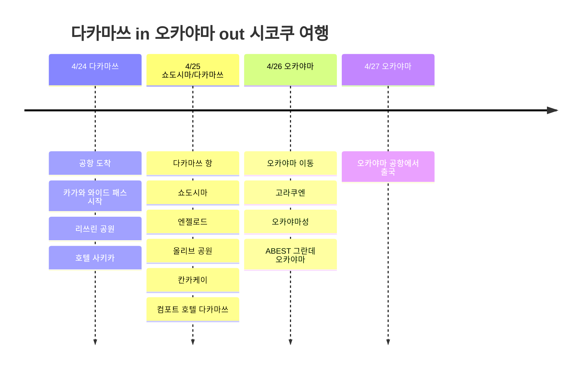

# 다카마쓰 in 오카야마 out 시코쿠 여행

4월 말, 다카마쓰로 들어가 오카야마에서 나오는 3박 4일 일정. 핵심은 카가와 와이드 패스를 사서 다카마쓰와 쇼도시마를 묶어 움직인 점이다.

## 여행 개요

- 기간: 2026년 4월 24일 ~ 27일
- 경로: 다카마쓰 in → 쇼도시마 → 오카야마 out
- 패스: 카가와 와이드 패스
- 숙소: 호텔 사키카, 컴포트 호텔 다카마쓰, ABEST 그란데 오카야마

## 일정 요약

| 날짜 | 지역 | 주요 일정 |
|------|------|----------|
| 4/24 | 다카마쓰 | 공항 도착, 카가와 와이드 패스 시작, 리쓰린 공원, 호텔 사키카 |
| 4/25 | 쇼도시마/다카마쓰 | 다카마쓰 항, 쇼도시마, 엔젤로드, 올리브 공원, 칸카케이, 컴포트 호텔 다카마쓰 |
| 4/26 | 오카야마 | 오카야마 이동, 고라쿠엔, 오카야마성, ABEST 그란데 오카야마 |
| 4/27 | 오카야마 | 오카야마 공항에서 출국 |

## 일정 타임라인

## 4/24 - 다카마쓰 도착과 시내 적응

다카마쓰 공항으로 들어와 시내로 이동. 이번 여행은 카가와 와이드 패스를 산 게 포인트라, 첫날부터 다카마쓰역과 항구를 기준으로 동선을 잡았다.

첫날은 이동 피로를 감안해 다카마쓰 시내를 가볍게 보는 구성. 리쓰린 공원은 다카마쓰에서 가장 안정적인 첫 코스다. 정원 규모가 크고 산 배경까지 같이 보여서, 짧은 일정에서도 카가와 여행이 시작됐다는 느낌이 난다.

## 4/25 - 쇼도시마 당일치기

이 여행의 중심은 쇼도시마. 다카마쓰 항에서 페리로 들어가 도노쇼항에 도착하는 흐름으로 잡았다. 카가와 와이드 패스를 산 덕분에 페리와 지역 이동을 여행의 일부처럼 쓸 수 있었다.

쇼도시마에서는 엔젤로드, 올리브 공원, 칸카케이를 중심으로 기록했다. 엔젤로드는 물때가 맞으면 길이 열리는 바닷길이고, 올리브 공원은 쇼도시마의 대표 이미지인 올리브와 지중해풍 풍경을 보기 좋은 곳이다. 칸카케이는 섬의 산 쪽 풍경이라, 바다와 올리브만 보고 끝나는 일정보다 입체감이 생긴다.

저녁에는 다카마쓰로 돌아와 컴포트 호텔 다카마쓰에서 1박. 하루 안에 항구, 섬, 산, 바다를 모두 찍는 꽤 알찬 날이었다.

## 4/26 - 오카야마로 이동

다카마쓰에서 오카야마로 넘어가 여행의 마지막 도시로 분위기를 바꿨다. 오카야마에서는 고라쿠엔과 오카야마성을 묶어 보기 좋다. 고라쿠엔은 넓은 정원이고, 오카야마성은 검은 외관 때문에 고라쿠엔과 같이 보면 대비가 좋다.

숙소는 ABEST 그란데 오카야마. 다음 날 오카야마 공항으로 나가는 일정이라, 마지막 밤은 이동하기 편한 오카야마 시내에 두는 구성이 자연스럽다.

## 4/27 - 오카야마 out

마지막 날은 오카야마 공항에서 출국. 다카마쓰로 들어와 쇼도시마를 거치고 오카야마에서 나가는, 세토내해 쪽 동선을 잘 살린 일정이었다.
