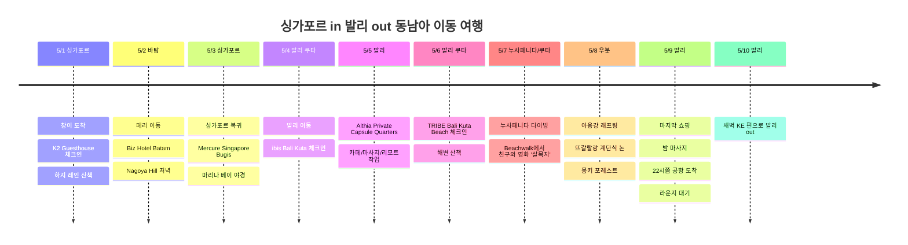

# 싱가포르 in 발리 out 동남아 이동 여행

5월 초, 싱가포르로 들어가 바탐을 거쳐 발리에서 나오는 긴 이동 여행. 도시 이동이 많은 앞부분과, 쿠타 비치 근처에서 속도를 늦추는 뒷부분이 대비되는 일정이다.

## 여행 개요

- 기간: 2026년 5월 1일 ~ 10일
- 경로: 싱가포르 → 바탐 → 싱가포르 → 발리
- 숙소: K2 Guesthouse, Biz Hotel Batam, Mercure Singapore Bugis, ibis Bali Kuta, Althia Private Capsule Quarters, TRIBE Bali Kuta Beach
- 메모: 마지막 날은 숙박 없이 5/9 밤 마사지 후 공항 라운지에서 쉬다가 5/10 새벽 KE 편으로 출국

## 일정 요약

| 날짜 | 지역 | 숙소/이동 |
|------|------|----------|
| 5/1 | 싱가포르 | 창이 도착, K2 Guesthouse 체크인, 하지 레인 산책 |
| 5/2 | 바탐 | 페리 이동, Biz Hotel Batam, Nagoya Hill 저녁 |
| 5/3 | 싱가포르 | 싱가포르 복귀, Mercure Singapore Bugis, 마리나 베이 야경 |
| 5/4 | 발리 쿠타 | 발리 이동, ibis Bali Kuta 체크인 |
| 5/5 | 발리 | Althia Private Capsule Quarters, 카페/마사지/리모트 작업 |
| 5/6 | 발리 쿠타 | TRIBE Bali Kuta Beach 체크인, 해변 산책 |
| 5/7 | 누사페니다/쿠타 | 누사페니다 다이빙, Beachwalk에서 친구와 영화 '살목지' |
| 5/8 | 우붓 | 아융강 래프팅, 뜨갈랄랑 계단식 논, 몽키 포레스트 |
| 5/9 | 발리 | 마지막 쇼핑, 밤 마사지, 22시쯤 공항 도착, 라운지 대기 |
| 5/10 | 발리 | 새벽 KE 편으로 발리 out |

## 일정 타임라인

## 5/1 - 싱가포르 도착

창이공항으로 들어와 첫날은 싱가포르 시내에 가볍게 적응하는 날. K2 Guesthouse에 짐을 두고 부기스, 하지 레인, 아랍 스트리트 쪽을 걸으면 도착일치고 부담이 적다. 저녁은 싱가포르답게 호커센터나 근처 로컬 식당으로 마무리.

## 5/2 - 페리 타고 바탐으로

하버프론트에서 페리를 타고 바탐으로 넘어가는 날. 바탐에서는 Biz Hotel Batam에 1박한다. 숙소가 Nagoya 쪽이라 하버 베이 페리터미널에서 이동하기 좋고, Nagoya Hill 주변에서 쇼핑몰, 마사지, 저녁 식사를 묶기 편하다.

## 5/3 - 싱가포르로 돌아와 부기스

짧은 바탐 1박을 마치고 다시 싱가포르로 복귀. Mercure Singapore Bugis에 체크인한 뒤, 낮에는 부기스와 시티홀 쪽을 천천히 보고 밤에는 마리나 베이 야경까지 이어가기 좋은 날이다.

## 5/4 - 발리 이동

싱가포르 구간을 마치고 발리로 이동. 응우라라이 국제공항에 도착한 뒤 첫 숙소는 ibis Bali Kuta. 이 날은 공항 이동과 체크인만으로도 충분해서 쿠타 주변에서 저녁 먹고 쉬는 정도가 좋다.

## 5/5 - 캡슐 숙소와 느슨한 하루

Althia Private Capsule Quarters에서 1박. 이동이 많은 일정 중간이라 카페에서 쉬거나, 짧게 리모트 작업을 하거나, 마사지로 컨디션을 회복하는 날로 잡기 좋다.

## 5/6 - 쿠타 비치 베이스

여행 후반의 메인 베이스는 TRIBE Bali Kuta Beach. 쿠타 비치가 바로 앞이라 아침 산책, 석양, Beachwalk 쇼핑몰, 호텔 수영장, 카페를 느슨하게 반복하기 좋다.

## 5/7 - 누사페니다 다이빙과 Beachwalk 영화

5/7은 쿠타에서 쉬는 날이 아니라 바다로 나간 날. 사누르 항 쪽으로 이동해 보트를 타고 누사페니다 주변에서 다이빙을 했다. 누사페니다는 발리 본섬과는 물빛과 지형이 확 달라서, 이번 여행에서 가장 액티비티다운 하루였다.

다이빙 후에는 쿠타로 돌아와 Beachwalk에서 친구와 영화 '살목지'도 봤다. 바다에서 하루를 보내고 쇼핑몰 영화관으로 들어가는 흐름이 묘하게 현실적인 여행의 쉼표처럼 남았다.

## 5/8 - 우붓 투어

5/8은 우붓으로 올라간 날. 아융강 래프팅으로 시작해서, 계단식 논 풍경을 보고, 마지막으로 몽키 포레스트까지 묶었다. 전날이 바다였다면 이 날은 완전히 내륙의 발리였다.

아융강 래프팅은 숲과 강을 따라 내려가는 코스라 쿠타의 해변 분위기와 다르게 몸을 쓰는 재미가 있었다. 뜨갈랄랑 계단식 논은 사진으로 많이 보던 발리의 초록색 장면이고, 몽키 포레스트는 우붓 특유의 사원과 숲 분위기까지 같이 느낄 수 있는 코스였다.

## 5/9-5/10 - 마사지, 라운지, 새벽 KE 출국

마지막 날은 숙박 없이 넘어가는 일정. 쿠타 주변에서 마지막 쇼핑과 짐 정리를 마친 뒤, 밤에는 마사지로 시간을 보내고 몸을 풀었다.

마사지 후 밤 10시쯤 응우라라이 국제공항에 도착해 라운지에서 대기. 5/10 새벽 KE 편으로 발리를 떠나는 흐름이라, 실제 여행의 마지막 밤은 호텔이 아니라 공항 라운지에서 마무리한 셈이다.
