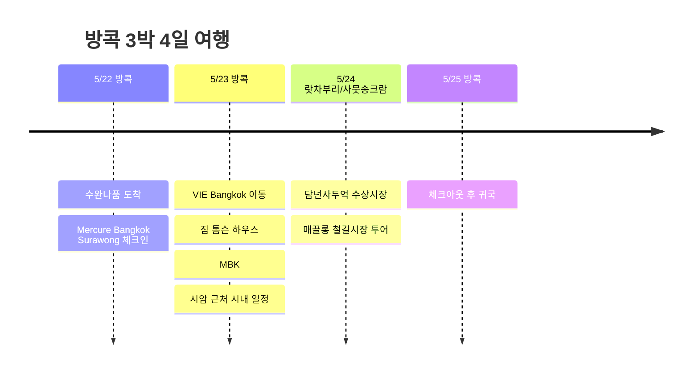

# 방콕 3박 4일 여행

5월 말, 방콕 왕복으로 다녀오는 3박 4일 일정. 첫날은 수라웡에서 가볍게 시작하고, 이후에는 라차테위 쪽 VIE Bangkok을 베이스로 시내와 근교 투어를 묶었다.

## 여행 개요

- 기간: 2026년 5월 22일 ~ 25일
- 경로: 방콕 왕복
- 숙소: Mercure Bangkok Surawong 1박, VIE Bangkok 2박
- 하이라이트: 담넌사두억 수상시장, 매끌롱 철길시장, 시암 쇼핑

## 일정 요약

| 날짜 | 지역 | 주요 일정 |
|------|------|----------|
| 5/22 | 방콕 | 수완나품 도착, Mercure Bangkok Surawong 체크인 |
| 5/23 | 방콕 | VIE Bangkok 이동, 짐 톰슨 하우스, MBK, 시암 근처 시내 일정 |
| 5/24 | 랏차부리/사뭇송크람 | 담넌사두억 수상시장, 매끌롱 철길시장 투어 |
| 5/25 | 방콕 | 체크아웃 후 귀국 |

## 일정 타임라인

## 5/22 - 수라웡에서 시작

방콕 도착 후 첫 1박은 Mercure Bangkok Surawong. 긴 이동일에는 너무 빡빡한 일정보다는 호텔 주변에서 가볍게 밥 먹고, 다음 날부터 움직이기 좋게 컨디션을 맞추는 쪽이 잘 맞는다.

## 5/23 - VIE Bangkok으로 이동

두 번째 숙소는 VIE Hotel Bangkok - MGallery. 라차테위 BTS 근처라 시암 쪽으로 이동하기 편하고, 쇼핑몰이나 마사지, 카페를 섞어 넣기 좋은 위치다. 방콕에서는 이런 위치 좋은 호텔이 일정의 피로도를 꽤 줄여준다.

이 날은 호텔 이동 후 라차테위와 시암 주변을 느슨하게 보는 구성으로 잡았다. VIE Bangkok 근처의 짐 톰슨 하우스를 먼저 보고, 이후 MBK와 시암 쪽으로 넘어가 쇼핑몰, 카페, 식사를 이어가는 흐름이다. 다음 날이 근교 투어라 무리하지 않고 시내 적응에 가까운 하루.

## 5/24 - 담넌사두억 수상시장 & 매끌롱 철길시장

이번 일정의 근교 투어 날. 방콕에서 남서쪽으로 나가 담넌사두억 수상시장을 먼저 보고, 이어서 매끌롱 철길시장으로 이동하는 코스다.

담넌사두억은 운하 위로 배가 오가고, 배 위에서 과일이나 간식, 기념품을 파는 장면이 대표적이다. 관광지화된 시장이라 가격은 잘 보고 움직이는 편이 좋지만, 방콕 근교 여행의 장면감은 확실하다.

매끌롱 철길시장은 시장 한가운데로 기차가 지나가는 곳. 기차가 들어오기 전 상인들이 차양을 접고 물건을 정리했다가, 기차가 지나가면 다시 시장이 펼쳐지는 장면이 핵심이다. 투어에서는 기차 시간에 맞춰 움직이는 게 중요해서, 이 날은 가이드 투어로 다녀오는 구성이 잘 맞는다.

## 5/25 - 귀국

마지막 날은 VIE Bangkok에서 체크아웃하고 수완나품 국제공항으로 이동. 3박 4일 기준으로는 시내 숙소 2곳과 근교 투어 하나를 섞은, 짧지만 밀도 있는 방콕 일정.
