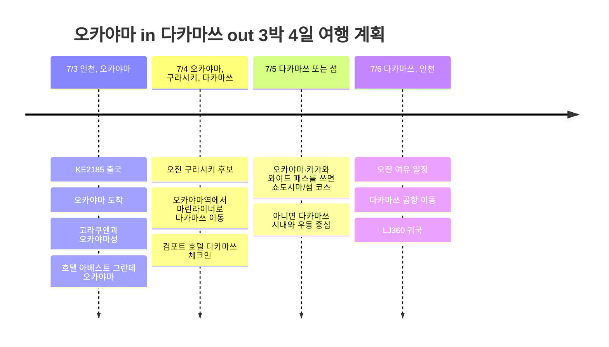

# 오카야마 in 다카마쓰 out 3박 4일 여행 계획

7월 초에는 오카야마로 들어가 다카마쓰에서 나오는 흐름. 4월 여행의 반대 방향에 가까운 동선이라, 이번에는 첫날 오카야마를 안정적으로 보고 다카마쓰에서 2박을 두는 구성이 좋다.

## 여행 개요

- 기간: 2026년 7월 3일 ~ 7월 6일
- 항공: 대한항공 KE2185, 진에어 LJ360
- 숙소: 호텔 아베스트 그란데 오카야마 1박, 컴포트 호텔 다카마쓰 2박
- 이동 후보: 오카야마·카가와 와이드 패스 또는 마린라이너 편도
- 핵심 지역: 오카야마, 구라시키, 다카마쓰, 쇼도시마 후보

## 일정 요약

| 날짜 | 지역 | 주요 일정 |
|------|------|----------|
| 7/3 | 인천, 오카야마 | KE2185 출국, 오카야마 도착, 고라쿠엔과 오카야마성, 호텔 아베스트 그란데 오카야마 |
| 7/4 | 오카야마, 구라시키, 다카마쓰 | 오전 구라시키 후보, 오카야마역에서 마린라이너로 다카마쓰 이동, 컴포트 호텔 다카마쓰 체크인 |
| 7/5 | 다카마쓰 또는 섬 | 오카야마·카가와 와이드 패스를 쓰면 쇼도시마/섬 코스, 아니면 다카마쓰 시내와 우동 중심 |
| 7/6 | 다카마쓰, 인천 | 오전 여유 일정, 다카마쓰 공항 이동, LJ360 귀국 |

## 일정 타임라인

## 7/3 - 오카야마 도착과 시내 산책

KE2185는 오전에 오카야마에 도착하는 편이라 첫날을 꽤 길게 쓸 수 있다. 도착 후 호텔 아베스트 그란데 오카야마에 짐을 맡기고, 고라쿠엔과 오카야마성을 묶어 보는 구성이 가장 안정적이다.

첫날은 다음 날 이동을 생각해서 무리하지 않는 쪽이 좋다. 시간이 남으면 오카야마역 주변에서 식사와 카페 정도를 붙이고, 숙소에서 일찍 정리하는 흐름으로 둔다.

## 7/4 - 구라시키를 보고 다카마쓰로 이동

오전에는 컨디션이 괜찮으면 구라시키 미관지구를 넣는다. 오카야마에서 가까워서 반나절 코스로 좋고, 이후 오카야마역으로 돌아와 마린라이너를 타고 다카마쓰로 넘어가면 동선이 깔끔하다.

이 날이 패스 판단 지점이다. 오카야마·카가와 와이드 패스를 쓸 거라면 7/4부터 7/6까지 3일권으로 맞추는 흐름이 좋고, 섬이나 버스/페리까지 크게 쓰지 않을 거라면 마린라이너 편도만 사는 쪽도 충분히 가능하다.

## 7/5 - 카가와를 넓게 쓸지, 다카마쓰를 깊게 볼지

패스를 산다면 쇼도시마나 나오시마 같은 섬 코스를 넣는 게 패스 효율이 좋다. 특히 다카마쓰항을 기준으로 움직이면 하루를 섬 일정으로 쓰고 저녁에 다시 다카마쓰로 돌아오는 구성이 자연스럽다.

패스를 안 쓴다면 다카마쓰 시내 중심으로 잡는다. 리쓰린 공원, 상점가, 우동집, 항구 산책을 느슨하게 묶고, 저녁에는 다음 날 공항 이동을 고려해 숙소 주변에서 마무리한다.

## 7/6 - 다카마쓰 out

LJ360은 오후 출발이라 오전에 가벼운 일정 하나는 가능하다. 다만 공항 이동 시간을 감안해서 점심 이후에는 바로 출국 모드로 전환하는 편이 좋다. 다카마쓰 공항에서 17:15 출발, 인천 18:55 도착 예정으로 여행을 마무리한다.
