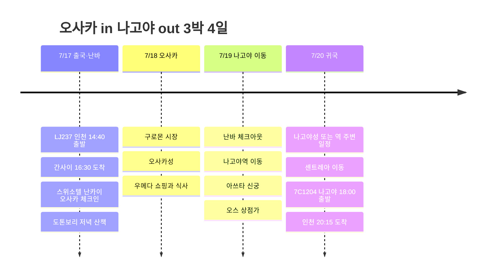

# 오사카 in 나고야 out 3박 4일 여행 계획

7월 중순, 오사카로 들어가 나고야에서 나오는 3박 4일 일정. 처음 2박은 스위소텔 난카이 오사카에 두고 난바를 편하게 쓰고, 마지막 하루는 나고야로 넘어가 귀국 동선을 짧게 잡는 구성이다.

## 여행 개요

- 기간: 2026년 7월 17일 ~ 20일
- 항공: LJ237 인천 → 간사이, 7C1204 나고야 → 인천
- 숙소: 스위소텔 난카이 오사카 2박, 나고야역 근처 1박 후보
- 경로: 간사이공항 → 난바/오사카 → 나고야 → 주부국제공항

## 일정 요약

| 날짜 | 지역 | 주요 일정 |
|------|------|----------|
| 7/17 | 인천, 간사이, 오사카 | LJ237 출국, KIX 도착, 난바 이동, 스위소텔 체크인, 도톤보리 저녁 |
| 7/18 | 오사카 | 구로몬 시장, 오사카성, 우메다 쇼핑과 저녁 |
| 7/19 | 오사카, 나고야 | 난바 체크아웃, 나고야 이동, 아쓰타 신궁, 오스 상점가 |
| 7/20 | 나고야, 인천 | 나고야성 또는 역 주변 일정, 센트레아 이동, 7C1204 귀국 |

## 일정 타임라인

## 7/17 - 오사카 도착과 난바 적응

LJ237은 오후 출발이라 첫날은 무리하지 않고 오사카에 들어가는 날로 잡는다. 간사이공항에 도착하면 난카이 전철로 난바까지 붙고, 스위소텔 난카이 오사카에 체크인한다.

숙소가 난바역과 바로 이어지는 위치라 첫날 저녁은 도톤보리와 신사이바시 주변만 걸어도 충분하다. 늦게 도착하는 일정에서 이동을 줄일 수 있는 게 이 숙소의 가장 큰 장점이다.

## 7/18 - 오사카 시내 하루

둘째 날은 오사카를 너무 멀리 벌리지 않고 시내 중심으로 잡는다. 아침은 구로몬 시장에서 시작하고, 낮에는 오사카성으로 이동해 대표 코스를 본다.

오후에는 우메다로 넘어가 쇼핑몰, 카페, 저녁 식사를 묶는다. 난바 숙소로 돌아오기 쉬운 구조라 짐이나 쇼핑 부담도 적다.

## 7/19 - 나고야로 이동

셋째 날은 오사카에서 나고야로 넘어가는 날. 신칸센을 쓰면 빠르고, 비용을 아끼고 싶으면 긴테쓰 특급 계열도 후보가 된다. 나고야역 근처에 마지막 1박을 두면 다음 날 공항 이동이 편하다.

나고야 도착 후에는 아쓰타 신궁과 오스 상점가 정도를 묶어 가볍게 본다. 저녁은 히츠마부시나 미소카츠처럼 나고야 쪽 음식을 넣기 좋다.

## 7/20 - 나고야에서 귀국

마지막 날은 오전에 나고야성이나 역 주변 쇼핑을 넣고, 오후에는 주부국제공항 센트레아로 이동한다. 7C1204는 저녁 출발이라 마지막 날도 너무 급하지 않게 쓸 수 있다.
