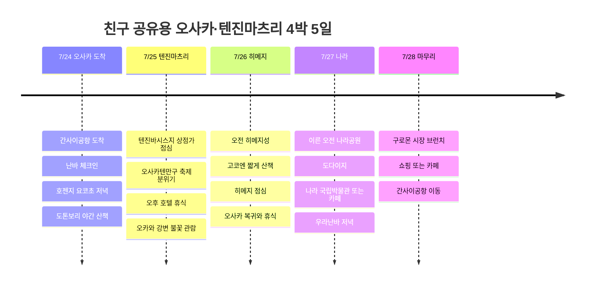

# 친구 공유용 오사카·텐진마츠리 4박 5일 일정

7월 오사카에서 축제와 불꽃의 색다름을 넣되, 놀이공원은 빼고 더위 부담을 줄이는 친구 공유용 일정. 핵심은 7/25 텐진마츠리 불꽃, 7/26 히메지성, 7/27 나라 사슴공원이다.

## 여행 개요

- 기간: 2026년 7월 24일 ~ 28일
- 성격: 친구 공유용 숨김 일정
- 숙소 베이스: 난바 또는 우메다 후보
- 핵심: 텐진마츠리 불꽃, 히메지성, 나라 사슴공원, 오사카 맛집
- 더위 전략: 야외는 오전과 밤, 오후는 카페·상점가·호텔 휴식
- 항공편: 미확정, 공항 이동 기준점만 표시

## 일정 요약

| 날짜 | 지역 | 주요 일정 |
|------|------|----------|
| 7/24 | 간사이, 난바 | KIX 도착, 난바 체크인, 호젠지 요코초와 도톤보리 저녁 |
| 7/25 | 오사카텐만구, 오카와 | 텐진바시스지 점심, 오후 휴식, 텐진마츠리 불꽃과 강변 축제 |
| 7/26 | 히메지 | 오전 히메지성, 고코엔 짧게, 히메지 음식 후 오사카 복귀 |
| 7/27 | 나라, 오사카 | 이른 오전 나라공원과 도다이지, 오후 박물관 또는 카페, 우라난바 저녁 |
| 7/28 | 난바, 간사이 | 구로몬 시장 브런치, 쇼핑 또는 카페, KIX 이동 |

## 일정 타임라인

## 7/24 - 난바에 들어와 맛으로 시작

첫날은 이동 피로를 고려해서 크게 벌리지 않는다. 간사이공항에서 난바나 우메다 숙소로 들어온 뒤, 저녁은 호젠지 요코초나 우라난바 쪽에서 가볍게 시작한다.

도톤보리는 첫날 밤 분위기 확인 정도로만 둔다. 7월 밤도 습할 수 있으니 오래 걷는 계획보다, 식사 후 글리코 사인과 강변을 짧게 보고 숙소로 돌아오는 편이 좋다.

## 7/25 - 텐진마츠리와 불꽃

이 일정의 하이라이트. 텐진마츠리는 7월 24일과 25일에 열리는 오사카의 대표 여름 축제라, 25일 저녁 불꽃과 오카와 강변 분위기를 중심에 둔다.

낮에는 텐진바시스지 상점가처럼 지붕 있는 동선을 쓰고, 오사카텐만구는 짧게 분위기만 본다. 한낮에는 반드시 호텔이나 카페로 빠져서 쉬고, 저녁에 오카와 강변으로 이동한다.

불꽃 관람은 예쁘지만 사람이 많다. 정확한 관람 지점과 교통 통제는 2026년 공식 안내가 나오면 다시 확인하고, 친구에게는 "일찍 가거나, 너무 붐비면 멀리서 분위기만 보고 빠지는 플랜"으로 공유하는 게 좋다.

## 7/26 - 히메지성은 아침에만

오사카성도 좋지만, 한 번 색다르게 가려면 히메지성이 훨씬 강한 카드다. 다만 7월의 히메지성은 성 내부에 냉방, 엘리베이터, 에스컬레이터가 없고 계단도 많아서 오전 9시 입장을 목표로 잡는다.

히메지성 이후 체력이 괜찮으면 고코엔을 짧게 보고, 점심은 아나고메시나 히메지 오뎅 같은 지역 음식으로 잡는다. 오후 늦게까지 버티지 말고 오사카로 돌아와 쉬는 편이 다음 날 나라 일정이 살아난다.

## 7/27 - 나라 사슴공원은 이른 오전

사슴공원을 좋아한다면 나라는 꼭 넣자. 대신 더위를 싫어하는 조건이 있으니 오사카에서 일찍 출발해 오전에 나라공원과 도다이지를 보고, 정오 이후에는 실내나 카페로 빠지는 흐름이 좋다.

사슴은 귀엽지만 야생동물이라 먹이를 들고 오래 끌거나 놀리면 스트레스와 사고가 생길 수 있다. 사슴 센베이는 짧게 주고, 사진은 그늘과 거리를 두고 찍는 쪽이 편하다.

오후에는 나라 국립박물관이나 상점가 카페로 더위를 피한 뒤, 저녁에는 오사카로 돌아와 우라난바에서 마지막 밤 식사를 잡는다.

## 7/28 - 브런치와 귀국

마지막 날은 비행기 시간에 따라 구로몬 시장 브런치나 난바 쇼핑 정도만 넣는다. 7월에는 짐 들고 오래 움직이면 급격히 피곤해지니, 체크아웃 후 짐 보관과 공항 이동 시간을 먼저 계산한다.

귀국편이 이른 시간이면 구로몬 시장은 과감히 빼고 바로 공항으로 이동한다. 늦은 출발이면 카페 한 곳을 정해두고 느슨하게 마무리하는 편이 좋다.

## 참고 링크

- [텐진마츠리](https://en.wikipedia.org/wiki/Tenjin_Matsuri)
- [히메지성 공식 홈페이지](https://www.himejicastle.jp/en/)
- [나라공원 - Nara Travelers Guide](https://visitnara.jp/destinations/area/nara-park/)
- [도톤보리 - OSAKA INFO](https://osaka-info.jp/en/spot/dotonbori/)
