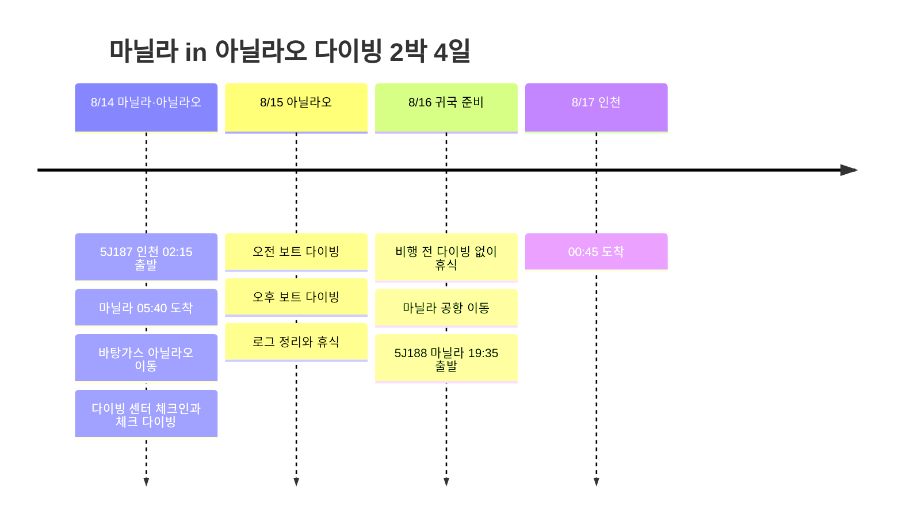

# 마닐라 in 아닐라오 다이빙 2박 4일 여행 계획

8월 14일 새벽 5J187로 마닐라에 들어가, 바탕가스 아닐라오 다이빙 센터를 베이스로 짧게 다녀오는 다이빙 일정. 귀국은 5J188 기준으로 8월 16일 밤 마닐라 출발, 8월 17일 새벽 인천 도착으로 임시 배치했다.

## 여행 개요

- 기간: 2026년 8월 14일 ~ 17일
- 항공: 5J187 인천 → 마닐라, 5J188 마닐라 → 인천
- 베이스: 아닐라오 다이빙 센터
- 핵심: 마닐라 공항 픽업, 아닐라오 이동, 체크 다이빙, 보트 다이빙, 비행 전 휴식

## 일정 요약

| 날짜 | 지역 | 주요 일정 |
|------|------|----------|
| 8/14 | 인천, 마닐라, 아닐라오 | 5J187 새벽 출국, 마닐라 도착, 바탕가스 이동, 다이빙 센터 체크인, 체크 다이빙 |
| 8/15 | 아닐라오 | 오전/오후 보트 다이빙, 로그 정리, 해안 휴식 |
| 8/16 | 아닐라오, 마닐라 | 비행 전 다이빙 없이 휴식, 마닐라 이동, 공항 대기, 5J188 출국 |
| 8/17 | 인천 | 00:45 인천 도착 |

## 일정 타임라인

## 8/14 - 마닐라 도착 후 아닐라오 이동

5J187은 새벽 출발이라 체력 소모가 있는 편이다. 마닐라에 이른 아침 도착한 뒤, 공항 픽업으로 바탕가스 마비니 쪽 아닐라오까지 이동하는 흐름이 가장 편하다.

도착일은 무리해서 많은 다이빙을 넣기보다는 체크인, 장비 세팅, 체크 다이빙 정도로 잡는다. 이동 시간이 길기 때문에 첫날 컨디션 관리가 다음 날 다이빙 만족도를 좌우한다.

## 8/15 - 아닐라오 보트 다이빙

둘째 날이 메인 다이빙 날. 오전과 오후 보트 다이빙을 중심으로 잡고, 수면 휴식 시간에는 식사와 로그 정리를 넣는다. 아닐라오는 마크로 생물과 산호 포인트가 강한 지역이라 카메라나 라이트를 챙기면 기록하기 좋다.

## 8/16 - 비행 전 휴식과 마닐라 복귀

5J188이 19:35 출발이라 마지막 날은 비행 전 안전 간격을 고려해 다이빙을 넣지 않는 쪽으로 잡는다. 오전에는 정리와 휴식, 이후 마닐라로 이동해 공항 근처에서 시간을 조절한다.

귀국편은 밤에 출발해 다음 날 새벽 인천에 도착하는 구조라, 실제 여행 종료일은 8월 17일로 보는 게 자연스럽다.
