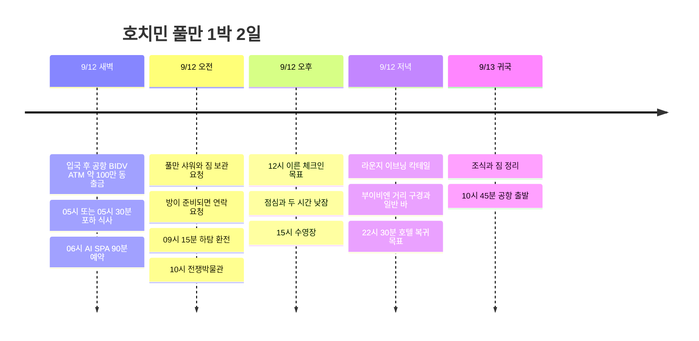

**공항 BIDV ATM 약 100만 동 출금 → 포하 새벽 식사 → 06시 AI SPA → 풀만 샤워·짐 보관 → 하탐 환전 → 전쟁박물관 → 12시 체크인 목표 → 낮잠 → 수영장 → 라운지 해피아워**로 움직인다. 이번에는 풀만을 충분히 이용하도록 우체국·냐항응온·카페 아파트를 기본 동선에서 빼고, 밤에는 가까운 부이비엔에서 거리 분위기를 구경하고 일반 바에서 여행객들과 대화할 시간을 남겼다.

**확정 예약은 9/12 AI SPA 06:00·90분 코스**다. 포하는 05:00 또는 05:30 식사 희망, 풀만은 ALL 플래티넘 회원으로 **12시경 이른 체크인과 객실 준비 연락을 요청할 예정**이다. 체크인 전 샤워 가능 여부와 12시 객실 제공은 호텔 확인 전까지 목표로 표시한다.

모든 시간은 현지 기준이다. 항공 배치는 공개 시간표의 **9G401 인천 00:10 → 호치민 03:35 / 9G400 호치민 15:25 → 인천 22:40**을 사용했다. 실제 예약편·시각은 대조가 필요하며, 00:10 출국이면 인천공항에는 **9/11 금요일 밤**에 간다. [노선 시간표](https://www.aeroroutes.com/eng/260707-9gaug26kr).

## 일정 요약

| 날짜 | 핵심 동선 | 우선 유지할 시간 |
|---|---|---|
| 9/11 금 | 인천공항 출국 준비 | 00:10편이면 21:10 공항 도착 목표 |
| 9/12 토 새벽 | 공항 입국·BIDV ATM 약 100만 동 출금 → 포하 → AI SPA | 05:40 식당 출발, **06:00∼07:30 마사지 예약** |
| 9/12 토 오전 | 풀만 짐 보관 → 하탐 환전 → 전쟁박물관 → 호텔 | 09:15 환전, 10:00∼11:30 박물관, 12시 체크인 목표 |
| 9/12 토 오후·저녁 | 점심·낮잠 → 수영장 → 라운지 → 부이비엔·바 | 13∼15시 낮잠, 15∼16:15 수영장, 18시대 라운지, 20시대 부이비엔 |
| 9/13 일 | 선택 아침 수영 → 조식 → 체크아웃 → 공항 | 10:30 체크아웃 완료·10:45 차량 출발 |

## 일정 타임라인

## 9/12 토 · 새벽 식사와 06시 마사지

| 현지 시간 | 할 일 | 이동·예약 기준 |
|---|---|---|
| 03:35∼04:20 | 도착·입국·수하물 | 조회 항공편 기준, 처리 시간은 변동 가능 |
| 04:20∼04:30 목표 | **공항 BIDV ATM 약 1,000,000 VND 출금·차량 호출** | 입국을 마친 뒤 5∼10분 배정. 늦어지면 포하 식사부터 축소 |
| 04:30∼05:15 | 공항 → 포하 | 차량 이동에 45분 배정. 05시 식사는 공항에서 더 일찍 나왔을 때 가능 |
| 05:00∼05:40 중 | **포하 새벽 식사** | 도착 시각에 맞춰 시작. 05:30 도착이면 대기 없는 빠른 식사·포장만 |
| 05:40∼05:55 | 포하 → AI SPA | 차량 호출·이동에 15분, 도보 이동으로 바꾸지 않기 |
| 05:55∼06:00 | 예약 확인·준비 | 늦어질 경우 예약 채널로 연락 |
| **06:00∼07:30** | **AI SPA 90분 마사지** | 사용자 예약 확정 시간 |
| 07:30∼07:45 | 마무리·소지품 정리 | 실제 코스 시작 시각에 따라 조정 |
| 07:45∼08:15 | AI SPA → 풀만 | 차량 30분 배정 |
| 08:15∼09:00 | 샤워·짐 보관·회원 혜택 확인 요청 | 객실 준비 시 연락 요청, 가능하면 12시 입실 희망 전달 |

[포하 지도](https://maps.app.goo.gl/nkqyTSqZkxR9cmZd6) · [AI SPA 지도](https://maps.app.goo.gl/T8tWoQu1C3Xrp5A1A) · [포하 → AI SPA 차량 동선](https://www.google.com/maps/dir/?api=1&origin=10.7719657,106.7052281&destination=10.779081,106.705037&travelmode=driving) · [AI SPA → 풀만](https://www.google.com/maps/dir/?api=1&origin=10.779081,106.705037&destination=Pullman+Saigon+Centre&travelmode=driving).

포하는 **PHỞ HÀ, 19 Hải Triều** 지점이다. 공식 소개에서 확인한 지점과 사용자 지도를 연결했다. [포하 매장 소개](https://phoha.com.vn/tin-tuc/pho-ha-tren-pho-an-dem-hai-trieu-co-gi-dac-biet-niu-chan-thuc-khach.html). AI SPA는 **8A/7D2 Thái Văn Lung**이며 공식 사이트에 **24시간 영업**으로 안내한다. 골목 안 위치이므로 지도 핀과 예약 안내를 함께 본다. [AI SPA 공식 안내](https://www.aispa1.com/eng).

**06시 예약을 우선한다.** 05:30 식사는 여유 있는 한 끼로 보기 어렵다. 주문이 밀리거나 05:40 출발이 안 되면 포장 또는 마사지 뒤 식사로 바꾼다. 입국이 지연돼 04:45까지 공항에서 출발하지 못하면 식당 경유를 생략하고 스파로 직접 가는 편이 낫다. 실제 도로 상황에 따라 06시 도착도 달라질 수 있어 지연 시 스파에 직접 연락한다.

호텔 방문은 마사지 뒤로 두어 새벽 호텔 왕복을 줄였다. 이 순서에는 **식당·스파에 캐리어를 가지고 가는 조건**이 있으므로 스파 예약 채널에서 짐 둘 공간을 확인한다. 스파 보관이 불가능하면 호텔에 먼저 맡겨야 하며, 이 경우 포하 식사는 마사지 뒤로 옮겨 예약 시간을 지킨다.

## 9/12 토 · 박물관 후 낮잠·수영장·라운지

| 현지 시간 | 할 일 | 유지할 여유 |
|---|---|---|
| 09:00∼09:15 | 풀만 → 하탐 환전소 | 차량 이동, 짐은 호텔에 보관 |
| 09:15∼09:30 | **Ha Tam Jewelry에서 USD 100 환전 목표** | 당일 영업·취급 여부와 실제 수령액 확인 |
| 09:30∼10:00 | 하탐 → 전쟁박물관 | 차량·입장 준비 포함 |
| 10:00∼11:30 | **전쟁박물관 관람** | 90분. 환전을 빨리 마치면 관람 시간을 늘림 |
| 11:30∼12:00 | 호텔로 복귀·객실 준비 확인 | 연락이 왔으면 짐 회수·체크인으로 연결 |
| 12:00∼12:30 | **이른 체크인 목표·짐 풀기** | 객실이 준비된 경우. 준비 지연 시 아래 대체 시간표 적용 |
| 12:30∼13:00 | 호텔 또는 바로 근처에서 간단한 점심 | 점심 때문에 다시 관광 구역까지 왕복하지 않기 |
| 13:00∼15:00 | **객실 낮잠·휴식** | 새벽 도착 후 수면 2시간 확보 |
| 15:00∼16:15 | **6층 수영장** | 수영·풀사이드 휴식 합계 75분 |
| 16:15∼16:45 | 객실 샤워·옷 갈아입기 | 수영 뒤 바로 외출·라운지로 서두르지 않기 |
| 16:45∼17:30 | 객실 휴식·라운지 당일 시간 확인 | 호텔에서 안내한 시작 시간에 맞추기 |
| 18:00∼19:30 목표 | **30층 Executive Lounge 이브닝 칵테일** | 정확한 당일 제공 시간은 체크인 때 확인. 17:30 시작이면 17:30∼19:00로 당김 |
| 19:30∼20:00 | 객실 정리·필요하면 가벼운 저녁 | 라운지를 20시까지 쓰면 외출을 30분 늦춤 |
| 20:00∼20:30 | 풀만 → 부이비엔 도보·거리 구경 | 호텔에서 거리까지 10∼15분 여유, 메인 거리 분위기·호객 구경 |
| 20:30∼22:00 | **Rooster Beers 등 일반 바 1곳** | 여행객과 대화할 자리 선택, 이동보다 한 곳에서 머무는 시간 확보 |
| 22:00∼22:30 | 도보로 풀만 복귀 | 더 머물면 아래 연장안 적용, 다음 날 아침 수영은 생략 |

전쟁박물관은 **28 Võ Văn Tần**, 매일 **07:30∼17:30**, 입장 마감 **17:00**다. 박물관 뒤 우체국을 이어 붙이지 않고 호텔로 돌아와 12시 객실 준비 연락에 대응한다. [박물관 공식 안내](https://baotangchungtichchientranh.vn/en/visit), [입장 마감 안내](https://ticket.baotangchungtichchientranh.vn/terms-and-conditions.html).

### 공항 BIDV ATM · 약 100만 동 출금

입국·수하물 수령 후 **국제선 도착 구역의 BIDV ATM**을 먼저 찾는다. BIDV 공식 ATM 목록에 ‘Ga đến quốc tế - Sân bay Tân Sơn Nhất’(떤선녓공항 국제선 도착) 설치 기록이 있다. 다만 과거 목록이므로 현재 정확한 기기 위치와 가동 여부는 도착 구역 안내로 확인한다. 다른 터미널까지 이동해 찾는 일정은 넣지 않았다. [BIDV 공식 ATM 목록](https://bidv.com.vn/wps/wcm/connect/d5e0fc34-1e5c-4390-b02e-321329c595b6/Danh%2Bsach%2BATM%2BBIDV%2Bchap%2Bnhan%2Bthe%2Bquoc%2Bte.pdf?MOD=AJPERES).

출금 목표는 **1,000,000 VND**, 소요 시간은 **5∼10분**이다. 당일 기기와 카드에 표시되는 출금 수수료를 확인하고, 이용이 어렵다면 같은 도착 구역의 다른 ATM 또는 환전 창구로 바꾼다. 지연되면 포하 식사를 뒤로 미뤄 06시 마사지 예약에 맞춘다.

### 하탐 환전 · 100달러 현금 준비

**Ha Tam Jewelry, 2 Nguyễn An Ninh**는 벤탄시장 옆으로, 풀만에서 박물관으로 가기 전 들른다. **09:15∼09:30에 USD 100을 VND로 바꾸는 계획**이며 환전 완료 기록은 아니다. 공개 안내에는 매일 **08∼19시**로 나오지만 운영 상태에 상반된 정보도 있어, 오전 호텔에서 짐을 맡길 때 당일 환전 가능 여부부터 확인한다. [주소·운영시간 안내](https://antoursvietnam.com/best-places-for-money-exchange-in-ho-chi-minh-city/), [폐점 언급 자료 — 현재 상태 미확정](https://en.thevietmedia.net/hatam-jewelry-fx-rules-2026/).

100달러권 한 장을 준비하되 **원화→달러 구입 비용까지 포함한 최종 수령 VND**로 비교한다. 100달러권이 항상 더 유리하다고 단정하지 않고, 창구에서 적용 환율·수수료·받을 총액을 먼저 확인한다. 실제 환율을 아직 모르므로 예상 VND 금액을 고정하지 않았다. 환전은 통화 교환이므로 **USD 100을 여행 지출 합계에 더하지 않고**, 이후 식비·마사지 등 실제 사용액을 기록한다.

**입국 후 공항 BIDV ATM에서 약 1,000,000 VND(100만 동)를 출금**해 새벽 포하·마사지·이동에 쓸 현금으로 준비한다. ATM 이용은 5∼10분 목표로 입국·수하물 수령 뒤에 배치했다. 마사지 금액은 아직 제공되지 않아 100만 동으로 모두 충당된다고 단정하지 않으며, 부족하면 스파의 카드 결제 가능 여부를 확인한다. Grab에 사용할 카드도 출발 전에 등록한다. 출금액과 오전 하탐 환전액은 현금 준비 내역이며 여행 지출에 중복 합산하지 않는다. 실제 출금 수수료가 발생하면 확인한 금액만 별도 기록한다. ATM 대기·오류로 지연되면 포하를 마사지 뒤로 미루고 06시 예약을 우선한다. 하탐이 닫았거나 환전을 취급하지 않으면 호텔에 가까운 영업 중인 정식 환전 창구를 안내받고, **09:30까지 처리가 안 되면 박물관으로 이동**한다. 다른 환전소를 연달아 찾아 12시 입실·낮잠을 밀지 않는다.

### 수영장 이용 시간

호텔 공식 수영장 운영은 **6층, 06:00∼22:00**다. 토요일 15:00∼16:15를 기본으로 하고, 더 이용하고 싶으면 16:30까지 늘린 뒤 샤워한다. 일요일 아침에는 선택으로 06:45∼07:30 한 번 더 이용할 수 있다. 수영장과 Pool Bar의 영업시간은 다르며, 음료·식사는 별도다. [호텔 수영장 공식 안내](https://www.pullman-saigon-centre.com/spa-fitness/).

### 풀만 해피아워 · Executive Lounge 기준

플래티넘 혜택으로 이용하려는 곳은 **30층 Executive Lounge의 이브닝 칵테일**이다. 호텔 공식 페이지는 라운지 전체 운영 **06:00∼22:30**과 이브닝 칵테일 제공을 안내하지만 현재 정확한 칵테일 시작·종료 시간은 적지 않았다. [라운지 공식 안내](https://www.pullman-saigon-centre.com/restaurants-and-bars/executive-lounge/).

과거 방문 기록에는 **18:00∼20:00**으로 소개되어 있어 이번에는 **18:00∼19:30 이용 목표**를 잡고, 17:30∼20:00은 호텔 안에서 비워둔다. 이 시간을 최신 확정 영업시간으로 보지는 않으며 **당일 라운지 안내가 우선**이다. [18∼20시 이브닝 칵테일 방문 기록](https://r923e.blog109.fc2.com/blog-entry-2872.html).

공식 라운지 페이지의 **14:30∼17:30 애프터눈 티는 가격이 표시된 별도 상품**이므로 회원에게 무료로 포함된다고 단정하지 않는다. 라운지 음식으로 충분하지 않으면 산책할 때 가볍게 저녁을 먹거나 호텔에서 별도 주문한다.

## 9/12 토 밤 · 부이비엔 구경과 여행자 바

**풀만 → 부이비엔 메인 거리 → 40 Bùi Viện의 Rooster Beers → 풀만**으로 걸어서 연결한다. 부이비엔·팜응우라오 일대는 해외 배낭여행객이 모이는 구역이라 영어로 여행 이야기를 시작해 볼 후보로 골랐다. 서양 여행객을 만나고 싶다는 취향을 반영했지만, 특정 바의 당일 손님 국적이나 비율은 확인할 수 없다. [호치민 관광청의 부이비엔 소개](https://visithcmc.net/en/news/khu-pho-tay-bui-vien-sai-gon-song-dong-voi-pho-khong-ngu).

| 목적 | 장소·선택 방법 | 배정 |
|---|---|---|
| 번화가·호객 분위기 구경 | 부이비엔 메인 거리를 한 번 걷고 마음에 드는 가게 메뉴 보기 | 20∼30분 |
| 일반 바에서 친구 만들기 | **Rooster Beers / Tiệm Bia Gà, 40 Bùi Viện**을 첫 후보로 보고, 대화 가능한 음량과 바 자리 확인 | 60∼90분 |
| 조용한 야경으로 마무리 | **The View Rooftop, 195 Bùi Viện**으로 교체 | 45∼60분, 두 곳을 반드시 다 방문할 필요 없음 |

Rooster의 주소는 양조장 공식 탭룸 목록으로 확인했다. 매장에 들어가기 전 혼자 온 손님이나 소규모 여행객이 있는지 보고, 너무 시끄럽거나 자리가 없으면 근처 일반 펍으로 옮긴다. **‘국적이 정해진 손님이 모이는 곳’이라는 보장보다 실제 대화하기 좋은 자리가 있는지를 기준으로 선택**한다. [Rooster 공식 탭룸](https://roosterbeverages.com/vi/tiem-bia-ga/), [지도](https://www.google.com/maps/search/?api=1&query=Rooster+Beers+40+Bui+Vien).

The View는 덕브엉 호텔 위의 루프톱으로 공식 안내는 **07:00∼02:00**이다. 조용한 분위기와 야경을 원할 때의 대안이며, 모르는 여행객과 자연스럽게 섞이는 목적에는 당일 자리 배치를 보고 고른다. [The View 공식 안내](https://ducvuonghotel.com/en/restaurant-2/).

호객하는 직원과 가볍게 이야기하고 메뉴를 구경하는 건 거리 산책에 포함한다. 입장할 때 **메뉴 가격·최소 주문·추가 요금**만 먼저 확인하고, 술은 직접 주문한다. 대화를 시작하려면 “Hey, are you travelling here too?” 또는 “Mind if I join you for a drink?” 정도면 충분하다. 상대가 대화를 원할 때 이어가고, 마음이 맞으면 다음 여행지나 맛집 이야기를 나눈다.

**기본은 22:30 복귀, 재미있으면 23:30까지 연장 가능**으로 잡는다. 연장한 날은 일요일 06:45 수영을 빼고 08시 조식부터 시작한다. 피곤하면 부이비엔 20∼30분 구경과 한 잔만 하고 21:30경 돌아온다. 응우옌후에는 이번 밤 동선에서 제외해 차량 왕복과 바 사이 이동을 줄였다.

## 플래티넘·짐 보관·객실 준비 연락

08시대 호텔에서 **플래티넘 회원 확인 → 짐 보관 → 체크인 전 샤워 공간 이용 요청 → 12시 입실 희망 → 객실 준비 시 연락 요청**을 한 번에 전달한다. 연락받을 수 있는 번호 또는 호텔과 실제로 연결되는 메신저 채널을 남긴다. 샤워가 바로 가능하지 않으면 박물관 이동을 오래 늦추지 않고 객실 입실 후 씻는다.

현장에서 사용할 문장:

> I'm an ALL Platinum member and I have a reservation for tonight. Could you store my luggage and let me know if I can use the shower facilities before my room is ready? If possible, I'd like to check in around noon. Please message or call me as soon as the room is ready. Could you also confirm today's Executive Lounge evening cocktail hours and my breakfast benefits?

ALL 공식 혜택은 플래티넘의 라운지 이용과 아시아·태평양 지역 조식을 안내한다. **이른 체크인은 객실 상황에 따른 혜택**이라 12시로 보장된 예약은 아니다. 이번 일정은 사용자가 예상한 12시를 기본 목표로 잡았고, 샤워 장소·혜택 적용·조식 제공 장소는 호텔에서 확인한다. [ALL 공식 회원 혜택](https://all.accor.com/loyalty-program/cards-status-benefits-details/index.en.shtml).

### 방이 늦게 준비되면

| 실제 입실 | 낮잠·수영장 조정 | 유지할 기준 |
|---|---|---|
| 12시경 | 13:00∼15:00 낮잠 → 15:00∼16:15 수영 | 기본 시간표 |
| 13시경 | 먼저 점심 → 13:30∼15:30 낮잠 → 15:30∼16:30 수영 | 샤워 후 17:30까지 호텔에서 준비 |
| 14시경 | 점심 후 14:15∼16:15 낮잠 → 16:15∼17:00 짧은 수영 | 17:00∼17:30 샤워, 라운지 시간 우선 |
| 14시 이후 또는 수면 부족이 큼 | 낮잠 우선, 수영을 일요일 06:45로 이동 | 수면·라운지·귀국일 출발 시간을 억지로 줄이지 않기 |

방 준비 연락이 박물관 관람 중 오면 바로 돌아갈 필요는 없다. 관람을 마치고 11:30경 출발하되, 호텔이 정한 객실 수령 조건이 있으면 그 안내를 따른다. 우체국·냐항응온은 입실이 늦고 체력이 충분할 때만 **박물관 뒤 점심 동선 대신** 선택하며, 관광을 더해 낮잠까지 늦추지는 않는다.

## 9/13 일 · 선택 아침 수영과 플래티넘 조식

| 현지 시간 | 할 일 | 마감 기준 |
|---|---|---|
| 06:45∼07:30 | 선택: 수영장 | 토요일 수영을 못 했거나 더 이용하고 싶을 때만 |
| 07:30∼08:00 | 객실 샤워·정리 | 밤늦게 복귀했다면 수영을 빼고 08시 조식 전까지 자기 |
| 08:00∼09:00 | **플래티넘 조식** | 호텔이 안내한 라운지·레스토랑과 혜택 범위 적용 |
| 09:00∼10:00 | 객실 휴식·짐 정리 | 추가 외출·마사지 없음 |
| 10:00∼10:30 | 체크아웃·정산 | 레이트 체크아웃 혜택이 가능해도 비행 시간에 맞춰 출발 |
| 10:30∼10:45 | 차량 호출·탑승 | 예약표의 국제선 터미널 확인 |
| 10:45∼12:15 | 호텔 → 공항 | 차량 대기·교통에 90분 배정 |
| 12:15∼15:25 | 수속·출국·점심·탑승 | 조회 출발시각 기준 약 3시간 여유 |
| 15:25∼22:40 | 호치민 → 인천 | 각 공항 현지 시각, 실제 항공권 우선 |

토요일에 박물관을 못 갔다면 **일요일 수영·여유 조식 대신 07:00 호텔 출발 → 07:30∼09:00 박물관 → 09:30 호텔 복귀**로 교체할 수 있다. 이때는 간단한 아침을 미리 먹고, 10:30 체크아웃·10:45 공항 출발을 유지한다. 수영·조식·박물관을 일요일 오전에 모두 넣지는 않는다.

## 시간 조절 범위

| 구간 | 조절 가능한 범위 | 늦거나 피곤할 때 |
|---|---|---|
| 공항 BIDV ATM | 입국 후 5∼10분 목표 | 약 100만 동 출금. 지연되면 포하 경유부터 생략 |
| 새벽 포하 | 10∼30분, **05:40 식당 출발** | 대기가 있으면 포장·마사지 후 식사. 06시 예약 우선 |
| AI SPA | **06:00 시작·90분 예약 고정** | 앞 일정으로 늦어지면 예약 채널에 연락 |
| 호텔 샤워·짐 보관 | 20∼45분 | 샤워 대기부터 줄이고 객실 준비 연락만 요청 |
| 하탐 환전 | 10∼15분 | 09:30 출발 목표. 휴무·긴 대기면 호텔 안내 대안으로 변경 |
| 전쟁박물관 | 90분 기본, 환전이 일찍 끝나면 최대 120분 | 10:00∼11:30 관람 유지. 지치면 일요일 이른 관람으로 이동 |
| 객실 낮잠 | 2∼3시간 | 3시간 자고 싶으면 수영을 45∼60분으로 줄이거나 일요일로 이동 |
| 토요일 수영장 | 45∼90분 | 실제 입실·낮잠 종료 시각에 맞춤. 17시 수영 종료·샤워 여유 확보 |
| 라운지 | 실제 제공 시간 중 60∼120분 | 당일 공지 우선. 20시까지 이용하면 부이비엔 출발을 30분 늦춤 |
| 부이비엔·바 | 거리 20∼30분 + 바 45∼90분 | 21:30 조기 복귀∼23:30 연장. 늦게 돌아오면 일요일 아침 수영 생략 |

새벽부터 움직이는 날이므로 **우체국·카페 추가 → 두 번째 수영 → 바 두 번째 방문 순서로 줄인다.** 기본 수영 1회·낮잠·라운지를 확보하면 숙소 이용 시간을 충분히 남길 수 있다.

귀국편이 조회와 다르면 **공항 수속 여유 3시간 + 시내 이동 90분**을 빼서 호텔 출발 목표를 다시 계산한다. 항공사 권장 도착 시각과 실제 교통 상황이 우선이다.

## 예약·비용 메모

| 항목 | 확인 내용·금액 |
|---|---|
| 선푸꾸옥항공 출국 | 185,600원 |
| 풀만 9/12∼13, 1박 | 168,327원 · ALL 플래티넘 |
| AI SPA | **9/12 06:00·90분 예약 완료**, 금액 미제공 |
| 포하 | 9/12 05시 또는 05시 30분 식사 예정 |
| 공항 BIDV ATM 출금 | **약 1,000,000 VND 예정**, 출금액은 지출 합계 제외 |
| 하탐 환전 | **USD 100 → VND 예정**, 환전액은 지출 합계 제외 |
| 기록된 원화 부분 합계 | **353,927원** |

마사지·식비·귀국 항공료·현지 교통·박물관 입장료는 합계에 포함하지 않았다. 이른 체크인과 체크인 전 샤워는 호텔에 요청할 사항이며, 호텔로 메시지를 전송하거나 추가 결제를 진행한 것은 아니다. 실제 항공편·수하물, 스파 짐 보관, 객실 준비 연락 채널, 당일 라운지 칵테일 시간만 출발 전에 대조한다. 일정 갱신일 2026-09-07.
