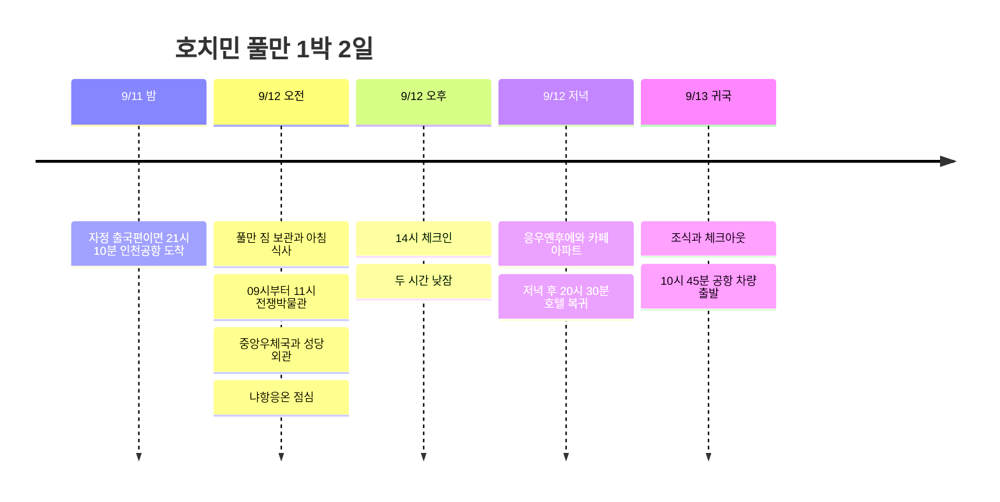

토요일은 **전쟁박물관 → 중앙우체국 → 냐항응온 점심 → 풀만 낮잠 → 응우옌후에**로 움직인다. 전쟁박물관 관람에 2시간을 확보하고 벤탄시장·책거리는 기본 동선에서 뺐다. 오전에 박물관에서 동쪽 우체국·점심 식당으로 연결한 뒤 호텔로 돌아오고, 저녁에는 보행거리 한 구역만 둘러본다. 일요일에는 외곽 관광을 넣지 않고 공항으로 간다.

모든 시간은 현지 시각이다. 항공은 공개된 **9G401 인천 00:10 → 호치민 03:35 / 9G400 호치민 15:25 → 인천 22:40**을 배치 기준으로 사용했다. 선푸꾸옥항공 왕복은 확정이지만 실제 편명·시각은 예약표 대조가 필요하다. 아래 관광 시각은 이동 여유를 넣은 목표 시간이며 식당·차량 예약 완료를 뜻하지 않는다. [노선 시간표](https://www.aeroroutes.com/eng/260707-9gaug26kr).

## 일정 요약

| 날짜 | 핵심 동선 | 고정할 시간 |
|---|---|---|
| 9/11 금 | 인천공항 출국 준비 | 00:10편이면 전날 21:10 공항 도착 목표 |
| 9/12 토 | 공항 → 풀만 짐 보관 → 전쟁박물관 → 우체국 → 냐항응온 → 호텔 휴식 → 응우옌후에 | 14:00 체크인, 14:30∼16:30 낮잠 |
| 9/13 일 | 조식 → 체크아웃 → 공항 → 귀국 | 10:45 차량 출발, 12:15까지 공항 도착 목표 |

## 일정 타임라인

## 9/12 토 · 전쟁박물관과 우체국, 오후는 풀만

| 현지 시간 | 할 일 | 이동·대기 배치 |
|---|---|---|
| 03:35∼05:00 | 호치민 도착·입국·수하물 | 공개 시간표 기준, 입국 소요에 따라 뒤 구간 조정 |
| 05:00∼06:00 | GrabCar로 풀만 이동·짐 보관 요청 | 공항 승차장 찾기와 차량 대기 포함 60분 |
| 06:00∼08:30 | 아침 식사·앉아서 쉬기 | 호텔 주변에서 영업 중인 곳 이용. 객실 수면은 이른 체크인 보장 시에만 가능 |
| 08:30∼09:00 | 풀만 → 전쟁박물관 | GrabCar 호출·이동·입장 준비 포함 30분 |
| 09:00∼11:00 | **전쟁박물관 관람** | 전시·중간 휴식을 포함해 2시간. 관심 전시부터 보기 |
| 11:00∼11:25 | 중앙우체국으로 이동 | 도보 약 20∼25분 배정. 덥거나 지치면 차량으로 대체 |
| 11:25∼12:00 | 우체국 내부 → 노트르담 외관 | 35분으로 짧게 묶고 책거리는 생략 |
| 12:00∼12:15 | 냐항응온으로 이동 | **160 Pasteur** 지점, 도보 15분 배정 |
| 12:15∼13:00 | 냐항응온 점심 | 반쎄오·고이꾸온 등 현지식. 대기가 길면 근처 식당으로 변경 |
| 13:00∼13:30 | 차량으로 풀만 복귀 | 차량 대기 포함 30분 |
| 13:30∼14:00 | 체크인 대기·휴식 | 14시 이전 객실 제공은 보장하지 않음 |
| 14:00∼16:30 | 체크인·샤워·낮잠 | 객실 정리 30분 + 실제 휴식 2시간 |
| 16:30∼17:00 | 호텔 → 응우옌후에 | 차량 30분 배정 |
| 17:00∼18:15 | 보행거리 → **42 Nguyễn Huệ 카페 아파트** | 카페 한 곳과 주변 산책, 쇼핑몰 추가하지 않기 |
| 18:15∼19:15 | 응우옌후에·동커이 권역 저녁 | 낮에 현지식을 먹었으므로 메뉴는 현장에서 가볍게 선택 |
| 19:15∼20:00 | 야경 산책 | 피곤하거나 비가 오면 바로 호텔 복귀 |
| 20:00∼20:30 | 차량으로 호텔 복귀 | 다음 날 짐 정리 후 휴식 |

[오전 구간 지도](https://www.google.com/maps/dir/?api=1&origin=Pullman+Saigon+Centre&destination=Nha+Hang+Ngon+160+Pasteur&waypoints=War+Remnants+Museum%7CSaigon+Central+Post+Office&travelmode=walking) · [호텔 → 카페 아파트](https://www.google.com/maps/dir/?api=1&origin=Pullman+Saigon+Centre&destination=42+Nguyen+Hue+Ho+Chi+Minh+City&travelmode=driving). 오전 지도는 위치 순서 확인용이며, 호텔→박물관은 표처럼 차량으로 이동한다. 구간별 소요 시간은 정시 운행 정보가 아닌 일정상 여유다.

전쟁박물관은 **War Remnants Museum / Bảo tàng Chứng tích Chiến tranh**, 주소는 **28 Võ Văn Tần**이다. 공식 안내상 매일 **07:30∼17:30**, 매표·입장 마감은 **17:00**다. 기본안은 09시 입장으로 충분한 관람 시간을 확보했다. 입장권은 아직 구매하지 않았고 비용 합계에도 포함하지 않았다. [박물관 공식 방문 안내](https://baotangchungtichchientranh.vn/en/visit), [공식 운영·입장 마감 안내](https://ticket.baotangchungtichchientranh.vn/terms-and-conditions.html).

중앙우체국은 시 관광청 안내상 토요일 **07:00∼18:00**다. 늦은 오후에 내부 관람을 서두르지 않도록 오전으로 옮겼다. [호치민 관광청 우체국 안내](https://visithcmc.net/en/news/buu-dien-trung-tam-sai-gon-net-dep-hai-hoa-giua-long-sai-gon). 점심은 **Nhà Hàng Ngon, 160 Pasteur**로 정했다. 공식 영업시간은 매일 **07:00∼22:30**이며 비슷한 이름의 Ngon 138과 다른 식당이다. [식당 공식 위치·시간](https://nhahangngon.com.vn/).

### 새벽 도착 후 쉴 곳

풀만은 **148 Tran Hung Dao**, 일반 체크인 **14:00**, 체크아웃 **12:00**다. 토요일 1박 예약만으로 새벽 입실은 보장되지 않는다. 호텔이 보장한 유료 이른 체크인이나 전날 객실을 확보하면 **06:00∼09:30 수면 → 10:00∼12:00 전쟁박물관 → 12:30 점심**으로 바꾸고 우체국을 뺀다. [호텔 공식 안내](https://www.pullman-saigon-centre.com/), [Accor 체크인 안내](https://all.accor.com/hotel/7489/index.en.shtml).

객실 확보가 안 됐고 비행기에서 거의 못 잤다면 **오전 관광 전체를 생략**하고 아침·실내 카페 휴식 후 14시 체크인한다. 전쟁박물관은 아래 일요일 이른 관람으로 옮길 수 있다. 오후 늦게 박물관까지 추가해 관람을 서두르는 대신 호텔 휴식·저녁 동선만 유지한다. 카페 의자 휴식을 숙면 대체로 계산하지 않는다. 체크인 전 조식·샤워·수영장 무료 이용도 예약에 포함된 것으로 가정하지 않는다.

## 9/13 일 · 조식 후 바로 공항

| 현지 시간 | 할 일 | 마감 기준 |
|---|---|---|
| 08:00∼09:00 | 호텔 조식 또는 호텔 근처 아침 | 조식 포함 여부는 예약 조건에 따름 |
| 09:00∼10:00 | 객실 휴식·샤워·짐 정리 | 시장·마사지 추가하지 않기 |
| 10:00∼10:30 | 체크아웃 | 미니바·보증금 정산 여유 30분 |
| 10:30∼10:45 | 차량 호출·탑승 | 목적지는 예약표의 국제선 터미널 |
| 10:45∼12:15 | 호텔 → 공항 | 주말 교통을 고려해 90분 배정 |
| 12:15∼15:25 | 항공 수속·출국 심사·점심·탑승 | 조회된 출발보다 약 3시간 먼저 도착 |
| 15:25∼22:40 | 호치민 → 인천 | 각 공항 현지 시각, 실제 예약표 우선 |

### 토요일 관람이 어려울 때 · 일요일 이월

토요일 새벽 도착 후 너무 피곤하면 박물관만 일요일로 옮길 수 있다. 이때는 기본 일요일 조식·객실 휴식 대신 **06:30 간단한 아침 → 07:00 호텔 출발 → 07:30∼09:00 박물관 → 09:30 호텔 복귀·짐 정리 → 10:30 체크아웃 완료 → 10:45 공항 차량 출발**로 바꾼다. 짐은 호텔에 두고 왕복한다.

박물관에서 **09:00 출발은 유지**하고, 우체국·시장은 추가하지 않는다. 07시 호텔 출발이 안 되면 관람을 뒤로 밀지 않고 공항 일정을 우선한다. 충분히 전시를 보고 싶다면 2시간을 확보한 토요일 기본안을 선택한다.

## 비가 오거나 덜 걷고 싶을 때

저녁 보행거리 산책 대신 [공식 60분 시티버스](https://www.hopon-hopoff.vn/)를 이용할 수 있다. **17시대 출발 가능한 1회 순환편**을 고르고 카페·야경 산책 자리에 넣는다. 출발 지점과 운행 시간은 해당 날짜 상품으로 확인한다. 시티버스를 추가하면서 기존 저녁 활동까지 모두 유지하지 않는다.

비가 길어지면 호텔로 돌아와 **18:00 Mad Cow Wine & Grill 저녁**으로 바꾼다. 공식 안내상 18∼22시 운영이며 식사 비용은 별도다. [호텔 레스토랑](https://www.pullman-saigon-centre.com/vi/nha-hang-bar/mad-cow-wine-grill/).

## 시간 조절 범위

아래 범위는 이동 지연과 컨디션에 맞춰 쓸 여유다. 여러 구간의 최대치를 동시에 선택하지 않고, 한 구간을 늘린 만큼 선택 관광을 줄인다.

| 구간 | 조절 가능한 범위 | 유지할 경계·생략 순서 |
|---|---|---|
| 토요일 전쟁박물관 | **90∼150분**, 기본 120분 | 관람을 늘리면 **우체국·성당 외관부터 생략**. 12시까지 박물관을 나와 점심·14시 체크인으로 연결 |
| 토요일 우체국·성당 외관 | 0∼35분 | 박물관 출발이 11:15를 넘으면 생략하고 냐항응온으로 바로 이동. 벤탄·책거리는 기본안에서 제외 |
| 토요일 점심 | 45∼75분 | 대기가 30분을 넘으면 가까운 식당으로 변경. 13시대 호텔 복귀 유지 |
| 토요일 객실 휴식 | 낮잠 2∼3시간 | 14시 입실 후 정리하고 쉬기. 17:30까지 자면 저녁 카페를 빼고 식사·보행거리만 |
| 토요일 저녁 | 카페 0∼60분, 야경 산책 20∼45분 | **카페 → 추가 야경 산책 순서로 줄이기**. 20:30 호텔 복귀 목표, 피곤하면 19시대 복귀 |
| 일요일 아침 | 조식 45∼60분, 객실 휴식 0∼45분 | **10:30 체크아웃 완료 → 10:45 차량 출발** 유지. 아침 활동을 더하고 출발을 늦추지 않기 |

**가장 여유로운 하루:** 오전 관광 생략 → 가까운 곳에서 점심 → 14시 체크인·낮잠 → 18시 호텔 저녁. 새벽 도착 후 제대로 못 잤다면 이 구성이 우선이다. 박물관은 일요일 07:30 관람으로 옮기되, 아침 출발이 어려우면 귀국일에 억지로 추가하지 않는다.

**항공 시각이 다를 때:** 귀국편 출발 시각에서 **공항 수속 여유 3시간 + 시내 이동 90분**을 빼서 호텔 출발 목표를 다시 계산한다. 예를 들어 15:25편은 10:55 이전 출발이 계산상 기준이므로 표에서는 10:45로 잡았다. 이는 교통·수속을 보장하는 수치가 아니며 항공사의 권장 시각이 우선이다.

## 예약·비용 메모

| 항목 | 기록된 금액 |
|---|---:|
| 선푸꾸옥항공 출국 | 185,600원 |
| 풀만 9/12∼13, 1박 | 168,327원 |
| 확인된 부분 합계 | **353,927원** |

귀국 항공료·현지 교통·식비·박물관 입장료·이른 체크인 비용은 별도다. 인원수는 제공되지 않아 1인 총액으로 표시하지 않았다. 출발 전에 대조할 예약 정보는 **왕복 편명·시각, 풀만의 정확한 호텔명, 새벽 입실 가능 여부, 조식·수하물**이다. 전쟁박물관·동선 갱신일 2026-09-07.
