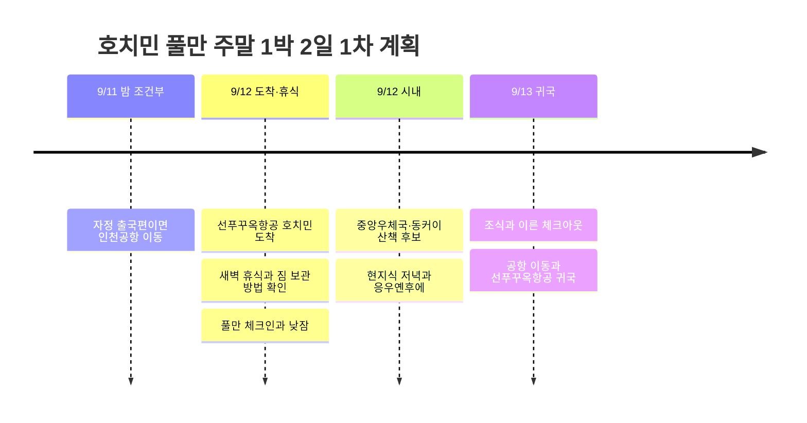

# 호치민 풀만 1박 2일 · 선푸꾸옥항공 주말 여행 1차 계획

**토요일은 도착 후 휴식과 시내 관광·식사, 일요일은 조식과 체크아웃 후 공항 이동**으로 잡는다. 숙소에서 쉬는 시간까지 포함하면 짧은 주말 여행에 잘 맞는다. 쿠치 터널이나 메콩델타처럼 하루를 쓰는 외곽 투어는 이번 기본안에서 제외한다.

2026년 9월 12일 토요일 출국, 9월 13일 일요일 귀국 일정이다. 사용자가 **선푸꾸옥항공으로 호치민 왕복**한다고 확인했으며 푸꾸옥 섬을 방문하는 일정이 아니다. 호치민 풀만 토~일 1박을 예약했고, 이 글에서는 **Pullman Saigon Centre**로 해석했다. 항공편명·실제 시간·귀국 항공료·조식 포함 여부는 미확정이다.

조사 기준일은 2026-09-05다. 아래 조회 항공편은 예약표를 확인하기 전의 계획용 가정이며, 실제 탑승편은 추후 대조한다.

## 확인된 비용

| 항목 | 사용자 제공 금액 |
|------|----------------:|
| 호치민 출국 항공료 | 185,600원 |
| 풀만 토~일 1박 | 168,327원 |
| 현재 확인된 합계 | **353,927원** |

귀국 항공료·현지 교통·식비·체험·새벽 휴식 추가 비용은 제외한 부분 합계다. 몇 명분인지 미확인이므로 1인 총예산으로 해석하지 않는다.

## 항공 시간 가정과 새벽 도착

현재 공개된 노선 시간표를 적용하면 다음과 같은 일정이 가능하다. **이는 예약표 확인 전의 계획용 가정이다.** [AeroRoutes 선푸꾸옥항공 호치민–인천 시간표](https://www.aeroroutes.com/eng/260707-9gaug26kr).

| 구간 | 조회된 편명·현지 시각 | 이번 일정에서 확인할 점 |
|------|----------------------|------------------------|
| 인천 → 호치민 | 9G401 · 00:10 → 03:35 | 9/12 출발편이라면 공항에는 **9/11 금요일 밤**에 가야 함 |
| 호치민 → 인천 | 9G400 · 15:25 → 22:40 | 9/13 오후 출발 가정, 점심 무렵에는 공항에 도착하도록 배치 |

베트남은 한국보다 2시간 느리며 표의 출발·도착 시각은 각 공항 현지 시각이다. 실제 항공편이 다르면 도착 후 활동 시작 시각과 귀국일 공항 이동부터 조정한다. 9/13 귀국이 현지 출발일인지 한국 도착일인지도 예약표로 최종 대조한다.

**새벽 도착이 맞다면 가장 먼저 확인할 것은 객실 사용 시간이다.** 풀만 사이공 센터의 일반 체크인은 14:00, 체크아웃은 12:00이다. 9/12~13 예약만으로 9/12 새벽 입실이 보장되지는 않는다. [Accor 공식 호텔 정보](https://all.accor.com/hotel/7489/index.en.shtml).

| 도착 후 휴식 방법 | 적용 조건 |
|------------------|----------|
| 호텔에서 보장한 유료 이른 체크인 | 가능한 시각·추가 요금·객실 보장을 사전에 확인한 경우 |
| 전날 9/11 객실도 추가 예약 | 새벽부터 확실하게 객실을 쓰고 싶을 때. 새벽 도착 예정임을 알려 노쇼 처리 방지, 추가 1박은 현재 예약에 포함되지 않음 |
| 별도 새벽 휴식 숙소/데이룸 | 실제 새벽 이용 가능 시간을 확인하고 별도 예약한 경우 |
| 기존 토~일 예약 유지 | 호텔 짐 보관 가능 여부를 확인하고 가벼운 조식·카페 후 14시 체크인. 수면 부족이 크면 오전 관광 생략 |

이번 초안은 기존 1박 예약을 유지하며, 새벽 휴식은 별도 확인 과제로 남긴다. 호텔 라운지·수영장·조식·샤워를 체크인 전에 무료로 이용할 수 있다고 가정하지 않는다.

## 일정 요약

조회된 자정 출국·일요일 오후 귀국 시간표를 기준으로 만든 목표 시간이다. 식당·투어 예약은 하지 않았다.

| 날짜 | 시간대 | 일정 | 조정 기준 |
|------|--------|------|----------|
| 9/11 금 | 밤 | 9/12 00:10편인 경우 인천공항 이동·수속 | 항공사 권장 도착 시각 적용 |
| 9/12 토 | 새벽~오전 | 호치민 입국 → 차량 이동 → 사전에 확보한 휴식 또는 짐 보관·조식 | 숙면이 부족하면 오전 관광 생략 |
| 9/12 토 | 10~12시 | 컨디션이 좋을 때 벤탄시장 짧게, 점심 | 시장은 30~45분만 배정 |
| 9/12 토 | 14~16시 | 풀만 체크인·낮잠·휴식 | 이번 여행의 고정 휴식 구간 |
| 9/12 토 | 16~18시 | 중앙우체국·노트르담 외관·동커이 산책 | 관광은 1~2곳만, 우천 시 실내 카페 |
| 9/12 토 | 18~21시 | 현지식 저녁 → 응우옌후에 산책·카페 → 호텔 | 원하면 짧은 시티버스 투어로 교체 |
| 9/13 일 | 08~10시 | 조식·호텔 휴식, 가까운 카페 또는 기념품 | 조식 포함 여부 별도 확인 |
| 9/13 일 | 10:30~11시 | 짐 정리·일찍 체크아웃, 공항 차량 출발 | 교통에 60~90분 여유를 배정 |
| 9/13 일 | 12시 전후 | 공항 도착·수속·점심 | 조회된 15:25 출발 기준 약 3시간 전 |
| 9/13 일 | 오후~밤 | 귀국편 → 인천 도착 | 실제 예약 시간 기준으로 조정 |

## 일정 타임라인

## 호텔 기준 시내 동선

풀만 사이공 센터 주소는 **148 Tran Hung Dao Boulevard, Ho Chi Minh City**다. 공항↔호텔은 GrabCar 또는 호텔 차량을 이용하는 쪽으로 계획한다. 호텔 위치·좌표는 [호텔 공식 안내](https://www.pullman-saigon-centre.com/)를 기준으로 했다.

관광은 **호텔 → 벤탄시장 → 호텔 휴식 → 중앙우체국·노트르담 외관 → 동커이 → 응우옌후에 → 호텔**로 묶는다. 낮잠 후 중앙우체국 내부 관람이 종료되었으면 외관만 보고 동커이로 이동한다. 성당 내부 입장이나 특정 전시 관람은 확정 일정으로 잡지 않는다.

구간 사이에는 차량을 타고, 도착한 권역 안에서 짧게 걷는다. 시내 주요 명소와 Grab 이용은 [베트남 관광청 호치민 안내](https://vietnam.travel/places-to-go/southern-vietnam/ho-chi-minh-city)를 참고했다. 응우옌후에의 카페 아파트 **42 Nguyễn Huệ**는 분위기를 보고 한 곳만 고르는 후보다. [관광청 현지 여행 안내](https://www.vietnam.travel/things-to-do/how-see-hcmc-local).

## 먹고 쉬는 일정

| 식사 | 추천 구성 | 동선 |
|------|----------|------|
| 토요일 조식 | 쌀국수 또는 반미·베트남 커피 | 도착 시각에 영업하는 곳을 공항/호텔 근처에서 선택 |
| 토요일 점심 | 껌땀 또는 가벼운 베트남식 | 벤탄·호텔 권역, 체크인 전에 마무리 |
| 토요일 저녁 | 반쎄오 등 현지식 | 동커이·응우옌후에 권역에서 산책과 연결 |
| 토요일 저녁 대안 | 호텔 Mad Cow Wine & Grill | 외출을 줄이고 스테이크·야경을 즐기고 싶을 때 |
| 일요일 | 호텔 조식 또는 근처 아침, 점심은 공항 | 귀국일 식당 대기 때문에 공항 이동을 늦추지 않기 |

반미·반쎄오·껌땀은 [베트남 관광청](https://vietnam.travel/places-to-go/southern-vietnam/ho-chi-minh-city)이 소개하는 현지 음식 후보다. **Mad Cow Wine & Grill은 공식 안내상 매일 18~22시 운영**하며 좌석과 가격은 방문 전 확인한다. [호텔 레스토랑 안내](https://www.pullman-saigon-centre.com/vi/nha-hang-bar/mad-cow-wine-grill/). 현지식 저녁과 호텔 스테이크를 모두 넣기보다 하나를 고른다.

마사지나 수영장을 원하면 토요일 오후 관광 한 구간을 바꾼다. 숙박객 시설 이용 조건·운영 시각과 마사지 예약 가능 여부는 호텔에서 확인하며 비용은 아직 기록하지 않는다.

## 버스 투어와 비 오는 날 대안

걷기보다 차창으로 도시를 보고 싶으면 [Hop On Hop Off Vietnam 공식 사이트](https://www.hopon-hopoff.vn/)의 **호치민 60분 1회 순환 투어**를 토요일 시내 산책 대신 검토한다. 승하차형 4시간·24시간권과 1회 순환 상품은 구분해서 고르고, 실제 출발 지점·시간·좌석·언어·요금은 선택한 날짜 상품으로 확인한다. 이번 짧은 일정에는 늦은 밤까지 기다리는 코스보다 이른 저녁에 끝낼 수 있는 편이 맞다.

9월은 호치민의 통상적인 우기에 포함된다. 비가 길어지면 우체국 외관·보행거리 대신 실내 카페와 호텔 휴식을 늘리고, 야외 버스는 날씨와 운영사 안내를 보고 선택한다. [베트남 관광청 기후 안내](https://vietnam.travel/places-to-go/southern-vietnam/ho-chi-minh-city).

## 다음에 확정할 항목

- 선푸꾸옥항공 실제 편명, 한국 출도착 공항·시각, 수하물, 이용 터미널.
- 예약 호텔이 Pullman Saigon Centre인지, 조식·체크인 조건과 귀국 항공료.
- 새벽 도착일 객실 확보 방법과 추가 비용. 기존 토~일 1박으로 새벽 입실은 미보장.
- 현지식 저녁/호텔 저녁, 시내 도보/60분 시티버스 중 선호.
- 여행 인원과 별도 체험·식사 예산.
