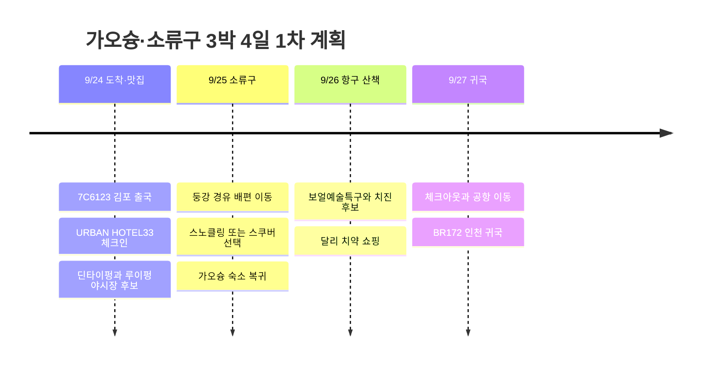

# 가오슝 3박 4일 · 소류구 바다 체험 여행 1차 계획

**추천 구성은 9/24 맛집·야시장 → 9/25 소류구 바다 체험 → 9/26 항구·치진 → 9/27 귀국이다.** URBAN HOTEL33에서 3박 모두 숙박하고, 바다는 하루만 다녀온다. 스노클링을 기본 후보로 두고, 원하면 같은 날 체험 스쿠버 또는 자격에 맞는 펀다이빙으로 바꾼다.

2026년 여행으로 작성했다. 조사 기준일은 2026-09-05이며, 항공편·숙소·아래 확정 금액은 사용자 제공 정보다. 식당, 체험, 투어는 예약되지 않은 후보다. 지도 좌표는 동선 파악용 기준점이며 상점 입구나 실제 다이빙 포인트를 뜻하지 않는다.

## 확정 정보와 비용

| 항목 | 확정 내용 | 금액 |
|------|----------|-----:|
| 출국 | 9/24 제주항공 7C6123 · 김포 GMP → 가오슝 KHH | 184,230원 |
| 귀국 | 9/27 에바항공 BR172 · 가오슝 KHH → 인천 ICN | 348,300원 |
| 숙소 | URBAN HOTEL33 · 9/24 체크인, 9/27 체크아웃, 3박 | 197,658원 |
| 합계 | 항공 532,530원 + 숙박 197,658원 | **730,188원** |

숙소는 3박 합계이며 단순 박당 평균은 65,886원이다. 항공·숙박이 몇 명분인지는 미확인이므로 합계를 임의로 1인 비용이라고 부르지 않는다. 식비·교통·바다 체험·쇼핑은 별도이며 실제 금액 확인 후 추가한다. 추석 기간 항공권이라는 사용자 메모를 남긴다.

시간 배치를 위한 조회 시간은 **7C6123 김포 09:45 → 가오슝 12:00**, **BR172 가오슝 15:50 → 인천 19:45**다. 모두 각 공항 현지 시각이며 대만은 한국보다 1시간 느리다. 해당 날짜 예약표로 확정한 시간이 아니므로 출발 전 예약 내역과 대조한다. [출국 시간표](https://zbordirect.com/en/low-cost/from-korea/to-taiwan/seoul-kaohsiung), [귀국 시간표](https://zbordirect.com/en/tools/schedule?arrival_city=SEL&departure_city=KHH).

**대만도 9/25 중추절과 9/28 교사절이 이어지는 4일 연휴다.** 소류구 배편·접송·체험은 미리 확보하고, 도로와 선착장 대기를 넉넉히 잡는다. [대만 이민서 연휴 안내](https://news.immigration.gov.tw/NewsSection/Detail/af7f61dc-3652-4a0d-98fb-abdd4fe324dc?lang=EN).

## 일정 요약

아래 시각은 예약 시각이 아니라 이동·휴식 여유를 포함한 목표 시간이다.

| 날짜 | 오전 | 오후 | 저녁 |
|------|------|------|------|
| 9/24 목 | 김포에서 7C6123 출국 | 정오 도착 가정, 입국·MRT·숙소 이동, 체크인·휴식 | 16시대 딘타이펑 후보 → 한신 아레나 → 루이펑 야시장·천사지파이 후보 |
| 9/25 금 | 07시대 출발 목표, 둥강 이동·소류구 배편 | 11시 전후 스노클링 또는 스쿠버 한 종류, 점심·휴식, 15~16시대 본섬 복귀 목표 | 18~19시대 가오슝 복귀 예상, 숙소 근처 식사·휴식 |
| 9/26 토 | 10시대 보얼예술특구·옌청 거리 | 점심 → 하마싱·구산 선착장 → 치진 산책 | 항구 노을, 시내에서 달리 치약·기념품 구매 |
| 9/27 일 | 아침 식사·짐 정리, 예약 조건에 맞춰 체크아웃 | 12시대 숙소 출발, 13시 전후 공항 도착 목표 → BR172 | 인천 도착 후 귀가 |

## 일정 타임라인

## 9/24 · 체크인 후 딘타이펑과 천사지파이

공항에서 **레드선 R4 가오슝국제공항 → R10/O5 미려도 환승 → 오렌지선 O6 신이국소**로 이동한다. 호텔까지 도보를 포함해 공항 MRT 출발부터 45~60분 정도를 일정상 배정한다. URBAN HOTEL33 주소는 **No.33, Minzu 2nd Rd., Xinxing District**다. [호텔 등록 정보](https://www.taiwanstay.net.tw/TSA/web_page/TSA020200.jsp?hohi_id=17023&lang2=en), [MRT 공식 노선도](https://www.krtc.com.tw/KLRT/guide_map).

첫날 점심은 호텔 근처에서 가볍게 먹고 체크인 후 쉰다. 딘타이펑은 **한신 아레나(漢神巨蛋) B1** 지점을 후보로 잡는다. 미려도에서 레드선으로 갈아타 **R14 쥐단/Kaohsiung Arena** 방면으로 간다. 16시대 이른 저녁으로 샤오롱바오·볶음밥을 먹고, 같은 권역의 루이펑 야시장을 이어가면 동선이 맞는다. [한신 아레나 딘타이펑 안내](https://www.hanshin.com.tw/漢神巨蛋/tw/Floor/B1F/鼎泰豐).

천사지파이는 **天使雞排**로 검색한다. 루이펑점은 현재 매장 안내에 야시장 내 점포로 소개되어 있다. 딘타이펑에서 배부르면 치킨은 나눠 먹거나 다음 기회로 넘긴다. 두 곳 모두 희망 후보이므로 대기 줄이 길면 당일 생략해도 된다. [천사지파이 루이펑점 안내](https://supertaste.tvbs.com.tw/infocard/11902). 연휴 특별 영업과 정확한 매대 위치는 당일 확인한다.

## 9/25 · 소류구 바다 체험

**소류구(Xiaoliuqiu, 小琉球)를 우선 추천한다.** 호텔을 옮기지 않고 하루를 바다에 쓸 수 있고, 스노클링과 스쿠버 중 취향에 맞게 선택할 수 있다. 다만 차가 없을 때는 섬에 도착한 뒤의 이동까지 함께 준비해야 한다.

| 선택 | 이번 여행에 넣는 방식 | 예약 전 확인 |
|------|---------------------|--------------|
| 스노클링 · 기본 후보 | 강사 동행 한 차례 + 식사·항구 주변 휴식 | 구명장비·수트·샤워·언어·항구 및 입수 지점 차량 이동 |
| 체험 스쿠버 · 대안 | 자격증이 없다면 체험 프로그램으로 같은 시간대 교체 | 건강 문진·강사 배정·전체 소요 시간·픽업·귀환 배편 |
| 펀다이빙 · 자격 보유 시 | 자격 수준·최근 경험에 맞는 프로그램 선택 | 장비 대여·잠수 횟수·마지막 출수 시각·무비행 시간 |

기본 동선은 **숙소 → 둥강 선착장 → 소류구 → 업체 픽업 → 체험 → 샤워·점심 → 항구 → 둥강 → 가오슝**이다. 가오슝↔둥강은 예약 접송을 우선 검토한다. 대중교통으로 가면 MRT 쭤잉역에서 **9127D 대붕만·소류구 노선**을 연결한다. 현재 정류장·배차는 [관광청 노선 안내](https://www.dbnsa.gov.tw/zh-tw/plantrip/TaiwanTripPage?a=384)로 확인하고, 연휴에는 호텔부터 섬까지 편도 2∼3시간 이상을 열어둔다. 배 자체는 통상 20∼30분 수준이지만 수속·대기·도로 이동은 별도다. [다이빙 업체 교통 안내](https://www.neptune-diving.org/reserve_traffic.html).

확인된 업체·상품 후보는 다음과 같다. **9/25 잔여 좌석이나 최종 견적은 아직 확인하지 않았다.**

| 후보 | 확인한 내용 | 남은 확인 |
|------|-------------|----------|
| [Ofucos 소류구 스노클링](https://www.ofucos.com/product/liuqiusnorkeling/) | 스노클링 상품·왕복 배편 추가 구매 옵션 | 무운전 참가자 항구 픽업과 입수 지점 차량 이동, 연휴 총액 |
| [Neptune 체험 스쿠버](https://www.neptune-diving.org/experience-diving.html) | 무자격 체험 상품, 별도 교통 안내에 섬 항구→잠수점 차량 픽업 명시 | 체험 당일 왕복 픽업 포함 여부·강사 언어·시간·가격 |
| [대만 관광버스 소류구 일일 투어](https://www.taiwantourbus.com.tw/C/tour/tw/golden-founders002-001) | 가오슝 출발 차량·둥강 배편·유리바닥 보트 관광 안내 | 실제 운행일·차량 종류·섬 내 이동·최소 인원. 스노클링 포함으로 간주하지 않기 |

업체에 확인할 핵심은 **“렌터카와 스쿠터 없이 참가한다. 섬 항구 왕복 및 체험 지점 이동을 자동차로 제공하는가?”**이다. 픽업이 체험 이동만 포함한다면 별도 섬 일주를 넣지 않고 항구 인근에서 식사한다. 최종 배편에 기대지 않도록 오후 복귀를 목표로 잡는다.

스쿠버는 **25일에 마치고 26일을 육상 휴식일**로 둔다. DAN은 무감압 1회 잠수 후 최소 12시간, 반복·여러 날 잠수 후 최소 18시간의 비행 전 수면 휴식을 권고한다. 이번 초안은 더 긴 여유를 두지만 안전을 보장하는 수치는 아니며, 실제 잠수 계획과 다이브 컴퓨터·업체 지침을 따른다. [DAN 비행 전 잠수 간격](https://dan.org/health-medicine/health-resources/diseases-conditions/flying-after-diving/).

## 9/26 · 보얼·치진과 쇼핑

신이국소에서 오렌지선 **O2 옌청푸**로 이동해 보얼 창고 거리·전시를 둘러보고 점심을 먹는다. 보얼은 옌청푸역에서 도보 접근이 가능하다. [보얼 공식 교통 안내](https://www.en.pier2.org/transport/).

오후에는 하마싱 쪽으로 이동해 구산 선착장에서 치진행 페리를 타는 흐름으로 잡는다. 치진에서는 북쪽 구시가지와 해변 위주로 2~3시간 산책한다. 걷는 양이 많으면 등대나 포대는 하나만 선택한다. 시내 항구와 치진을 잇는 구성은 [가오슝 관광청 항구 여행 안내](https://khh.travel/zh-tw/travel/tour/151/)를 참고했다. 치진은 해변 산책 일정이며 소류구 수중 체험을 대신하는 다이빙 장소로 잡은 것은 아니다.

달리 치약은 이날 시내에서 구매한다. 저녁은 항구 근처나 호텔로 돌아오는 길에 해결하고, 다음 날 짐을 정리한다.

## 달리 치약 · 면세와 시내 구매

찾을 이름은 **DARLIE / 好來牙膏**, 예전 표기는 **黑人牙膏**다. 대만 브랜드 공식 페이지에는 왓슨스·코스메드·POYA 등 구매 채널이 연결되어 있어, **시내 드러그스토어에서 먼저 찾는 계획**이 현실적이다. 지점별 재고와 원하는 맛·종류는 별도 확인한다. [DARLIE 대만 상품 안내 및 판매 채널](https://www.darlie.com.tw/zh/products/all-products/darlie-all-shiny-white-starshine-purple-corrector-toothpaste).

가오슝 공항 면세점의 해당 제품 판매·재고는 이번 조사에서 확인하지 못했다. 공항 구매를 유일한 방법으로 남겨두지 않고 26일까지 시내에서 사둔다. 일반 시내 구매를 면세 구매로 기록하지 않는다.

대용량 치약은 위탁수하물에 넣는 쪽으로 준비한다. 기내 액체·젤류는 용기당 100mL 이하, 총 1L 투명 재밀봉 봉투 규정을 확인해야 하며 **제품 중량 100g을 용기 부피 100mL와 같다고 판단하지 않는다.** 위탁수하물 포함 여부도 예약표로 확인한다. [에바항공 수하물 제한](https://www.evaair.com/en-gb/fly-prepare/baggage/additional-baggage-information/restrictions/).

## 바다를 바꾸고 싶거나 날씨가 나쁠 때

| 상황 | 대체 방법 |
|------|----------|
| 소류구에서 물에 들어가지 않고 관광만 하고 싶음 | 위의 관광버스·유리바닥 보트 상품 검토. 배가 운항하는 해황일 때만 가능 |
| 컨딩의 해안 풍경·수족관이 더 끌림 | [가오슝 출발 컨딩 일일 투어](https://www.klook.com/zh-TW/activity/13631-kenting-classic-attractions-day-tour-kenting/)로 25일 하루를 교체. 수족관·어롼비·룽판 공원 관광 상품이며 다이빙 포함 상품은 아님 |
| 25일만 해황이 나쁨 | 운영사 확인 후 25·26일 교환 검토. 스쿠버는 실제 출수→27일 비행 간격이 맞지 않으면 생략 |
| 배편 취소·강풍·태풍 영향 | 섬·해안 투어를 취소하고 시내 전시·백화점·식사로 전환. 치진·컨딩을 악천후 대안으로 강행하지 않기 |

컨딩은 연휴에 육상 이동이 길어질 수 있어, 이번 3박 일정에는 소류구와 컨딩 두 곳을 모두 넣지 않는 편을 추천한다. 상품에 표시된 기본 가격을 확정 지출로 옮기지 않고, 선택 날짜·언어·입장권·식사·접송 포함 총액으로 비교한다.

## 9/27 · 공항으로 돌아가기

오전은 호텔 근처 아침 식사와 짐 정리만 한다. 예약 조건에 맞춰 체크아웃하고, **조회된 15:50 출발 기준 13시 전후 공항 도착**을 목표로 한다. MRT는 신이국소 → 미려도 환승 → 가오슝국제공항 역의 역순이다. 항공 시간이 바뀌면 항공사 권장 공항 도착 시각부터 역산한다.

한국에서는 김포로 출국하고 인천으로 귀국하므로 공항까지 자가용을 가져가는 계획이라면 귀국 후 회수 동선도 별도로 고려한다.

## 다음에 확정할 항목

- 예약표의 항공 시간과 위탁수하물, 호텔 체크인·체크아웃·조식 조건.
- 여행 인원, 스노클링/체험 스쿠버/펀다이빙 선택 및 다이빙 자격·경험.
- 9/25 체험·배편·양쪽 육상 접송의 묶음 견적과 취소 조건.
- 원하는 DARLIE 제품 종류·수량과 시내 지점 재고.
- 출발 직전 해황·운항 공지와 식당 연휴 영업 확인.
