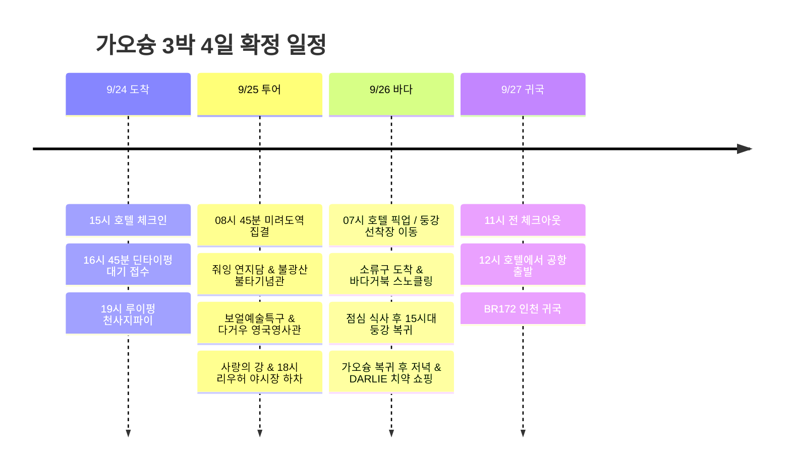

**첫날 북쪽 맛집(딘타이펑·루이펑), 둘째 날 클룩 일일 투어(불광산·연지담·영국영사관), 셋째 날 소류구 바다거북 스노클링**으로 알차게 재편했다. 왕복 4시간 이상 소요되는 컨딩 투어는 제외(포기)하고, 25일에 **클룩 한국어 가이드 투어**로 가오슝 시내 및 불광산 핵심 명소를 전용버스로 편안하게 관람한 뒤, 26일에는 **소류도(소류구) 당일치기 스노클링**으로 바다거북을 만나는 최적의 코스다.

시각은 현지 기준이며, 항공 배치는 **7C6123 김포 09:45 → 가오슝 12:00 / BR172 가오슝 15:50 → 인천 19:45** 조회 시간표를 기준으로 했다. 실제 예약표와 다른 경우 공항 이동부터 조정한다. [출국 시간표](https://zbordirect.com/en/low-cost/from-korea/to-taiwan/seoul-kaohsiung), [귀국 시간표](https://zbordirect.com/en/tools/schedule?arrival_city=SEL&departure_city=KHH).

## 일정 요약

| 날짜 | 동선 | 하루의 마무리 |
|---|---|---|
| 9/24 목 | 공항 → URBAN HOTEL33 → 한신 아레나 딘타이펑 → 루이펑 천사지파이 | 20:30 호텔, 다음 날 투어 준비 |
| 9/25 금 | **[확정] 클룩 일일 투어**: 미려도역 집결 → 연지담 → 불광산 불타기념관 → 보얼 → 영국영사관 → 사랑의 강 → 리우허 야시장 | 19:30 야시장 저녁 후 호텔 복귀 |
| 9/26 토 | **소류구 바다 스노클링**: 호텔 픽업 → 둥강 선착장 → 소류구 바다거북 스노클링 → 점심 → 가오슝 복귀 → 시내 저녁 & 쇼핑 | 20:30 호텔, 치약 위탁 짐에 포장 |
| 9/27 일 | 아침 → 11시 전 체크아웃 → 점심 → 공항 | 13시 공항 도착, BR172 귀국 |

## 9/25 금 · 클룩 가오슝 일일 투어 (한국어 가이드) 확정

**9/25(금)에 [클룩 가오슝 일일 투어 (한국어 가이드)](https://www.klook.com/ko/activity/22010-day-tour-kaohsiung/)를 확정했다.** 전용 차량과 한국어 가이드가 동행하여 가오슝의 대표적인 역사·문화 명소를 하루에 쾌적하게 연결한다.

* **예약 상품**: [가오슝 일일 투어 (한국어 가이드) - Klook](https://www.klook.com/ko/activity/22010-day-tour-kaohsiung/)
* **집결 장소**: **MRT 미려도역 (포모사 블러바드역)** 지하 '빛의 돔(Dome of Light)'
* **출발 시간**: 통상 08:30~09:00 사이 (바우처의 지정 시각 기준)
* **주요 방문지**: 연지담(용호탑) → 불광산 불타기념관 → 보얼 예술특구 → 다거우 영국영사관 / 치진 → 사랑의 강(아이허) → 리우허 야시장(하차 해산)
* **소요 시간**: 약 9시간 (09:00 경 시작 ~ 18:00 경 리우허 야시장 도착)

> [!NOTE]
> **컨딩 제외 및 소류구 26일 이동 효과**
> - **컨딩 투어 제외**: 왕복 4시간 이상 걸리는 컨딩은 이동 피로도를 감안하여 완전히 제외했다.
> - **완벽한 역할 분담**: 25일은 가오슝 핵심 명소와 역사문화(불광산/연지담/영국영사관)를 버스로 편하게 둘러보고, 26일은 소류구 에메랄드 바다에서 스노클링을 즐겨 관광과 자연 액티비티가 균형을 이룬다.
> - **출발지 접근성**: 숙소인 URBAN HOTEL33에서 MRT 1정거장(신이국소역→미려도역) 거리로 아침 집결이 매우 수월하다.

## 일정 타임라인

## 9/24 목 · 체크인 후 딘타이펑과 천사지파이

| 현지 시간 | 할 일 | 이동·대기 배치 |
|---|---|---|
| 12:00∼13:15 | 가오슝 도착·입국·수하물 | 정오 도착 기준 75분 |
| 13:15∼14:15 | MRT로 호텔 이동·짐 보관 | R4 공항 → R10/O5 미려도 환승 → O6 신이국소, 도보 포함 60분 |
| 14:15∼15:00 | 호텔 근처 가벼운 점심 | 딘타이펑을 위해 간단히 먹기 |
| 15:00∼16:00 | 체크인·샤워·휴식 | 도착 직후 북쪽까지 바로 이동하지 않기 |
| 16:00∼16:45 | 호텔 → 한신 아레나 | O6 → 미려도 환승 → R14 쥐단, 역에서 도보 포함 |
| 16:45∼18:30 | 딘타이펑 대기 접수·이른 저녁 | **漢神巨蛋 B1**. 대기와 식사 합쳐 1시간 45분 |
| 18:30∼19:00 | 루이펑 야시장으로 도보 | 중간 상점 구경 포함 30분 |
| 19:00∼19:45 | 천사지파이·야시장 | 天使雞排 루이펑점, 배부르면 나눠 먹기 |
| 19:45∼20:30 | MRT로 호텔 복귀 | 다음 날 일일 투어 바우처 확인 및 휴식 |

[호텔 → 딘타이펑](https://www.google.com/maps/dir/?api=1&origin=URBAN+HOTEL33+Kaohsiung&destination=Din+Tai+Fung+Hanshin+Arena&travelmode=transit) · [딘타이펑 → 루이펑](https://www.google.com/maps/dir/?api=1&origin=Din+Tai+Fung+Hanshin+Arena&destination=Ruifeng+Night+Market&travelmode=walking).

호텔은 **No.33, Minzu 2nd Rd.**, 조회된 체크인은 **15:00**, 체크아웃은 **11:00**다. [호텔 등록 정보](https://www.taiwanstay.net.tw/TSA/web_page/TSA020200.jsp?hohi_id=17023&lang2=en), [체크인·체크아웃 안내](https://www.booking.com/hotel/tw/urban-hotel33.en-gb.html), [MRT 공식 노선도](https://www.krtc.com.tw/KLRT/guide_map).

딘타이펑 접수 시 예상 대기가 60분을 넘으면 **같은 한신 아레나에서 저녁을 먹고 야시장으로 이동**한다. 첫날 저녁 때문에 다음 날 아침 일일 투어 집결을 피곤하게 시작하지 않도록 20:30 복귀를 기준으로 삼는다.

## 9/25 금 · 클룩 가오슝 일일 투어 (한국어 가이드)

| 현지 시간 | 할 일 | 이동·대기 배치 |
|---|---|---|
| 07:30∼08:15 | 아침 식사 및 외출 준비 | 호텔 주변 간단한 식사 |
| 08:15∼08:45 | 숙소 → 미려도역 이동 | MRT 신이국소역(O6) → 미려도역(O5/R10) 1정거장, 도보 포함 약 20분 |
| 08:45∼09:00 | **미려도역 집결 및 가이드 미팅** | 지하 '빛의 돔' 앞 집결, 전용 차량 탑승 |
| 09:30∼10:45 | **연지담 (줘잉 풍경구)** | 용의 입으로 들어가 호랑이 입으로 나오는 용호탑 관람 |
| 11:30∼13:45 | **불광산 불타기념관** | 세계 최대 청동 좌불(불광대불) 및 전시 관람, 사찰 내 자유 점심 |
| 14:30∼15:30 | **보얼 예술특구** | 과거 부두 창고를 예술 단지로 재탄생시킨 거리 산책 |
| 15:45∼16:45 | **다거우 영국영사관** | 언덕 위 붉은 벽돌 영사관 건물과 시즈완 항구 파노라마 |
| 17:00∼17:40 | **사랑의 강 (아이허)** | 가오슝의 대표적인 낭만 수변 공간 산책 |
| 18:00∼19:30 | **리우허 야시장 하차 및 저녁** | 투어 종료 후 야시장 구경, 해산물·파파야우유 등 현지 미식 |
| 19:30∼20:00 | 호텔 복귀 및 휴식 | 미려도역에서 신이국소역으로 1정거장 복귀 |

* 투어 코스 순서와 체류 시간은 현지 교통 상황 및 날씨에 따라 가이드의 안내로 유연하게 조정될 수 있다.
* 투어 중 불광산에서 점심시간이 주어지므로 사찰 내 채식 뷔페 또는 푸드코트를 이용한다.
* 리우허 야시장은 미려도역 11번 출구 바로 앞에 있으므로, 식사 후 숙소(URBAN HOTEL33)까지 MRT나 도보(약 15분)로 매우 가깝다.

## 9/26 토 · 소류구 바다거북 스노클링

소류도(小琉球, 소류구)는 가오슝 남쪽 둥강 선착장에서 배로 약 20~30분 거리에 있는 산호섬으로, 연중 바다거북을 볼 확률이 90% 이상인 대만 최고의 스노클링 명소다. 

**예약 권장 구성: 가오슝 ↔ 둥강 선착장 왕복 차량 + 왕복 배편 + 섬 항구 ↔ 스노클링 샵 픽업 + 강사 동행 스노클링(장비·슈트·샤워 포함)**

| 현지 시간 | 할 일 | 이동·대기 배치 |
|---|---|---|
| 06:30∼07:15 | 가벼운 조식 및 픽업 준비 | 수영복 이너 착용, 방수팩·갈아입을 옷 준비 |
| 07:15∼08:45 | 가오슝 숙소 픽업 → 둥강 선착장 | 전용 픽업차량 또는 샌딩 택시 이용 (약 60~80분) |
| 08:45∼09:30 | 승선권 발권 및 승선 대기 | 실물 티켓 수령 (신분증/여권 지참) |
| 09:30∼10:00 | 둥강 선착장 → 소류구 바이샤항 | 고속 페리 탑승 (약 20~25분) |
| 10:00∼11:00 | 소류구 도착, 샵 픽업 & 브리핑 | 샵 차량 이동, 슈트/구명조끼 착용, 안전 교육 |
| 11:00∼12:30 | **바다거북 스노클링 체험** | 현지 강사 동행, 화산암 해안에서 바다거북 관찰 및 사진 촬영 (약 90분) |
| 12:30∼13:30 | 샤워·환복 및 점심 식사 | 샵 샤워실 이용 후 항구 근처 해산물/망고빙수 |
| 13:30∼14:30 | 바이샤항 주변 산책 & 기념품 | 화제석(꽃병바위) 뷰포인트 산책 |
| 14:30∼15:30 | 소류구 → 둥강 선착장 복귀편 탑승 | 15시대 배편 목표로 탑승 |
| 15:30∼17:00 | 둥강 선착장 → 가오슝 숙소 복귀 | 복귀 차량 이용, 호텔 복귀 후 정돈 |
| 17:00∼18:30 | 호텔 휴식 및 외출 준비 | 바다 소금기 씻어내고 편한 옷으로 환복 |
| 18:30∼20:30 | 시내 저녁 식사 & DARLIE 치약 쇼핑 | 옌청/미려도 맛집 및 POYA/왓슨스 치약 구매 |
| 20:30∼21:30 | 호텔 복귀 & 수하물 최종 패킹 | 치약은 위탁수하물 캐리어에 안전 포장 |

> [!TIP]
> **비행 전 안전 (Flying After Diving)**
> - 스쿠버다이빙은 체내 질소 배출을 위해 비행 전 18~24시간의 수면 휴식이 필요하지만, **수면에서 숨을 쉬는 스노클링은 비행 전 휴식 제약이 전혀 없습니다.** 따라서 다음 날(9/27) 오후 비행기(BR172) 탑승에 안전 문제가 전혀 발생하지 않습니다.
> - 소류구에서는 스쿠터를 직접 운전하지 않고 **항구 픽업이 포함된 스노클링 샵**을 이용하는 것이 가장 안전하고 편리합니다.

## 9/27 일 · 11시 체크아웃, 12시 공항 출발

| 현지 시간 | 할 일 | 마감 기준 |
|---|---|---|
| 08:30∼09:30 | 아침 식사 | 호텔 주변 |
| 09:30∼10:45 | 짐 정리·체크아웃 | **11시 이전 객실 반납** |
| 10:45∼11:45 | 짐 보관 후 근처 이른 점심 | 점심 대기가 길면 공항에서 식사 |
| 11:45∼12:00 | 짐 회수·출발 준비 | 호텔에서 MRT 신이국소역 이동 |
| 12:00∼13:00 | MRT로 가오슝공항 이동 | O6 → 미려도 환승 → R4 공항역, 도보 포함 60분 |
| 13:00∼15:50 | 수속·출국·탑승 | 출발 15:50보다 약 3시간 전 공항 도착 |
| 15:50∼19:45 | BR172 가오슝 → 인천 | 김포 출국, 인천 귀국 |

## 쇼핑 메모 및 수하물 주의사항

* **달리 치약 (DARLIE / 好來牙膏)**: 시내 드럭스토어(왓슨스, 코스메드, POYA)에서 구입한다. 치약은 액체·겔류 규정이 적용되므로 100mL(g) 초과 제품은 반드시 위탁수하물 캐리어에 넣어야 한다.
* **써니힐 펑리수**: 기내 반입이 가능하므로 부서지지 않도록 기내 가방에 보관해도 무방하다.

## 확인된 비용 내역

| 항목 | 금액 | 비고 |
|---|---:|---|
| 7C6123 김포 → 가오슝 | 184,230원 | 제주항공 |
| BR172 가오슝 → 인천 | 348,300원 | 에바항공 |
| URBAN HOTEL33 3박 | 197,658원 | 3박 총액 (박당 약 65,886원) |
| 클룩 가오슝 일일 투어 (1인) | 54,600원 | 9/25 전일 한국어 가이드 투어 |
| **확인 합계** | **784,788원** | 소류구 페리/스노클링, 현지 식비·쇼핑 별도 |
