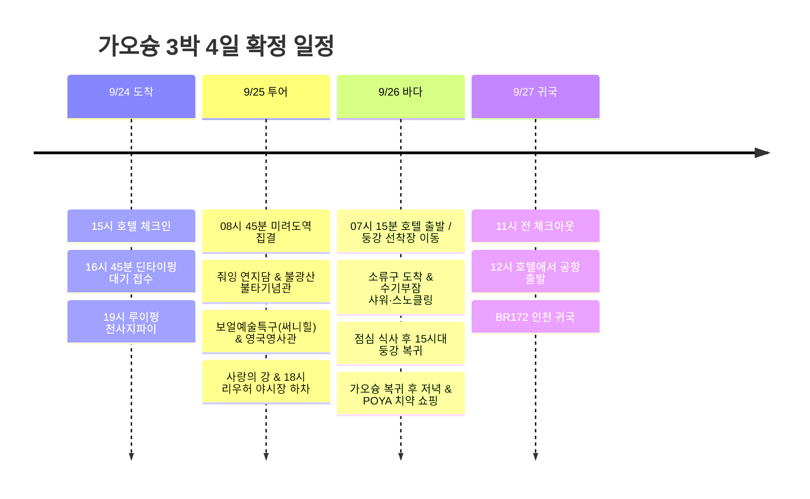

**첫날 북쪽 맛집(딘타이펑·루이펑), 둘째 날 클룩 일일 투어(불광산·연지담·영국영사관), 셋째 날 소류구 바다거북 스노클링 & 저녁 쇼핑**으로 완성했다. 컨딩 투어는 장거리 이동 부담으로 제외(포기)하고, 25일에 **클룩 한국어 가이드 투어**로 가오슝 시내 및 불광산 핵심 명소를 전용버스로 편안하게 관람한다. 26일에는 개인 오리발과 스노클을 챙겨 **소류도 수기부잠(秀記浮潛)**의 샤워·짐보관 시설을 이용해 바다거북 스노클링을 즐긴 뒤, 가오슝으로 복귀해 여유로운 저녁 식사와 DARLIE 치약 쇼핑으로 하루를 마무리한다.

시각은 현지 기준이며, 항공 배치는 **7C6123 김포 09:45 → 가오슝 12:00 / BR172 가오슝 15:50 → 인천 19:45** 조회 시간표를 기준으로 했다. 실제 예약표와 다른 경우 공항 이동부터 조정한다. [출국 시간표](https://zbordirect.com/en/low-cost/from-korea/to-taiwan/seoul-kaohsiung), [귀국 시간표](https://zbordirect.com/en/tools/schedule?arrival_city=SEL&departure_city=KHH).

## 일정 요약

| 날짜 | 동선 | 하루의 마무리 |
|---|---|---|
| 9/24 목 | 공항 → URBAN HOTEL33 → 한신 아레나 딘타이펑 → 루이펑 천사지파이 | 20:30 호텔, 다음 날 투어 준비 |
| 9/25 금 | **[확정] 클룩 일일 투어**: 미려도역 집결 → 연지담 → 불광산 불타기념관 → 보얼(써니힐) → 영국영사관 → 사랑의 강 → 리우허 야시장 | 19:30 야시장 저녁 후 호텔 복귀 |
| 9/26 토 | **소류구 스노클링 & 시내 쇼핑**: 호텔 출발 → 둥강 → 소류구(수기부잠 짐보관/샤워 & 바다거북 스노클) → 가오슝 복귀 → POYA 치약 쇼핑 | 20:30 호텔, 치약 위탁 짐에 포장 |
| 9/27 일 | 아침 → 11시 전 체크아웃 → 점심 → 공항 | 13시 공항 도착, BR172 귀국 |

## 9/25 금 · 클룩 가오슝 일일 투어 (한국어 가이드) 확정

**9/25(금)에 [클룩 가오슝 일일 투어 (한국어 가이드)](https://www.klook.com/ko/activity/22010-day-tour-kaohsiung/)를 확정했다.** 전용 차량과 한국어 가이드가 동행하여 가오슝의 대표적인 역사·문화 명소를 하루에 쾌적하게 연결한다.

* **예약 상품**: [가오슝 일일 투어 (한국어 가이드) - Klook](https://www.klook.com/ko/activity/22010-day-tour-kaohsiung/)
* **집결 장소**: **MRT 미려도역 (포모사 블러바드역)** 지하 '빛의 돔(Dome of Light)'
* **출발 시간**: 통상 08:30~09:00 사이 (바우처의 지정 시각 기준)
* **주요 방문지**: 연지담(용호탑) → 불광산 불타기념관 → 보얼 예술특구 → 다거우 영국영사관 / 치진 → 사랑의 강(아이허) → 리우허 야시장(하차 해산)
* **쇼핑 포인트**: 보얼 예술특구 자유시간에 **써니힐(SunnyHills) 보얼점**에 들러 선물용 프리미엄 펑리수를 바로 픽업할 수 있다.

> [!NOTE]
> **컨딩 제외 및 소류구 26일 이동 효과**
> - **컨딩 투어 제외**: 왕복 4시간 이상 걸리는 컨딩은 이동 피로도를 감안하여 완전히 제외했다.
> - **완벽한 역할 분담**: 25일은 가오슝 핵심 명소(불광산/연지담/보얼/영국영사관)를 버스로 편하게 둘러보고, 26일은 소류구 바다에서 스노클링에 집중하여 여행의 완성도를 높였다.
> - **출발지 접근성**: 숙소인 URBAN HOTEL33에서 MRT 1정거장(신이국소역→미려도역) 거리로 아침 집결이 매우 수월하다.

## 일정 타임라인

## 9/24 목 · 체크인 후 딘타이펑과 천사지파이

| 현지 시간 | 할 일 | 이동·대기 배치 |
|---|---|---|
| 12:00∼13:15 | 가오슝 도착·입국·수하물 | 정오 도착 기준 75분 |
| 13:15∼14:15 | MRT로 호텔 이동·짐 보관 | R4 공항 → R10/O5 미려도 환승 → O6 신이국소, 도보 포함 60분 |
| 14:15∼15:00 | 호텔 근처 가벼운 점심 | 딘타이펑을 위해 간단히 먹기 |
| 15:00∼16:00 | 체크인·샤워·휴식 | 도착 직후 북쪽까지 바로 이동하지 않기 |
| 16:00∼16:45 | 호텔 → 한신 아레나 | O6 → 미려도 환승 → R14 쥐단, 역에서 도보 포함 |
| 16:45∼18:30 | 딘타이펑 대기 접수·이른 저녁 | **漢神巨蛋 B1**. 식사 및 백화점 잡화 쇼핑 |
| 18:30∼19:00 | 루이펑 야시장으로 도보 | 중간 상점 구경 포함 30분 |
| 19:00∼19:45 | 천사지파이·야시장 | 天使雞排 루이펑점, 야시장 소품 구경 |
| 19:45∼20:30 | MRT로 호텔 복귀 | 다음 날 일일 투어 바우처 확인 및 휴식 |

[호텔 → 딘타이펑](https://www.google.com/maps/dir/?api=1&origin=URBAN+HOTEL33+Kaohsiung&destination=Din+Tai+Fung+Hanshin+Arena&travelmode=transit) · [딘타이펑 → 루이펑](https://www.google.com/maps/dir/?api=1&origin=Din+Tai+Fung+Hanshin+Arena&destination=Ruifeng+Night+Market&travelmode=walking).

호텔은 **No.33, Minzu 2nd Rd.**, 조회된 체크인은 **15:00**, 체크아웃은 **11:00**다. [호텔 등록 정보](https://www.taiwanstay.net.tw/TSA/web_page/TSA020200.jsp?hohi_id=17023&lang2=en), [체크인·체크아웃 안내](https://www.booking.com/hotel/tw/urban-hotel33.en-gb.html), [MRT 공식 노선도](https://www.krtc.com.tw/KLRT/guide_map).

## 9/25 금 · 클룩 가오슝 일일 투어 (한국어 가이드)

| 현지 시간 | 할 일 | 이동·대기 배치 |
|---|---|---|
| 07:30∼08:15 | 아침 식사 및 외출 준비 | 호텔 주변 간단한 식사 |
| 08:15∼08:45 | 숙소 → 미려도역 이동 | MRT 신이국소역(O6) → 미려도역(O5/R10) 1정거장, 도보 포함 약 20분 |
| 08:45∼09:00 | **미려도역 집결 및 가이드 미팅** | 지하 '빛의 돔' 앞 집결, 전용 차량 탑승 |
| 09:30∼10:45 | **연지담 (줘잉 풍경구)** | 용의 입으로 들어가 호랑이 입으로 나오는 용호탑 관람 |
| 11:30∼13:45 | **불광산 불타기념관** | 세계 최대 청동 좌불(불광대불) 및 전시 관람, 사찰 내 자유 점심 |
| 14:30∼15:30 | **보얼 예술특구 & 써니힐 쇼핑** | 창고 거리 산책 및 **써니힐 보얼점** 펑리수 구매 |
| 15:45∼16:45 | **다거우 영국영사관** | 언덕 위 붉은 벽돌 영사관 건물과 시즈완 항구 파노라마 |
| 17:00∼17:40 | **사랑의 강 (아이허)** | 가오슝의 대표적인 낭만 수변 공간 산책 |
| 18:00∼19:30 | **리우허 야시장 하차 및 저녁** | 투어 종료 후 야시장 구경, 해산물·파파야우유 등 현지 미식 |
| 19:30∼20:00 | 호텔 복귀 및 휴식 | 미려도역에서 신이국소역으로 1정거장 복귀 |

## 9/26 토 · 소류구 스노클링 (수기부잠 샤워) & 시내 쇼핑

개인 오리발(핀)과 스노클 마스크가 준비되어 있으므로, 장비 대여 없이 **샤워 시설과 락커 짐보관이 완비된 현지 전문 샵 [소류구 수기부잠 (秀記浮潛)](https://maps.app.goo.gl/6qvMkMZoN6G9okRk9)**을 거점으로 활용한다.

* **이용 거점**: [小琉球秀記浮潛 (Xiuji Snorkeling Show)](https://maps.app.goo.gl/6qvMkMZoN6G9okRk9)
  * **위치**: 소류구 바이샤항(여객선 선착장)에서 도보 3분 거리
  * **편의시설**: 온수 샤워실, 헤어드라이어, 바디워시/샴푸 구비, 소지품 락커 짐 보관
  * **포인트 접근성**: 바로 앞이 소류구 최고의 바다거북 서식지인 **화제석(꽃병바위, 花瓶岩)** 해변

| 현지 시간 | 할 일 | 이동·대기 배치 |
|---|---|---|
| 06:30∼07:15 | 가벼운 조식 및 출발 준비 | 수영복 이너 착용, 개인 오리발·스노클·방수팩 챙기기 |
| 07:15∼08:45 | 숙소 → 둥강 선착장 이동 | 픽업차량 또는 왕복 택시 예약 이용 (약 60~80분) |
| 08:45∼09:30 | 승선권 발권 및 승선 대기 | 실물 티켓 수령 (신분증/여권 지참) |
| 09:30∼10:00 | 둥강 선착장 → 소류구 바이샤항 | 고속 페리 탑승 (약 20~25분 소요) |
| 10:00∼10:20 | **수기부잠 (秀記浮潛) 도착** | 선착장에서 도보 3분 이동, 짐 보관 및 입수 준비 |
| 10:30∼12:30 | **바다거북 스노클링 세션** | 화제석(꽃병바위) 포인트에서 개인 오리발·마스크로 스노클링 |
| 12:30∼13:30 | **수기부잠 온수 샤워 & 환복** | 샵 내 온수 샤워실 이용, 보송한 옷으로 갈아입기 |
| 13:30∼14:30 | 항구 근처 점심 식사 | 바이샤항 주변 현지 식당(해산물 볶음밥, 망고빙수) |
| 14:30∼15:00 | 바이샤항으로 복귀 | 복귀편 페리 탑승 대기 |
| 15:00∼15:30 | 소류구 → 둥강 선착장 페리 | 오후 배편 탑승 |
| 15:30∼17:00 | 둥강 선착장 → 가오슝 숙소 복귀 | 차량 이동, 호텔 복귀 후 장비 정리 |
| 17:00∼18:30 | 호텔 정돈 및 가벼운 휴식 | 짐 정리 및 편한 쇼핑 복장으로 환복 |
| 18:30∼20:30 | **시내 저녁 식사 & 메인 쇼핑** | 숙소 인근 맛집 저녁 식사 후 **POYA(포야)**에서 달리치약 등 쇼핑 |
| 20:30∼21:30 | 호텔 복귀 & 수하물 최종 패킹 | 치약 및 액체류는 모두 위탁수하물 캐리어에 안전 포장 |

> [!TIP]
> **스노클링 안전 & 쇼핑 팁**
> - **비행 전 휴식 걱정 없음**: 스쿠버다이빙과 달리 수면 스노클링은 비행 전 감압 휴식(18시간 이상) 제약이 없으므로, 다음 날(9/27 15:50) 인천행 귀국 비행기(BR172) 탑승에 안전 문제가 전혀 없습니다.
> - **치약 수하물 규정**: 대만 인기 쇼핑템인 **DARLIE(달리) 치약**은 젤류로 분류되어 100mL(g) 초과 시 기내 반입이 엄격히 금지됩니다. 구매 후 반드시 호텔에서 위탁수하물(부치는 캐리어)에 넣어 패킹해야 합니다.

## 9/27 일 · 11시 체크아웃, 12시 공항 출발

| 현지 시간 | 할 일 | 마감 기준 |
|---|---|---|
| 08:30∼09:30 | 아침 식사 | 호텔 주변 |
| 09:30∼10:45 | 짐 정리·체크아웃 | **11시 이전 객실 반납** |
| 10:45∼11:45 | 짐 보관 후 근처 이른 점심 | 점심 대기가 길면 공항에서 식사 |
| 11:45∼12:00 | 짐 회수·출발 준비 | 호텔에서 MRT 신이국소역 이동 |
| 12:00∼13:00 | MRT로 가오슝공항 이동 | O6 → 미려도 환승 → R4 공항역, 도보 포함 60분 |
| 13:00∼15:50 | 수속·출국·탑승 | 출발 15:50보다 약 3시간 전 공항 도착 |
| 15:50∼19:45 | BR172 가오슝 → 인천 | 김포 출국, 인천 귀국 |

## 확인된 비용 내역

| 항목 | 금액 | 비고 |
|---|---:|---|
| 7C6123 김포 → 가오슝 | 184,230원 | 제주항공 |
| BR172 가오슝 → 인천 | 348,300원 | 에바항공 |
| URBAN HOTEL33 3박 | 197,658원 | 3박 총액 (박당 약 65,886원) |
| 클룩 가오슝 일일 투어 (1인) | 54,600원 | 9/25 전일 한국어 가이드 투어 |
| **확인 합계** | **784,788원** | 소류구 페리, 수기부잠 시설 이용료, 현지 식비·쇼핑 별도 |
