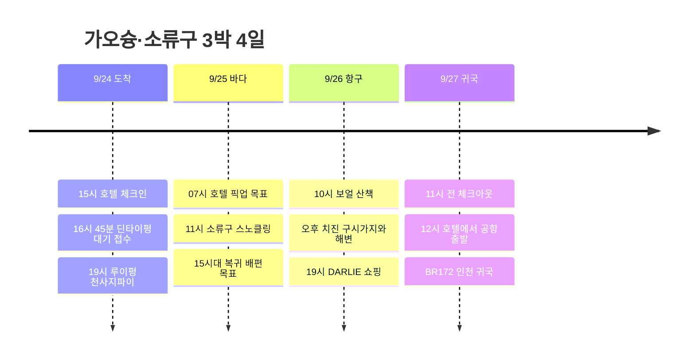

**첫날 북쪽 맛집, 둘째 날 소류구, 셋째 날 서쪽 항구**로 권역을 나눈다. URBAN HOTEL33에 짐을 두고 매일 돌아오며, 소류구에서는 스쿠터를 빌리지 않고 항구·체험장 차량 이동이 포함된 스노클링을 이용한다.

시각은 현지 기준이며, 항공 배치는 **7C6123 김포 09:45 → 가오슝 12:00 / BR172 가오슝 15:50 → 인천 19:45** 조회 시간표를 기준으로 했다. 실제 예약표와 다른 경우 공항 이동부터 조정한다. 관광·픽업·배편의 표기 시각은 목표 시간이며 예약 완료된 출발편은 아니다. [출국 시간표](https://zbordirect.com/en/low-cost/from-korea/to-taiwan/seoul-kaohsiung), [귀국 시간표](https://zbordirect.com/en/tools/schedule?arrival_city=SEL&departure_city=KHH).

## 일정 요약

| 날짜 | 동선 | 하루의 마무리 |
|---|---|---|
| 9/24 목 | 공항 → URBAN HOTEL33 → 한신 아레나 딘타이펑 → 루이펑 천사지파이 | 20:30 호텔, 다음 날 바다 준비 |
| 9/25 금 | 호텔 픽업 → 둥강 → 소류구 스노클링 → 둥강 → 호텔 | 18:30 복귀 목표, 저녁 후 휴식 |
| 9/26 토 | 보얼 → 하마싱 → 구산 선착장 → 치진 → 시내 쇼핑 | 20:30 호텔, 치약 위탁 짐에 포장 |
| 9/27 일 | 아침 → 11시 전 체크아웃 → 점심 → 공항 | 13시 공항 도착, BR172 귀국 |

## 일정 타임라인

## 9/24 목 · 체크인 후 딘타이펑과 천사지파이

| 현지 시간 | 할 일 | 이동·대기 배치 |
|---|---|---|
| 12:00∼13:15 | 가오슝 도착·입국·수하물 | 정오 도착 기준 75분 |
| 13:15∼14:15 | MRT로 호텔 이동·짐 보관 | R4 공항 → R10/O5 미려도 환승 → O6 신이국소, 도보 포함 60분 |
| 14:15∼15:00 | 호텔 근처 가벼운 점심 | 딘타이펑을 위해 간단히 먹기 |
| 15:00∼16:00 | 체크인·샤워·휴식 | 도착 직후 북쪽까지 바로 이동하지 않기 |
| 16:00∼16:45 | 호텔 → 한신 아레나 | O6 → 미려도 환승 → R14 쥐단, 역에서 도보 포함 |
| 16:45∼18:30 | 딘타이펑 대기 접수·이른 저녁 | **漢神巨蛋 B1**. 대기와 식사 합쳐 1시간 45분 |
| 18:30∼19:00 | 루이펑 야시장으로 도보 | 중간 상점 구경 포함 30분 |
| 19:00∼19:45 | 천사지파이·야시장 | 天使雞排 루이펑점, 배부르면 나눠 먹기 |
| 19:45∼20:30 | MRT로 호텔 복귀 | 다음 날 접송·배편 바우처와 수영복 준비 |

[호텔 → 딘타이펑](https://www.google.com/maps/dir/?api=1&origin=URBAN+HOTEL33+Kaohsiung&destination=Din+Tai+Fung+Hanshin+Arena&travelmode=transit) · [딘타이펑 → 루이펑](https://www.google.com/maps/dir/?api=1&origin=Din+Tai+Fung+Hanshin+Arena&destination=Ruifeng+Night+Market&travelmode=walking).

호텔은 **No.33, Minzu 2nd Rd.**, 조회된 체크인은 **15:00**, 체크아웃은 **11:00**다. [호텔 등록 정보](https://www.taiwanstay.net.tw/TSA/web_page/TSA020200.jsp?hohi_id=17023&lang2=en), [체크인·체크아웃 안내](https://www.booking.com/hotel/tw/urban-hotel33.en-gb.html), [MRT 공식 노선도](https://www.krtc.com.tw/KLRT/guide_map).

딘타이펑과 천사지파이를 같은 북쪽 권역에 묶었다. 딘타이펑 접수 시 예상 대기가 60분을 넘으면 **같은 한신 아레나에서 저녁을 먹고 야시장으로 이동**한다. 첫날 저녁 때문에 다음 날 바다 일정을 피곤하게 시작하지 않도록 20:30 복귀를 기준으로 삼는다. [딘타이펑 매장](https://www.hanshin.com.tw/漢神巨蛋/tw/Floor/B1F/鼎泰豐), [천사지파이 루이펑점](https://supertaste.tvbs.com.tw/infocard/11902).

## 9/25 금 · 소류구 스노클링 하루

**예약할 구성은 가오슝↔둥강 차량 + 왕복 배편 + 섬 항구↔체험장 차량 + 강사 동행 스노클링·장비·샤워**다. 차량이 호텔에서 출발하는 상품을 우선하며, 집결지 출발 상품이면 아래 07시 픽업을 집결지 도착 시각으로 바꾸고 호텔 출발을 앞당긴다.

| 현지 시간 | 할 일 | 이동·대기 배치 |
|---|---|---|
| 06:15∼07:00 | 아침·준비 | 조식 시간이 안 맞으면 전날 간단한 음식 확보 |
| 07:00∼09:00 | 호텔 픽업 → 둥강 선착장 | 연휴 차량 이동·집결에 최대 2시간 배정 |
| 09:00∼10:00 | 바우처 교환·승선 대기 | 선택 업체가 지정한 왕복 선사 이용 |
| 10:00∼11:00 | 소류구 도착·픽업·장비 준비 | 배 자체는 약 20∼30분, 나머지는 하선·차량·준비 |
| 11:00∼12:30 | 강사 동행 스노클링 | 브리핑·착탈의 포함 프로그램 전체 90분 목표 |
| 12:30∼14:00 | 샤워·점심·휴식 | 항구 주변에서 먹고, 섬 일주를 추가하지 않기 |
| 14:00∼15:00 | 항구로 복귀·대기 | 픽업 및 배편 수속 여유 |
| 15:00∼16:00 | 둥강행 배편·차량 합류 | **15시대 복귀편을 예약 목표**로 지정 |
| 16:00∼18:30 | 둥강 → 가오슝 숙소 | 연휴 정체를 포함한 복귀 여유 |
| 18:30∼20:00 | 호텔 근처 저녁·휴식 | 야시장·쇼핑을 추가하지 않기 |

9/25는 대만 중추절 연휴 시작일이다. 시간표는 **차량과 체험 예약을 맞출 기준**이며, 실제 배편은 선사가 지정한 시간으로 교체해야 한다. [대만 연휴 안내](https://news.immigration.gov.tw/NewsSection/Detail/af7f61dc-3652-4a0d-98fb-abdd4fe324dc?lang=EN), [섬 이동 안내](https://www.neptune-diving.org/reserve_traffic.html).

| 예약할 곳 | 사용할 구성 | 반드시 맞출 조건 |
|---|---|---|
| [Ofucos 스노클링](https://www.ofucos.com/product/liuqiusnorkeling/) | 스노클링·배편 옵션을 먼저 확인 | 9/25 11시대 체험, 섬 차량 이동·샤워 포함 여부 |
| [Neptune 체험 스쿠버](https://www.neptune-diving.org/experience-diving.html) | 스쿠버를 선택하면 스노클링 자리에 대체 | 프로그램 전체 길이에 따라 10시대 시작, 마지막 출수·복귀편 조율 |
| [대만 관광버스 소류구 투어](https://www.taiwantourbus.com.tw/C/tour/tw/golden-founders002-001) | 차량·배편 중심의 물에 들어가지 않는 관광 | 스노클링 상품이 아니므로 바다 체험 대안으로 구분 |

세 상품의 **9/25 잔여석·가격·픽업 확정은 아직 없다.** 문의할 문장은 “차와 스쿠터 없이 참가하며, 가오슝 호텔 접송과 섬 항구 왕복 차량이 필요한 일정입니다. 오전 체험 후 15시대 둥강 복귀가 가능한가요?”로 정리한다. 픽업이 없는 상품을 예약한 뒤 현장에서 스쿠터로 해결하는 흐름은 사용하지 않는다.

대중교통을 선택한다면 쭤잉역에서 **9127D**를 연결할 수 있지만 호텔에서 북쪽으로 먼저 이동해야 하므로 이번 일정은 차량 접송을 기본으로 한다. [관광청 9127D 안내](https://www.dbnsa.gov.tw/zh-tw/plantrip/TaiwanTripPage?a=384).

스쿠버를 택하면 25일에 마치고 26일은 육상 일정으로 둔다. DAN은 무감압 1회 후 최소 12시간, 반복·여러 날 잠수 후 최소 18시간의 비행 전 수면 휴식을 권고한다. 실제 잠수·건강 상태와 업체 지침을 따라야 하며, 26일로 스쿠버를 자동 이월하지 않는다. [DAN 비행 전 잠수 간격](https://dan.org/health-medicine/health-resources/diseases-conditions/flying-after-diving/).

## 9/26 토 · 보얼에서 치진으로 서쪽 동선

| 현지 시간 | 할 일 | 이동·대기 배치 |
|---|---|---|
| 09:00∼09:30 | 호텔 아침 | 바다 다음 날 늦게 시작 |
| 09:30∼10:00 | O6 신이국소 → O2 옌청푸 | 도보 포함 30분 |
| 10:00∼11:45 | 보얼 창고 거리·전시 | 실내 전시는 당일 개관한 곳 1개만 선택 |
| 11:45∼12:45 | 옌청·하마싱에서 점심 | 오후 해변 전 충분히 앉아서 쉬기 |
| 12:45∼13:30 | 하마싱 산책 → 구산 선착장 | 더우면 이 구간은 차량 이동 |
| 13:30∼14:15 | 치진행 승선·이동 | 페리 대기 포함 45분 |
| 14:15∼16:15 | 치진 옛거리 → 해변 | 등대·포대는 둘 다 넣지 않고 한 곳만 선택 |
| 16:15∼17:15 | 구산행 복귀 페리 | 해변에서 오래 머물기보다 해 지기 전 복귀 |
| 17:15∼18:15 | 하마싱·옌청 저녁 | 항구 풍경 보며 식사 |
| 18:15∼19:00 | 시내 복귀 | MRT로 미려도·호텔 방면 |
| 19:00∼20:00 | 드러그스토어에서 DARLIE·기념품 | 이날 구매를 마치고 공항 재고에 의존하지 않기 |
| 20:00∼20:30 | 호텔 복귀·포장 | 대용량 치약은 위탁수하물에 넣기 |

[보얼 → 구산 선착장](https://www.google.com/maps/dir/?api=1&origin=Pier-2+Art+Center&destination=Gushan+Ferry+Pier&travelmode=walking) · [치진 구시가지·해변](https://www.google.com/maps/search/?api=1&query=Cijin+Old+Street+Kaohsiung) · [시내 DARLIE 구매할 왓슨스 찾기](https://www.google.com/maps/search/?api=1&query=Watsons+Xinxing+Kaohsiung).

동선은 [보얼 공식 교통 안내](https://www.en.pier2.org/transport/)와 [가오슝 관광청 항구 코스](https://khh.travel/zh-tw/travel/tour/151/)를 참고했다. 치진은 이번에 해변 산책만 하며 수중 체험은 전날 소류구에서 끝낸다. 페리 대기가 길어지면 등대·포대를 빼고 옛거리와 해변만 둘러본다.

## 9/27 일 · 11시 체크아웃, 12시 공항 출발

| 현지 시간 | 할 일 | 마감 기준 |
|---|---|---|
| 08:30∼09:30 | 아침 식사 | 호텔 주변 |
| 09:30∼10:45 | 짐 정리·체크아웃 | **11시 이전 객실 반납** |
| 10:45∼11:45 | 짐 보관 후 근처 이른 점심 | 점심 대기가 길면 공항에서 먹기 |
| 11:45∼12:00 | 짐 회수·출발 준비 | 호텔 보관 불가 시 짐을 챙겨 바로 공항으로 이동 |
| 12:00∼13:00 | MRT로 가오슝공항 | O6 → 미려도 환승 → R4, 도보 포함 |
| 13:00∼15:50 | 수속·출국·탑승 | 조회된 15:50 출발보다 약 3시간 전 도착 |
| 15:50∼19:45 | BR172 가오슝 → 인천 | 출국 공항은 김포, 귀국 공항은 인천 |

## 달리 치약과 날씨 대안

제품명은 **DARLIE / 好來牙膏**, 예전 표기는 黑人牙膏다. [브랜드 대만 안내](https://www.darlie.com.tw/zh/products/all-products/darlie-all-shiny-white-starshine-purple-corrector-toothpaste)에 왓슨스·코스메드·POYA 구매 채널이 연결되어 있다. 26일 시내에서 구매하고, 원하는 종류가 없으면 같은 동선의 다른 체인 한 곳만 더 확인한다. 공항 면세점 재고는 확인되지 않았으며 일반 시내 구매를 면세로 계산하지 않는다.

치약은 젤류다. 기내는 용기당 100mL 이하 등 액체 규정을 적용하고, 100g을 100mL와 동일하게 판단하지 않는다. [에바항공 수하물 제한](https://www.evaair.com/en-gb/fly-prepare/baggage/additional-baggage-information/restrictions/).

25일 바다 운영이 취소되면 **오전 늦게 시작 → 보얼 실내 전시 → 백화점 점심·쇼핑 → 호텔**로 교체한다. 강풍·태풍 때 치진이나 컨딩을 대체로 강행하지 않는다. 26일에 해황이 회복되고 운영사가 허용하면 스노클링만 날짜 교환을 검토하고, 쇼핑은 전날로 당긴다.

## 시간 조절 범위

| 날짜·구간 | 조절 가능한 범위 | 유지할 경계·생략 순서 |
|---|---|---|
| 9/24 체크인 후 | 호텔 휴식 45∼90분 | 16:30까지 호텔에서 출발하면 북쪽 저녁 동선 유지 가능. 더 늦으면 딘타이펑·야시장 중 한 곳만 |
| 9/24 딘타이펑·야시장 | 딘타이펑 대기 최대 60분, 야시장 20∼45분 | 기다림이 길면 야시장 구경을 줄이고 천사지파이만. **21시 호텔 복귀**를 늦추지 않기 |
| 9/25 소류구 | 항구 주변 휴식·산책 0∼60분 | 체험이 늦으면 산책부터 생략. **예약한 복귀 배편의 수속 시각**을 유지하고 업체 차량을 맞추기 |
| 9/26 보얼 | 거리·전시 합계 60∼105분 | 더위·피로가 크면 유료 전시를 빼고 창고 거리·카페만 |
| 9/26 치진 | 60∼120분 | **등대·포대 → 해변 긴 산책 순서로 생략**. 등대와 포대는 둘 중 한 곳만 |
| 9/26 쇼핑 | 30∼60분 | DARLIE부터 구매. 치진 체류를 늘린 만큼 다른 기념품 쇼핑을 줄이기 |
| 9/27 귀국 준비 | 점심 0∼60분 | 11시 전 체크아웃·12시 호텔 출발 유지. 늦으면 점심은 공항에서 |

**체력 부담이 큰 경우:** 26일은 **보얼·옌청 점심 → 호텔 14∼16시 휴식 → 시내 저녁·치약 구매**로 줄이고 치진을 통째로 뺀다. 전날 바다 체험 후라면 항구 두 곳을 모두 방문하는 것보다 회복에 도움이 되는 구성이다.

**배편이 애매할 때:** 25일 오전 예약편을 놓치거나 픽업·체험 시간이 어긋나면 업체가 새 왕복 연결을 확인한 경우에만 출발한다. 늦은 출발을 만회하려고 샤워·수속을 생략하거나 마지막 배에 기대지 않는다. 26일로 옮길 경우는 스노클링만 운영사와 재조율하고, 스쿠버는 비행 전 휴식 간격 때문에 별도 판단한다.

**항공 시각이 다를 때:** 귀국편에서 **공항 여유 약 3시간 + 호텔에서 공항까지 60분**을 빼서 출발 목표를 다시 잡는다. 항공사 권장 도착 시각과 실제 교통편이 우선이다.

## 예약·비용 메모

| 항목 | 금액 |
|---|---:|
| 7C6123 김포 → 가오슝 | 184,230원 |
| BR172 가오슝 → 인천 | 348,300원 |
| URBAN HOTEL33 3박 전체 | 197,658원 |
| 확인 합계 | **730,188원** |

호텔은 9/24∼27, 단순 박당 평균 65,886원이다. 식비·교통·바다 체험·쇼핑은 별도이며 인원수 미제공으로 1인 총액이라 부르지 않는다. 출발 전에 맞출 것은 **항공 예약 시각, 숙소 조식·수하물, 9/25 접송·체험·왕복 선사, DARLIE 종류·수량**이다. 조사 기준일 2026-09-05.
