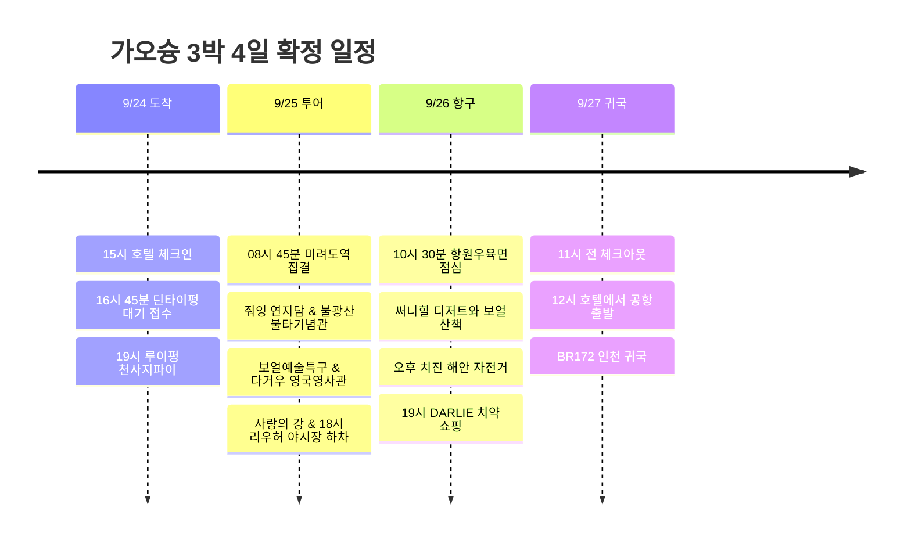

**첫날 북쪽 맛집(딘타이펑·루이펑), 둘째 날 클룩 일일 투어(불광산·연지담·영국영사관), 셋째 날 서쪽 항구 산책(항원우육면·써니힐·치진 자전거)**으로 권역을 나눈다. 왕복 이동 시간이 길고 일정이 빠듯했던 컨딩 투어는 제외(포기)하고, 9/25에 **클룩 가오슝 일일 투어(한국어 가이드)**를 확정하여 가오슝 핵심 명소를 알차고 편안하게 둘러보는 동선으로 정비했다.

시각은 현지 기준이며, 항공 배치는 **7C6123 김포 09:45 → 가오슝 12:00 / BR172 가오슝 15:50 → 인천 19:45** 조회 시간표를 기준으로 했다. 실제 예약표와 다른 경우 공항 이동부터 조정한다. [출국 시간표](https://zbordirect.com/en/low-cost/from-korea/to-taiwan/seoul-kaohsiung), [귀국 시간표](https://zbordirect.com/en/tools/schedule?arrival_city=SEL&departure_city=KHH).

## 일정 요약

| 날짜 | 동선 | 하루의 마무리 |
|---|---|---|
| 9/24 목 | 공항 → URBAN HOTEL33 → 한신 아레나 딘타이펑 → 루이펑 천사지파이 | 20:30 호텔, 다음 날 투어 준비 |
| 9/25 금 | **[확정] 클룩 일일 투어**: 미려도역 집결 → 연지담 → 불광산 불타기념관 → 보얼 → 영국영사관 → 사랑의 강 → 리우허 야시장 | 19:30 야시장 저녁 후 호텔 복귀 |
| 9/26 토 | 항원우육면 → 써니힐 → 보얼 산책 → 구산 선착장 → 치진 자전거 → 시내 쇼핑 | 20:30 호텔, 치약 위탁 짐에 포장 |
| 9/27 일 | 아침 → 11시 전 체크아웃 → 점심 → 공항 | 13시 공항 도착, BR172 귀국 |

## 9/25 금 · 클룩 가오슝 일일 투어 (한국어 가이드) 확정

**9/25(금)에 [클룩 가오슝 일일 투어 (한국어 가이드)](https://www.klook.com/ko/activity/22010-day-tour-kaohsiung/)를 확정했다.** 전용 차량과 한국어 가이드가 동행하여 가오슝의 대표적인 역사·문화 명소를 하루에 쾌적하게 연결한다.

* **예약 상품**: [가오슝 일일 투어 (한국어 가이드) - Klook](https://www.klook.com/ko/activity/22010-day-tour-kaohsiung/)
* **집결 장소**: **MRT 미려도역 (포모사 블러바드역)** 지하 '빛의 돔(Dome of Light)'
* **출발 시간**: 통상 08:30~09:00 사이 (바우처의 지정 시각 기준)
* **주요 방문지**: 연지담(용호탑) → 불광산 불타기념관 → 보얼 예술특구 → 다거우 영국영사관 / 치진 → 사랑의 강(아이허) → 리우허 야시장(하차 해산)
* **소요 시간**: 약 9시간 (09:00 경 시작 ~ 18:00 경 리우허 야시장 도착)

> [!NOTE]
> **컨딩 투어 및 불광산 후보 정리 결과**
> - **컨딩 투어 제외**: 야놀자 NOL 컨딩 투어, 투어비스 남부 버스투어 등은 왕복 4시간 이상의 장거리 이동 및 피로도 문제로 최종 포기(제외)했다.
> - **불광산 일정 해결**: 9/26(토)에 별도로 갈지 고민하던 불광산 불타기념관이 9/25 투어 코스에 포함되어 자연스럽게 해결되었다.
> - **미팅 장소 편의성**: 숙소인 URBAN HOTEL33에서 MRT 1~2정거장(신이국소역→미려도역) 거리로 아침 집결이 매우 수월하다.

## 일정 타임라인

## 9/24 목 · 체크인 후 딘타이펑과 천사지파이

| 현지 시간 | 할 일 | 이동·대기 배치 |
|---|---|---|
| 12:00∼13:15 | 가오슝 도착·입국·수하물 | 정오 도착 기준 75분 |
| 13:15∼14:15 | MRT로 호텔 이동·짐 보관 | R4 공항 → R10/O5 미려도 환승 → O6 신이국소, 도보 포함 60분 |
| 14:15∼15:00 | 호텔 근처 가벼운 점심 | 딘타이펑을 위해 간단히 먹기 |
| 15:00∼16:00 | 체크인·샤워·휴식 | 도착 직후 북쪽까지 바로 이동하지 않기 |
| 16:00∼16:45 | 호텔 → 한신 아레나 | O6 → 미려도 환승 → R14 쥐단, 역에서 도보 포함 |
| 16:45∼18:30 | 딘타이펑 대기 접수·이른 저녁 | **漢神巨蛋 B1**. 대기와 식사 합쳐 1시간 45분 |
| 18:30∼19:00 | 루이펑 야시장으로 도보 | 중간 상점 구경 포함 30분 |
| 19:00∼19:45 | 천사지파이·야시장 | 天使雞排 루이펑점, 배부르면 나눠 먹기 |
| 19:45∼20:30 | MRT로 호텔 복귀 | 다음 날 일일 투어 바우처 확인 및 휴식 |

[호텔 → 딘타이펑](https://www.google.com/maps/dir/?api=1&origin=URBAN+HOTEL33+Kaohsiung&destination=Din+Tai+Fung+Hanshin+Arena&travelmode=transit) · [딘타이펑 → 루이펑](https://www.google.com/maps/dir/?api=1&origin=Din+Tai+Fung+Hanshin+Arena&destination=Ruifeng+Night+Market&travelmode=walking).

호텔은 **No.33, Minzu 2nd Rd.**, 조회된 체크인은 **15:00**, 체크아웃은 **11:00**다. [호텔 등록 정보](https://www.taiwanstay.net.tw/TSA/web_page/TSA020200.jsp?hohi_id=17023&lang2=en), [체크인·체크아웃 안내](https://www.booking.com/hotel/tw/urban-hotel33.en-gb.html), [MRT 공식 노선도](https://www.krtc.com.tw/KLRT/guide_map).

딘타이펑 접수 시 예상 대기가 60분을 넘으면 **같은 한신 아레나에서 저녁을 먹고 야시장으로 이동**한다. 첫날 저녁 때문에 다음 날 아침 일일 투어 집결을 피곤하게 시작하지 않도록 20:30 복귀를 기준으로 삼는다.

## 9/25 금 · 클룩 가오슝 일일 투어 (한국어 가이드)

| 현지 시간 | 할 일 | 이동·대기 배치 |
|---|---|---|
| 07:30∼08:15 | 아침 식사 및 외출 준비 | 호텔 주변 간단한 식사 |
| 08:15∼08:45 | 숙소 → 미려도역 이동 | MRT 신이국소역(O6) → 미려도역(O5/R10) 1정거장, 도보 포함 약 20분 |
| 08:45∼09:00 | **미려도역 집결 및 가이드 미팅** | 지하 '빛의 돔' 앞 집결, 전용 차량 탑승 |
| 09:30∼10:45 | **연지담 (줘잉 풍경구)** | 용의 입으로 들어가 호랑이 입으로 나오는 용호탑 관람 |
| 11:30∼13:45 | **불광산 불타기념관** | 세계 최대 청동 좌불(불광대불) 및 전시 관람, 자유 점심 |
| 14:30∼15:30 | **보얼 예술특구** | 과거 부두 창고를 예술 단지로 재탄생시킨 거리 산책 |
| 15:45∼16:45 | **다거우 영국영사관** | 언덕 위 붉은 벽돌 영사관 건물과 시즈완 항구 파노라마 |
| 17:00∼17:40 | **사랑의 강 (아이허)** | 가오슝의 대표적인 낭만 수변 공간 산책 |
| 18:00∼19:30 | **리우허 야시장 하차 및 저녁** | 투어 종료 후 야시장 구경, 해산물·파파야우유 등 현지 미식 |
| 19:30∼20:00 | 호텔 복귀 및 휴식 | 미려도역에서 신이국소역으로 1정거장 복귀 |

* 투어 코스 순서와 체류 시간은 현지 교통 상황 및 날씨에 따라 가이드의 안내로 유연하게 조정될 수 있다.
* 투어 중 불광산에서 점심시간이 주어지므로 사찰 내 채식 뷔페 또는 푸드코트를 이용한다.
* 리우허 야시장은 미려도역 11번 출구 바로 앞에 있으므로, 식사 후 숙소(URBAN HOTEL33)까지 MRT나 도보(약 15분)로 매우 가깝다.

## 9/26 토 · 항원우육면·써니힐, 오후 치진 자전거

전날 25일 투어에서 보얼과 영국영사관을 맛보기로 둘러보았으므로, 26일 토요일은 **항원우육면 점심, 써니힐 디저트, 치진 해안 자전거 라이딩, 시내 쇼핑**을 쫓기지 않고 여유롭게 즐기는 힐링 데이로 운영한다.

| 현지 시간 | 할 일 | 이동·대기 배치 |
|---|---|---|
| 09:00∼09:30 | 호텔에서 가벼운 아침 | 10:30 우육면을 위해 간단히 |
| 09:30∼10:15 | O6 신이국소 → O2 옌청푸 → 항원우육면 | MRT·도보 포함 45분 |
| 10:15∼10:30 | 개점 전 대기 | 당일 영업 확인 |
| 10:30∼11:30 | **항원우육면 이른 점심** | 대기·식사 합계 60분, 우육면 또는 비빔우육면 |
| 11:30∼11:45 | 써니힐 보얼점으로 도보 | 가게 사이 이동 여유 15분 |
| 11:45∼12:15 | **써니힐 디저트·기념품** | 파인애플 케이크 등 구매 |
| 12:15∼13:00 | 보얼 창고 거리 여유 산책 | 전날 못 본 샵이나 카페 방문, 45분 |
| 13:00∼13:30 | 구산 선착장으로 이동 | 도보 또는 더울 때 택시, 30분 |
| 13:30∼14:15 | 치진행 페리 대기·승선 | 연휴 대기를 포함한 목표 구간 |
| 14:15∼14:45 | 섬에서 자전거 대여 | 대여소 반납 시각·자전거길 확인 |
| 14:45∼16:00 | **치진 해안 자전거 라이딩** | 개방된 해안 자전거길 왕복, 실제 라이딩 약 75분 |
| 16:00∼16:15 | 자전거 반납 | 출발했던 대여소로 복귀 |
| 16:15∼17:15 | 구산행 복귀 페리 | 반납 후 선착장 이동·대기 포함 |
| 17:15∼18:15 | 하마싱·옌청 저녁 | 항구 근처 맛집에서 식사 |
| 18:15∼19:00 | 시내 복귀 | MRT로 미려도·신이국소 방면 |
| 19:00∼20:00 | 드러그스토어에서 DARLIE 치약 구매 | 왓슨스/코스메드/POYA 등 |
| 20:00∼20:30 | 호텔 복귀·수하물 포장 | 대용량 치약은 위탁수하물에 넣기 |

[항원우육면 지도](https://maps.app.goo.gl/b5G84pAu1pLNnsix5) · [써니힐 지도](https://maps.app.goo.gl/DERHvpKe53X7bVbe7) · [치진 해수욕장 지도](https://maps.app.goo.gl/5vCA1jeoxvkpsHCv5) · [도보 동선](https://www.google.com/maps/dir/?api=1&origin=22.6210904,120.2877845&destination=Gushan+Ferry+Pier&waypoints=22.618044,120.28607%7CPier-2+Art+Center&travelmode=walking).

### 식사와 디저트
* **항원우육면**: **港園牛肉麵, 鹽埕區大成街55號**. 영업시간 **10:30∼20:00**. 개점에 맞춰 이른 점심으로 방문하면 웨이팅을 최소화할 수 있다. [가오슝 관광청 매장 안내](https://khh.travel/zh-tw/shop/gourmet/810/).
* **써니힐 보얼점**: **SunnyHills / 微熱山丘**. 보얼 예술특구 내 위치하며 **10:00∼20:00** 운영. 시식과 차 한 잔 후 기념품을 구매한다. [보얼 공식 매장 안내](https://pier2.org/stores/info/18/).

### 치진 해안 자전거 코스
* 구산 선착장에서 일반 페리를 타고 치진 섬으로 건너간 뒤, 현지 대여소에서 자전거를 대여한다.
* **대여소 → 해수욕장 주변 → 해안공원 방향 자전거길 → 같은 길로 회차 → 대여소** 코스가 안전하며 60∼90분 정도가 적당하다. 출발 후 35~40분 시점에 회차하면 반납 시간을 맞추기 수월하다.

## 9/27 일 · 11시 체크아웃, 12시 공항 출발

| 현지 시간 | 할 일 | 마감 기준 |
|---|---|---|
| 08:30∼09:30 | 아침 식사 | 호텔 주변 |
| 09:30∼10:45 | 짐 정리·체크아웃 | **11시 이전 객실 반납** |
| 10:45∼11:45 | 짐 보관 후 근처 이른 점심 | 점심 대기가 길면 공항에서 식사 |
| 11:45∼12:00 | 짐 회수·출발 준비 | 호텔에서 MRT 신이국소역 이동 |
| 12:00∼13:00 | MRT로 가오슝공항 이동 | O6 → 미려도 환승 → R4 공항역, 도보 포함 60분 |
| 13:00∼15:50 | 수속·출국·탑승 | 출발 15:50보다 약 3시간 전 공항 도착 |
| 15:50∼19:45 | BR172 가오슝 → 인천 | 김포 출국, 인천 귀국 |

## 쇼핑 메모 및 수하물 주의사항

* **달리 치약 (DARLIE / 好來牙膏)**: 시내 드럭스토어(왓슨스, 코스메드, POYA)에서 구입한다. 치약은 액체·겔류 규정이 적용되므로 100mL(g) 초과 제품은 반드시 위탁수하물 캐리어에 넣어야 한다.
* **써니힐 펑리수**: 기내 반입이 가능하므로 부서지지 않도록 기내 가방에 보관해도 무방하다.

## 확인된 비용 내역

| 항목 | 금액 | 비고 |
|---|---:|---|
| 7C6123 김포 → 가오슝 | 184,230원 | 제주항공 |
| BR172 가오슝 → 인천 | 348,300원 | 에바항공 |
| URBAN HOTEL33 3박 | 197,658원 | 3박 총액 (박당 약 65,886원) |
| 클룩 가오슝 일일 투어 (1인) | 54,600원 | 9/25 전일 한국어 가이드 투어 |
| **확인 합계** | **784,788원** | 현지 식비·쇼핑·치진 페리 및 자전거 대여료 별도 |
