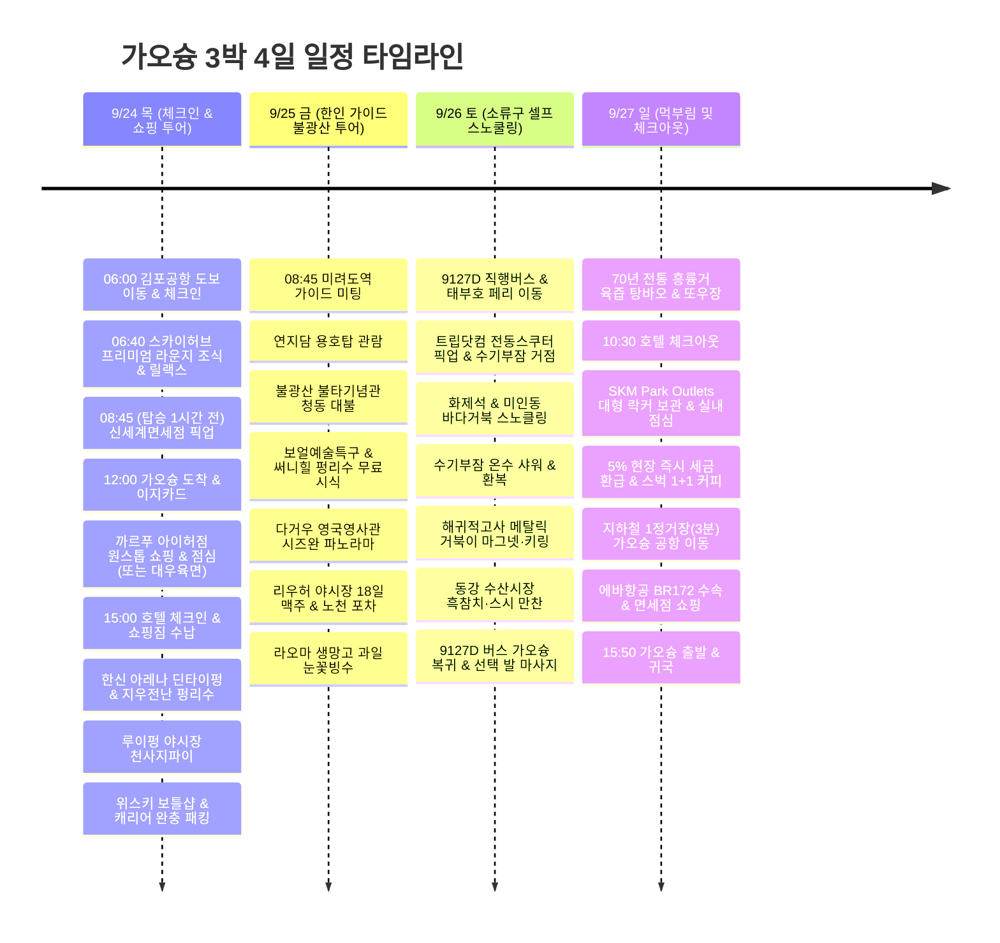

**첫날 정오 도착부터 얼리 체크인 대기 시간까지 알차게 채운 딘타이펑·한신 아레나 쇼핑 & 루이펑 야시장 & 달리 치약 원스톱 장보기, 둘째 날 클룩 투어 & 써니힐 펑리수·리우허 야시장 친구 만들기, 셋째 날 소류구 바다거북 스노클링·키링 쇼핑, 넷째 날 로컬 조식 후 SKM Park 아웃렛 경유 공항 이동**으로 가오슝 여행의 모든 동선과 쇼핑을 가장 완벽하게 완성했다. 

둘째 날(클룩 일일 투어)과 셋째 날(소류구 바다 스노클링)이 아침부터 저녁까지 꽉 찬 일정이기 때문에, 무거운 마트 장보기와 달리 치약 쇼핑을 첫날 밤 숙소(URBAN HOTEL33) 바로 옆에서 미리 해결하고 캐리어에 싹 패킹해둠으로써 여행 후반부를 짐 부담 없이 가볍고 쾌적하게 즐길 수 있다.

시각은 현지 기준(한국보다 1시간 느림)이며, 항공 배치는 **7C6123 김포 09:45 → 가오슝 12:00 / BR172 가오슝 15:50 → 인천 19:45** 조회 시간표를 기준으로 했다. 실제 예약표와 다른 경우 공항 이동부터 조정한다. [출국 시간표](https://zbordirect.com/en/low-cost/from-korea/to-taiwan/seoul-kaohsiung), [귀국 시간표](https://zbordirect.com/en/tools/schedule?arrival_city=SEL&departure_city=KHH).

## 일정 요약

### 🎯 일자별 4대 핵심 메인 토픽 (Daily Core Mission)

* 🏬 **Day 1 (9/24 목) : 체크인 및 쇼핑 투어**
  - **테마**: 비행 후 쾌적한 얼리 체크인 대기 시간 활용과 가오슝 핵심 상권 쇼핑 정복
  - **핵심 일정**: 06:00 다산하우스에서 김포공항 도보 이동 & 7C6123 체크인 → 06:40 스카이허브 프리미엄 라운지 직행 조식 & 릴랙스 → 08:45(탑승 1시간 전) 신세계면세점 인도장 픽업 → 09:45 김포 출발, 12:00 가오슝 도착 & 이지카드 수령/충전 → 호텔 짐보관 후 얼리 체크인 골든타임 활용(**[선택 1] 까르푸 아이허점 원스톱 쇼핑 & 푸드코트 점심 & 5% 현장 즉시 환급** 또는 **[선택 2] 대우육면 로컬 노포 점심 & 마구티 즈즈망고**) → 15:00 호텔 체크인 & 짐 정리 → 한신 아레나(딘타이펑 저녁 & 130년 전통 지우전난 펑리수) → 루이펑 야시장 천사지파이 → 카발란 쇼룸 / 남위해양주행 위스키 2병 구매 후 캐리어 안전 패킹.
* 🏛️ **Day 2 (9/25 금) : 한인 가이드 불광산 투어**
  - **테마**: 가오슝 1등 랜드마크 역사·문화 탐방과 현지인·여행자 야시장 소셜 네트워킹
  - **핵심 일정**: **[예약 확정] 클룩 전일 한국어 가이드 투어**: 미려도역 집결 → 연지담(용호탑) → 세계 최대 청동 좌불의 불광산 불타기념관 → 보얼예술특구 & 써니힐(SunnyHills) 토종 파인애플 펑리수 무료 시식·구매 → 다거우 영국영사관 항구 파노라마 전망 → 리우허 야시장 하차 후 중앙 노천 포차에서 18일 생맥주 & 해산물 구이 소셜 타임 → 로컬 숨은 빙수 명가 라오마(老媽) 생망고 눈꽃빙수로 화려한 마무리.
* 🐢 **Day 3 (9/26 토) : 소류구 셀프 스노쿨링**
  - **테마**: 에메랄드빛 바다 속 야생 바다거북 초밀착 유영과 섬 굿즈 쇼핑
  - **핵심 일정**: 9127D 버스 & KKday 태부호 왕복 고속 페리(14,815원) → 트립닷컴 무면허 전동스쿠터(13,600원) 픽업 → **수기부잠 온수 샤워 거점 & 화제석·미인동 2대 명소 바다거북 초밀착 스노클링** → 해귀적고사 '小琉球' 각인 입체 메탈릭 마그넷 & 바다거북 키링·인형 쇼핑, 마화쥐엔(꽈배기 과자) 겟 → 동강 화교수산시장 흑참치 스시·카이센동 만찬 → 9127D 버스로 가오슝 복귀 후 선택 힐링 마사지.
* 🥟 **Day 4 (9/27 일) : 먹부림 및 체크아웃**
  - **테마**: 70년 전통 로컬 조식 미식과 출국 직전 완벽한 아웃렛 쇼핑 & 초고속 공항 이동
  - **핵심 일정**: 숙소 MRT 4분 70년 전통 흥륭거 시그니처 육즙 탕바오(왕만두) & 또우장 조식 → 10:30 호텔 체크아웃 → **SKM Park Outlets 대형 락커 캐리어 보관 & 시원한 실내 점심·브랜드 쇼핑·5% 현장 즉시 택스리펀 & 스타벅스 1+1 쿠폰 소진** → 공항 직전 1정거장(MRT 3분) 초고속 이동으로 에바항공 BR172 여유로운 수속, 면세점 쇼핑 후 15:50 귀국.

---

### 🗺️ 일정 타임라인 (Mermaid)

---

| 일자 | 메인 토픽 | 주요 동선 | 하루의 마무리 |
|---|---|---|---|
| 9/24 목 | **체크인 및 쇼핑 투어** | 06:00 김포공항 도보 이동 → 라운지 직행 조식 → 08:45(탑승 1시간 전) 면세품 픽업 → 12:00 가오슝 도착(e-Gate 1분·공항 1층 이지카드 교환) → **숙소 짐보관 & 얼리 체크인 전 까르푸 아이허점(MRT 3분+도보/버스, 쇼핑·푸드코트 점심·5% 현장 즉시 택스리펀) [또는 숙소 도보 5분 대우육면·버블티]** → 15:00 체크인/휴식 → **한신 아레나(MRT 이동, 스벅 1+1 쿠폰 & 딘타이펑 대기 중 지우전난 펑리수·누가크래커 쇼핑)** → 루이펑 야시장(도보 5분) → **위스키샵(남위해양주행/카발란쇼룸)** | 21:00 호텔, **달리 치약 & 쇼핑템 캐리어 즉시 사전 패킹** |
| 9/25 금 | **한인 가이드 불광산 투어** | **[확정] 클룩 일일 투어**: 미려도역 집결 → 연지담 → 불광산 불타기념관(예경대청 스벅) → 보얼(성품서점 스벅 & 써니힐 무료 시식/쇼핑) → 영국영사관 → 사랑의 강 → **리우허 야시장 하차 & 노천 포차 소셜 타임 → 老媽冰店(종합과일 망고 눈꽃빙수)** | 21:00 야시장 & 빙수 후 호텔 복귀 |
| 9/26 토 | **소류구 셀프 스노쿨링** | **소류구 3대 퀘스트 [페리·스쿠터 확정]**: 9127D 직행버스(대중교통) → 동강 태부호(泰富) 승선(KKday) → 트립닷컴 스쿠터 픽업 → **스노클링 2~3대 거점 호핑(화제석·미인동)** → **해귀적고사(소류구 각인 메탈릭 거북이 마그넷·키링)** & 마화쥐엔 겟 → 동강 수산시장(카이센동) → 9127D 버스로 가오슝 복귀 | 20:30 호텔, 여유로운 휴식 |
| 9/27 일 | **먹부림 및 체크아웃** | 70년 전통 조식(흥륭거 탕바오/또우장, MRT 4분) → 10:30 체크아웃 → **SKM Park 아웃렛 점심 & 스벅 1+1 커피 & 쇼핑(대형 락커 짐보관)** → 공항 MRT 딱 1정거장(3분) 이동 | 13:30 공항 도착, BR172 귀국 |

---

> [!TIP]
> **대만 현지 ATM 출금 & 해외 카드 (트래블로그 · 트래블월렛 / 트래블고) 수수료 완전 정복 가이드**
> 대만 가오슝은 타이베이와 달리 야시장 포차, 로컬 노포 식당, 소류구 스노클링 샤워/락커비 등에서 **100% 현금만 받는 곳이 매우 많습니다**. 한국 해외 카드(트래블로그, 트래블월렛, 트래블고, 토스 등)로 인출할 때 **카드 제휴 네트워크(Master/Visa vs UnionPay)와 기기 설치 은행에 따라 수수료(건당 100 NTD, 한화 약 4,200원) 발생 여부**가 완전히 달라집니다.
>
> #### 1. 카드 브랜드 네트워크별 현지 수수료 무료(0원) 은행 총정리
> | 카드 종류 및 브랜드 | 🟢 수수료 0원 면제 은행 (무료) | ❌ 수수료 100 NTD 부과 (비추천) |
> |---|---|---|
> | **마스터(Master) & 비자(Visa)** • 트래블월렛 (Visa) • 트래블로그 (Master) • 토스뱅크 체크 (Master) • 신한 쏠트래블 (Master) | • **국태세화은행 (Cathay United / 國泰世華)** 🌳 • **대만은행 (Bank of Taiwan / 臺灣銀行)** • **메가국제상업은행 (Mega Bank / 兆豐銀行)** • **신광은행 (Shin Kong Bank / 新光銀行)** | • **패밀리마트(全家) 편의점 ATM (타이신은행)** ⚠️ • **일부 세븐일레븐(7-11) 편의점 ATM (중국신탁 CTBC)** ⚠️ *(※ 편의점 기기에서 마스터/비자로 인출 시 건당 100 NTD 뜯김)* |
> | **유니온페이 (UnionPay)** • 하나 트래블로그 (UPI) | • **국태세화은행 (Cathay United)** 🌳 • **대만은행 (Bank of Taiwan)** • **중국신탁은행 (CTBC / 中國信託) → 세븐일레븐(7-11)** • **타이신은행 (Taishin / 台新銀行) → 패밀리마트(全家)** | 일반 소형 사설 ATM |
>
> > ⭐ **유니온페이(UPI) vs 마스터/비자의 결정적 차이**:
> > - **유니온페이(트래블로그 UPI)**: 세븐일레븐(CTBC)과 패밀리마트(타이신) 편의점 ATM에서도 **수수료 0원 무료 인출 가능**! 대만 전역 편의점을 자유롭게 쓸 수 있는 최강의 편의성.
> > - **마스터 / 비자(트래블월렛 등)**: 편의점(CTBC/타이신)에서 뽑으면 100 NTD가 청구되므로, 무조건 **국태세화은행(나무 로고 🌳)**, **대만은행**, **메가은행**, **신광은행** 기기를 찾아야 합니다.
>
> #### 2. 카드사별 인출 한도·수수료 차이 & 딘타이펑/교통카드 꿀팁
> 1. **하나 트래블로그 (Mastercard vs UnionPay)**:
>    - **인출 수수료 & 한도**: 하나카드 쪽 ATM 출금 수수료 **전액 면제**, 1일 $6,000 / 월 $10,000 상당으로 한도가 매우 넉넉함.
>    - **자동 충전**: 계좌를 연결해 두면 잔액이 부족해도 매매기준율 그대로 실시간 자동 충전되어 출금/결제 가능.
>    - **유니온페이(UPI) 가맹점 혜택**: 중화권 특화 카드로, **딘타이펑(鼎泰豐)** 등 주요 대만 프랜차이즈에서 유니온페이 결제 시 10% 할인 프로모션이 빈번하게 진행됩니다 (1일 차 한신 아레나 딘타이펑 결제 시 카운터 확인 추천!).
> 2. **트래블월렛 (Visa)**:
>    - **★ 월 $500 초과 시 2% 자체 수수료 주의**: 트래블월렛은 **월 500달러(USD) 상당까지만 ATM 인출 수수료 무료**이며, **초과 인출분에는 2%의 자체 수수료가 부과**됩니다 (1회 $400, 1일 $1,000, 월 $2,000 한도). 대량 현금 인출 시에는 트래블로그를 우선 사용하는 것이 유리합니다.
> 3. **가오슝 MRT 개찰구 컨택리스(Touch) 직접 태그 탑승**:
>    - **비자·마스터카드 (컨택리스)**: 트래블월렛(비자) 및 트래블로그(마스터)는 가오슝 MRT 개찰구에 교통카드처럼 실물 카드를 직접 찍고 통과할 수 있습니다.
>    - **유니온페이(UPI)는 직접 태그 불가**: 유니온페이는 지하철 개찰구 컨택리스 태그를 지원하지 않으므로 **반드시 실물 이지카드(EasyCard)**를 사용해야 합니다. (우리 일정은 공항 1층에서 실물 이지카드를 수령해 400 NTD를 충전하므로 동강 버스 9127D와 지하철 모두 100% 완벽 호환).
>
> #### 3. 가오슝 공항 수수료 무료(0원) ATM 3대 포인트 & 최적 동선
> 가오슝 국제공항(KHH)은 규모가 아담하여 동선이 매우 짧으며, 입국 심사 후 곳곳에 무료 ATM이 완비되어 있습니다:
> 
> | 공항 내 구역 | 설치 은행 및 위치 | 추천 이유 & 실전 이용 팁 |
> |---|---|---|
> | **① [초고속] 수하물 수취대 (Baggage Claim / 세관 통과 전)** | **대만은행(Bank of Taiwan) & 메가은행(Mega Bank) ATM** • e-Gate 통과 후 짐 찾는 컨베이어 벨트 구역 벽면 | 짐 나오길 기다리는 5~10분 대기 시간 동안 줄 서지 않고 가장 빠르게 현금 3,000~5,000 NTD 인출 가능! |
> | **② [메인] 1층 입국장 도착홀 (세관 통과 직후 로비)** | **대만은행 (좌측 서쪽 구역) & 메가은행 (우측 동쪽 구역) ATM** • 자동문 열리고 나오면 환전 창구 바로 옆 | • **가장 찾기 쉬운 메인 거점** (우측 5번 출구 부근에 '유나이트 트래블러' 이지카드 수령처 위치) • **원스톱 3분 플로우**: 세관 통과 → 좌측 대만은행 ATM 출금(100 NTD 분할) → 우측 5번 출구 유나이트 트래블러 이지카드 수령 → 편의점/MRT에서 충전 |
> | **③ [대안] 지하 1층 MRT 공항역 (R4 Kaohsiung Airport Station)** | **국태세화은행 (Cathay United Bank / 國泰世華 🌳) ATM** • 1층 6번 출구 앞 에스컬레이터 타고 지하철 타러 내려가는 길/개찰구 대합실 | • 초록 나무 로고의 국태세화은행 기기 (마스터/비자/UPI 모두 수수료 0원) • 1층 ATM에 줄이 길거나 깜빡했더라도 지하철 탑승 직전 바로 인출 가능 |
>
> 💡 **가오슝 시내 및 숙소 앞 추가 거점**:
> - **가오슝 MRT 전 역사 (미려도역, 신이국소역 등)**: 개찰구 안팎에 **국태세화은행(초록 나무 로고 🌳) ATM** 완비.
> - **숙소 바로 앞 PX Mart 신이점 (全聯福利中心, 도보 2분)**: 매장 내에 **국태세화은행 ATM**이 기본 입점되어 있어 숙소 코앞에서 언제든 무료 인출 가능 (※ 마트 물품 결제는 한국 신카 불가, 현금/이지카드 전용).
>
> #### 4. 실전 ATM 출금 완벽 매뉴얼 (100 TWD 소액권 분할 꿀팁)
> 1. **카드 삽입 & PIN 입력**: 카드를 넣고 한국 비밀번호 4자리 입력 후 초록색 버튼(Enter). (6자리 요구 시 **비밀번호 4자리 + 00** 입력).
> 2. **계좌 메뉴 선택**: 3번째 메뉴인 **`Savings Account(저축예금)`** 클릭.
> 3. **출금 금액 입력**: 1회 최대 20,000 NTD까지 가능 (예: 1,000 NTD 또는 3,000 NTD 입력 후 Next).
> 4. **🌟 100 NTD 권종 분할 화면 (가장 중요!)**:
>    - 출금 직전 화면에 **"출금 금액을 100 대만달러 지폐로 나누어 받으시겠습니까? (Exchange to 100 TWD notes?)"**라는 안내가 뜹니다.
>    - **무조건 `YES`를 누르세요!** (예: 1,000 NTD 인출 시 100 NTD 지폐 10장으로 나옴).
>    - 야시장 포차, 길거리 음식, 자판기, 소류구 스노클링 샤워장/코인락커 등에서는 1,000 NTD 큰 지폐를 내면 잔돈이 없어 곤란해하는 경우가 많으므로 100 NTD 지폐 확보가 필수입니다.
> 5. **카드 회수 & 현금 수령**: 화면 안내에 따라 **카드를 먼저 뽑은 뒤** 현금과 영수증(선택)을 챙기면 출금 완료!
>
> #### 5. 가오슝 현지 결제 & 택시 실전 팁
> - **로컬 맛집 & 야시장**: 100% 현금 결제 (일부 라인페이 지원).
> - **택시**: 차량 외부에 신용카드 스티커가 붙어 있어도 실제 승차 시 카드가 안 된다고 현금을 요구하는 기사가 대다수입니다. 카드 결제를 원할 때는 **우버(Uber) 앱 자동 결제**를 이용하세요. (단, 치진섬 선착장 등 외곽에서는 우버 호출이 잘 안 잡히므로 길거리 일반 택시 현금 탑승이 훨씬 빠릅니다).

---

## 9/24 목 · [Day 1: 체크인 및 쇼핑 투어] 정오 도착, 까르푸·한신 아레나 쇼핑 & 루이펑 야시장

* **출국 전야 (9/23 수)**: 오전 09:45 비행기(7C6123) 출발에 맞추기 위해 김포공항 바로 앞 송정역 **[다산하우스](https://naver.me/xjgcCwsW)에서 1박(18,000원)** 투숙. 이른 아침 첫차 이동 부담 없이 푹 자고 오전 06:00에 출발한다.
* **출국 아침 (9/24 목)**: 오전 **06:00 다산하우스에서 김포공항 국제선 청사로 여유롭게 도보 이동(약 10~15분)**하여 06:15경 도착. 제주항공 카운터에서 탑승 수속 및 위탁 수하물 위탁 후 출국 심사를 마치고, 06:30 오픈하는 **[스카이허브 프리미엄 라운지](https://www.prioritypass.com/ko-KR/lounges/south-korea/gimpo-international/gmp5-sky-hub-lounge-premium)**로 직행! 따뜻한 뷔페 조식과 라이브 즉석요리, 안마의자 릴랙스존에서 2시간여 동안 완벽하게 쉰 뒤, **비행기 탑승 1시간 전(08:45경) 라운지에서 나와 바로 앞 신세계면세점 인도장에서 사전 주문 면세품을 픽업**하고 09:15 보딩 게이트로 이동한다.

### 💡 첫날 정오 도착 후 얼리 체크인(15:00) 전 골든 타임 활용법 (까르푸 vs 로컬 우육면)
가오슝 공항에 낮 12:00에 도착하여 e-Gate 통과 및 국제선 1터미널 1층 카운터에서 이지카드를 수령/충전하고 나면 약 13:00~13:10이 됩니다. 숙소인 URBAN HOTEL33의 정규 체크인 시각은 **15:00**이므로 약 1시간 30분가량 객실 입실 대기 시간이 생깁니다.  
13:35 호텔 프런트에 캐리어를 무료 보관(1분 컷)한 뒤, 취향과 선호에 맞춰 **[선택 1: 까르푸 대형마트 원스톱 코스 (대중교통 100%)]** 또는 **[선택 2: 로컬 미식 & 디저트 도보 코스 (교통비 0원)]** 중 선택하여 알차게 보낼 수 있습니다:

#### 🏆 [선택 1 (대중교통 추천 - 대형마트 원스톱 공략형)] 까르푸 아이허점 쇼핑 & 점심 & 즉시 택스리펀
*호텔 체크인 전 대형마트를 먼저 정복하여 대량의 쇼핑 짐을 15:00 체크인과 동시에 객실에 바로 수납하고, 2~4일 차 일정 내내 양손 가볍게 다니는 스마트한 플랜!*
1. **13:35 호텔 짐보관 후 MRT 대중교통 이동**:
   - 숙소 바로 앞 **O6 신이국소역에서 MRT 주황선 탑승 → O4 시의회역(舊 가오슝시의회) 하차 (단 2정거장, 3분 소요, 이지카드 20 TWD)**.
   - 2번 출구로 나와 중정교(아이허)를 건너는 강변길 도보 약 10~12분(또는 시의회역 앞 60번 버스 2정거장 / YouBike 3분)으로 **[까르푸 아이허점 (家樂福 愛河店)](https://maps.app.goo.gl/fPioKXCNr9VqWssw7)** 도착.
2. **13:45 까르푸 푸드코트 점심 & 대형마트 쇼핑**:
   - **푸드코트/식당가 점심**: 시원한 에어컨 아래에서 우육면, 대만 철판요리, 일식, 딤섬 등 다양한 메뉴를 대기 없이 쾌적하고 신속하게 식사.
   - **쇼핑 싹쓸이**: DARLIE 달리 치약(묶음 할인팩), 닥터큐(Dr.Q) 곤약젤리, 만한대찬 우육면 컵라면, 3시 15분 밀크티 티백, 구미 초코볼, 금문고량주 등 기념품과 야식을 한곳에서 모두 카트에 담기.
   - **[현장 5% 즉시 세금 환급(TRS)]**: 당일 합산 **2,000 NTD 이상** 구매 시 **1층 고객서비스센터에서 여권 제시 후 그 자리에서 5% 현금 즉시 환급**! (공항 세관 대기 완전 생략).
3. **14:45 MRT로 호텔 복귀 & 15:00 정규 체크인**: 시의회역에서 MRT 주황선으로 신이국소역(단 3분) 복귀 *(※ 만약 박스 단위 대량 구매로 짐이 지나치게 무거울 경우에만 호텔 앞까지 우버/택시 약 8분·110 TWD 선택)*. 15:00 정규 체크인 후 쇼핑 짐을 객실에 즉시 올려두고 에어컨 아래에서 40분간 쾌적한 휴식!

#### 🍜 [선택 2 (도보 완결형 - 로컬 미식형)] 숙소 도보 5분 대우육면 로컬 점심 & 마구티 과일티 디저트
*차량 탑승이나 환승 없이 숙소 코앞에서 가오슝 현지인 찐 로컬 맛집과 대만 대표 과일티를 즐기며 여유롭게 체크인을 기다리는 100% 도보 친화 코스!*
1. **13:35 호텔 짐보관**: 캐리어를 호텔 프런트에 맡기고 가벼운 복장으로 출발 (교통비 0원).
2. **13:45 로컬 찐 맛집에서 첫 끼 식사**: 숙소 도보 5분 거리의 가오슝 현지인 최애 우육면 노포인 **[대우육면 (大牛牛肉麵)](https://maps.app.goo.gl/hXfR9jY8j1K6Z9pE7)**으로 이동! 깔끔하고 진한 홍샤오/칭둔 우육면과 쫄깃한 소힘줄, 시원한 오이무침으로 비행 후 허기를 달랩니다.
3. **14:25 대만 1등 과일티 디저트**: 식사 후 바로 인근의 **마구티(MACU 麻古茶坊)**에서 여름/가을 시그니처인 **즈즈망고(생망고 스무디 + 단짠 치즈폼)** 또는 **50란(50嵐) 우롱밀크티(버블 추가)** 한 잔을 손에 들고 시원하게 당을 충전합니다.
4. **14:50 호텔 복귀 & 체크인(15:00)**: 객실 키를 받아 시원한 에어컨 아래에서 세안 및 휴식. (치약과 라면 등 마트 장보기는 밤 일정 후 숙소 앞 PX Mart & POYA에서 진행)

| 현지 시간 | 할 일 | 이동·대기 배치 |
|---|---|---|
| 06:00∼06:15 | **다산하우스 출발 → 김포공항 도보 이동** | 송정역 숙소에서 김포공항 국제선 청사까지 약 10~15분 아침 도보 이동 |
| 06:15∼06:40 | **7C6123 탑승수속 & 보안검색·출국심사** | 제주항공 위탁수하물 위탁 및 빠른 출국 심사 통과 |
| 06:40∼08:45 | **[스카이허브 프리미엄 라운지](https://www.prioritypass.com/ko-KR/lounges/south-korea/gimpo-international/gmp5-sky-hub-lounge-premium) 직행 조식 & 릴랙스** | 06:30 오픈 신규 프리미엄 라운지 직행! 라이브 즉석요리 조식, 안마의자 휴식존에서 2시간여 동안 쾌적한 힐링 |
| 08:45∼09:15 | **[탑승 1시간 전] 신세계면세점 인도장 픽업** | 라운지 퇴장 후 신세계면세점 인도장에서 사전 주문 면세품 수령 & 정리 후 탑승구(09:15 보딩) 이동 |
| 09:15∼09:45 | **7C6123 탑승 및 이륙 (GMP → KHH)** | 09:45 김포공항 출발 (가오슝 현지 12:00 정오 도착 예정) |
| 12:00∼13:00 | **가오슝 도착 · e-Gate(1분) & 트래블로그 출금 & 이지카드 교환/충전** | 온라인 사전신고 후 e-Gate 통과. 입국장 1층 **대만은행/메가은행 ATM에서 트래블로그로 5,000 NTD 출금(수수료 0원)** → **1층 유나이트 트래블러 카운터**에서 이지카드(87 TWD) 실물 교환 → 편의점 또는 MRT 공항역(R4)에서 **400 NTD 즉시 충전** (1,000 NTD 지폐 내고 잔돈 600 NTD 야시장용 100 NTD 지폐로 확보) |
| 13:00∼13:35 | MRT 탑승 → 숙소 이동 및 **캐리어 짐보관** | R4 공항역 → 미려도 환승 → O6 신이국소역(도보 3분). **호텔 프런트에 캐리어 먼저 보관(1분 컷)** |
| 13:35∼14:50 | **[선택 1] 까르푸 아이허점 MRT 이동 & 쇼핑·점심·즉시 택스리펀** *(선택 2: 대우육면 로컬 점심 & 마구티 즈즈망고 도보 코스)* | • **선택 1 (대중교통)**: 숙소 앞 MRT 주황선 탑승(O6 신이국소 → O4 시의회역 2정거장 3분, 20 TWD) 후 아이허 강변길 도보 10분(또는 60번 버스/YouBike) → **[까르푸 아이허점](https://maps.app.goo.gl/fPioKXCNr9VqWssw7)** 푸드코트 점심 & 대형마트 필수 쇼핑템(달리 치약 묶음팩, 만한대찬, 닥터큐 젤리, 밀크티) 카트 가득 장보기 → **1층 고객서비스센터에서 5% 현장 즉시 현금 환급(2,000 NTD 이상 시)** → MRT로 호텔 복귀 • **선택 2 (도보 완결)**: 숙소 도보 5분 **[대우육면](https://maps.app.goo.gl/hXfR9jY8j1K6Z9pE7)** 홍샤오/칭둔 우육면·소힘줄 점심 식사 후 **마구티(MACU)** 즈즈망고 테이크아웃 (교통비 0원) |
| 14:50∼15:45 | **호텔 체크인(15:00) & 방 입실·쇼핑짐 수납·샤워·휴식** | URBAN HOTEL33 체크인. (선택 1 진행 시 마트 쇼핑짐 즉시 객실 수납 완료!) 시원한 방에서 세안 및 40분간 쾌적한 체력 재충전 |
| 15:45∼16:15 | 숙소 → 한신 아레나 이동 | O6 신이국소 → 미려도 환승 → R14 쥐단역 (지하철 및 도보 약 20분) |
| 16:15∼18:00 | **한신 아레나 B1 쇼핑 & 딘타이펑 저녁 & 스벅 1+1** | **1) 딘타이펑 번호표 접수 (대기 약 20~30분)** **2) 대기 시간 동안 쇼핑 & 커피**: 1890년 전통 **지우전난(舊振南) 프리미엄 펑리수** 시식/구매, **수제 누가크래커** 픽업. 한신 아레나 내 스타벅스(2F 또는 B1)에서 **110 TWD 1+1 쿠폰**으로 시원한 음료 픽업 • **[택스리펀 꿀팁]**: 한신백화점 내 당일 합산 **2,000 NTD 이상** 구매 시 **여권 지참 후 B1 또는 6층 고객서비스센터에서 5% 현장 즉시 현금 환급** 가능! **3) 딘타이펑 식사**: 샤오롱바오, 갈비볶음밥, 비빔만두 (※ 유니온페이 카드 결제 시 딘타이펑 10% 할인 프로모션 여부 카운터 확인) |
| 18:00∼18:15 | 한신 아레나 → 루이펑 야시장 도보 | 백화점 뒤편 골목길 도보 5분 이동 |
| 18:15∼19:30 | **루이펑 야시장 (천사지파이 & 스트리트 푸드)** | 가오슝 최대 로컬 핫플 야시장. 바삭하고 두툼한 **천사지파이(天使雞排)**, 고구마볼, 길거리 먹거리 구경 |
| 19:30∼20:10 | **[위스키 보틀샵] 남위해양주행 푸민점** | **[남위해양주행 (南威海洋酒行)](https://maps.app.goo.gl/4mksKCj4XeMNTj269)** 이동, 한국 면세 한도에 맞춘 **위스키 2병(카발란/싱글몰트)** 구매 후 R13 아오쯔디역 이동 |
| 20:10∼20:35 | MRT로 숙소 동네 복귀 | R13 아오쯔디 → 미려도 환승 → O6 신이국소역 (약 20분) |
| 20:35∼21:05 | **숙소 앞 대형마트(PX Mart & POYA) 또는 여유로운 야식 픽업** | • 낮에 까르푸를 완료했다면: 숙소 앞 편의점/마트에서 시원한 18일 생맥주와 야식만 가볍게 픽업하여 여유로운 마무리 • 낮에 대우육면을 즐겼다면: 숙소 도보 2분 **POYA**(달리치약 묶음팩) & **PX Mart**(만한대찬 라면, 닥터큐 젤리, 밀크티 장보기 & 매장 내 국태세화은행 ATM 수수료 0원 무료 출금 가능. ※ 마트 결제는 한국 신카 불가, 현금/이지카드 전용)에서 필수 장보기 완료 |
| 21:05∼21:40 | 호텔 복귀 & **위탁 캐리어 완충 패킹 완료** | **위스키 2병**을 옷가지/수건으로 병목까지 두껍게 감싸 캐리어 중앙에 완충 패킹하고 치약과 함께 잠그기. (2~4일 차 일정 완벽 대비) |

[호텔 → 까르푸 아이허점 (대중교통/도보)](https://www.google.com/maps/dir/?api=1&origin=URBAN+HOTEL33+Kaohsiung&destination=%E5%AE%B6%E6%A8%82%E7%A6%8F%E9%87%8F%E8%B2%A9+%E6%84%9B%E6%B2%B3%E5%BA%97&travelmode=transit) · [호텔 → 대우육면](https://www.google.com/maps/dir/?api=1&origin=URBAN+HOTEL33+Kaohsiung&destination=Da+Niu+Beef+Noodles+Kaohsiung&travelmode=walking) · [호텔 → 한신 아레나](https://www.google.com/maps/dir/?api=1&origin=URBAN+HOTEL33+Kaohsiung&destination=Din+Tai+Fung+Hanshin+Arena&travelmode=transit) · [한신 아레나 → 루이펑](https://www.google.com/maps/dir/?api=1&origin=Din+Tai+Fung+Hanshin+Arena&destination=Ruifeng+Night+Market&travelmode=walking).

> [!TIP]
> **김포공항 국제선 ‘스카이허브 프리미엄’ 라운지 (2026.09.07 개장 신상) & 면세점 픽업 팁**
> - **신세계면세점 인도장**: 김포공항 국제선 3층 출국 심사 후 면세구역 내에 위치. 모바일 교환권과 여권, 탑승권을 제시하여 빠르게 수령할 수 있습니다.
> - **스카이허브 프리미엄 라운지 (Sky Hub Lounge Premium)**:
>   - **신규 개장**: 2026년 9월 7일 김포공항 국제선 에어사이드에 갓 오픈한 최신 프리미엄 라운지.
>   - **운영시간**: 매일 06:30 ~ 20:10 (08:35경 아침 조식 시간대에 방문하기 최적)
>   - **입장 혜택**: 기존 PP카드(Priority Pass), 더라운지(The Lounge), 마티나/드래곤패스 지원 제휴 신용카드로 **추가금 없이 일반 무료 입장 가능**!
>   - **차별화 시설**: 라이브 셰프 즉석요리 코너, 안마의자 릴랙스존, 비즈니스 라운지 좌석, 생맥주 및 프리미엄 베이커리.

> [!TIP]
> **가오슝 공항 e-Gate(자동출입국심사) 등록 & 연말 타이베이 하이패스 팁**
> - **연말 타이베이 여행 대비**: 타이베이(타오위안 공항)는 입국 줄이 길기로 악명 높지만, 한적한 가오슝 공항 입국장에서 e-Gate를 등록해두면 **여권 유효기간 만료일까지 대만 전역 공항에서 유효**합니다. 연말 타이베이 방문 시 대기 없이 자동출입국 게이트로 30초 만에 통과할 수 있습니다.
> - **진행 3단계**:
>   1. **출국 전 온라인 사전 신청**: [대만 이민서 온라인 입국신고서(Online Arrival Card)](https://niaspeedy.immigration.gov.tw/webacard/)에서 여권 및 항공편 정보 입력 후 제출.
>   2. **가오슝 공항 현장 등록**: 입국심사장 내 **e-Gate 등록 카운터**에서 여권 제출 후 얼굴 사진 촬영 및 양손 검지 지문 등록 (약 1분 소요, 모자·안경·마스크 탈의).
>   3. **당일 즉시 이용**: 등록 직후 바로 옆 **e-Gate 자동게이트**로 이동하여 여권 스캔 + 지문/얼굴 인식으로 30초 만에 입국 완료!

> [!NOTE]
> **가오슝 공항 입국 골든 플로우: 트래블로그 5,000 NTD 출금 & 이지카드 400 NTD 충전**
> 1. **e-Gate 자동출입국 게이트 통과 (약 1분)**: 온라인 사전신고서(Arrival Card) 작성 완료 상태에서 현장 등록대 거쳐 지문/얼굴 스캔 후 즉시 입국.
> 2. **트래블로그 수수료 무료 5,000 NTD 인출**:
>    - **ATM 위치**: 1층 입국장 로비의 **대만은행 (Bank of Taiwan / 臺灣銀行)** 또는 **메가은행 (Mega Bank / 兆豐銀行)** ATM 이용.
>    - **수수료**: 트래블로그(하나 마스터/UPI) 이용 시 **현지 수수료 0원**.
>    - **출금 팁**: 화면 언어를 '한국어' 또는 '영어'로 선택 후 비밀번호 4자리(필요 시 뒤에 00 추가) 입력. DCC 환전 선택창이 뜨면 반드시 **현지 통화(TWD)** 선택. 5,000 NTD는 3박 4일 야시장·로컬 식당·마사지·간식 등 현금 경비로 완벽한 규모.
> 3. **이지카드 실물 수령 (유나이트 트래블러 카운터)**:
>    - **위치**: 국제선 제1터미널 1층 중화통신(中華電信) 카운터와 5번 출입구 사이.
>    - 사전 구매(87 TWD) 모바일 바우처 제시 후 실물 카드 1분 만에 수령.
> 4. **이지카드 400 NTD 충전 & 잔돈(100 NTD권) 확보**:
>    - 로비 내 편의점(세븐일레븐/패밀리마트) 또는 연결 통로 **MRT 가오슝공항역(R4) 안내소** 방문.
>    - ATM에서 인출한 1,000 NTD 지폐를 건네며 **"400 NTD 충전(加值, 찌아즈)"** 요청.
>    - **400 NTD 예산 적합도**: 3박 4일 시내 MRT(공항/시내/아웃렛 왕복 약 150 TWD) + 26일 동강 9127D 버스 왕복(약 240 TWD) 총 약 390 TWD로 딱 떨어지는 황금 금액!
>    - **거스름돈 효과**: 거슬러 받는 600 NTD(100 NTD 지폐들)는 첫날 루이펑 야시장과 천사지파이 등 현금 결제용으로 바로 요긴하게 활용.

> [!TIP]
> **스타벅스 110 TWD 즉시 사용 1+1 쿠폰 베스트 활용 동선 가이드**
> 이번에 발급받은 **‘스타벅스 110 TWD 즉시 사용 쿠폰 1+1’**은 대만 현지 매장에서 결제 시 QR코드를 제시하면 110 TWD 한도 내에서 음료 1+1 혜택을 받거나 금액을 즉시 차감받을 수 있는 실속 쿠폰입니다 (110 TWD 초과 음료 주문 시 초과 차액만 현금/이지카드/카드로 결제 가능).
> 동선상 가장 방문하기 좋고 감성 넘치는 스타벅스 5대 스팟을 추천합니다:
> 1. **9/24(목) 한신 아레나 (2F / B1 매장)**: 딘타이펑 대기 번호표를 뽑고 20~30분 대기하거나 지우전난 펑리수 쇼핑 전후로 시원한 1+1 음료 테이크아웃! (2층 매장은 통창 뷰가 쾌적함)
> 2. **9/25(금) 불광산 불타기념관 (예경대청 禮敬大廳 1층)**: 사찰 입구 대형 홀 1층에 입점한 이색 스타벅스. 더운 낮 시간 투어 중 에어컨 아래에서 시원한 1+1 휴식 명소.
> 3. **9/25(금) 보얼 예술특구 (보얼 성품서점 駁二誠品 매장)**: 붉은 벽돌 옛 항구 창고를 리모델링한 감성 만점 매장. 써니힐 무료 펑리수 시식 후 산책하며 감성 커피 타임에 최고.
> 4. **9/27(일) SKM Park Outlets (1층 대형 매장)**: 체크아웃 후 대형 코인락커에 캐리어를 넣고 시원한 몰 내에서 쇼핑 후 여유롭게 1+1 커피 & 베이커리를 즐기기 가장 여유로운 장소.
> 5. **9/27(일) 가오슝 국제공항 국제선 3층 출국장 (에어사이드)**: 보안검색 통과 후 비행기 탑승 전 게이트 근처에서 마지막으로 남은 쿠폰을 깔끔하게 소진 가능.

> [!TIP]
> **대만 3대 필수 쇼핑템 (달리 치약 · 누가크래커 · 펑리수) 완벽 구매 동선 총정리**
> 1. **달리 치약 (DARLIE / 黑人牙膏)**:
>    - **구매처**: 첫날 체크인 전 **까르푸 아이허점 (家樂福 愛河店)** (대용량 묶음 할인팩 & 5% 즉시 환급 최고 추천) 또는 첫날 밤 숙소 앞 **POYA(포야 신이점)** / **PX Mart(전련복리중심)**.
>    - **추천 종류**: 오리지널 더블액션(초록색 민트향, 개운함 1위), 올인원 베이킹소다 화이트닝, 차콜 클린.
>    - **핵심 팁**: 치약은 젤류로 분류되어 100mL(g) 초과 시 기내 반입 불가! 첫날 사자마자 숙소에서 위탁 캐리어에 즉시 패킹해두면 2~3일 차 일정 내내 가볍게 다닐 수 있습니다.
> 2. **누가크래커 (牛軋餅)**:
>    - **구매처 1 (프리미엄)**: 1일 차 한신 아레나 B1 베이커리 팝업 매장. 갓 구워낸 바삭한 파 크래커와 부드럽고 쫀득한 우유 누가의 조화.
>    - **구매처 2 (가성비 선물용)**: 숙소 앞 PX Mart 또는 까르푸. 대량으로 회사/친구들에게 가볍게 돌리기 좋은 개별 포장 박스.
> 3. **펑리수 (鳳梨酥)**:
>    - **써니힐 (SunnyHills, 微熱山丘) 보얼점**: 둘째 날(9/25) 클룩 투어 보얼예술특구 자유시간에 방문. 매장에 들어서면 따뜻한 우롱차 1잔과 정품 펑리수 1개를 무료로 시식 제공! 토종 파인애플(투펑리) 특유의 새콤한 과육 섬유질이 살아있는 대만 1등 브랜드.
>    - **지우전난 (舊振南, Jiu Zhen Nan)**: 첫날(9/24) 한신 아레나 B1 위치. 1890년 가오슝에서 시작된 130년 전통의 최고급 페이스트리 명가. 고소하고 달콤한 전통 버터 풍미와 고급스러운 골드 패키지로 부모님/은사님 선물용으로 최고.

> [!TIP]
> **대만 쇼핑 택스리펀(Tax Refund) & 가오슝 공항 면세점 완벽 가이드**
> 대만은 **시내 사후 면세(TRS, Tax Refund Shopping)** 제도와 **공항 면세점(Duty Free)**이 매우 발달해 있습니다. 쇼핑 시 여권을 항상 소지하면 세금을 알뜰하게 환급받을 수 있습니다.
> 1. **시내 택스리펀(TRS) 환급 기준**:
>    - **자격**: 외국인 여행자 (입국일 기준 체류 183일 미만, 여권 원본 필수).
>    - **최소 구매 금액**: **동일 날짜, 동일 TRS 인가 매장에서 세금 포함 2,000 NTD (한화 약 85,000원) 이상** 구매 시.
>    - **실수령 환급액**: 대만 부가가치세 5% 중 환급 수수료(약 14%) 공제 후 **실제 약 4.2~4.3% 내외 현금/카드 환급**.
>    - **주의 사항**: 미개봉 상태로 구매일로부터 90일 이내에 국외 반출해야 합니다 (밀봉 훼손 주의).
> 2. **현장 소액 즉시 환급 (現場小額退稅 / On-site Small-amount Tax Refund)** - *가장 편리한 방법!*:
>    - **적용 금액**: 당일 동일 매장 누적 구매액 **2,000 NTD 이상 ~ 48,000 NTD 이하**.
>    - **방법**: 결제 후 구매 영수증과 **여권 원본**을 지참하여 백화점/아웃렛 내 서비스 카운터에 방문하면, 공항에 갈 필요 없이 **그 자리에서 즉시 현금(NTD)으로 환급**해 줍니다.
>    - **이번 일정 추천 현장 환급처**:
>      - **까르푸 아이허점 (家樂福 愛河店)**: 첫날(9/24) 13:45 방문 시 1층 고객서비스센터에서 달리 치약, 닥터큐 젤리, 만한대찬, 밀크티, 과자류 등 대형마트 쇼핑 합산 2,000 NTD 이상 시 여권 제시 후 5% 현장 즉시 현금 환급.
>      - **한신 아레나 쇼핑몰**: 6층 또는 B1 고객서비스센터에서 딘타이펑 대기 중 구매한 지우전난 펑리수, 화장품, 패션 잡화 등 합산 2,000 NTD 이상 시 즉시 환급 (식당 식사비는 면세 제외).
>      - **SKM Park Outlets Kaohsiung**: 1층 중앙 고객서비스센터에서 아웃렛 브랜드 매장 합산 2,000 NTD 이상 구매 시 즉시 현금 환급.
> 3. **공항 세관 택스리펀 (Customs Tax Refund)**:
>    - 현장 환급을 지원하지 않는 일반 가맹점(POYA 등)에서 2,000 NTD 이상 구매 후 '외국인 여행자 세무 환급 신청서(退稅明細申請表)'를 발급받은 경우.
>    - 9/27(일) 귀국일 가오슝 공항 3층 출발 로비(체크인 카운터 부근) **세관 E-Tax 키오스크/카운터**에서 여권과 서류를 스캔하여 즉시 현금 또는 신용카드로 환급받을 수 있습니다.
> 4. **가오슝 국제공항 면세점 (Everrich Duty Free - 사전 면세)**:
>    - 가오슝 시내에는 별도의 대형 시내 사전면세점(Duty Free)이 없으므로, 시내 쇼핑은 백화점/아웃렛 택스리펀을 이용합니다.
>    - 9/27(일) 가오슝 공항 3층 출국 심사 후 탑승 게이트 구역에 **에버리치(昇恆昌 / Everrich) 면세점**이 크게 자리잡고 있어 세금이 빠진 면세가로 마지막 쇼핑이 가능합니다.
>    - **주요 면세 추천 품목**: **금문고량주 58도(金門高粱酒)**, **카발란(Kavalan) 싱글몰트 위스키**(대만 위스키는 시내보다 공항 면세점이 저렴하고 면세 혜택 완벽 적용), **치아더(佳德) 펑리수**, 담배, 명품 및 향수.

> [!TIP]
> **대만 위스키 2대 쇼핑 명소 (숙소 앞 카발란 공식 쇼룸 vs 남위해양주행) & 주류 2병 한국 면세 반입 완벽 가이드**
> 이번 여행에서 위스키 2병을 구매하기 가장 완벽한 2곳의 명소가 동선상에 위치합니다. 취향에 따라 선택하거나 둘 다 둘러보실 수 있습니다:
> 1. **숙소 바로 앞 (도보 4분, 400m) - [카발란 위스키 링야 중정 전시판매점 (KAVALAN 噶瑪蘭威士忌)](https://maps.app.goo.gl/hKy1YJECDVfEGw8JA)**:
>    - **위치**: 링야구 중정2로 (숙소 URBAN HOTEL33에서 도보 단 4분 거리, 신이국소역 3번 출구 인근).
>    - **특징 & 장점**: **카발란 본사 공식 직영 전시장(Showroom)**.
>      - **시음(Tasting)**: 카발란 솔리스트(Solist) 비노바리끄, 올로로소 쉐리, 포트 캐스크 등 대표 라인업을 직접 시음해보고 입맛에 딱 맞는 캐스크를 고를 수 있습니다.
>      - **정품 패키지 & 굿즈**: 고급 케이스, 정품 쇼핑백, 카발란 전용 글라스, 미니어처 세트 구비.
>      - **압도적 동선**: 숙소 코앞이라 무거운 술병을 들고 대중교통을 탈 필요 없이, 시음 후 구매하여 4분 만에 객실 캐리어로 쏙 넣을 수 있는 최상의 접근성!
> 2. **가오슝 대표 전문 보틀샵 - [남위해양주행 가오슝 푸민점 (南威海洋酒行)](https://maps.app.goo.gl/4mksKCj4XeMNTj269)**:
>    - **위치**: 치엔진/쥐단 상권 (MRT R13 아오쯔디역 3번 출구 도보 5분, 1일 차 루이펑 야시장 도보 10분).
>    - **특징 & 장점**: 카발란뿐만 아니라 스카치 싱글몰트, 독점 배럴 보틀링, 버번, 일본 위스키 등 다양한 전 세계 희귀 보틀을 전문 취급하며 가격 경쟁력이 뛰어납니다.
> - **대한민국 관세청 1인 주류 면세 규정 (2병 면세 기준)**:
>   - **면세 규격**: **1인당 최대 2병 (합산 용량 2.0L 이하, 합산 총액 미화 400달러 이하)**.
>   - 2병을 구매하여 한국 입국 시 여행자 휴대품 신고서에 성실 기재하면 세금(관세·주세·교육세)이 **100% 면세(0원)** 처리됩니다.
> - **시내 구매 주류의 기내/위탁 패킹 필수 팁**:
>   - 시내 매장에서 구매한 100ml 초과 주류는 **보안검색대 통과 불가로 절대 기내 휴대 반입이 안 됩니다**.
>   - **반드시 위탁 수하물(체크인 캐리어)**에 부쳐야 하므로, 호텔에서 수건이나 옷가지로 병목과 유리병 바닥을 두껍게 감싸 캐리어 정중앙에 완충 배치해 두면 2~4일 차 일정 내내 파손 걱정 없이 안전하게 한국까지 운반할 수 있습니다.

---

## 9/25 금 · [Day 2: 한인 가이드 불광산 투어] 전일 버스 투어, 연지담, 보얼 써니힐 & 리우허 야시장

**9/25(금)에 [클룩 가오슝 일일 투어 (한국어 가이드)](https://www.klook.com/ko/activity/22010-day-tour-kaohsiung/)를 확정했다.** 전용 차량과 한국어 가이드가 동행하여 가오슝의 대표적인 역사·문화 명소를 하루에 쾌적하게 연결한다.

* **예약 상품**: [가오슝 일일 투어 (한국어 가이드) - Klook](https://www.klook.com/ko/activity/22010-day-tour-kaohsiung/)
* **집결 장소**: **MRT 미려도역 (포모사 블러바드역)** 지하 '빛의 돔(Dome of Light)'
* **출발 시간**: 통상 08:30~09:00 사이 (바우처의 지정 시각 기준)
* **주요 방문지**: 연지담(용호탑) → 불광산 불타기념관 → 보얼 예술특구 → 다거우 영국영사관 / 치진 → 사랑의 강(아이허) → 리우허 야시장(하차 해산)
* **쇼핑 포인트**: 보얼 예술특구 자유시간에 **써니힐(SunnyHills) 보얼점**에 들러 무료 차/펑리수 시식 후 선물용 펑리수를 바로 픽업할 수 있다.

| 현지 시간 | 할 일 | 이동·대기 배치 |
|---|---|---|
| 07:30∼08:15 | 아침 식사 및 외출 준비 | 호텔 주변 간단한 식사 |
| 08:15∼08:45 | 숙소 → 미려도역 이동 | MRT 신이국소역(O6) → 미려도역(O5/R10) 1정거장, 도보 포함 약 20분 |
| 08:45∼09:00 | **미려도역 집결 및 가이드 미팅** | 지하 '빛의 돔' 앞 집결, 전용 차량 탑승 |
| 09:30∼10:45 | **연지담 (줘잉 풍경구)** | 용의 입으로 들어가 호랑이 입으로 나오는 용호탑 관람 |
| 11:30∼13:45 | **불광산 불타기념관** | 세계 최대 청동 좌불(불광대불) 및 전시 관람, 사찰 내 자유 점심 |
| 14:30∼15:30 | **보얼 예술특구 & 써니힐 쇼핑** | 창고 거리 산책 및 **써니힐 보얼점** 펑리수 무료 시식 & 구매 |
| 15:45∼16:45 | **다거우 영국영사관** | 언덕 위 붉은 벽돌 영사관 건물과 시즈완 항구 파노라마 |
| 18:00∼20:00 | **리우허 야시장 하차 & 노천 포차 소셜 타임** | 투어 종료 후 하차. 중앙 노천 테이블 합석, 해산물 구이 & 18일 타이완 맥주 즐기며 현지인/여행자 교류 |
| 20:00∼20:45 | **[필수 디저트] 老媽冰店 (라오마 빙점)** | 야시장 서쪽 끝(자강일로 사거리) 도보 1~2분. • **추천 메뉴**: **종합과일 망고 눈꽃빙수 (綜合水果芒果雪花冰)** • 부드러운 우유 눈꽃 얼음에 달콤한 생망고와 제철 과일(수박, 키위, 바나나 등)이 산더미처럼 올라가는 가성비 끝판왕 로컬 빙수 |
| 20:45∼21:10 | 호텔 복귀 및 휴식 | 미려도역(또는 시의회역)에서 신이국소역으로 복귀 (도보 15분 또는 MRT 3분) |

> [!TIP]
> **리우허 야시장(六合夜市)에서 친구 만들기 & 빙수 디저트 꿀팁**
> - **중앙 공용 테이블 합석**: 리우허 야시장은 길 중앙에 원형/사각 테이블과 의자가 길게 놓여 있어 자연스럽게 모르는 사람과 합석(併桌)하는 문화가 발달해 있습니다. 양꼬치나 해산물 구이를 놓고 "이거 맛있어요?" 한마디로 현지인이나 글로벌 여행자와 쉽게 대화가 시작됩니다.
> - **18일 생맥주 (台灣啤酒 18天生啤酒)**: 야시장 해산물 포차나 편의점에서 유통기한 18일짜리 신선한 대만 생맥주를 한 병 사서 가볍게 "건배(乾杯, 간베이)!"를 건네면 금세 친구가 될 수 있습니다.
> - **클룩 투어 동행과 자연스러운 저녁**: 9/25 일일 투어 참가자들(주로 20~30대 자유여행자들)이 모두 이곳에서 함께 하차합니다. 투어 중 친해진 사람들과 "야시장에서 시원하게 맥주 한잔하고 들어가실래요?" 제안하기 가장 완벽한 타이밍입니다.
> - **야시장 직후 필수 디저트: 老媽冰店 (라오마 빙점) 종합과일 망고 눈꽃빙수**:
>   - **위치**: 리우허 야시장 서쪽 출구(자강일로 自強一路 교차로)에서 바로 도보 1~2분 거리(前金區 自強一路 102號).
>   - **추천 메뉴**: **종합과일 망고 눈꽃빙수(綜合水果芒果雪花冰 / 綜合水果雪花冰)**.
>   - **매력 포인트**: 관광객 대상 비싼 프랜차이즈가 아닌 현지 로컬 주민들이 줄 서서 먹는 숨은 노포. 곱게 갈아낸 달콤한 우유 눈꽃 얼음(雪花冰) 베이스 위에 신선한 생망고와 계절 과일이 그릇 가득 넘치도록 올려져 나옵니다.
>   - **조합 팁**: 야시장의 기름지고 짭짤한 해산물/스테이크/튀김을 1차로 즐긴 뒤, 시원하고 달콤한 과일 눈꽃빙수로 마무리하면 가오슝 밤 미식의 화룡점정이 됩니다!
> - **안전한 귀가 동선**: 리우허 야시장 및 老媽冰店은 숙소(URBAN HOTEL33)가 있는 신이국소역(O6)에서 **지하철 딱 1~2정거장(미려도역 또는 시의회역 연결)**이라, 늦은 시간까지 여유롭게 이야기 나누다 천천히 걸어와도(도보 약 15분) 안전합니다.

---

## 9/26 토 · [Day 3: 소류구 셀프 스노쿨링] 바다거북 초근접 관찰, 전기스쿠터, 키링 쇼핑 & 동강 수산시장

개인 오리발과 스노클 마스크를 챙겨 소류구로 이동한 뒤, **전기오토바이 드라이브 + 바다거북 스노클링(수기부잠 샤워) + 거북이 키링·마화쥐엔 쇼핑**에 온전히 집중한다. 치약 쇼핑을 첫날 이미 마쳤으므로 가오슝 복귀 후에는 짐 부담 없이 가뿐하게 맛있는 저녁 식사를 즐길 수 있다.

* **가오슝 ↔ 동강 대중교통 100% 이동 (9127D 직행버스)**: 비싼 택시 대신 숙소(신이국소역)에서 MRT로 가오슝역 이동 후, 동강 페리터미널 바로 앞(도보 2분 화교시장)까지 한번에 꽂아주는 **9127D 다이렉트 버스**를 이용한다. 공항에서 충전해둔 **이지카드로 승하차 태그(편도 약 120 TWD)**만 하면 되어 가장 알뜰하고 쾌적하게 이동할 수 있다.
* **[확정] 동강 ↔ 소류구 왕복 고속 페리 (KKday 태부호 泰富 / 14,815원 결제 완료)**:
  - **예약 상품**: [대만 핑둥 동강 - 소류구 왕복 페리 티켓 (태부 TaiFu)](https://www.kkday.com/ko/product/100243-pingtung-donggang-xiaoliuqiu-ferry-ticket-taifu)
  - **발권 장소**: 동강 페리터미널(屏東縣東港鎮朝隆路43號) 내 **'태부호(泰富 / TaiFu)' 전용 매표 창구**에서 모바일 바우처(QR)와 **여권** 제시 후 실물 왕복 승선권 교환.
  - **태부호 시간표**: 
    - **동강 → 소류구(바이샤항)**: 07:20, **09:00**, (기동 09:35), 10:30, 12:00, 13:30, 15:30, 16:50
    - **소류구(바이샤항) → 동강**: 08:00, 09:50, 11:20, 12:50, **14:30**, (기동 **15:30**), 16:10, 17:20
  - **권장 운항편**: 동강 발 **09:00 (또는 09:35)** 배편 탑승(소요시간 약 20분), 복귀 시 **14:30 또는 15:30/16:10** 배편 탑승.
* **[확정] 소류구 전기스쿠터 당일 대여 (트립닷컴 110242025 / 13,600원 예약 완료)**:
  - **예약 상품**: [트립닷컴 소류구 전기스쿠터 당일 대여](https://kr.trip.com/things-to-do/detail/110242025)
  - **특징**: **국제면허증 불요** (무면허로 누구나 쉽게 탈 수 있는 전동바이크/전동차), 헬멧 기본 제공, 무료 배터리 교체 지원.
  - **수령처**: 소류구 바이샤항(선착장) 하선 후 도보 약 5분 거리 대여 매장에서 바우처 제시 후 수령.
* **스노클 & 샤워 거점**: [小琉球秀記浮潛 (Xiuji Snorkeling Show)](https://maps.app.goo.gl/6qvMkMZoN6G9okRk9)
  - 바이샤항 도보 3분 거리. 개인 장비 지참 시 온수 샤워실, 헤어드라이어, 락커 짐 보관 베이스캠프로 이용
  - 무거운 짐은 수기부잠에 맡겨두고, 개인 오리발과 마스크만 챙겨 트립닷컴 전동스쿠터로 2~3개 포인트를 3분 만에 자유롭게 호핑!
* **바다거북 스노클링 2~3대 명소 호핑 플로우**:
  1. **거점 1: 화제석 (꽃병바위, 花瓶岩, Vase Rock)** - 수기부잠 바로 앞(스쿠터 1분). 소류구 최고 랜드마크. 잔잔하고 얕은 산호초 바다에서 암초의 해조류를 뜯어먹는 바다거북을 눈앞에서 초근접 관찰.
  2. **거점 2: 미인동 (美人洞 해변, Beauty Cave)** - 화제석에서 해안 도로 전동스쿠터 3~4분. **소류구 바다거북 밀집도 1위 포인트!** 투명한 에메랄드빛 바다 속 산호 터널과 바위 틈 사이를 우아하게 유영하는 거북이들을 만날 확률이 가장 높은 핵심 명당.
  3. **거점 3 (선택/여유 시): 중아오 해변 (中澳沙灘, Zhong'ao Beach)** - 바이샤항 바로 동편(스쿠터 2분). 파도가 잔잔하고 부드러운 백사장이 펼쳐져 있어 모래사장에서 편안하게 바다로 걸어 들어가기 좋은 힐링 스팟.
* **소류구 2대 필수 쇼핑 & 미식**:
  - **소류구 각인 입체 메탈릭 마그넷, 거북이 인형 & 키링 쇼핑**:
    - **[해귀적고사 (海龜的故事 / The Story of Sea Turtle)](https://maps.app.goo.gl/LZEuaKYqDeR6B6vc6)** (민성로 84호, 바이샤항 도보 3분): 소류구 최대 거북이 테마 전문 편집숍(가게 입구에 선글라스 낀 대형 거북이 조형물 포토존).
      - **‘小琉球 (Xiaoliuqiu)’ 각인 메탈릭 입체 마그넷**: 묵직하고 고급스러운 황동·실버·엔틱 메탈 질감의 입체 바다거북 마그넷 & 병따개 겸용 마그넷 집중 구비!
      - **바다거북 인형 & 쿠션**: 부드럽고 퀄리티 높은 에메랄드/파스텔톤 거북이 봉제 인형, 등껍질 쿠션, 키링 인형 등 다양한 사이즈 판매.
    - **민성로 상점가 수공예점**: 아기자기한 핸드메이드 바다거북 우드/패브릭 키링(海龜鑰匙圈) 득템.
  - **소류구 명물 꽈배기 과자 마화쥐엔 (麻花捲)**: 바삭하고 고소하여 섬 방문객들이 박스째 사가는 소류구 1등 특산품 (오리지널, 흑설탕, 참깨, 매콤한 맛).
* **동강 귀항 후 늦은 점심 미식 - [동강터미널 수산시장 수석 (壽司 / 魚莊)](https://maps.app.goo.gl/HQ5VFQZHXa2ojWKk6)**:
  - **위치**: 태부호(泰富) 페리터미널 바로 옆 동강 화교수산시장(華僑市場) 내 위치 (선착장 도보 2~3분).
  - **메뉴 & 특징**: 참치 본고장 동강의 신선한 다랑어(흑참치)·연어 초밥(스시) 모둠, 불초밥(아부리 스시), 생선회, 푸짐한 카이센동(해산물 덮밥, 약 550 TWD).
  - **주문 편의**: 테이블 위 QR코드로 한국어 메뉴판 주문 가능. 소류구에서 물놀이와 쇼핑을 마치고 동강으로 건너와 15시경 여유롭고 든든하게 즐기는 최고의 늦은 점심 코스!
* **[선택/피로 회복 옵션] 스노클링 후 1시간 마사지 휴식 - [개지양생관 KD (凱地養生館KD)](https://maps.app.goo.gl/KRhXqxNYz3iRQMBq7)**:
  - **위치**: 첸진구 리우허 2로 152호 부근 (MRT 시의회역 4번 출구 도보 3분, 리우허 야시장 서쪽 끝 도보 4~5분).
  - **추천 코스**: 발 마사지 또는 전신 지압 60분 (약 700~1,000 TWD 내외).
  - **포인트**: 낮 시간 소류구 바다거북 스노클링 2~3개 포인트 호핑으로 뭉친 어깨와 다리 근육을 시원하게 풀어주는 힐링 옵션! 숙소 복귀 후 샤워하고 야시장 가기 전(또는 야시장 투어 중간) 1시간 들러 피로를 녹이면 여행 피로가 싹 가신다.

| 현지 시간 | 할 일 | 이동·대기 배치 |
|---|---|---|
| 06:30∼07:15 | 가벼운 조식 및 출발 준비 | 수영복 이너 착용, 개인 오리발·스노클·방수팩 지참 |
| 07:15∼08:35 | **숙소 → 동강 선착장 대중교통 이동** | MRT로 가오슝역(R11) 이동 후 **9127D 직행버스 탑승 (이지카드 태그, 약 60~70분 소요, 화교시장/동강 선착장 도보 2분 하차)** |
| 08:35∼09:00 | **태부호 승선권 발권 및 탑승 대기** | 둥강 터미널 내 태부호(泰富) 창구에서 KKday 바우처 + 여권으로 왕복 티켓 교환 |
| 09:00∼09:25 | **동강 선착장 → 소류구 바이샤항** | 태부호(泰富) 09:00 고속 페리 탑승 (약 20~25분 소요, 만석 시 09:35 탑승) |
| 09:25∼10:00 | **[트립닷컴] 전동스쿠터 수령 & 수기부잠 이동** | 바이샤항 도보 5분 대여처에서 전동스쿠터(무면허 전동차) 수령 → 수기부잠에 짐 보관 |
| 10:00∼12:40 | **바다거북 스노클링 2~3대 포인트 호핑** | **1) 화제석(꽃병바위)** 얕은 바다 거북이 관찰 → **2) 전동스쿠터 3분 이동 후 미인동(거북이 최다 밀집 명당)** 에메랄드빛 유영 세션 → **3) 중아오 비치/수기부잠 복귀** |
| 12:40∼13:20 | **수기부잠 온수 샤워 & 환복** | 샵 내 온수 샤워실 이용, 보송한 옷으로 갈아입기 |
| 13:20∼14:10 | **소류구 특산품 & 굿즈 쇼핑** | **[해귀적고사]** '小琉球' 각인 메탈릭 입체 거북이 마그넷, 포근한 거북이 인형 득템, 상점가에서 **마화쥐엔(꽈배기 과자)** 쇼핑 및 가벼운 음료 |
| 14:10∼14:30 | 전동스쿠터 반납 & 선착장 대기 | 대여처에 스쿠터 반납 후 바이샤항 태부호 페리 탑승 대기 |
| 14:30∼14:55 | **소류구 → 동강 선착장 페리** | 태부호 14:30 고속 페리 탑승 (약 20~25분 소요) |
| 15:00∼16:00 | **[동강 도착 후 늦은 점심] 화교시장 수석 (壽司)** | **[동강터미널 수산시장 수석](https://maps.app.goo.gl/HQ5VFQZHXa2ojWKk6)** 도보 2분 이동, 동강 참치·연어 스시 모둠 & 카이센동 식사 |
| 16:00∼17:20 | **동강 선착장 → 가오슝 숙소 대중교통 복귀** | 화교시장 앞 정류장에서 **9127D 버스 탑승(이지카드 태그, 약 60분)** → 가오슝역 하차 후 MRT로 신이국소역 복귀 |
| 17:20∼18:20 | 호텔 정돈 및 가벼운 휴식 | 스노클링 장비 세척 및 정리, 온수 샤워 & 외출 복장 환복 |
| 18:20∼19:30 | **[옵션] 스노클링 피로 회복 1시간 마사지** | **[개지양생관 KD](https://maps.app.goo.gl/KRhXqxNYz3iRQMBq7)** (시의회역/리우허 야시장 인근)에서 스노클링 근육통을 푸는 60분 발·전신 지압 휴식 |
| 19:30∼21:00 | **가오슝 야시장 미식 & 저녁 산책** | 리우허 야시장 / 미려도 인근 로컬 먹거리 투어 & 시원한 디저트 즐기기 |
| 21:00∼22:00 | 호텔 복귀 & 편안한 휴식 | 짐 정리 완료 상태로 편안하게 휴식 |

---

## 9/27 일 · [Day 4: 먹부림 및 체크아웃] 흥륭거 전통 조식, SKM Park 아웃렛 쇼핑 & 공항 3분 귀국

15:50 귀국편(BR172) 탑승 전 마지막 날을 가장 알차고 여유롭게 완성하는 **로컬 조식 미식 → 호텔 체크아웃 → SKM Park Outlets 복합 쇼핑 & 쾌적한 점심 식사 → 공항 1정거장(3분) 이동** 루트다.

* **[아침 로컬 미식] 70년 전통 조식 명가 - [흥륭거 (興隆居)](https://maps.app.goo.gl/vVkWf8eP8N9B1a8q9)**:
  - **위치**: 치엔진구 리우허 2로 186호 (MRT 시의회역 1번 출구 도보 1분). 숙소(신이국소역)에서 MRT 주황선 2정거장(환승 없음, 약 4분 소요).
  - **영업 시간**: 04:30 ~ 11:00 (일요일 오전 현지인과 여행자 줄이 형성됨).
  - **줄 서기 & 주문 공략**:
    - **좌측 줄 (탕바오 전용 줄)**: 시그니처 육즙 왕만두 **‘탕바오(湯包, 1개 25 TWD)’** 전용 라인. 얇고 쫄깃한 만두피 속 양배추와 다진 고기의 달콤하고 풍부한 육즙이 폭발! 1인 1~2개 필수.
    - **우측 줄 (기타 메뉴 줄)**: 따뜻하고 고소한 **‘텐또우장(甜豆漿, 달콤한 콩국)’** 또는 짭조름한 **‘순또우장(鹹豆漿, 식초·고추기름·유탸오가 들어간 순두부 스타일 콩국죽)’**, 바삭하고 촉촉한 대만식 계란 전병 **‘딴빙(蛋餅)’**.
  - **즐기는 방법**: 2층 좌석에서 갓 쪄낸 만두에 생강채와 특제 고추간장을 얹어 바로 먹거나, 테이크아웃하여 호텔 객실에서 시원한 에어컨 아래 편안하게 아침 식사.
  - *(대안)* 만약 흥륭거 대기 줄이 지나치게 길다면 바로 옆집인 **‘과래래두장(果貿來來豆漿)’** 또한 현지인들이 손꼽는 동일 수준의 탕바오·또우장 명가로 훌륭한 대안이 된다.

* **호텔 최종 패킹 & 체크아웃 (09:30~10:30)**:
  - 소류구에서 구매한 **'小琉球' 각인 메탈릭 입체 마그넷**, **바다거북 봉제 인형**, **마화쥐엔(꽈배기 과자)**, 첫날 구매한 달리 치약, 누가크래커, 펑리수 등을 캐리어에 안전하게 수납.
  - 100ml 초과 액체류나 치약 등은 반드시 위탁 수하물 캐리어에 넣고, 여권·보조배터리·지갑·바우처는 백팩/크로스백에 보관.
  - 10:30 URBAN HOTEL33 프런트에서 체크아웃 후 캐리어를 끌고 출발.

* **MRT 이동: 신이국소역 → SKM Park Outlets (10:30~11:00)**:
  - **이동 경로**: O6 신이국소역(주황선) 탑승 → 1정거장 후 O5/R10 미려도역 하차 → 빨간선(Red Line) 남행(샤오강행 / 往小港) 환승 → 7정거장 후 **R4A 차오야역(草衙站)** 하차.
  - **출구 직결**: 차오야역 **2번 출구로 나오면 밖으로 나갈 필요 없이 SKM Park Outlets 지하 입구로 바로 연결**되어 무더위나 날씨 걱정 없이 쾌적하게 진입. (이동 소요 약 20~25분, 이지카드 결제)

* **[도심 복합 아웃렛] [SKM Park Outlets Kaohsiung](https://www.skmpark.com.tw/) 완벽 정복 (11:00~13:20)**:
  - **대형 코인락커 짐 보관 (11:00~11:15)**: 2번 출구 연결 통로 및 B1/1F 안내데스크 부근의 대형 코인락커에 28인치 캐리어를 보관(약 20~50 TWD)하여 두 손 가볍게 자유 쇼핑.
  - **여유로운 쇼핑 & 현장 즉시 택스리펀 (11:15~12:15)**: 유럽풍 야외 스트리트와 쾌적한 3층 실내 쇼핑몰. 나이키·아디다스 팩토리 아울렛, 뷰티, 라이프스타일 숍, 지하 식품관에서 미처 못 산 대만 차(우롱차)나 기념 과자 추가 쇼핑.
    - **[현장 택스리펀 팁]**: SKM Park 내 당일 구매 합산 **2,000 NTD 이상 시 여권 지참 후 1층 고객서비스센터에서 5% 현장 즉시 현금 환급** 가능!
  - **시원한 실내 점심 식사 (12:15~13:00)**: 3층 식당가/푸드코트에서 쾌적한 마지막 만찬 즐기기.
    - **춘수당 (春水堂)**: 원조 버블티, 깔끔한 홍샤오 우육면, 공부면(비빔면)으로 대만 여행의 클래식한 마무리.
    - **푸드코트 & 패밀리 레스토랑**: 철판요리, 일식 돈카츠, 라멘 등 200~300 TWD 선에서 깔끔하고 신속하게 식사 가능.
  - **스타벅스 110 TWD 1+1 쿠폰 마지막 소진 (13:00~13:20)**: 1층 유럽풍 테라스 거리 앞 스타벅스 매장에서 110 TWD 1+1 할인 쿠폰을 사용해 아이스 아메리카노/라떼를 테이크아웃하며 시원하게 티타임.

* **공항 이동 (13:20~13:35) - MRT 단 1정거장 (3분 소요)**:
  - 코인락커에서 캐리어 회수 후 R4A 차오야역 승강장 이동.
  - **공항 바로 전 정거장**: R4A 차오야역 → **R4 가오슝국제공항역 (Kaohsiung International Airport)**까지 MRT 딱 1정거장, **승차 시간 단 3분!**
  - 공항역 **6번 출구** 전용 연결 통로로 나오면 에스컬레이터/엘리베이터를 통해 3층 국제선 출국 로비로 곧바로 직결.

* **가오슝 공항 수속 & 귀국 (BR172) 플로우 (13:35~19:45)**:
  - **13:35∼14:15 [에바항공 BR172 탑승 수속 & 세관 택스리펀]**: 3층 출발 로비 에바항공(EVA Air) 전용 카운터에서 탑승권 발권 및 위탁 수하물 위탁 (출발 2시간 15분 전 도착으로 대기 없이 쾌적한 수속).
    - **세관 환급 키오스크**: 시내 일반 매장에서 현장 환급받지 못한 택스리펀 영수증이 있다면 3층 세관 E-Tax 키오스크에서 여권 스캔 후 즉시 환급.
  - **14:15∼14:35 [이지카드 잔액 털기 & 출국 심사]**: 3층 로비 편의점(패밀리마트)에서 남은 이지카드 잔액으로 대만 밀크티·과자 깔끔하게 소진. 보안검색 및 출국 심사 통과 (소형 공항이라 10~15분 초고속 통과).
  - **14:35∼15:20 [공항 면세점(Everrich) 쇼핑 & 휴식]**: 출국 게이트 구역 에버리치(昇恆昌 / Ever Rich) 면세점에서 **금문고량주 58도**, **카발란(Kavalan) 싱글몰트 위스키**(시내보다 저렴한 면세가), 치아더 펑리수 쇼핑 및 탑승 게이트 휴식. (출국장 내 스타벅스에서도 잔여 1+1 쿠폰 적용 가능)
  - **15:20∼15:50 [보딩 & 이륙]**: 15:50 BR172 출발 (가오슝 KHH → 인천 ICN, 기내식 제공, 19:45 도착).

| 현지 시간 | 할 일 | 이동·대기 배치 |
|---|---|---|
| 08:00∼09:15 | **전통 조식 (흥륭거 興隆居)** | MRT 2정거장(시의회역 1번 출구) 이동, 70년 전통 육즙 탕바오(25 TWD), 또우장(콩국), 딴빙 식사 |
| 09:15∼10:20 | 호텔 복귀 & 최종 패킹 | 객실 복귀, 마그넷·인형·꽈배기·치약 등 기념품 캐리어 안전 패킹 |
| 10:20∼10:30 | **호텔 체크아웃** | URBAN HOTEL33 프런트 룸키 반납 및 캐리어 지참 출발 |
| 10:30∼11:00 | **MRT로 SKM Park 이동** | O6 신이국소역 → 미려도역 환승 → R4A 차오야역 2번 출구 직결 진입 (약 25분) |
| 11:00∼11:15 | **대형 코인락커 짐 보관** | 2번 출구 연결 통로/지하 1층 락커에 캐리어 보관 (약 20~50 TWD) |
| 11:15∼12:15 | **SKM Park 쇼핑 & 현장 택스리펀** | 시원한 실내 쇼핑몰, 아웃렛 브랜드 및 지하 식품관 쇼핑 (2,000 NTD 이상 시 **1층 고객센터에서 5% 현장 즉시 현금 환급**) |
| 12:15∼13:00 | **3층 식당가 점심 식사** | 춘수당(버블티·우육면) 또는 시원하고 쾌적한 푸드코트 점심 |
| 13:00∼13:20 | **스타벅스 1+1 티타임 & 짐 회수** | 1층 스타벅스 매장에서 110 TWD 1+1 쿠폰으로 커피 테이크아웃 후 락커 캐리어 회수 |
| 13:20∼13:35 | **공항 이동 (MRT 단 1정거장)** | R4A 차오야역 → **R4 가오슝공항역 (3분 소요)**, 6번 출구로 국제선 3층 로비 직결 |
| 13:35∼14:35 | **에바항공 수속 & 세관 택스리펀** | BR172 카운터 수하물 위탁, 시내 미환급 영수증 세관 키오스크 환급, 편의점 이지카드 잔액 털기, 초고속 보안검색·출국 심사 |
| 14:35∼15:20 | **에버리치 면세점 쇼핑 & 게이트 대기** | 금문고량주(58도)·카발란 위스키·치아더 펑리수 면세 쇼핑 및 게이트 휴식 |
| 15:20∼15:50 | **BR172 탑승 및 이륙** | 15:50 가오슝 출발 → 인천공항 19:45 도착 (기내식 제공) |
| 19:45∼20:45 | 인천공항 입국 및 귀가 | 자동출입국 심사, 수하물 수령 후 공항철도/리무진 귀가 |

> [!TIP]
> **마지막 날 완벽 동선의 3대 핵심 포인트**
> 1. **공항 직전 3분의 심리적 안정감**: SKM Park Outlets은 공항 바로 전 역(R4A)이라 비행기 시간 늦을 염려가 전혀 없으며, 날씨와 상관없이 100% 실내 에어컨 아래에서 점심과 쇼핑을 끝낼 수 있습니다.
> 2. **코인 락커 완비**: 지하 1층 및 지상층에 28인치 캐리어가 넉넉히 들어가는 대형 락커가 많아 무거운 짐을 끌고 다닐 필요가 없습니다.
> 3. **스타벅스 110 TWD 1+1 쿠폰 최종 소진**: SKM Park 1층 매장 또는 공항 출국장 매장에서 잔여 쿠폰을 사용해 알뜰하게 커피를 즐기세요.

---

## 확인된 비용 내역

| 항목 | 금액 | 비고 |
|---|---:|---|
| 7C6123 김포 → 가오슝 | 184,230원 | 제주항공 |
| BR172 가오슝 → 인천 | 348,300원 | 에바항공 |
| 다산하우스 1박 | 18,000원 | 9/23 출국 전날 김포공항(송정역) 1박 |
| URBAN HOTEL33 3박 | 197,658원 | 3박 총액 (박당 약 65,886원) |
| 클룩 가오슝 일일 투어 (1인) | 54,600원 | 9/25 전일 한국어 가이드 투어 |
| KKday 동강 ↔ 소류구 태부호 왕복 페리 | 14,815원 | 9/26 왕복 탑승권 (할인코드 적용 확정) |
| 트립닷컴 소류구 전기스쿠터 당일 대여 | 13,600원 | 9/26 당일 예약 확정 (110242025, 무면허 전동차) |
| 가오슝 공항 수령 이지카드 실물 카드 | 87 TWD | 국제선 1층 유나이트 트래블러 교환 (약 3,700원 상당) |
| **확인 원화 합계** | **831,203원** | 87 TWD 별도 (수기부잠 시설비, 현지 식비·쇼핑 별도) |
