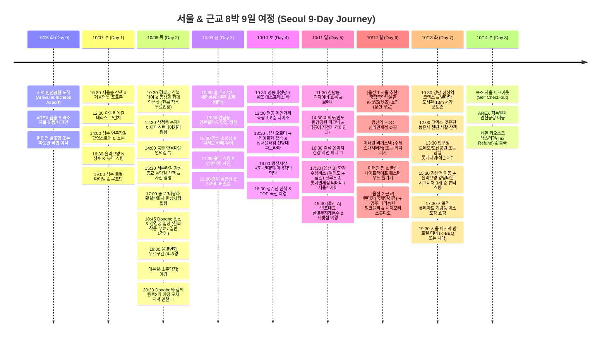

<strong>친구를 위해 한국의 트렌디한 감성과 역사적 낭만을 빈틈없이 채운 서울 & 근교 8박 9일 추천 일정표입니다.</strong>

<strong>A complete 9-day Seoul & Gyeonggi travel guide crafted for an unforgettable autumn journey combining trendy K-culture, historic charms, scenic Pink Muhly flowers, exotic Edo-themed Nijimori Studio, and vibrant night pocha dining.</strong>

> [!TIP]
> **💡 여행 전 안내: 유연한 추천 플랜 & 서울 vs 근교 꿀팁!💡 Pre-Trip Notice: Flexible Plan & Seoul vs Suburbs Advice!**  
> 

> 1. <strong>서울만 돌아도 9일이 부족합니다!</strong>: 성수, 홍대, 경복궁, 서순라길, 남산타워, 한남동, 여의도, 반포, 코엑스, 이태원, 용산 등 서울 시내에만 볼거리와 미식이 넘쳐나기 때문에 8박 9일도 서울 안에서만 즐기기에 빠듯할 정도입니다. 
> 2. <strong>근교(양주/동두천)를 가실 경우</strong>: 서울 외곽 대중교통은 배차 간격이 길기 때문에, 꼭 근교에 가고 싶다면 <strong>국제운전면허증(IDP)을 챙겨와서 렌터카를 대여</strong>해 쾌적하게 드라이브하시는 것을 강력 추천합니다! 
> 3. <strong>렌트가 부담스럽다면?</strong>: Day 6에 서울 밖으로 나가지 않고 <strong>국립중앙박물관(K-굿즈 뮷즈 쇼핑) ➔ 용산역 신라면세점 ➔ 이태원(수제버거 '버거스낵' & 펍/클럽)</strong>으로 완벽한 서울 도심 하루를 즐기실 수 있습니다!
> 

> 

> 1. <strong>Seoul is more than enough for 9 days!</strong>: With vibrant districts like Seongsu, Hongdae, Gyeongbokgung, Seosulla-gil, Namsan Tower, Hannam-dong, Hangang parks, COEX, Itaewon, and Yongsan, 9 days will barely feel like enough time even staying purely inside Seoul. 
> 2. <strong>If heading to the suburbs (Yangju/Dongducheon)</strong>: Suburban transit has longer headways. If you wish to explore outside Seoul, we strongly recommend bringing an <strong>International Driving Permit (IDP) and renting a car</strong> for maximum comfort and freedom! 
> 3. <strong>Prefer staying in Seoul?</strong>: Day 6 can seamlessly pivot into the <strong>National Museum of Korea (iconic MU:DS K-goods) ➔ Yongsan Duty Free ➔ Itaewon (Burger Snack & nightlife/clubs)</strong> cluster!
> 

---

## 🎫 예약 필수 vs 현장 발권/자유 방문 구분🎫 Booking & Walk-in Guide

여행 전 스트레스 없이 일정을 즐길 수 있도록 사전 예약이 필요한 곳과 자유롭게 방문할 수 있는 곳을 명확히 구분했습니다.

To ensure a smooth trip without unexpected surprises, here is the clear breakdown between activities requiring advance reservations versus walk-in attractions.

| 구분Category | 장소 및 일정Attraction & Date | 예약 방법 및 현장 안내Booking & Admission Details |
|---|---|---|
| 🔴 <strong>사전 예약 필수</strong>🔴 <strong>Reservation Required</strong> | <strong>홍대 K-뷰티 헤어/스파 (10/9 금)</strong><strong>Hongdae Hair Salon & Scalp Spa (Oct 9 Fri)</strong> | <strong>네이버 예약 또는 인스타그램/크리에이트립 사전 예약</strong>. 인기 디자이너 및 시술 시간 확보를 위해 1–2주 전 예약 권장.<strong>Book 1–2 weeks in advance via Creatrip or Instagram</strong>. Essential to secure your preferred designer and time slot. |
| 🟡 <strong>현장/원격 웨이팅</strong>🟡 <strong>Walk-in Waiting List</strong> | <strong>성수 팝업스토어 & 런던베이글뮤지엄/아티스트베이커리</strong><strong>Seongsu Pop-ups & London Bagel / Artist Bakery</strong> | <strong>캐치테이블(CatchTable) 앱 원격 줄서기</strong> 또는 매장 앞 태블릿 현장 대기 등록 후 대기 시간 동안 주변 산책.<strong>Remote waitlisting via CatchTable app</strong> or register at on-site tablet kiosks upon arrival. |
| 🟢 <strong>현장 대여 / 자유 관람</strong>🟢 <strong>Walk-in / Rental on Site</strong> | <strong>경복궁 한복 대여 (10/8 목)</strong><strong>Gyeongbokgung Hanbok Rental (Oct 8 Thu)</strong> | 예약 불필요! 안국역/경복궁역 인근 대여점에서 현장 대여 (2–4시간 대여). <strong>💡 한복 착용 시 경복궁·창경궁 등 서울 고궁 입장료 100% 무료!</strong>No advance booking needed! Rent directly near Anguk / Gyeongbokgung Station. <strong>💡 Free palace admission when wearing Hanbok!</strong> |
| 🟢 <strong>현장 발권 / 일반 입장 (자유 관람)</strong>🟢 <strong>Walk-in / Free Public Viewing</strong> | <strong>창경궁 물빛연화 4–8경 (10/8 목)</strong><strong>Changgyeonggung Mulbit Yeonhwa Zones 4–8 (Oct 8 Thu)</strong> | 사전 예매 불필요! <strong>한복 착용 시 무료 입장</strong>, 또는 <strong>현장 매표(1,000원) / 교통카드 게이트 직접 태그</strong>로 입장. 예약석(1–3경) 외 <strong>4–8경(제4경 대온실, 제5경 소춘당지, 제6경 산책로, 제7–8경 진출로)은 일반 관람객에게 전면 개방</strong>되어 자유롭게 관람 가능 (20:00 입장 마감).No advance Ticketlink ticket required! <strong>Free admission in Hanbok</strong>, or tap T-money/credit card (1,000 KRW). <strong>Zones 4–8 (Grand Greenhouse, Small Pond, and forest illuminated pathways) are completely open to the general public</strong> (Entry closes at 20:00). |
| 🟢 <strong>자유 무료 관람 (상설전)</strong>🟢 <strong>Free Walk-in (Permanent Gallery)</strong> | <strong>국립중앙박물관 & 뮷즈 MU:DS 샵 (10/12 월 서울 옵션)</strong><strong>National Museum of Korea & MU:DS (Oct 12 Mon Seoul Option)</strong> | 예약 불필요! 상설 전시는 <strong>전액 무료 관람</strong>. 박물관 1층 문화상품점(뮷즈 샵)에서 고품격 K-기념품 자유 쇼핑.No booking required! Permanent galleries are <strong>100% FREE</strong>. Shop exclusive modern K-cultural goods at the MU:DS shop. |
| 🟢 <strong>자유 방문 (상시 개방)</strong>🟢 <strong>Free Walk-in Access</strong> | <strong>용산역 신라면세점 & 이태원 '버거스낵' (10/12 월)</strong><strong>Yongsan Duty Free & Itaewon Burger Snack (Oct 12 Mon)</strong> | 예약 불필요. 용산역 아이파크몰 면세점 쇼핑 후 이태원으로 이동해 성시경 극찬 수제 스매시버거 '버거스낵' 및 나이트라이프 즐기기.Walk-in. Shop at Yongsan Shilla I'Park Duty Free, then explore Itaewon for juicy smash burgers at Burger Snack and vibrant night clubs. |
| 🟢 <strong>자유 방문 (상시 개방)</strong>🟢 <strong>Free Walk-in Access</strong> | <strong>서순라길 돌담길 & 종로 '더쌍화' (10/8 목)</strong><strong>Seosulla-gil Stone Wall & 'The Ssanghwa' (Oct 8 Thu)</strong> | 별도 예약 없음. 종묘 서쪽 돌담길 산책 & 사진 촬영, '더쌍화' 한방 카페에서 황실쌍화차 세트 현장 주문.No reservation required. Stroll and take photos along the stone wall, and order the Royal Ssanghwa Tea Set on-site. |
| 🟢 <strong>현장 발권 / 사전 할인</strong>🟢 <strong>Walk-in / Discount Ticket</strong> | <strong>남산타워 케이블카 & N서울타워 (10/10 토)</strong><strong>Namsan Cable Car & N Seoul Tower (Oct 10 Sat)</strong> | 명동역 3번 출구 남산 오르미(경사형 무료 엘리베이터) 탑승 후 매표소에서 <strong>케이블카 왕복(15,000원)</strong> 현장 발권. N서울타워 전망대는 현장 또는 모바일 할인 예매 가능.Take free Namsan Oreumi elevator from Myeongdong Station Exit 3, then purchase <strong>round-trip cable car ticket (15,000 KRW)</strong> at the counter. |
| 🟢 <strong>모바일 간편 결제 / 자유 대여</strong>🟢 <strong>Mobile QR Rent / Walk-in</strong> | <strong>반포/여의도 한강공원 따릉이 자전거 (10/11 일)</strong><strong>Hangang Seoul Bike Ddareungi Rental (Oct 11 Sun)</strong> | 사전 예약 불필요! 스마트폰으로 따릉이 영문 웹(bikeseoul.com) 접속 ➔ 외국인 비회원 1–2시간권(1,000–2,000원) 해외 신용카드 결제 ➔ 자전거 안장 뒤 QR코드 스캔 즉시 잠금 해제.No registration required! Open bikeseoul.com on phone ➔ Buy 1–2 hr foreigner pass (1,000–2,000 KRW) with international card ➔ Scan QR code to unlock. |
| 🟢 <strong>현장 발권 / 대중교통</strong>🟢 <strong>Walk-in / Transit Cruise</strong> | <strong>한강 수상버스 (리버버스) 여의도 ➔ 잠실 (10/11 일 옵션 B)</strong><strong>Hangang River Bus: Yeouido ➔ Jamsil (Oct 11 Sun Option B)</strong> | 사전 예약 불필요! 여의도 선착장에서 시간 맞춰 승선권 발권 또는 교통카드 태그로 탑승. 강 위에서 서울 스카이라인을 조망하며 잠실로 이동.Walk-in transit cruise! Board at Yeouido Pier using transit card or kiosk ticket for a scenic water cruise to Jamsil. |
| 🟢 <strong>현장 발권 (자유 방문)</strong>🟢 <strong>Walk-in / Ticket on Site</strong> | <strong>양주 나리농원 핑크뮬리 (10/12 월 근교 옵션)</strong><strong>Yangju Nari Park Pink Muhly (Oct 12 Mon Suburbs Option)</strong> | 사전 예약 불필요. 매표소 앞 <strong>무인 발권기에서 1인 2,000원 결제</strong> 후 즉시 입장 (국제면허증 렌터카 권장).No advance booking needed. Buy 2,000 KRW ticket at entrance kiosk for immediate entry (Rental car with IDP recommended). |
| 🟢 <strong>현장 발권 (자유 방문)</strong>🟢 <strong>Walk-in / Ticket on Site</strong> | <strong>동두천 니지모리 스튜디오 (10/12 월 근교 옵션)</strong><strong>Nijimori Studio Edo Village (Oct 12 Mon Suburbs Option)</strong> | 사전 예약 불필요. 입구 <strong>키오스크에서 1인 20,000원 결제</strong> 후 즉시 입장 (만 19세 이상 성인 전용, 신분증 지참).No reservation needed. Buy 20,000 KRW ticket at entrance kiosk (Adults only 19+, ID required). |
| 🟢 <strong>자유 무료 입장 & 외국인 혜택</strong>🟢 <strong>Free Walk-in & Foreigner Perks</strong> | <strong>잠실 롯데면세점 월드타워점 & 롯데타워 (10/11 또는 10/13)</strong><strong>Jamsil Lotte Duty Free & Seoul Sky (Oct 11 or 13)</strong> | 롯데월드몰 8·9층 면세점 고객센터 방문 시 <strong>외국인 여행객 대상 커스텀 티머니(T-Money) 카드 무료 증정 및 할인 쿠폰북 수령!</strong> 123층 서울스카이 전망대는 현장 또는 모바일 예매 이용.Visit 8F/9F Customer Desk with foreign passport for a <strong>Free Custom T-Money Card & coupon book!</strong> Ascend Seoul Sky observation deck freely. |
| 🟢 <strong>자유 무료 입장</strong>🟢 <strong>Free Walk-in Access</strong> | <strong>강남 삼성역 코엑스 별마당 도서관 & 봉은사 (10/13 화)</strong><strong>COEX Starfield Library & Bongeunsa (Oct 13 Tue)</strong> | 별도 입장료 및 예약 없음! 운영 시간 내 언제든 자유 관람 및 13m 서가 사진 촬영 가능.No entrance fees or reservations. Stroll and photograph freely anytime during open hours. |
| 🟢 <strong>자유 방문 (상시 개방)</strong>🟢 <strong>Free Walk-in Access</strong> | <strong>강남역 올리브영 강남타운 시그니처 (10/13 화)</strong><strong>Olive Young Gangnam Town Signature (Oct 13 Tue)</strong> | 예약 불필요. 강남역 10번 출구, 3개 층 규모의 초대형 시그니처 플래그십 매장. 5% 즉시 세금 환급(Tax Refund).Walk-in shopping. 3-story mega flagship with dedicated men's grooming and instant tax refunds. |
| 🟢 <strong>자유 무료 입장</strong>🟢 <strong>Free Walk-in Access</strong> | <strong>서울숲, 북촌 한옥마을, 명동, 광장시장, DDP, 반포/여의도 한강, 석촌호수</strong><strong>Seoul Forest, Bukchon, Myeongdong, Gwangjang, DDP, Hangang, Seokchon Lake</strong> | 예약 없이 언제든 자유롭게 방문하여 산책 및 미식 즐기기.Enjoy walks, photo spots, and street dining anytime without bookings. |

---

## 일정 요약Trip Summary

### 🎯 일자별 8대 핵심 메인 토픽🎯 8 Daily Core Missions

* ✈️ **Day 0 (10/6 화) : Welcome to Seoul (입국 & 숙소 자율 체크인)Day 0 (Oct 6 Tue) : Welcome to Seoul & Self Check-in** 🟢 자유 방문🟢 Walk-in
  
저녁 인천공항 도착 ➔ 공항철도(AREX) 등으로 친구 숙소로 자율 이동 & 체크인 ➔ 근처 편의점 털기 또는 따뜻한 국밥으로 첫날 편안한 휴식.

  
Evening arrival at Incheon Airport (ICN) ➔ Take AREX train or limousine bus to your hotel ➔ Self check-in ➔ Warm soup or convenience store snack & restful sleep.

* 🌸 **Day 1 (10/7 수) : Trendy K-Vibe & Nature (성수 & 서울숲)Day 1 (Oct 7 Wed) : Trendy K-Vibe & Nature (Seongsu & Seoul Forest)** 🟢 자유 방문 / 🟡 웨이팅🟢 Walk-in / 🟡 Queue
  
서울숲 가을 산책 ➔ 아틀리에길 테라스 브런치 ➔ 연무장길 핫플 팝업 투어 ➔ 5개 층 규모 '올리브영 N 성수' K-뷰티 털기 ➔ 성수 로컬 디너.

  
Morning stroll at Seoul Forest ➔ Terrace brunch at Atelier Street ➔ Trendiest pop-up stores along Yeonmujang-gil ➔ Massive 5-story 'Olive Young N Seongsu' beauty haul ➔ Seongsu local dinner.

* 🏮 **Day 2 (10/8 목) : ★ With Dongho ★ Royal Hanbok, Seosulla-gil, Mulbit Yeonhwa & Pocha (경복궁 한복 · 서순라길 · 더쌍화 · 창경궁 & 종로 야장)Day 2 (Oct 8 Thu) : ★ With Dongho ★ Royal Hanbok, Seosulla-gil, Mulbit Yeonhwa & Pocha Night** 🟢 자유 방문 (한복 착용 시 궁궐 무료)🟢 Walk-in (Free Palace Entry in Hanbok)
  
경복궁에서 동생과 함께 화려한 한복 대여 & 인생샷 ➔ 안국/삼청동 수제비 점심 ➔ 북촌 한옥마을 ➔ 감성 가득한 서순라길 돌담길 산책 & 사진 ➔ 종로 '더쌍화'에서 전통 한방 황실쌍화차 힐링 ➔ [18:45 Dongho 접선] 창경궁 춘당지 '물빛연화' 일반 관람구역(4–8경: 대온실·소춘당지·빛의 산책로) 야경 ➔ 종로3가 3~6번 출구 가을밤 야장(포차) 거리에서 Dongho와 함께하는 꼼장어·해산물 & 소주 낭만 저녁 만찬 🍻.

  
Gyeongbokgung Hanbok dress-up photoshoot with sibling (Free palace entry in Hanbok!) ➔ Samcheong-dong handmade sujebi lunch ➔ Bukchon Hanok Village ➔ Seosulla-gil atmospheric stone wall stroll & photo ops ➔ Traditional Korean herbal healing at 'The Ssanghwa' cafe ➔ [Meet Dongho at 18:45] Changgyeonggung 'Mulbit Yeonhwa' public viewing route (Zones 4–8: Grand Greenhouse & Small Pond) ➔ Festive dinner & drinks with Dongho at Jongno 3-ga outdoor street pocha party 🍻.

* 💇‍♀️ **Day 3 (10/9 금 - 한글날 공휴일) : K-Beauty Styling & Young Energy (홍대 & 연남동)Day 3 (Oct 9 Fri - Hangeul Day) : K-Beauty Styling & Young Energy (Hongdae & Yeonnam)** 🔴 예약 필수🔴 Reservation Required
  
(Dongho 베트남 출국) 홍대 감각적인 헤어살롱 스타일링/두피 스파 체험(사전 예약) ➔ 연트럴파크 맛집 점심 ➔ 연남동 골목 소품샵 투어 ➔ 인생네컷 ➔ 지글지글 삼겹살 & 버스킹.

  
(Dongho in Vietnam) K-beauty salon makeover (hair styling / scalp spa - booked in advance) in Hongdae ➔ Lunch along Yeonnam-dong Forest Park ➔ Cute boutique gift shops ➔ Photo booth ➔ K-BBQ pork belly & street busking.

* 🛍️ **Day 4 (10/10 토) : Myeongdong, Namsan Cable Car & Gwangjang Feast (명동 · 남산 케이블카 · 광장시장 & DDP)Day 4 (Oct 10 Sat) : Myeongdong, Namsan Cable Car & Gwangjang Feast** 🟢 자유 방문🟢 Walk-in
  
명동대성당 & 성당 뷰 카페 몰또 ➔ 명동 쇼핑 & 8층 다이소 ➔ **남산 오르미 & 남산타워 케이블카 탑승 & N서울타워 도심 파노라마 전망대** ➔ 활기찬 광장시장 육회·빈대떡·마약김밥 먹방 ➔ 청계천 산책 & DDP 미래형 야경.

  
Myeongdong Cathedral & Molto Espresso terrace ➔ Myeongdong shopping & 8-story Daiso ➔ **Namsan Oreumi inclined lift & Namsan Cable Car ride up to N Seoul Tower panoramic observatory** ➔ Gwangjang Market feast (beef tartare, crispy mung bean pancakes) ➔ Cheonggyecheon stream stroll & futuristic curved DDP night view.

* 🧺 **Day 5 (10/11 일) : Hannam Lifestyle, Hangang Ddareungi Bike & River Bus (한남동 · 한강 따릉이 자전거 & 라면 피크닉 / 수상버스 🛳️)Day 5 (Oct 11 Sun) : Hannam Lifestyle, Hangang Ddareungi Bike & River Bus Cruise** 🟢 자유 방문🟢 Walk-in
  
<strong>옵션 A (반포 코스)</strong>: 한남동 디자이너 쇼룸 ➔ 반포 한강공원 따릉이 라이딩 ➔ 즉석 은박지 한강 라면 + 배달 치킨 ➔ 반포대교 무지개분수 야경. <strong>옵션 B (여의도 & 수상버스 ➔ 잠실 연계 코스)</strong>: 여의도 한강공원 따릉이 자전거 라이딩 ➔ 즉석 한강 라면 피크닉 ➔ 여의도 선착장에서 한강 수상버스(리버버스) 탑승하여 잠실 선착장 크루즈 ➔ 잠실 롯데면세점 외국인 웰컴 티머니 카드 발급 & 123층 롯데타워/석촌호수 조망!

  
<strong>Option A (Classic Banpo)</strong>: Hannam-dong showrooms ➔ Banpo Hangang Park Ddareungi bike ride ➔ Tin-foil instant ramyeon + delivery chicken picnic ➔ Moonlight Rainbow Fountain. <strong>Option B (Yeouido & River Bus to Jamsil Express)</strong>: Yeouido Hangang Park Ddareungi bike ride ➔ Instant Hangang ramyeon picnic ➔ Board Hangang River Bus at Yeouido Pier for a scenic cruise to Jamsil Pier ➔ Jamsil Lotte Duty Free (free foreign visitor T-Money card & vouchers) & 123F Lotte World Tower Seoul Sky / Seokchon Lake!

* 🏛️ **Day 6 (10/12 월) : [선택] 용산 K-굿즈 & 이태원 버거스낵 vs 근교 핑크뮬리 로드트립Day 6 (Oct 12 Mon) : [Choice] Yongsan K-Goods & Itaewon vs Suburbs Roadtrip** 🟢 자유 방문 / 현장 발권🟢 Walk-in / Tickets
  

  <strong>코스 1 (서울 도심 추천): 국립중앙박물관 K-굿즈(뮷즈) ➔ 용산역 신라면세점 ➔ 이태원 '버거스낵' & 펍/클럽 나이트라이프!</strong> (국보 반가사유상 미니어처/자개 굿즈 털기 ➔ 성시경 극찬 수제버거 & 화덕피자 ➔ 이국적인 웨스턴 무드 & 클럽 파티). 
  <strong>코스 2 (근교 가을 로드트립 - 국제운전면허증 렌터카 추천)</strong>: 10월 절정 양주 나리농원 핑크뮬리 바다 ➔ 동두천 니지모리 스튜디오 일본 에도 마을 & 라멘.
  

  

  <strong>Option 1 (Seoul Inside - Recommended): National Museum of Korea (MU:DS K-Goods) ➔ Yongsan Station Duty Free ➔ Itaewon (Burger Snack & Nightlife)!</strong> (Shop iconic Pensive Bodhisattva miniatures & mother-of-pearl crafts ➔ Savor legendary smash burgers at Burger Snack ➔ Experience vibrant international bars & clubs). 
  <strong>Option 2 (Suburban Autumn Roadtrip - IDP Car Rental Recommended)</strong>: Yangju Nari Park glowing Pink Muhly ocean ➔ Nijimori Studio Edo-period village.
  

* 🏙️ **Day 7 (10/13 화) : Gangnam Landmarks, Olive Young Town, Lotte Mart & Farewell Night (코엑스 · 별마당 도서관 · 봉은사 · 올리브영 강남타운 & 마지막 밤)Day 7 (Oct 13 Tue) : Gangnam Landmarks, Olive Young Town, Lotte Mart & Farewell Night** 🟢 자유 방문🟢 Walk-in
  
지하철 2호선 삼성역 코엑스몰 & 13m 웅장한 별마당 도서관 ➔ 코엑스 맞은편 1,200년 천년고찰 봉은사 ➔ (Day 5에 잠실을 다녀왔다면 여유롭게 압구정 로데오/도산공원 산책, 안 다녀왔다면 잠실 롯데면세점 티머니/롯데타워 투어) ➔ 2호선 강남역 <strong>3개 층 규모의 초대형 '올리브영 강남타운 시그니처' 뷰티 쇼핑</strong> ➔ 서울역 롯데마트에서 K-과자·라면·김 박스 포장 쇼핑 ➔ 서울에서의 마지막 밤 로컬 디너.

  
Line 2 Samseong Station COEX Mall & towering 13m Starfield Library ➔ Ancient Bongeunsa Buddhist Temple right across COEX ➔ (If Jamsil was already visited on Day 5 via River Bus, explore trendy Apgujeong Rodeo / Dosan Park; otherwise visit Jamsil Lotte Duty Free & Seoul Sky) ➔ Ride Line 2 to Gangnam Station for <strong>colossal 3-story 'Olive Young Gangnam Town Signature' beauty haul</strong> ➔ Lotte Mart Seoul Station mega-souvenir grocery box haul ➔ Relaxed farewell local dinner on your last night in Seoul.

* 🛫 **Day 8 (10/14 수) : Safe Journey Home (자율 체크아웃 & 출국)Day 8 (Oct 14 Wed) : Safe Journey Home (Self Check-out & Flight Departure)** 🟢 자유 방문🟢 Walk-in
  
숙소 자율 체크아웃 ➔ AREX 직통열차 등으로 인천공항 이동 ➔ 세관 키오스크 택스리펀 & 면세점 쇼핑 후 안전하게 귀국.

  
Self check-out at your own pace ➔ Transfer to Incheon Airport via AREX ➔ Tax refund, duty-free shopping & flight departure.

---

### 🗺️ 일정 타임라인🗺️ Trip Timeline

---

### 📋 빠른 비교표📋 Quick Overview Table

| 날짜Date | 요일Day | 테마Core Theme | 예약 구분Booking | 주요 동선Key Route |
|---|:---:|---|:---:|---|
| **10/6** | 화Tue | <strong>도착 & 자율 체크인</strong><strong>Arrival & Check-in</strong> | 🟢 자유 방문🟢 Walk-in | 인천공항 ➔ AREX 공항철도 ➔ 숙소 자율 이동 ➔ 편의점/국밥Incheon Airport ➔ AREX ➔ Self Check-in ➔ Late Snack |
| **10/7** | 수Wed | <strong>성수 & 서울숲</strong><strong>Seongsu & Forest</strong> | 🟡 현장 대기🟡 Queue | 서울숲 ➔ 아틀리에길 브런치 ➔ 연무장길 팝업 ➔ <strong>올리브영 N 성수</strong>Seoul Forest ➔ Atelier Brunch ➔ Yeonmujang Pop-ups ➔ <strong>Olive Young N Seongsu</strong> |
| **10/8** | <strong>목</strong><strong>Thu</strong> | <strong>★ Dongho와 함께 ★</strong><strong>★ With Dongho ★</strong> | 🟢 <strong>자유 방문 (한복 무료)</strong>🟢 <strong>Free Palace Entry in Hanbok</strong> | <strong>경복궁 한복(동생과) ➔ 서순라길 ➔ 더쌍화 ➔ [Dongho 접선] 창경궁(4–8경) ➔ 종로3가 야장 🍻</strong><strong>Gyeongbokgung Hanbok ➔ Seosulla-gil ➔ The Ssanghwa ➔ [Meet Dongho] Changgyeonggung ➔ Jongno Pocha 🍻</strong> |
| **10/9** | 금Fri | <strong>홍대 K-뷰티</strong><strong>Hongdae K-Beauty</strong> | 🔴 <strong>예약 필수</strong>🔴 <strong>Booking Req.</strong> | <strong>홍대 미용실 헤어/스파 (예약)</strong> ➔ 연트럴파크 점심 ➔ 소품샵/쇼핑 ➔ 삼겹살<strong>Hongdae Hair/Spa (Booked)</strong> ➔ Yeonnam Lunch ➔ Shopping ➔ K-BBQ |
| **10/10** | 토Sat | <strong>명동 & 남산타워 & 광장시장</strong><strong>Myeongdong & Namsan</strong> | 🟢 자유 방문🟢 Walk-in | 명동성당/몰또 ➔ 명동 쇼핑 ➔ <strong>남산타워 케이블카 & N서울타워</strong> ➔ <strong>광장시장 먹방</strong> ➔ DDPMyeongdong Cathedral ➔ <strong>Namsan Cable Car & N Seoul Tower</strong> ➔ <strong>Gwangjang Market</strong> ➔ DDP |
| **10/11** | 일Sun | <strong>한남동 & 한강 피크닉 / 수상버스</strong><strong>Hannam & Hangang River Bus</strong> | 🟢 자유 방문🟢 Walk-in | 한남동 쇼룸 ➔ <strong>여의도/반포 한강공원 (따릉이 자전거 라이딩 🚴‍♀️ + 즉석 라면) ➔ 수상버스 ➔ 잠실 롯데면세점(티머니)</strong>Hannam Showrooms ➔ <strong>Hangang Park (Ddareungi Cycling + Ramyeon) ➔ River Bus ➔ Jamsil Lotte Duty Free</strong> |
| **10/12** | 월Mon | <strong>[서울] 국립중앙박물관 & 이태원 vs [근교] 핑크뮬리</strong><strong>[Seoul] NMK K-Goods & Itaewon vs [Suburbs] Pink Muhly</strong> | 🟢 <strong>자유 방문 (상설 무료)</strong>🟢 <strong>Walk-in (Free Entry)</strong> | <strong>[서울 추천] 국립중앙박물관 K-굿즈(뮷즈) ➔ 용산역 신라면세점 ➔ 이태원 '버거스낵' & 클럽</strong> <em>[근교 옵션] 국제면허증 렌터카 ➔ 양주 나리농원 ➔ 니지모리 스튜디오</em><strong>[Seoul Recommended] National Museum of Korea (MU:DS K-Goods) ➔ Yongsan Duty Free ➔ Itaewon (Burger Snack & Clubs)</strong> <em>[Suburbs Option] IDP Car Rental ➔ Yangju Nari Park ➔ Nijimori Studio</em> |
| **10/13** | 화Tue | <strong>강남 랜드마크 & 뷰티 쇼핑</strong><strong>Gangnam Landmarks & Beauty</strong> | 🟢 자유 방문🟢 Walk-in | <strong>삼성역 코엑스 별마당 도서관 ➔ 봉은사 ➔ 도산공원/잠실 ➔ 올리브영 강남타운 시그니처 ➔ 롯데마트 ➔ 로컬 석식</strong><strong>COEX Starfield Library ➔ Bongeunsa ➔ Dosan/Jamsil ➔ Olive Young Gangnam Town ➔ Lotte Mart</strong> |
| **10/14** | 수Wed | <strong>자율 체크아웃 & 귀국</strong><strong>Check-out & Flight</strong> | 🟢 자유 방문🟢 Walk-in | 숙소 자율 체크아웃 ➔ AREX ➔ 공항 세관 환급 ➔ 출국Self Check-out ➔ AREX ➔ Airport Tax Refund ➔ Departure |

---

## 🚨 출발 전 필수 준비 & 생존 가이드🚨 Pre-Trip Survival & Essential Guide

> [!TIP]
> **창경궁 '물빛연화' 일반 관람구역(4–8경) 안내Changgyeonggung 'Mulbit Yeonhwa' Free Public Walk-in Zones (4–8)**  
> * 
<strong>개최 장소</strong>: 창경궁 춘당지(연못) 및 대온실 일대.

<strong>Location</strong>: Changgyeonggung Chundangji Pond & Grand Greenhouse area.

> * 
<strong>상영구간 안내</strong>: 1–3경(대춘당지 사전예약석)은 사전예매자 전용이지만, <strong>4–8경(제4경 대온실 조화의 빛, 제5경 소춘당지 물의 숨결, 제6경 화평의 빛 산책로, 제7–8경 진출로)은 일반 관람객에게 전면 개방</strong>된 무료 관람 구역입니다!

<strong>Viewing Zones</strong>: While Zones 1–3 require advance tickets, <strong>Zones 4–8 (Zone 4 Grand Greenhouse light projections, Zone 5 Small Pond waters, Zone 6 illuminated forest pathway, and Zones 7–8 exit routes) are completely open to the general public</strong>!

> * 
<strong>입장 방법</strong>: 티켓링크 예매가 없어도 <strong>한복 착용 시 입장료 전액 무료</strong>, 또는 <strong>창경궁 현장 매표(1인 1,000원) / 교통카드 게이트 직접 태그</strong>로 입장 가능합니다.

<strong>Admission</strong>: Even without advance Ticketlink reservations, <strong>admission is 100% FREE in Hanbok</strong>, or just 1,000 KRW by tapping T-money / credit card at the turnstile gate.

> * 
<strong>입장 마감 주의</strong>: 창경궁 정문 홍화문은 <strong>20:00 입장 마감</strong> (퇴장 21:00)이므로, 19:00 전후로 입장하여 환상적인 대온실과 물빛 산책로를 감상하시면 가장 좋습니다!

<strong>Entry Deadline</strong>: Changgyeonggung Main Gate (Honghwamun) <strong>closes entry strictly at 20:00</strong> (park closes at 21:00). Entering around 19:00 is ideal!

> * 
<strong>저녁 만찬</strong>: 창경궁 관람 후 20:30경 종로3가 야장 포차거리로 이동하여 Dongho와 함께 든든하고 신나는 저녁 만찬을 즐깁니다 🍻.

<strong>Pocha Feast</strong>: After palace sightseeing, head to Jongno 3-ga outdoor street pocha around 20:30 for an electric feast and drinks with Dongho 🍻.

---

### 💳 1. 교통 & 결제 완전 정복💳 1. Transportation & Payment

| 수단Method | 설명Description | 활용 팁Pro-Tips |
|---|---|---|
| <strong>기후동행카드</strong><strong>Climate Card</strong> | 외국인 관광객용 단기권 (1/2/3/5/7일권). 서울 시내 지하철·시내버스를 무제한 탑승.Unlimited ride transit pass for Seoul subways & public buses (1/2/3/5/7 day passes available). | • 편의점에서 실물 카드(3,000원) 구매 후 지하철 무인 충전기에서 현금 충전. • 서울 시외 구간(양주, 동두천 등)은 별도 요금 적용.• Buy physical card (3,000 KRW) at convenience stores and top-up at subway kiosks with cash. • Excludes suburban stops outside Seoul boundary. |
| <strong>T-Money 카드</strong><strong>T-Money Card</strong> | 한국의 만능 충전식 교통카드. 지하철, 버스, 편의점, 택시 결제 가능.Standard rechargeable transit card accepted across all subways, buses, taxis, and convenience stores. | • 편의점에서 손쉽게 구매 및 현금 충전 가능. • 양주, 동두천 등 한국 전역에서 그대로 사용 가능! • <strong>💡 잠실 롯데면세점 월드타워점 외국인 고객센터에서 무료 증정 혜택 제공!</strong>• Easy to buy and top up with cash at any convenience store. • Works everywhere in Korea including Yangju and Dongducheon! • <strong>💡 Claim a free custom card at Jamsil Lotte Duty Free customer desk!</strong> |
| <strong>해외 카드 결제</strong><strong>Overseas Cards</strong> | 대부분 매장에서 VISA, Mastercard, AMEX가 문제없이 결제됩니다.Most restaurants, cafés, and retail shops accept foreign credit cards without hassle. | • 포장마차(야장) 및 전통시장 일부 노점은 <strong>현금 결제</strong> 선호. 비상금으로 5–10만 원 현금 소지 권장!• Traditional market stalls and street pochas prefer <strong>cash (KRW notes)</strong>. Keep 50,000–100,000 KRW cash handy! |
| <strong>국제운전면허증 (IDP)</strong><strong>Int'l Driving Permit (IDP)</strong> | 근교(양주, 가평, 동두천)를 렌터카로 여행할 경우 본국 면허증 + 국제면허증 필수.Essential along with your home country driver's license if renting a car for suburban road trips. | • 서울 시내는 대중교통이 최고지만, 근교 외곽은 렌터카가 훨씬 편리합니다. 렌트 계획이 있다면 출국 전 발급 필수!• While subways are king inside Seoul, driving a rental car is ideal for suburban scenic areas. Bring an IDP if you plan to drive! |

---

### 📱 2. 스마트폰 필수 앱📱 2. Essential Travel Apps

* 🗺️ **네이버 지도 (NAVER Map)NAVER Map**
  
한국에서는 구글맵보다 네이버 지도가 정확합니다. 영어, 중국어, 일본어 인터페이스를 지원하며 지하철 실시간 출구 정보와 버스 도착 시간을 알려줍니다.

  
Far more accurate than Google Maps in South Korea. Supports English, Japanese, and Chinese. Offers precise subway exit numbers and real-time transit directions.

* 💬 **파파고 (Papago)Papago Translation**
  
네이버의 인공지능 번역 앱. 식당 메뉴판 사진을 찍으면 즉시 번역해주며 한국어 음성 대화 번역이 가장 자연스럽습니다.

  
The best AI translation tool for Korean. Snap photos of menus for instant translation and enjoy natural voice conversation features.

* 🚕 **카카오 T (Kakao T)Kakao T (Taxi)**
  
한국의 우버(Uber). 길거리에서 택시가 안 잡힐 때 필수이며 해외 신용카드 등록이 지원됩니다.

  
Korea's premier ride-hailing app (like Uber). Accepts international credit cards and is super useful when getting around with luggage.

---

## 10/6 (화) · Day 0 : 입국 & 숙소 자율 체크인Oct 6 (Tue) · Day 0 : Welcome to Seoul & Self Check-in 🟢 자유 방문🟢 Walk-in

* ✈️ **18:30 ~ 20:30 | 인천국제공항 입국 & 숙소로 자율 이동18:30 ~ 20:30 | Arrival at Incheon Airport & Self Transfer**
  
저녁 인천국제공항(ICN) 도착 ➔ 입국 수속 후 공항철도(AREX 직통/일반) 또는 공항리무진 버스를 타고 예약한 친구 숙소 위치로 자유롭게 이동 & 체크인.

  
Arrive at Incheon Int'l Airport (ICN) in the evening ➔ Clear customs and take the AREX Airport Railroad or airport limousine bus directly to your accommodation ➔ Self check-in at your own pace.

* 🍜 **21:00 ~ | 첫날 밤 자유 야식 & 휴식21:00 ~ | Free Evening & First Night Snack**
  
숙소 근처 따뜻한 국밥(설렁탕, 순대국밥) 한 그릇 또는 편의점에서 바나나맛 우유, 컵라면, 삼각김밥 꿀조합으로 여독 풀고 푹 쉬기.

  
Unwind with a warm bowl of Korean soup (Seolleongtang ox bone soup or pork soup), or raid the nearby convenience store for iconic banana milk, ramyeon, and triangle kimbap before a restful sleep.

---

## 10/7 (수) · Day 1 : 성수 & 서울숲Oct 7 (Wed) · Day 1 : Trendy K-Vibe & Nature (Seongsu & Seoul Forest) 🟢 자유 방문 / 🟡 웨이팅🟢 Walk-in / 🟡 Queue

> 
평일이라 팝업스토어 웨이팅이 적고 카페가 여유로워 성수동을 정복하기 가장 이상적인 날입니다.

> 
A weekday is the perfect golden window to explore Seongsu with minimal queueing for pop-ups and relaxed café vibes.

* 🌲 **10:30 ~ 12:30 | 서울숲 가을 힐링 산책10:30 ~ 12:30 | Seoul Forest Autumn Stroll** 🟢 자유 방문🟢 Walk-in
  
수인분당선 서울숲역 3번 출구 도보 5분. '거울연못(Mirror Pond)' 앞에서 단풍과 빌딩이 물에 비치는 인생 사진 촬영, 울창한 은행나무 숲길 산책.

  
Take Suin-Bundang Line to Seoul Forest Station (Exit 3). Walk through the scenic park to 'Mirror Pond', Seoul's favorite reflection photo spot surrounded by autumn foliage and skyscrapers.

* 🍳 **12:30 ~ 14:00 | 서울숲 아틀리에길 테라스 브런치12:30 ~ 14:00 | Atelier Street Brunch** 🟡 현장 대기🟡 Queue
  
감성 한식 퓨전 맛집 난포(Nampo - 강된장 쌈밥, 제철회 묵은지말이) 또는 정갈한 가정식 할머니의 레시피, 테라스 브런치 카페 체디(Chedi).

  
Explore Atelier Street. Savor modern Korean soul food at Nampo (soybean paste leaf wraps, seasoned raw fish rolls) or traditional home meal at Grandma's Recipe, or Western brunch at Chedi.

* 🏬 **14:00 ~ 16:30 | 성수 연무장길 팝업 & 플래그십 투어14:00 ~ 16:30 | Yeonmujang-gil Pop-ups & Showrooms** 🟡 현장 대기🟡 Queue
  
2호선 성수역 3번/4번 출구. 탬버린즈(Tamburins) 향수 쇼룸, 우주선 컨셉의 아더에러(ADER Space), 그리고 유럽 대저택 외관의 디올 성수(Dior Seongsu) 앞에서 인증샷!

  
Walk down Yeonmujang-gil near Seongsu Station (Exit 3/4). Check out avant-garde scents at Tamburins, futuristic streetwear at ADER Space, and snap an obligatory selfie in front of the palace-like Dior Seongsu.

* 💄 **16:30 ~ 18:30 | 올리브영 N 성수 K-뷰티 메카16:30 ~ 18:30 | Olive Young N Seongsu Mega Flagship** 🟢 자유 방문🟢 Walk-in
  
성수역 4번 출구 앞. 총 5개 층 규모의 초대형 K-뷰티 혁신 매장! 피부 진단 부스 체험, 인기 선크림, 세럼, 마스크팩 쇼핑 및 즉시 5% 택스리펀 환급.

  
Located directly at Seongsu Station (Exit 4). This 5-story flagship is Korea's largest beauty playground. Enjoy personalized skin consultations, sample trending K-skincare & makeup, and get immediate tax-free refunds.

* 🍷 **19:00 ~ 21:00 | 성수 로컬 다이닝 & 루프탑19:00 ~ 21:00 | Seongsu Local Dinner** 🟢 자유 방문🟢 Walk-in
  
붉은 벽돌 감성의 성수동 파스타/와인 바에서 여유로운 첫날 마무리.

  
Enjoy casual Italian dining or a craft taproom tucked inside Seongsu’s charming red-brick alleys.

---

## 10/8 (목) · Day 2 : 경복궁 한복, 서순라길 & 창경궁 물빛연화 + 가을 야장 🍻 (★ With Dongho ★)Oct 8 (Thu) · Day 2 : Royal Hanbok, Seosulla-gil, Mulbit Yeonhwa & Pocha Night (★ With Dongho ★) 🟢 자유 방문 (한복 무료)🟢 Walk-in (Free Palace Entry in Hanbok)

> 
Dongho와 함께하는 이번 여행 최고의 하이라이트 데이! 낮에는 동생과 함께 한복을 입고 경복궁과 서순라길 돌담길에서 인생샷을 찍고 '더쌍화'에서 한방 힐링을 즐긴 뒤, 저녁에는 Dongho와 합류하여 창경궁 물빛연화 야간 산책과 종로3가 가을밤 야장 포차 만찬을 즐깁니다! 다음 날(10/9)이 한글날 공휴일이라 종로3가 야장이 일주일 중 가장 뜨겁고 낭만적인 밤입니다.

> 
★ The Ultimate Highlight Day with Dongho! ★ In the daytime, rent a gorgeous Hanbok with your sibling to explore Gyeongbokgung Palace & picturesque Seosulla-gil stone walls, followed by herbal tea healing at 'The Ssanghwa'. In the evening, meet up with Dongho for Changgyeonggung illuminated night walk and an unforgettable outdoor pocha feast in Jongno 3-ga! (Next day Oct 9 is Hangeul Day holiday, making Thursday night the most electric outdoor party night of the week!).

* 🎎 **10:30 ~ 12:30 | 경복궁 한복 대여 & 동생과 함께 궁궐 인생샷10:30 ~ 12:30 | Gyeongbokgung Hanbok Photoshoot with Sibling** 🟢 현장 대여 / 궁궐 무료입장🟢 Walk-in Rental / Free Admission
  
3호선 안국역/경복궁역 인근 유명 한복 대여점에서 동생과 함께 곱고 화려한 전통/테마 한복 대여 (머리 땋기 및 소품 포함). <strong>💡 특급 꿀팁: 한복을 착용하면 경복궁 입장료(3,000원)는 물론, 당일 서울 고궁(창경궁 등) 입장료가 100% 무료!</strong> 웅장한 광화문과 근정전, 그리고 버드나무가 늘어진 연못 위 경회루(Gyeonghoeru) 앞에서 평생 남을 화보 같은 사진 남기기!

  
Rent premium traditional or modern Hanbok near Anguk / Gyeongbokgung Station with your sibling (hair braiding & accessories included). <strong>💡 Pro-Tip: Wearing Hanbok grants 100% FREE admission to Gyeongbokgung Palace and Changgyeonggung!</strong> Pose before majestic Gwanghwamun Gate, Geunjeongjeon throne hall, and the breathtaking Gyeonghoeru Pavilion floating over the tranquil pond!

* 🍲 **12:30 ~ 14:00 | 안국/삼청동 미식 & 베이커리12:30 ~ 14:00 | Samcheong-dong Gourmet Lunch** 🟡 현장 대기🟡 Queue
  
미쉐린 빕 구르망에 빛나는 삼청동 수제비(진한 멸치 육수 손수제비 + 바삭한 감자전/파전), 또는 담백한 사골 황생가칼국수, 핫플 아티스트 베이커리(소금빵)에서 맛있는 점심.

  
Taste Michelin Bib Gourmand hand-pulled dough flake soup at Samcheong-dong Sujebi paired with crispy seafood/potato pancake, or beef broth noodles at Hwangsaengga Kalguksu, followed by salt bread at Artist Bakery.

* 🏮 **14:00 ~ 15:30 | 북촌 한옥마을 언덕길 산책14:00 ~ 15:30 | Bukchon Hanok Village Walk** 🟢 자유 방문🟢 Walk-in
  
'가회동 31번지 언덕길(북촌 6경)'에서 한옥 기와 처마 너머로 저 멀리 남산서울타워가 내려다보이는 서울 최고의 뷰 감상 (실제 주민 거주지역이므로 정숙 필수!).

  
Wander uphill to Gahoe-dong 31 (Bukchon Viewpoint 6), where traditional tiled roofs frame N Seoul Tower on the horizon. (Please maintain silence as this is a residential neighborhood).

* 📸 **15:30 ~ 17:00 | 서순라길 감성 종묘 돌담길 산책 & 인생샷15:30 ~ 17:00 | Seosulla-gil Stone Wall Stroll & Photos** 🟢 자유 방문🟢 Walk-in
  
창덕궁 돈화문 앞에서 종묘 서쪽 돌담을 따라 이어지는 <strong>서울에서 가장 힙하고 고즈넉한 '서순라길'</strong>! 아름다운 종묘 돌담벽을 배경으로 가을빛 감성 사진 남기기, 돌담길을 따라 늘어선 한옥 주얼리 공방과 아기자기한 테라스 카페 구경.

  
Head to <strong>Seosulla-gil</strong>, the trendiest historic alley winding along the ancient western stone wall of Jongmyo Shrine! Snap aesthetic photos against the long stone wall lined with autumn trees, and explore indie craft jewelry workshops and cozy outdoor terrace cafés.

* 🍵 **17:00 ~ 18:30 | 종로 1967년 전통 한방 카페 '더쌍화' 힐링17:00 ~ 18:30 | Traditional Korean Herbal Tea Healing at 'The Ssanghwa'** 🟢 자유 방문🟢 Walk-in
  
종로3가/5가에 위치한 이색 전통 한방 카페 '더쌍화'. 조선시대 의녀 복장을 한 직원이 직접 자리로 정성스레 서빙해주는 시그니처 <strong>'황실쌍화차 세트(진한 쌍화차 + 미니 새싹삼 + 한방 환 + 전통 다과)'</strong> 한상차림! 한복을 입고 궁궐과 돌담길을 걸으며 쌓인 여독을 따뜻하고 향긋하게 녹여내기.

  
Visit 'The Ssanghwa', a unique traditional Korean herbal tea house dating back to 1967 in Jongno. Staff dressed in historic royal nurse attire serve the signature <strong>Royal Ssanghwa Tea Set</strong> (piping hot medicinal herb tea, mini fresh ginseng sprout, herbal pills, and traditional sweet rice crackers) on an ornate wooden tray. A deeply restorative cultural experience!

* 🌟 **18:45 ~ 20:15 | ★ Dongho 접선 ★ 창경궁 야간 산책 & '물빛연화' 일반 관람구역18:45 ~ 20:15 | ★ Meet Dongho ★ Changgyeonggung Night Walk & 'Mulbit Yeonhwa'** 🟢 자유 방문 (한복 무료 / 일반 1천원)🟢 Walk-in (Free in Hanbok / 1k KRW)
  
창경궁 정문 홍화문에서 퇴근한 Dongho와 접선! 티켓링크 사전 예매가 없어도 <strong>한복 착용 시 입장료 무료(일반 복장은 현장 1,000원 매표 또는 교통카드 태그)</strong>로 입장 (20:00 입장 마감). 예약석(1–3경) 외에 일반인에게 전면 개방된 <strong>4–8경 구간(제4경 대온실 조화의 빛, 제5경 소춘당지 물의 숨결, 제6경 숲속 빛의 산책로, 제7–8경 진출로)</strong>을 따라 은은한 조명과 빅토리아풍 대온실 야경 인생샷 남기기!

  
Meet up with Dongho at Changgyeonggung Palace Main Gate (Honghwamun)! No Ticketlink advance reservation needed—<strong>entry is 100% FREE in Hanbok</strong> (or just 1,000 KRW by tapping T-money/credit card at the turnstile; must enter before 20:00). Stroll through the open public zones (Zones 4–8: Grand Victorian Greenhouse light projections, Small Pond reflection sounds, and illuminated forest pathways)!

* 🍻 **20:30 ~ 늦은 밤 | ★ Dongho와 함께하는 저녁 만찬 ★ 종로3가 가을밤 야장 포차 거리20:30 ~ Late | ★ Dinner Feast with Dongho ★ Jongno 3-ga Outdoor Pocha Street** 🟢 자유 방문🟢 Walk-in
  
창경궁 관람 후 5호선 종로3가역 3~6번 출구 포차거리로 이동! 선선한 가을바람 속에 수십 개의 야외 플라스틱 테이블이 펼쳐지는 한국 특유의 야장 문화 속에서 Dongho와 함께하는 본격적인 저녁 만찬! 매콤달콤 쫄깃한 꼼장어 구이, 바삭한 해물파전, 신선한 해산물 모둠, 두툼한 계란말이에 소주/맥주로 잊지 못할 가을밤 건배! (2차: 을지로 노가리 골목 생맥주).

  
After the palace stroll, head straight to Jongno 3-ga Station (Exits 3, 4, 5, 6) for dinner and drinks! Experience Korea’s legendary outdoor street pocha culture where hundreds of tables fill the autumn night. Feast together with Dongho on sizzling grilled sea eel (Kkomjangeo), crispy seafood pancake, live octopus, and fluffy rolled omelets washed down with ice-cold soju and beer! (Alternative 2nd round: Euljiro Nogari draft beer square).

---

## 10/9 (금) · Day 3 : 홍대 K-뷰티 & 젊음의 거리 (한글날 공휴일)Oct 9 (Fri) · Day 3 : Hongdae K-Beauty & Youth Culture (Hangeul Day) 🔴 미용실 예약 필수🔴 Salon Booking Required

> 
(Dongho 베트남 여행 기간 ✈️) 머리부터 발끝까지 K-스타일로 완벽하게 변신하고 젊음의 거리를 활보하는 날!

> 
(Dongho travelling in Vietnam ✈️) Treat yourself to a head-to-toe K-beauty salon makeover and soak in youth energy along Hongdae!

* 💇‍♀️ **10:30 ~ 13:00 | 홍대 K-뷰티 살롱 헤어 & 두피 스파10:30 ~ 13:00 | Hongdae K-Beauty Salon Makeover** 🔴 사전 예약 필수 (네이버/크리에이트립)🔴 Pre-booking Required
  
사전 예약한 인기 살롱(준오헤어, 차홍룸, 또는 디자이너 샵) 방문. 한국식 트렌디 디자인 커트/펌 스타일링, 시원한 힐링 두피 스케일링 스파, 혹은 퍼스널 컬러 진단 받기.

  
Visit your pre-booked hair salon in Hongdae. Experience world-class Korean haircuts, scalp aroma scaling spa, or a personal color consultation to discover your signature tones.

* 🌳 **13:30 ~ 15:00 | 연남동 경의선 숲길 (연트럴파크) & 점심13:30 ~ 15:00 | Yeonnam Forest Park & Lunch** 🟢 자유 방문🟢 Walk-in
  
2호선/공항철도 홍대입구역 3번 출구. 초록빛 철길 공원을 거닐며 골목길 아기자기한 이탈리안 파스타나 일본식 덮밥으로 점심.

  
Head out of Hongik Univ. Station (Exit 3) to "Yeontral Park". Stroll along the revitalized railway park and pick a cozy bistro for pasta or Japanese donburi rice bowls.

* 🎁 **15:00 ~ 17:30 | 연남동 감성 골목 소품샵 투어15:00 ~ 17:30 | Yeonnam Boutique Gift Shops** 🟢 자유 방문🟢 Walk-in
  
귀여운 캐릭터 문구류, 핸드메이드 소품, 빈티지 편집숍 구경 및 감성 디저트 카페 탐방.

  
Get lost in Yeonnam-dong’s winding alleys packed with whimsical indie stickers, artisan accessories, and trendy concept cafés.

* 📸 **17:30 ~ 19:30 | 홍대 패션 쇼핑 & 인생네컷17:30 ~ 19:30 | Hongdae Fashion Shopping & Photo Booth** 🟢 자유 방문🟢 Walk-in
  
KT&G 상상마당에서 독특한 디자인 굿즈 쇼핑, '인생네컷/포토이즘'에서 귀여운 모자와 머리띠 쓰고 한국 여행 필수 네컷 사진 남기기!

  
Shop lifestyle designer goods at KT&G Sangsangmadang. Slip into funny hats at an instant photo booth (Life4Cuts / Photoism) for the quintessential Korea keepsake!

* 🥓 **19:30 ~ 22:00 | 홍대 삼겹살 & 길거리 버스킹19:30 ~ 22:00 | Hongdae K-BBQ & Street Busking** 🟢 자유 방문🟢 Walk-in
  
솥뚜껑에 지글지글 굽는 삼겹살에 볶음밥 마무리! 홍대 걷고싶은거리 버스킹 존에서 실력파 인디 버스커들의 K-POP 라이브 음악 감상.

  
Savor sizzling thick pork belly BBQ grilled with aged kimchi, topped off with cheese fried rice. Finish the evening watching vibrant K-pop street dancers and indie acoustic buskers.

---

## 10/10 (토) · Day 4 : 명동, 남산타워 케이블카 & 광장시장 먹방Oct 10 (Sat) · Day 4 : Myeongdong, Namsan Cable Car & Gwangjang Feast 🟢 자유 방문🟢 Walk-in

* ⛪ **10:30 ~ 12:00 | 명동대성당 & 성당 뷰 테라스 카페10:30 ~ 12:00 | Myeongdong Cathedral & Terrace Cafe Molto** 🟢 자유 방문🟢 Walk-in
  
4호선 명동역 8번 출구 또는 2호선 을지로입구역. 1898년 완공된 유서 깊은 고딕 양식의 명동성당을 둘러보고, 맞은편 '몰또(Molto)' 에스프레소 바 야외 테라스에서 성당 첨탑을 바라보며 시그니처 에스프레소와 크루아상 즐기기.

  
Head to Myeongdong Station (Exit 8). Admire Korea's historic 1898 Gothic cathedral, then grab an outdoor terrace seat at Molto Italian Espresso Bar for rich espresso and pastries with sweeping views of the church facade.

* 🛍️ **12:00 ~ 13:30 | 명동 메인거리 쇼핑 & 8층 다이소12:00 ~ 13:30 | Myeongdong Shopping Spree & 8-Story Daiso** 🟢 자유 방문🟢 Walk-in
  
명동 보행자 전용거리에서 K-패션과 뷰티 로드샵 구경. 특히 명동역 8층 전체가 다이소인 건물에서 가성비 최고 뷰티 소품과 한국 전통 기념품 득템.

  
Browse cosmetic shops along the bustling pedestrian strip. Don't miss the colossal 8-story Daiso building right next to Myeongdong Station—a budget shopping paradise for Korean souvenirs, cosmetics, and travel essentials.

* 🚡 **13:30 ~ 15:30 | 남산 오르미 ➔ 남산타워 케이블카 & N서울타워 파노라마 뷰13:30 ~ 15:30 | Namsan Oreumi Lift ➔ Cable Car & N Seoul Tower** 🟢 현장 발권 (왕복 15,000원)🟢 Walk-in Ticket (15k KRW)
  
명동역 3번 출구에서 도보 7분 이동 ➔ 무료 야외 경사형 엘리베이터 '남산 오르미(Namsan Oreumi)' 탑승 후 케이블카 승강장 도착 ➔ 케이블카를 타고 가을빛 남산 숲 위를 날아 N서울타워 정상 도착! 팔각정과 사랑의 자물쇠(Love Locks) 전망대에서 360도로 펼쳐지는 서울 도심 스카이라인 파노라마 인생샷 남기기 (타워 전망대 내부 입장은 선택 사항).

  
Walk 7 mins from Myeongdong Station Exit 3 ➔ Take the free outdoor glass-elevator 'Namsan Oreumi' directly to the cable car station ➔ Ride the iconic Namsan Cable Car soaring over the autumn foliage straight to the peak of N Seoul Tower! Marvel at 360-degree panoramic skyline views from the Octagonal Pavilion and colorful Love Locks fence (Observatory deck inside the tower is optional).

* 🥢 **16:00 ~ 18:30 | 종로 광장시장 전통 먹방 투어16:00 ~ 18:30 | Gwangjang Market Traditional Street Food Feast** 🟢 자유 방문🟢 Walk-in
  
케이블카를 타고 내려와 지하철 또는 택시로 1호선 종로5가역 광장시장 이동! 살아 꿈틀거리는 산낙지가 올라간 육회 탕탕이(자매집 또는 창신육회), 맷돌로 갈아 노릇노릇 부쳐낸 순희네 녹두빈대떡과 마약김밥, 그리고 줄 서서 먹는 달콤쫄깃 찹쌀꽈배기 디저트까지 전통 시장 먹방 섭렵.

  
Descend via cable car and hop on subway/taxi to Gwangjang Market (Jongno 5-ga Station). Feast on legendary Yukhoe Tangtangi (fresh beef tartare topped with wriggling live octopus tentacles), golden crispy mung bean pancakes from Sunine stall dipped in onion soy sauce, bite-sized addictive Mayak gimbap, and freshly spun cinnamon sugar twisted donuts.

* 🌌 **18:30 ~ 20:30 | 청계천 산책 & DDP 미래형 야경18:30 ~ 20:30 | Cheonggyecheon Stream Walk & DDP Night View** 🟢 자유 방문🟢 Walk-in
  
배부른 배를 두드리며 청계천 물소리를 따라 도심 산책 후, 자하 하디드가 설계한 DDP(동대문 디자인 플라자)로 이동. 밤이 되면 은빛 곡선 외벽 위로 은은한 미디어 조명이 켜지는 미래지향적 우주선 야경 감상.

  
Stroll along the tranquil Cheonggyecheon stream to digest the market feast, arriving at Dongdaemun Design Plaza (DDP). Marvel at the world's largest three-dimensional atypical building designed by Zaha Hadid, glowing like an illuminated spaceship under the night sky.

---

## 10/11 (일) · Day 5 : 한남동 감성 쇼룸 & 한강 따릉이 라이딩 + 라면 피크닉 / 수상버스 🛳️Oct 11 (Sun) · Day 5 : Hannam Showrooms, Hangang Cycling & River Bus to Jamsil 🟢 자유 방문🟢 Walk-in

* 👗 **11:30 ~ 14:00 | 한남동 디자이너 패션 쇼룸 & 브런치11:30 ~ 14:00 | Hannam Designer Showrooms & Brunch** 🟢 자유 방문🟢 Walk-in
  
6호선 한강진역 1번/3번 출구. 한국 2030 트렌드세터들의 성지! 시그니처 플라워 프린트의 마르디 메크르디(Mardi Mercredi), 감각적인 향의 논픽션(Nonfiction) 플래그십, 셀럽 애정템 이미스(EMIS) 볼캡 쇼룸 쇼핑 & 테라스 감성 브런치.

  
Take Line 6 to Hangangjin Station (Exit 1/3). Explore Seoul's trendiest boutique district featuring Mardi Mercredi (cult floral sweatshirts & knitwear), Nonfiction (fragrance & body care flagship), and EMIS (it-girl caps & tote bags), followed by a relaxed terrace brunch.

> **💡 한강 오후 일정 선택 (Option A vs Option B)💡 Afternoon Hangang Routes (Option A vs Option B)**  
> 
친구분의 취향과 동선에 맞춰 아래 두 가지 코스 중 자유롭게 선택할 수 있습니다!

> 
Choose freely between two wonderful riverside experiences based on your preferences:

* 🌟 **[코스 선택 A : 클래식 반포 코스] 반포 한강공원 따릉이 & 분수 야경[Option A : Classic Banpo Course] Banpo Cycling & Rainbow Fountain**
  * 🚴‍♀️ **15:00 ~ 16:30 | 반포 한강공원 따릉이 자전거 힐링 라이딩15:00 ~ 16:30 | Banpo Hangang Ddareungi Cycling**
    
한강진역에서 버스 또는 택시로 반포 한강공원 이동. 입구 따릉이 대여소에서 스마트폰 모바일 웹(bikeseoul.com)으로 외국인 1–2시간권 결제 후 QR코드 스캔 해제! 시원한 가을바람을 맞으며 한강변 자전거 도로 힐링 라이딩 🚴.

    
Take a quick bus/cab to Banpo Hangang Park. Rent a green Seoul Bike (Ddareungi) via bikeseoul.com English site for 1–2 hours. Cruise along Seoul's dedicated riverside bike expressway under crisp autumn skies 🚴.

  * 🍜 **16:30 ~ 19:00 | 즉석 은박지 '한강 라면' + 배달 치킨 피크닉16:30 ~ 19:00 | Tin-Foil Hangang Ramyeon & Fried Chicken Picnic**
    
반포 편의점 자동 조리기에 은박지 용기를 올려 끓여내는 마법의 '한강 라면'! 배달존에서 갓 튀긴 반반 치킨을 픽업해 잔디밭 돗자리에서 노을을 감상하며 낭만 피크닉.

    
Cook instant ramyeon in silver foil bowls on induction cookers at the riverside convenience store! Grab delivery crispy fried chicken at the pickup zone and picnic on the lawn at golden hour.

  * 🌈 **19:30 ~ 21:00 | 반포대교 달빛무지개분수 & 세빛섬 야경19:30 ~ 21:00 | Banpo Moonlight Rainbow Fountain & Sevit Island**
    
세계 최장 분수 교량인 반포대교 달빛무지개분수 20분 음악 쇼(19:30, 20:00, 20:30) 및 인공섬 세빛섬 조명 감상.

    
Watch illuminated water cascades dance to music from Banpo Bridge (19:30, 20:00, 20:30) and enjoy glowing futuristic floating islands.

* 🛳️ **[코스 선택 B : 여의도 자전거 + 한강 수상버스 ➔ 잠실 연계 코스][Option B : Yeouido Cycling + River Bus Cruise to Jamsil]**
  * 🚴‍♀️ **14:30 ~ 16:30 | 여의도 한강공원 따릉이 라이딩 & 한강 라면14:30 ~ 16:30 | Yeouido Park Ddareungi Cycling & Hangang Ramyeon**
    
한남동에서 5호선 여의나루역으로 이동. 여의도 한강공원에서 따릉이를 대여해 63빌딩 앞 시원한 강변 자전거 전용도로를 라이딩 ➔ 편의점에서 즉석 은박지 한강 라면 끓여먹기!

    
Take subway Line 5 to Yeouinaru Station. Rent a Ddareungi bike at Yeouido Hangang Park, ride alongside panoramic views of 63 Building and riverside parks, then savor iconic tin-foil Hangang ramyeon!

  * ⛴️ **16:30 ~ 17:30 | 여의도 선착장 ➔ 한강 수상버스(리버버스) 잠실행 탑승16:30 ~ 17:30 | Hangang River Bus: Yeouido Pier to Jamsil Pier**
    
여의도 선착장에서 시간 맞춰 한강 수상버스(리버버스) 탑승! 시원한 가을 강바람을 맞으며 한강 중심을 가로질러 잠실 선착장으로 낭만 크루즈 이동 (서울 도심 다리들과 남산타워, 롯데월드타워를 강 위에서 모두 조망).

    
Board the Hangang River Bus at Yeouido Pier for a scenic transit cruise straight across the Han River to Jamsil Pier! Experience stunning skyline views of Namsan Tower, Seoul bridges, and Lotte World Tower from the water.

  * 🛍️ **17:30 ~ 20:00 | 잠실 롯데면세점 외국인 티머니 카드 수령 & 롯데타워/석촌호수17:30 ~ 20:00 | Jamsil Lotte Duty Free Foreigner T-Money Card & Seoul Sky**
    
잠실 선착장에서 롯데월드몰로 이동 ➔ 롯데면세점 월드타워점 고객센터에서 **외국인 관광객(여권 지참) 대상 커스텀 티머니(T-Money) 무료 카드 & 할인 쿠폰 수령!** ➔ 123층 서울스카이 전망대 또는 단풍 물든 석촌호수 산책. *(💡 Day 5에 잠실을 다녀오면 Day 7에 잠실을 생략하고 강남/코엑스/도산공원을 훨씬 여유롭게 즐길 수 있습니다!).*

    
Walk from Jamsil Pier to Lotte World Mall ➔ Present your foreign passport at Lotte Duty Free World Tower Customer Desk to **claim a FREE Custom T-Money transit card and shopping vouchers!** ➔ Marvel at the 123F Seoul Sky observation deck or stroll around autumn-colored Seokchon Lake. *(💡 Doing Jamsil today frees up Day 7 for a much more relaxed Gangnam day!).*

---

## 10/12 (월) · Day 6 : [선택 1] 용산 K-굿즈 & 이태원 버거스낵 vs [선택 2] 가을 근교 로드트립Oct 12 (Mon) · Day 6 : [Option 1] Yongsan K-Goods & Itaewon vs [Option 2] Autumn Suburbs Roadtrip 🟢 자유 방문🟢 Walk-in

> 

> <strong>💡 일정 선택 안내</strong>: 서울 시내만으로도 9일이 빠듯하므로 무리하게 교외로 나가지 않고 <strong>옵션 1(용산 & 이태원)을 강력 추천</strong>합니다! 만약 꼭 양주/동두천 근교를 가고 싶다면 한국 지하철보다는 <strong>국제운전면허증(IDP)을 지참하여 렌터카를 대여해 드라이브</strong>하시는 것이 훨씬 여유롭습니다.
> 

> 

> <strong>💡 Course Advice</strong>: Since Seoul itself is deeply packed with attractions, <strong>Option 1 (Yongsan & Itaewon) is strongly recommended</strong> for a relaxed, culture-rich experience! If you genuinely wish to explore suburban Gyeonggi-do (Option 2), bringing an <strong>International Driving Permit (IDP) and renting a car</strong> is far more comfortable than suburban trains.
> 

* 🌟 **[추천 옵션 1 : 서울 도심] 용산역 신라면세점 · 국립중앙박물관 K-굿즈(뮷즈) & 이태원 '버거스낵' + 클럽 나이트라이프[Recommended Option 1 : Seoul Inside] National Museum of Korea (MU:DS K-Goods) · Yongsan Duty Free & Itaewon (Burger Snack + Clubs)**
  * 🏛️ **10:30 ~ 13:30 | 국립중앙박물관 상설전 관람 & '뮷즈(MU:DS)' K-굿즈 쇼핑10:30 ~ 13:30 | National Museum of Korea & Iconic 'MU:DS' K-Goods** `🟢 상설전 전액 무료`
    
4호선/경의중앙선 이촌역 2번 출구 박물관 나들길 직결. 세계적인 규모의 국립중앙박물관 상설전시관(무료 관람)을 여유롭게 산책! 특히 1층 문화상품점(뮷즈 샵)에서 한국인과 외국인 모두 열광하는 <strong>국보 반가사유상 컬러 미니어처, 고려청자 텀블러/케이스, 나전칠기 자개 소품 및 디자인 문구류</strong> 등 서울에서 가장 감각적인 최고급 전통 K-굿즈 쇼핑 🛍️.

    
Take Line 4 / Gyeongui-Jungang Line to Ichon Station (Exit 2). The grand permanent gallery is <strong>100% FREE</strong>! Don't miss the legendary <strong>MU:DS (Museum Goods) Shop</strong> on the 1st floor—world-famous for aesthetic, modern reimaginations of Korean treasures: pastel <strong>Pensive Bodhisattva mini statues</strong>, Celadon tumblers, and mother-of-pearl lacquerware!

  * 🛍️ **13:30 ~ 15:30 | 용산역 HDC 신라면세점 & 아이파크몰 투어13:30 ~ 15:30 | Yongsan Station HDC Shilla I'Park Duty Free & Mall** `🟢 자유 방문`
    
이촌역에서 1정거장(경의중앙선) 또는 택시 5분으로 용산역 도착. 아이파크몰 3–7층에 위치한 대규모 'HDC 신라면세점'에서 여권을 제시하고 럭셔리 브랜드 및 K-패션/뷰티 면세 쇼핑 즐기기.

    
Hop one train stop to Yongsan Station. Explore HDC Shilla I'Park Duty Free occupying floors 3 to 7 of I'Park Mall for tax-free luxury cosmetics, fashion, and lifestyle shopping.

  * 🍔 **16:00 ~ 18:30 | 이태원/녹사평 이동 ➔ 성시경 극찬 수제버거 '버거스낵(Burger Snack)' 또는 화덕 피자16:00 ~ 18:30 | Itaewon / Noksapyeong: Burger Snack (Smash Burgers) or Pizza** `🟢 자유 방문`
    
용산에서 6호선 녹사평역 또는 택시로 10분 이동. 이국적인 감성이 흐르는 이태원/경리단길 초입! 성시경의 유튜브 '먹을텐데'에서 극찬받은 수제 스매시버거 성지 <strong>'버거스낵(Burger Snack)'</strong> 방문! 철판에 바삭하게 눌러 구운 소고기 패티와 달콤하게 카라멜라이징된 양파가 폭발하는 육즙 버거 맛보기 (또는 보니스피자펍/모터시티 화덕 피자).

    
Take a 10-minute cab or subway to Noksapyeong / Itaewon Station. Treat your tastebuds at <strong>Burger Snack</strong>, Seoul's cult smash-burger haven celebrated by top foodies! Savor crispy lacy beef patties dripping with melted cheese and sweet caramelized onions on a buttery potato bun. (Alternative: artisan Detroit pizza at Motor City).

  * 🍸 **19:00 ~ 늦은 밤 | 이태원 웨스턴 펍, 루프탑 & 글로벌 클럽 나이트라이프19:00 ~ Late | Itaewon International Pubs, Rooftops & World-Famous Nightclubs** `🟢 자유 방문`
    
한국 속의 작은 지구마을 이태원! 세계 각국의 수제맥주 펍과 남산타워가 보이는 루프탑 바에서 칵테일을 즐기고, 밤이 깊어지면 활기찬 하우스/힙합 클럽에서 자유롭고 신나는 가을밤 파티 만끽하기.

    
Experience Itaewon's electric global nightlife! Sip craft beers at open-air sidewalk pubs, take in N Seoul Tower sunset views from rooftop lounges, and dance the night away at premier underground electronic or hip-hop clubs.

* 🚗 **[옵션 2 : 근교 로드트립] 양주 나리농원 핑크뮬리 & 동두천 니지모리 스튜디오 (국제면허증 렌터카 추천)[Option 2 : Suburban Roadtrip] Yangju Pink Muhly & Nijimori Studio (Car Rental Recommended)**
  * 🌸 **10:30 ~ 12:30 | 양주 나리농원 핑크뮬리 & 가을꽃 바다 산책10:30 ~ 12:30 | Yangju Nari Park Pink Muhly & Flower Fields** `🟢 현장 발권 (2,000원)`
    
10월 절정인 분홍빛 핑크뮬리, 보랏빛 천일홍, 붉은 댑싸리 꽃바다 속에서 인생 사진 남기기!

    
Wander through endless fields of glowing pastel pink muhly grass, purple globe amaranth, and crimson round kochia!

  * ⛩️ **13:15 ~ 18:00 | 동두천 니지모리 스튜디오 에도 마을 투어13:15 ~ 18:00 | Nijimori Studio Edo Period Village Tour** `🟢 현장 발권 (20,000원 / 성인 19+)`
    
마을 내 전통 일본 라멘 점심, 기모노/유카타 대여 산책, 찻집 말차와 당고, 17:30경 해질 무렵 마을 전체에 켜지는 붉은 홍등 야경 감상 후 서울 복귀.

    
Tonkotsu ramen lunch, Kimono dressing, matcha sweets, and illuminated red lanterns at twilight before driving back to Seoul.

---

## 10/13 (화) · Day 7 : 강남 코엑스, 별마당 도서관, 올리브영 강남타운 & 마지막 밤Oct 13 (Tue) · Day 7 : Gangnam Landmarks, Olive Young Town & Farewell Night 🟢 자유 방문🟢 Walk-in

> 
강남의 미래형 랜드마크와 1,200년 천년고찰, 3개 층 규모의 초대형 올리브영 강남타운 시그니처, 그리고 마지막 밤의 기념품 장보기까지 완벽한 동선! (💡 Day 5에 잠실을 이미 방문했다면 오늘 잠실을 생략하고 코엑스 ➔ 봉은사 ➔ 압구정 로데오/도산공원 ➔ 강남역으로 여유롭게 이동할 수 있습니다).

> 
Experience the futuristic landmarks of Gangnam, a 1,200-year-old tranquil temple, the massive 3-story Olive Young Gangnam Town Signature flagship, and a grand souvenir grocery haul on your farewell night! (💡 If Jamsil was already visited on Day 5 via River Bus, skip Jamsil today and enjoy a relaxed stroll through Apgujeong Rodeo / Dosan Park!).

* 📚 **10:30 ~ 12:00 | 강남 삼성역 코엑스몰 & 별마당 도서관10:30 ~ 12:00 | Samseong COEX Starfield Library** 🟢 자유 무료 입장🟢 Free Walk-in
  
지하철 2호선 삼성역 5번·6번 출구 직결. 13m 높이의 거대한 책장 벽면과 부드러운 자연광이 쏟아지는 '별마당 도서관'에서 인생 사진 촬영! 코엑스 아티움 외벽 초대형 3D K-POP 스퀘어 미디어아트 감상.

  
Take Line 2 to Samseong Station (Exits 5/6) connected to COEX Mall. Visit the world-famous Starfield Library featuring towering 13-meter curved bookshelves and radiant natural sunlight—one of Korea's most photogenic modern landmarks! Catch the 3D anamorphic media wave on the K-Pop Square giant screen outside.

* 🏯 **12:00 ~ 13:00 | 도심 속 천년고찰 봉은사 산책12:00 ~ 13:00 | Historic Bongeunsa Buddhist Temple** 🟢 자유 무료 입장🟢 Free Walk-in
  
코엑스 바로 맞은편 (9호선 봉은사역 1번 출구). 신라 원성왕 10년(794년)에 창건된 1,200년 역사의 사찰. 강남 현대식 고층 빌딩 숲과 대비되는 고즈넉한 대웅전과 23m 미륵대불 불상 감상.

  
Located directly across from COEX Mall. Founded in 794 AD, this 1,200-year-old Buddhist sanctuary offers an incredible visual contrast between ancient spiritual heritage and Gangnam's towering skyscrapers. Admire the 23-meter stone Maitreya Buddha statue.

* 🛍️ **13:00 ~ 15:30 | [선택지] 압구정 로데오/도산공원 또는 잠실 롯데월드타워/면세점13:00 ~ 15:30 | [Choice] Apgujeong Rodeo / Dosan or Jamsil Lotte Tower** 🟢 자유 방문🟢 Walk-in
  
Day 5에 수상버스로 잠실을 이미 다녀왔다면: 코엑스에서 수인분당선으로 2정거장 이동해 **압구정 로데오 & 하우스 도산(젠틀몬스터, 탬버린즈), 런던베이글뮤지엄 도산** 탐방! Day 5에 반포 코스를 선택했다면: 2호선 3정거장 이동해 **잠실 롯데면세점 월드타워점(외국인 티머니 무료 카드 수령) & 123층 서울스카이 / 석촌호수** 투어.

  
If Jamsil was completed on Day 5: Ride 2 stops to **Apgujeong Rodeo & Haus Dosan (Gentle Monster, Tamburins) and London Bagel Museum Dosan**! If you chose Banpo on Day 5: Ride 3 stops on Line 2 to **Jamsil Lotte Duty Free World Tower (Free T-Money card) & 123F Seoul Sky / Seokchon Lake**.

* 💄 **15:30 ~ 17:00 | 강남역 올리브영 강남타운 시그니처 플래그십15:30 ~ 17:00 | Olive Young Gangnam Town Mega Flagship** 🟢 자유 방문🟢 Walk-in
  
지하철 2호선 강남역 10번 출구. 3개 층 전체가 K-뷰티 테마로 꾸며진 올리브영 대표 시그니처 매장! 1층 트렌드 뷰티 & 메이크업, 2층 프리미엄 스킨케어 & 웰니스, 3층 남성 그루밍(맨즈케어) 및 글로벌 베스트셀러 존 완비. 즉시 택스리펀(Tax Refund) 지원.

  
Take Line 2 to Gangnam Station (Exit 10). Step into Olive Young Gangnam Town, an iconic 3-story flagship store! Floor 1 features trending makeup & seasonal launches, Floor 2 houses premium dermo-skincare & wellness, and Floor 3 boasts an extensive Men's Grooming Zone and tourist bestsellers. Instant tax refund available on-site.

* 🛒 **17:30 ~ 19:00 | 서울역 롯데마트 제타플렉스 기념품 박스 장보기17:30 ~ 19:00 | Lotte Mart Seoul Station Souvenir Haul** 🟢 자유 방문🟢 Walk-in
  
강남역에서 2호선 탑승 후 시청역/사당 환승 또는 버스로 서울역 직결 롯데마트 제타플렉스 이동. K-라면(신라면툼바, 불닭볶음면), 허니버터아몬드, 초코파이, 고급 김, 홍삼 등 대량 구매. 매장 내 즉시 5% 택스리펀 및 무료 자율 포장대에서 박스 테이핑 포장.

  
Head to Lotte Mart Zettaplex at Seoul Station—the ultimate supermarket for tourist snacks. Stock up on instant ramyeon, HBAF flavored almonds, seaweed sheets, and red ginseng. Enjoy instant 5% tax refunds and pack your loot in free cardboard boxes for easy flight check-in.

* 🥩 **19:30 ~ 21:30 | 서울 마지막 밤 자율 로컬 디너19:30 ~ 21:30 | Farewell Dinner in Seoul** 🟢 자유 방문🟢 Walk-in
  
쇼핑 짐을 숙소에 두고 숙소 근처 골목 맛집에서 삼겹살 숯불구이, 따뜻한 찌개, 또는 바삭한 치킨에 맥주(치맥)로 서울에서의 마지막 밤을 여유롭게 만끽하기.

  
Drop your shopping haul at your hotel and savor your final evening in Seoul at a local neighborhood gem—crispy pork belly K-BBQ or iconic Chimaek (fried chicken & cold draft beer).

---

## 10/14 (수) · Day 8 : 자율 체크아웃 & 출국Oct 14 (Wed) · Day 8 : Safe Journey Home (Check-out & Flight Departure) 🟢 자유 방문🟢 Walk-in

* 🧳 **숙소 자율 체크아웃 & 공항 이동Self Check-out & Airport Transfer**
  
친구 숙소에서 일정에 맞게 자율 체크아웃 ➔ 서울역에서 공항철도(AREX 직통/일반) 또는 공항리무진 탑승 ➔ 인천국제공항 제1 또는 제2터미널 이동.

  
Self check-out from your accommodation at your own pace ➔ Board the AREX Express Train from Seoul Station or an airport limousine bus to Incheon Airport.

* 💵 **택스리펀 & 안전한 귀국Tax Refund & Departure**
  
공항 3층 출국장 세관 키오스크에서 여행 중 모은 택스리펀 영수증 바코드 스캔 ➔ 현금(원화/달러) 또는 카드 환급 수령 ➔ 면세점 쇼핑 후 안전하게 탑승!

  
Scan all your tax refund receipts at the 3rd-floor customs electronic kiosk to claim instant cash or credit card refunds ➔ Complete security checks, pick up duty-free orders, and board your flight safely back home!

---

## 💡 서울 여행 특급 실전 가이드 & 인근 보너스 버킷리스트💡 Seoul Pro-Tips & Extra Bucket List Guide

친구분의 취향과 체력, 그날의 날씨에 따라 일정을 더 풍성하고 유연하게 즐길 수 있도록 핵심 팁과 주변 추가 가볼 만한 곳들을 총정리했습니다! (Plan일 뿐이니 원하는 만큼 골라서 즐기시면 됩니다).

Here is an exhaustive, practical pro-tip handbook designed to make navigating Seoul effortless, flexible, and fun—from renting city bikes without a Korean phone to claiming free duty-free T-Money perks and picking extra activities!

### 🚗 1. 서울 vs 근교 여행: 국제운전면허증(IDP)과 렌터카 안내🚗 1. Seoul vs Suburbs: Int'l Driving Permit & Car Rental Guide

* 
<strong>서울만 돌아도 9일이 부족합니다</strong>: 서울 시내에만 성수, 홍대, 경복궁, 서순라길, 남산타워, 한남동, 여의도, 반포, 코엑스, 이태원, 용산 등 가볼 만한 곳이 가득 차 있어 9일도 짧게 느껴집니다. 무리하게 외곽으로 이동하기보다 서울 도심의 다채로운 매력에 집중하는 것을 권장합니다.

<strong>Seoul is more than enough for 9 days</strong>: Seoul is brimming with iconic districts, world-class food, culture, and shopping. You can comfortably spend all 9 days inside Seoul without running out of exciting things to do.

* 
<strong>근교 여행 시 필수 준비물</strong>: 양주 나리농원이나 동두천 니지모리 스튜디오, 가평 남이섬 등 교외로 나가실 계획이라면 <strong>국제운전면허증(IDP, 본국 면허증과 함께 소지)</strong>을 반드시 준비해 오셔서 렌터카(롯데렌터카/SK렌터카 등)를 이용하시는 것이 대중교통 배차 대기 없이 훨씬 쾌적합니다.

<strong>Essential for Suburbs Roadtrip</strong>: If planning to explore outside Seoul (Yangju Pink Muhly, Nijimori Studio, Nami Island), bringing an <strong>International Driving Permit (IDP) and renting a car</strong> is strongly recommended over suburban buses/trains for flexibility and comfort.

---

### 🏛️ 2. 국립중앙박물관 K-굿즈(뮷즈 MU:DS) 쇼핑 & 용산 면세점 꿀팁🏛️ 2. National Museum of Korea K-Goods (MU:DS) & Yongsan Duty Free

* 
<strong>국보급 K-굿즈의 성지 '뮷즈(MU:DS)'</strong>: 국립중앙박물관 1층에 위치한 기념품 샵은 한국 MZ세대와 외국인 관광객 모두에게 폭발적인 인기를 끌고 있는 최고급 문화 굿즈 브랜드입니다.

<strong>The Holy Grail of K-Cultural Goods: MU:DS</strong>: Located on the 1st floor of the National Museum of Korea, MU:DS offers the most sophisticated, beautifully designed souvenirs in the country.

* 
<strong>추천 쇼핑 리스트</strong>:
  * <strong>반가사유상 미니어처 (Pensive Bodhisattva)</strong>: 국보 반가사유상을 현대적인 파스텔톤 컬러로 재해석한 오브제 (BTS RM의 작업실에도 놓여있어 세계적으로 유명해짐).
  * <strong>고려청자 모티브 굿즈</strong>: 비취색 청자 문양 텀블러, 에어팟 케이스, 키링.
  * <strong>자개 공예품 (Najeonchilgi)</strong>: 각도에 따라 영롱하게 빛나는 자개 스티커, 손거울, 트레이.

<strong>Must-Buy Souvenir List</strong>:
  * <strong>Pensive Bodhisattva Miniature</strong>: Modern pop-art pastel mini statues of Korea’s National Treasure (famous worldwide after BTS RM featured one in his studio).
  * <strong>Goryeo Celadon Items</strong>: Jade-green glazed celadon tumblers, phone accessories, and keyrings.
  * <strong>Mother-of-Pearl (Najeonchilgi) Crafts</strong>: Shimmering mother-of-pearl phone stickers, compact mirrors, and lacquer trays.

* 
<strong>용산역 HDC 신라면세점</strong>: 박물관 관람 후 바로 인근 용산역 아이파크몰로 이동해 도심 면세점 쇼핑과 식사를 원스톱으로 즐길 수 있습니다.

<strong>Yongsan Station Shilla I'Park Duty Free</strong>: Just one quick stop from the museum, head into I'Park Mall for multi-level tax-free luxury shopping.

---

### 🍔 3. 이태원 웨스턴 무드 & 성시경 극찬 '버거스낵(Burger Snack)' 가이드🍔 3. Itaewon Western Vibe & Cult Smash Burger 'Burger Snack' Guide

* 
<strong>이태원을 가야 하는 이유</strong>: 한국의 전통미와 K-팝 트렌드 외에, 자유롭고 이국적인 서양식 펍, 라운지 바, 그리고 서울 최고의 나이트라이프(클럽)를 경험하고 싶다면 단연 이태원이 최고입니다!

<strong>Why Visit Itaewon</strong>: If you crave an international Western vibe, buzzing open-air pubs, rooftop cocktails, and Seoul’s premier clubbing scene, Itaewon is the undisputed center!

* 
<strong>'버거스낵(Burger Snack)' 수제 스매시버거</strong>:
  * 위치: 녹사평역 2번 출구 도보 5분 (용산구 녹사평대로46길 13, 경리단길 입구).
  * 매력: 성시경의 유튜브 '먹을텐데'에서 극찬받은 수제버거 성지! 철판에 눌러 바삭하게 구운 패티와 달콤하게 카라멜라이징된 양파가 폭발적인 육즙을 자랑합니다.
  * 피자 옵션: 이태원의 유명 화덕 피자 맛집인 보니스피자펍(Bonny's Pizza Pub) 또는 모터시티(Motor City) 디트로이트 피자도 최고의 선택지입니다.

<strong>Burger Snack (Smash Burgers)</strong>:
  * Location: 5-min walk from Noksapyeong Station Exit 2 (13 Noksapyeong-daero 46-gil).
  * Highlights: Hailed by famous food critics, this tiny diner crafts top-tier smash burgers with lacy crisp beef edges and rich caramelized onions.
  * Pizza Options: Artisan Detroit pizza at Motor City or casual craft pies at Bonny’s Pizza Pub are equally iconic.

* 
<strong>이태원 클럽 & 나이트라이프</strong>: 해밀톤 호텔 뒷골목과 이태원 앤틱가구거리 주변에 하우스, 테크노, 힙합 클럽들이 밀집해 있어 신나는 가을밤 파티를 만끽할 수 있습니다.

<strong>Nightclubs & Lounges</strong>: The alleys behind Hamilton Hotel house Seoul’s trendiest electronic and hip-hop clubs running till dawn.

---

### 🚴‍♀️ 4. 외국인 전용 서울자전거 '따릉이(Ddareungi)' 200% 대여 & 라이딩 꿀팁🚴‍♀️ 4. Foreigner Guide to Seoul Bike (Ddareungi) Rental & Cycling

* 
<strong>한국 번호 / 본인인증 불필요!</strong>: 외국인 관광객도 스마트폰 모바일 웹 브라우저만 있으면 1분 만에 대여 가능합니다.

<strong>No Korean phone number required!</strong>: Any foreign tourist can rent a bike in 1 minute using just a mobile web browser.

* 
<strong>대여 단계 (Step-by-Step)</strong>:
  1. 따릉이 외국인 영문 모바일 웹(bikeseoul.com 접속 후 상단 언어를 English로 선택) 또는 <strong>티머니GO(T-money GO)</strong> 앱 실행.
  2. <strong>'Foreigner / Non-member Ticket'</strong> 선택 ➔ <strong>1-hour Pass (1,000 KRW)</strong> 또는 <strong>2-hour Pass (2,000 KRW)</strong> 선택.
  3. 해외 신용카드(VISA, Mastercard, JCB 등)로 간편 결제 완료.
  4. 대여소에 세워진 초록색 따릉이 자전거 뒷바퀴/안장 뒤 <strong>QR코드를 스마트폰 카메라로 스캔</strong> ➔ "찰칵" 소리와 함께 잠금장치 자동 해제!
  5. <strong>반납 방법</strong>: 서울 시내 어디든 보이는 따릉이 거치대에 자전거를 세우고, 잠금 레버를 아래로 내리기만 하면 "반납되었습니다" 안내와 함께 종료!

<strong>Step-by-Step Rental Guide</strong>:
  1. Open the English mobile site (bikeseoul.com) or T-money GO app on your smartphone.
  2. Select <strong>'Foreigner / Non-member Ticket'</strong> ➔ Choose <strong>1-hour Pass (1,000 KRW)</strong> or <strong>2-hour Pass (2,000 KRW)</strong>.
  3. Pay easily with any international credit card (VISA, Mastercard, JCB).
  4. Scan the <strong>QR code behind the bicycle saddle</strong> with your camera ➔ Lock snaps open automatically!
  5. <strong>How to Return</strong>: Park at any official Ddareungi docking station across Seoul, slide down the manual lock lever until it clicks ➔ Return confirmed!

* 
<strong>추천 라이딩 코스</strong>: 여의도 한강공원 순환 코스 (63빌딩과 마포대교 전망) 또는 반포 한강공원 ➔ 잠원 한강공원 코스.

<strong>Recommended Bike Routes</strong>: Yeouido Hangang riverside loop (spectacular 63 Building and bridges) or Banpo to Jamwon riverside path.

---

### 🚡 5. 남산 케이블카 & N서울타워 스마트 이용 가이드🚡 5. Namsan Cable Car & N Seoul Tower Smart Guide

* 
<strong>남산 오르미(Namsan Oreumi) 무료 탑승</strong>: 명동역 3번 출구 또는 회현역에서 남산 방향으로 올라가면, 도로변에서 케이블카 매표소까지 연결해 주는 <strong>통유리 경사형 야외 엘리베이터 '남산 오르미'</strong>를 무료로 탑승할 수 있어 오르막길을 편하게 올라갈 수 있습니다.

<strong>Free Namsan Oreumi Lift</strong>: Walk 7 mins from Myeongdong Station Exit 3 to ride the free inclined outdoor glass elevator 'Namsan Oreumi' straight to the cable car ticketing office without climbing steep stairs.

* 
<strong>케이블카 발권 & 요금</strong>: 케이블카 승강장 매표소에서 왕복 티켓(성인 15,000원) 현장 구매. (가을 단풍철에는 오후 2~4시경이 단풍 숲을 조망하기 가장 예쁩니다).

<strong>Cable Car Tickets</strong>: Buy round-trip tickets (15,000 KRW) at the counter. Riding between 14:00 and 16:00 gives the most radiant views of autumn foliage.

* 
<strong>N서울타워 전망대 팁</strong>: 꼭대기 타워 전망대(성인 약 21,000원)는 클룩(Klook) 등에서 할인 구매 가능합니다. 하지만 타워 정상 팔각정과 야외 사랑의 자물쇠 데크는 <strong>입장료 없이 무료로 360도 도심 파노라마</strong>를 마음껏 감상할 수 있습니다!

<strong>Observatory Tips</strong>: Indoor observatory deck tickets are ~21,000 KRW, but the outdoor pavilion and colorful Love Locks decks offer breathtaking 360-degree skyline views <strong>100% FREE without an admission ticket</strong>!

---

### 💳 6. 잠실 롯데면세점 월드타워점 외국인 티머니(T-Money) 카드 무료 발급 & 롯데타워💳 6. Jamsil Lotte Duty Free Free Foreigner T-Money Card & Lotte Tower

* 
<strong>외국인 관광객 전용 혜택</strong>: 잠실 롯데월드몰 8층 또는 9층에 위치한 <strong>롯데면세점 월드타워점 고객 서비스 데스크(Customer Service Desk)</strong> 방문.

<strong>Foreign Tourist Exclusive Perk</strong>: Visit the Customer Service Desk on the 8th or 9th floor of Lotte World Mall (Lotte Duty Free World Tower branch).

* 
<strong>준비물</strong>: 외국인 여권(Foreign Passport) 필수 지참.

<strong>Requirement</strong>: Valid foreign passport must be presented.

* 
<strong>수령 혜택</strong>: 한국 여행 기념 디자인이 인쇄된 <strong>웰컴 커스텀 티머니 교통카드(실물 카드)</strong> 무료 증정 및 쇼핑 시 즉시 할인되는 선불 쿠폰팩 & 골드 멤버십 업그레이드 혜택 제공!

<strong>Benefits Received</strong>: Complimentary custom-designed physical T-Money transit card, prepaid shopping discount vouchers, and instant Gold membership upgrade!

* 
<strong>연계 추천</strong>: 면세점 쇼핑 후 바로 옆 123층 <strong>서울스카이(Seoul Sky)</strong> 초고층 전망대로 이동해 투명 스카이데크에서 발아래 서울 풍경을 내려다보거나, 롯데월드타워 바로 앞 <strong>석촌호수 단풍 수변 산책로</strong>를 여유롭게 산책해보세요.

<strong>Nearby Highlights</strong>: Visit the 123-floor Seoul Sky glass observation deck or take a peaceful stroll along the autumn foliage trails around Seokchon Lake.

---

### 🛳️ 7. 한강 낭만 수상버스(리버버스) & 이랜드 크루즈 유람선 가이드🛳️ 7. Hangang River Bus & E-Land Sunset Cruise Guide

* 
<strong>한강 수상버스 (리버버스) 노선</strong>:
  * 여의도 ➔ 옥수 ➔ 뚝섬 ➔ 잠실 등 한강 주요 명소를 수상으로 연결하는 서울의 신개념 친환경 대중교통.
  * 지하철이나 택시 대신 강 위를 시원하게 달리며 서울의 스카이라인을 조망할 수 있는 이색적인 이동 수단입니다.
  * 10/11 Day 5 오후에 여의도에서 자전거를 타고 라면을 먹은 뒤, 리버버스를 타고 잠실로 이동하면 환상적인 낭만 루트가 완성됩니다!

<strong>Hangang River Bus (Water Transit)</strong>:
  * Seoul’s modern eco-friendly water transit connecting key docks including Yeouido, Oksu, Ttukseom, and Jamsil.
  * A refreshing alternative to subway/taxis, offering open water views of city landmarks and bridges.
  * Perfect for Day 5: ride bikes and eat ramyeon in Yeouido, then cruise smoothly across the Han River directly to Jamsil!

* 
<strong>이랜드 한강 크루즈 (E-Land Cruise)</strong>:
  * 여의도 한강공원 선착장에서 출발하는 선셋 크루즈(18:00) 및 달빛 뮤직 크루즈(19:00~20:00). 현장 발권 또는 온라인 예매 가능.

<strong>E-Land Sunset Cruise</strong>:
  * Sunset and starlight music cruises departing from Yeouido Pier, sailing beneath bridge fountains under night lights.

---

### 💄 8. 올리브영 N 성수 vs 올리브영 강남타운 시그니처 비교💄 8. Olive Young N Seongsu vs Olive Young Gangnam Town Signature

* 
<strong>Day 1: 올리브영 N 성수 (Seongsu N)</strong>
  * 특징: 총 5개 층 규모의 미래형 K-뷰티 혁신 플래그십.
  * 추천 포인트: 최신 K-인디 뷰티 브랜드 팝업, 1:1 맞춤형 피부 진단 및 퍼스널 스킨케어 컨설팅 존, 트렌디한 포토 스팟 중심.

<strong>Day 1: Olive Young N Seongsu</strong>
  * Specs: 5-story futuristic beauty innovation flagship store.
  * Highlights: Indie beauty pop-ups, 1-on-1 skin consultations, interactive makeup stations.

* 
<strong>Day 7: 올리브영 강남타운 (Gangnam Town Signature)</strong>
  * 특징: 총 3개 층 규모의 초대형 시그니처 플래그십.
  * 추천 포인트: 프리미엄 럭셔리 스킨케어 라인업, 대규모 남성 전문 맨즈케어(Grooming) 존, 외국인 관광객들에게 가장 인기 있는 마스크팩/세럼 벌크 번들 및 선물용 기획 세트 최다 보유.

<strong>Day 7: Olive Young Gangnam Town Signature</strong>
  * Specs: 3-story colossal high-volume signature flagship at Gangnam Station Exit 10.
  * Highlights: Premium skincare lines, extensive dedicated Men's Grooming Zone, and tourist gift bundle packs.

---

### 🗺️ 9. 권역별 인근 추가 추천 스팟🗺️ 9. Flexible Nearby District Bucket List

| 권역District | 인근 추천 스팟Nearby Spot | 특징 및 매력 포인트Highlights |
|---|---|---|
| <strong>용산/이태원</strong><strong>Yongsan/Itaewon</strong> | <strong>경리단길 & 해방촌 신흥시장</strong><strong>Gyeongnidan & Haebangchon</strong> | 녹사평역 도보 10분. 남산타워 노을 뷰 루프탑 카페와 아티스틱한 독립 서점 골목.Hilltop scenic alleys with stunning sunset views of N Seoul Tower, trendy bistros, and indie cafes. |
| <strong>성수/뚝섬</strong><strong>Seongsu</strong> | <strong>뚝섬 한강공원 & 자벌레 쉼터</strong><strong>Ttukseom Hangang Park</strong> | 성수동 카페거리에서 도보 10분. 서울 야경과 한강 노을 감상 명소.10 mins walk from Seongsu. Breathtaking sunset and water views. |
| <strong>종로/을지로</strong><strong>Jongno</strong> | <strong>익선동 한옥마을 (Ikseon-dong)</strong><strong>Ikseon-dong Hanok Alley</strong> | 서순라길 바로 옆 골목. 100년 된 한옥들을 개조한 트렌디한 디저트 카페와 아기자기한 소품 골목.Right next to Seosulla-gil. Century-old hanoks transformed into trendy cafés and bakeries. |
| <strong>명동/남산</strong><strong>Myeongdong</strong> | <strong>남대문시장 칼국수 골목 & 호떡</strong><strong>Namdaemun Market Food Alley</strong> | 명동 도보 10분. 저렴하고 푸짐한 손칼국수+비빔냉면 세트와 바삭한 야채호떡.10 mins from Myeongdong. Legendary handmade knife-cut noodle alley and vegetable hotteok. |
| <strong>한남/이태원</strong><strong>Hannam</strong> | <strong>리움미술관 (Leeum Museum of Art)</strong><strong>Leeum Museum of Art</strong> | 한남동 쇼룸 인근. 삼성문화재단이 운영하는 한국 고미술과 세계적인 현대미술 갤러리 (상설전 무료).World-class art museum featuring Korean ancient masterpieces and contemporary art (Permanent gallery free). |
| <strong>강남/삼성</strong><strong>Gangnam</strong> | <strong>압구정 로데오 & 도산공원 핫플</strong><strong>Apgujeong Rodeo & Dosan Park</strong> | 코엑스에서 수인분당선 2정거장. 젠틀몬스터 하우스 도산, 런던베이글뮤지엄 도산, 위글위글집.2 subway stops from COEX. Haus Dosan, London Bagel Museum, and luxury street fashion. |
| <strong>잠실/송파</strong><strong>Jamsil</strong> | <strong>송리단길 (Songridang-gil)</strong><strong>Songridang-gil Alley</strong> | 석촌호수 동호 바로 건너편. 감성적인 일식 덮밥, 디저트 베이커리, 인스타그래머블 루프탑 카페 밀집.Directly across Seokchon Lake. Vibrant indie eateries, dessert shops, and scenic rooftops. |\n