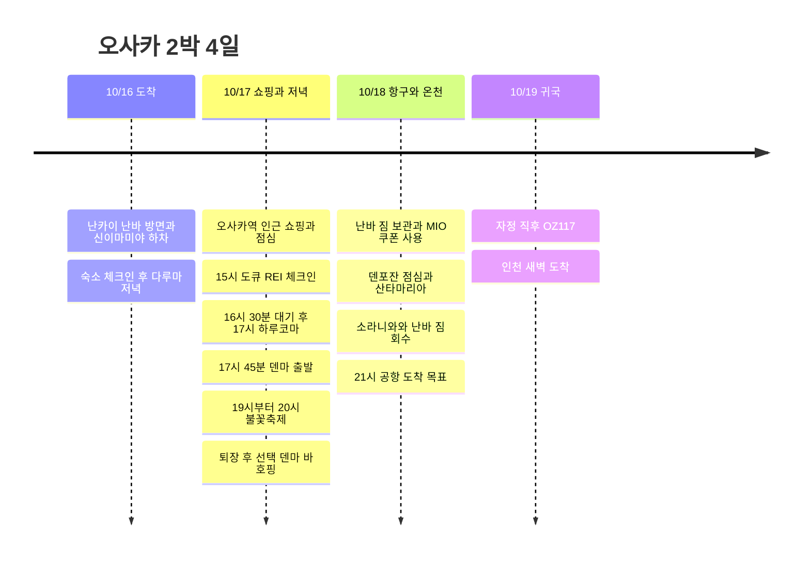

**첫날 다루마 → 17일 오사카역 쇼핑·17시 하루코마 → 19시 요도가와 불꽃축제 → 선택 덴마 호핑**으로 배치했다. 18일은 MIO 조이패스 쿠폰만 짧게 쓰고 항구·온천을 거쳐 공항으로 간다. 17일 쇼핑한 짐은 도큐 REI 객실에 놓고 나간다.

시각은 일본 현지 기준이다. **‘19시에 축제’는 현장 도착 목표**로 잡았다. 19시에 덴마에서 출발하면 시작을 놓칠 수 있다. 17시 식사와 축제를 모두 지키려면 하루코마에는 16:30경 도착하고 **17:45 출발**을 기준으로 조절한다. 축제 전 여러 바를 도는 일정은 시간상 어려워 호핑은 축제 후 선택으로 남겼다.

## 일정 요약

| 날짜 | 동선 | 유지할 시간 |
|---|---|---|
| 10/16 금 | 간사이 → 난카이 난바 방면·신이마미야 하차 → CHECK inn → **다루마** | 실제 도착시각에 맞춰 체크인 후 저녁 |
| 10/17 토 | 도큐 REI 짐 보관 → **오사카역 쇼핑** → 체크인 → **하루코마 저녁** → 불꽃축제 → 선택 덴마 호핑 | 16:30 식당 대기, 17시 식사, 17:45 이동, 19∼20시 축제 |
| 10/18 일 | 난바 짐 보관 → MIO 쿠폰 → 덴포잔 점심 → 산타마리아 → 소라니와 → 난바 → 공항 | 10:30 MIO, 13:30 선착장, 19:45 공항행 열차 목표 |
| 10/19 월 | OZ117 간사이 → 인천 | 공식 하계 시간표 00:15 출발·02:15 도착 |

## 일정 타임라인

## 10/16 금 · 체크인 후 다루마 저녁

간사이공항에서는 **난카이 난바 방면 열차를 타고 신이마미야에서 하차**한다. 숙소는 **CHECK inn Osaka Shinsekai, 1-9-5 Haginochaya** 기준이다. 난바까지 갔다가 숙소로 되돌아오는 구간을 줄인다. [난카이 공항 교통](https://www.howto-osaka.com/en/), [숙소 주소](https://www.hafh.com/en/properties/28089).

| 순서 | 배정할 시간 | 내용 |
|---|---|---|
| 공항 도착 후 | 입국·수하물 60∼90분 목표 | 실제 도착편과 입국 상황에 따라 변동 |
| 공항 → 신이마미야 → 호텔 | 열차 대기·도보 포함 70∼90분 목표 | 날짜별 난카이 운행 확인 |
| 숙소 체크인 | 20∼40분 | 짐 두고 외출 |
| 숙소 → 다루마 쓰텐카쿠점 | 도보 15∼20분 여유 | 첫날 저녁 고정 희망 장소 |
| 다루마 | 대기·식사 60∼90분 | 식사 후 쓰텐카쿠 주변 짧은 산책·숙소 복귀 |

다루마 쓰텐카쿠점은 **1-6-8 Ebisuhigashi**, 금요일 공식 **11:00∼22:30**, 주문 마감 **22:00**, 예약 불가다. **20시경까지 숙소에 도착해 체크인 후 방문**하는 것을 목표로 한다. [매장 공식 안내](https://www.kushikatu-daruma.com/location/tsutenkaku).

**출국편 시간만 추가 대조가 필요하다.** 기존 기록 KE737의 조회는 **22:40 간사이 도착**으로 첫날 다루마 영업시간과 맞지 않는다. 사용자가 지정한 첫날 방문을 기본에 반영했으나, 예약표가 정말 이 시간이라면 첫날 식사는 불가능해진다. 비용 약 14만 원만으로 더 이른 편이라고 추정하지 않았다. 실제 도착편 확인 뒤 첫날 시각을 채우고, 늦은 편이면 다루마 대체일을 다시 정한다. [기존 KE737 조회](https://www.trip.com/flights/status-ke737/).

## 10/17 토 · 오사카역 쇼핑, 17시 하루코마, 19시 불꽃축제

| 현지 시간 | 할 일 | 조절 기준 |
|---|---|---|
| 08:30∼09:30 | 아침·짐 정리·CHECK inn 체크아웃 | 전날 늦게 도착했으면 아침 간단히 |
| 09:30∼10:15 | 도부쓰엔마에 → 미도스지선 우메다 → 도큐 REI | 역·호텔 도보 포함 |
| 10:15∼10:45 | 호텔 짐 보관 → 오사카역 쪽 이동 | 큰 짐 없이 쇼핑 |
| 10:45∼12:30 | **오사카역 인근 쇼핑** | 역 주변 쇼핑몰에서 원하는 매장 먼저 |
| 12:30∼13:15 | 오사카역 인근 점심 | 저녁 스시를 위해 가볍게 |
| 13:15∼14:30 | **남은 쇼핑** | 당일 본 쇼핑은 여기서 완료 |
| 14:30∼15:00 | 도큐 REI 복귀·체크인 대기 | 구매품 정리 |
| 15:00∼16:00 | 체크인·짐 두기·객실 휴식 | 식사·축제 때 쇼핑백을 들고 다니지 않기 |
| 16:00∼16:30 | 호텔 → 하루코마 본점 | 도보와 길 찾기 여유 |
| 16:30∼17:00 | **하루코마 대기** | 17시 입장 보장 아님. 17:10까지 착석 어려우면 아래 대체안 |
| **17:00∼17:45** | **하루코마 저녁** | 축제 전 덴마 식사. 이날은 긴 추가 주문 대신 45분 목표 |
| **17:45∼18:45** | 덴마 → 지정 관람 구역 접근 | 아래 역 경로와 실제 게이트로 이동, 혼잡 시 더 걸림 |
| 18:45∼19:00 목표 | 게이트·자리 이동 | 입장 마감은 구매 티켓 기준, 늦은 입장이 가능한지 미리 확인 |
| **19:00∼20:00** | **요도가와 불꽃축제** | 19시에 출발하는 일정 아님 |
| 20:00∼22:00 | 질서 퇴장·우메다 방향 이동 | 역 대기와 퇴장 통제 때문에 도착시각 변동 큼 |
| 22:00∼23:00 선택 | 덴마역 인근 바 호핑 1∼2곳 | 덴마 도착이 가능할 때의 목표. 피곤하거나 퇴장이 늦으면 호텔로 바로 |
| 23:00∼23:30 목표 | 도큐 REI 복귀 | 영업 중인 바와 실제 귀가 경로 확인 |

[호텔 → 하루코마 도보](https://www.google.com/maps/dir/?api=1&origin=Osaka+Tokyu+REI+Hotel&destination=Harukoma+5-5-2+Tenjinbashi&travelmode=walking) · [하루코마 → 니시나카지마미나미가타](https://www.google.com/maps/dir/?api=1&origin=Harukoma+5-5-2+Tenjinbashi&destination=Nishinakajima-Minamigata+Station&travelmode=transit) · [덴마역 주변 바](https://www.google.com/maps/search/?api=1&query=bars+near+Temma+Station+Osaka).

하루코마는 **春駒 本店, 5-5-2 Tenjinbashi**, 공개 매장 안내상 **11:00∼21:30·화요일 휴무**다. 같은 이름의 우메다 식당과 혼동하지 않는다. 축제 후에는 마감과 겹칠 수 있어 스시는 반드시 축제 전에 배치했다. [본점 안내](https://www.hotpepper.jp/strJ000109465/). 호텔은 **15시 체크인·10시 체크아웃**, 체크인 전 짐 보관 가능 안내가 있다. [도큐 REI FAQ](https://www.tokyuhotels.co.jp/en/osaka-r/qa/index.html).

### 덴마에서 축제까지 · 촉박한 구간

기본 메트로 접근은 **덴진바시스지로쿠초메 → 다니마치선 히가시우메다 → 도보 환승 우메다 → 미도스지선 니시나카지마미나미가타 → 지정 게이트**다. 역간 도보 환승·혼잡까지 있어 **75분은 목표이며 보장 시간이 아니다.** 티켓이 주소역이나 다른 게이트를 지정하면 해당 접근로를 먼저 따른다. 한큐·JR 구간은 메트로 620엔권에 포함되지 않는다.

행사는 공식 **10/17 19:00∼20:00**, **우메다 측 강변은 일반 출입·관람 금지**다. 지도 기준점에 바로 가는 대신 티켓 구역과 입장 마감을 확인한다. 특히 무료 구역은 이 시간 도착으로 자리 확보를 기대하기 어려워 관람 가능 구역부터 정해야 한다. [행사 개요](https://www.yodohanabi.com/gaiyou.html), [관람 FAQ](https://www.yodohanabi.com/faq.html), [교통 규제](https://www.yodohanabi.com/kisei.html).

- **17시 식사 유지안:** 16:30 대기 → 17:00∼17:45 식사 → 바로 축제로 이동. 축제 전 바 방문은 생략한다.
- **여유를 늘리는 안:** 쇼핑을 30분 줄이고 하루코마를 **16:30∼17:15**로 당겨 **17:15 축제장 출발**. 게이트가 멀거나 입장 마감이 이르면 이 안을 쓴다.
- **17:10에도 입장이 어렵다면:** 하루코마 대기를 계속할지, 빠른 덴마 식사로 바꿔 축제 시작을 지킬지 선택한다. 대기·바 호핑·19시 입장을 모두 그대로 유지할 수는 없다.
- **축제 후 덴마 도착이 22:30을 넘으면:** 영업 중인 바 한 곳만 30∼45분 이용하거나 우메다에서 마무리한다. 호핑을 위해 퇴장 동선에 역행하지 않는다.

## 10/18 일 · MIO 쿠폰 → 항구 점심 → 크루즈 → 온천 → 공항

**본 쇼핑은 17일 오사카역에서 끝내고**, MIO는 사용자가 고른 조이패스 쿠폰 교환·사용만 30분 배정한다. 다루마는 첫날에 방문하므로 이날은 덴포잔에서 여유 있게 점심을 먹는다. 우메다 호텔 왕복을 줄이기 위해 짐은 아침에 난바로 옮긴다.

| 현지 시간 | 할 일 | 이동·대기 배치 |
|---|---|---|
| 08:00∼09:15 | 아침·짐 정리·체크아웃 | 호텔의 10시 마감보다 일찍 출발 |
| 09:15∼10:00 | 우메다 → 난바·짐 보관 | 공항행 난카이 쪽에서 회수하기 쉬운 보관소 |
| 10:00∼10:30 | 난바 → 덴노지 MIO | 개점에 맞춰 이동 |
| 10:30∼11:00 | **MIO 쿠폰 교환·사용** | 본 쇼핑을 추가하지 않고 필요한 물건만 |
| 11:00∼12:00 | 덴노지 → 혼마치 환승 → 오사카코 → 덴포잔 | 지하철·도보에 60분 여유 |
| 12:00∼13:00 | 덴포잔에서 점심·휴식 | 당일 대기 적은 식당 선택 |
| 13:00∼13:30 | 항구 산책·선착장 이동 | 비가 오면 실내에서 쉬고 바로 선착장 |
| 13:30∼14:00 | 산타마리아 표 교환·승선 대기 | 가이유칸 서쪽 선착장 |
| 14:00∼14:45 | **산타마리아 데이크루즈** | 실제 운항 확인, 14시대 승선 목표 |
| 14:45∼15:30 | 하선 → 오사카코 → 벤텐초 → 소라니와 | 하선·역 도보·온천 접수 포함 |
| 15:30∼17:45 | **소라니와 온천·휴식** | 착탈의 포함 2시간 15분 |
| 17:45∼18:30 | 벤텐초 → 혼마치 환승 → 난바 | 메트로권 경로 |
| 18:30∼19:15 | 난바 저녁·짐 회수 | 보관소 마감 확인, 대기 긴 식당 피하기 |
| 19:15∼19:45 | 난카이 승차권·승강장 이동 | 큰 역 내 이동 여유 |
| 19:45∼21:00 | 공항행 열차·터미널 이동 | 출발일 실제 열차 선택, 21시 공항 목표 |
| 21:00∼00:15 | 수속·출국·탑승 | 10/19 자정 직후 편 |

[MIO → 덴포잔](https://www.google.com/maps/dir/?api=1&origin=Tennoji+MIO&destination=Tempozan+Marketplace&travelmode=transit) · [온천 → 난바](https://www.google.com/maps/dir/?api=1&origin=Solaniwa+Onsen&destination=Namba+Station&travelmode=transit).

MIO 쇼핑층 공식 운영은 **10:30∼20:30**다. [MIO 안내](https://www.tennoji-mio.co.jp/access). 산타마리아는 데이크루즈 약 **45분**, 오사카코역에서 선착장까지 도보 약 10분이며 **14시대는 목표이지 10/18 출항 확정은 아니다**. [운영사](https://suijo-bus.osaka/cruiselist/santamaria/), [운항 캘린더](https://suijo-bus.osaka/wps/wp-content/uploads/2026/09/0901_time-santamaria.pdf). 소라니와는 벤텐초 Osaka Bay Tower, 통상 **11∼23시·마지막 입장 22시**다. [온천 FAQ](https://solaniwa.com/en-us/faq/).

## 조이패스·메트로권 사용표

| 이용일 | 사용할 곳 | 적용 조건 |
|---|---|---|
| 10/18 10:30 | 덴노지 MIO | 조이패스 1,500엔 쿠폰 안내. 교환 창구·대상 점포는 구매 상품 기준 |
| 10/18 14시대 | 산타마리아 | 약 45분 데이크루즈. 트와일라이트와 구분 |
| 10/18 15:30 | 소라니와 온천 | 날짜 등급 차액·입욕세 별도 확인 |
| 10/17·18 | 오사카 메트로 주말 1일권 | 하루 620엔, 양일 이용하면 1,240엔. 난카이·JR·한큐 별도 |

조이패스는 **Have Fun in Kansai Pass 3시설형**을 기준으로 세 곳을 배치했다. 첫 시설 이용일부터 7일·각 시설 1회라는 판매 조건을 확인했다. MIO 쿠폰과 산타마리아는 포함 안내가 있으나 **현재 공식 시설 목록 접속이 되지 않아 10월 세 시설 동시 적용은 아직 확인하지 못했다.** 세 곳의 방문 동선은 그대로 이용할 수 있지만, 패스 구매 전 해당 상품의 최신 목록으로 대조해야 한다. [조이패스 판매 조건](https://www.kkday.com/ko/product/131268-kansai-1-week-free-pass), [JR 서일본 MIO 소개](https://www.westjr.co.jp/global/kr/ticket/cp/west_japan/pdf/e-brochures_kr.pdf), [산타마리아 포함 안내](https://experiences.travel.rakuten.com/experiences/41020).

소라니와는 2026년 판매 조건상 C·D·E 날짜에 각각 770·990·1,320엔 차액과 입욕세 150엔이 안내된다. **10/18의 날짜 등급은 아직 확인되지 않았다.** 산타마리아 일반 데이크루즈는 10월부터 성인 2,000엔으로 안내되어 있다. 위 비용은 결제 내역에 넣지 않았다. [온천 패스 조건](https://www.kkday.com/ko/product/131268-kansai-1-week-free-pass), [크루즈 요금](https://suijo-bus.osaka/cruiselist/santamaria/).

17일은 호텔 이동·축제 접근, 18일은 여러 구간에 메트로권을 쓴다. 17일 축제 접근을 한큐로 바꾸면 메트로권의 절약 폭은 줄어든다. [620엔권 공식 범위](https://subway-tr.osakametro.co.jp/guide/page/enjoy-eco.php).

## 시간 조절 범위

| 구간 | 조절 가능한 범위 | 유지할 경계 |
|---|---|---|
| 첫날 다루마 | 대기·식사 60∼90분 | 실제 항공 도착과 22시 주문 마감을 먼저 대조 |
| 17일 오사카역 쇼핑 | 점심 제외 약 2시간 30분∼3시간 | 축제 이동 여유가 필요하면 30분 줄임 |
| 17일 하루코마 | 16:30 대기·17시 식사 목표, 식사 30∼45분 | **17:45 출발**. 이른 안은 16:30 식사·17:15 출발 |
| 17일 축제 후 덴마 | 0∼60분, 1∼2곳 | 퇴장·역 혼잡이 심하면 생략 또는 한 곳만 |
| 18일 MIO | 20∼30분 | 본 쇼핑 추가 대신 쿠폰 사용만 |
| 18일 항구 점심·산책 | 60∼90분 | 늦으면 산책부터 생략, 13:30 선착장 목표 |
| 18일 크루즈 | 14시대 기본, 운항·자리 확인 시 15시대 | 15시편이면 온천 16:30 시작, 16시 이후까지 기다리지 않기 |
| 18일 온천 | 75∼135분 | **17:45 출발** 유지. 결항이면 온천으로 바로 이동 |
| 18일 난바 저녁 | 30∼45분 | 늦으면 포장·공항 식사, **19:45 공항행 목표** 유지 |

소라니와가 75분 미만으로 남으면 짧은 목욕만 할지 입장을 생략할지 선택한다. 공항 이동을 줄여 패스를 억지로 모두 쓰지는 않는다. 난바 보관함이 만석이면 주변 보관소의 **19시 전후 회수 가능 여부**부터 확인한다.

## 10/19 월 · 자정 귀국과 비용

OZ117 공식 하계 시간표는 **00:15 간사이 → 02:15 인천**이다. **18일 일요일 밤 공항 이동**, 숙소는 **16·17일 2박**, 달력상 **4일**이다. 예약표 시각이 다르면 출발 약 3시간 전 공항 도착과 난바에서 터미널까지 75분을 기준으로 다시 계산한다. [아시아나 공식 시간표](https://flyasiana.com/C/JP/KO/customer/notice/detail?id=CM202603060002528429).

| 항목 | 기록된 금액 |
|---|---:|
| 출국 항공 | **약 140,000원** |
| OZ117 귀국 항공 | 190,000원 |
| 10/16 CHECK inn 오사카 신세카이 1박 | 23,000원 |
| 10/17 오사카 도큐 REI 1박 | 110,000원 |
| 원화 부분 합계 (출국 추정액 포함) | **약 463,000원** |
| 10/17 메트로권 이용 예정 | **620엔** |

출국 항공료는 사용자 제공 ‘14만 원 정도’를 반영한 추정액이다. 조이패스·난카이·18일 메트로권·식비·바·축제 좌석·보관료·온천 추가금은 별도다. 남은 확인 항목은 **실제 출국편·도착시각, 축제 구역·입장 마감·게이트, 구매할 조이패스 적용 시설, 공항행 열차·인천 새벽 귀가 교통**이다. 일정 갱신일 2026-09-07.
