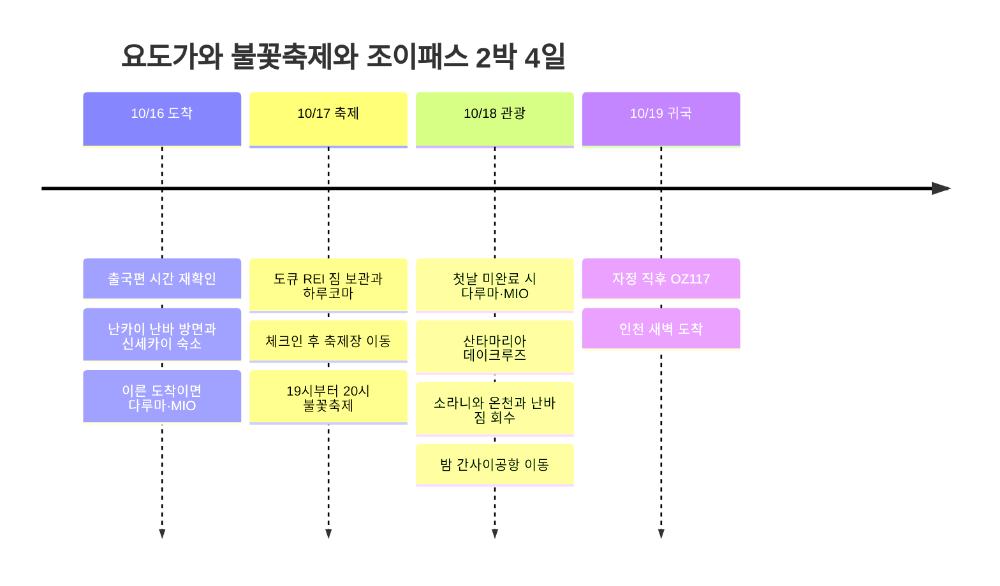

# 오사카 요도가와 불꽃축제 · 조이패스 2박 4일 1차 계획

**17일은 하루코마와 불꽃축제, 18일은 조이패스 관광 후 공항 이동**을 중심으로 잡는다. 첫날 희망 동선은 난카이 난바 방면 → 신세카이 숙소 체크인 → 다루마 쓰텐카쿠점 → 시간이 되면 덴노지 MIO다.

조사 기준일은 2026-09-05다. 기존 출국편 KE737의 조회 시각과 첫날 식사가 충돌하여, 늦은 도착 기준 기본안과 이른 항공편으로 변경했을 때의 희망안을 함께 남긴다. 지도는 권역 기준점이며 정확한 숙소 입구·식당·관람 게이트는 링크와 예약표로 대조한다.

## 확정 정보와 비용

| 항목 | 일정 | 사용자 제공 금액 |
|------|------|----------------:|
| 출국 | 기존 기록 10/16 KE737, 실제 편명·시간 재확인 | 미정 |
| 귀국 | 10/19 OZ117 · 간사이 → 인천 | 190,000원 |
| 숙소 1 | 10/16~17 CHECK inn 오사카 신세카이 | 23,000원 |
| 숙소 2 | 10/17~18 오사카 도큐 REI 호텔 | 110,000원 |
| 원화 확인 합계 | 귀국 항공 + 숙박 2박 | **323,000원** |
| 교통권 | 10/17 메트로 주말 1일권 이용 예정 | **620엔** |

출국 항공료·조이패스·난카이·식비·축제 좌석·보관함·현장 추가금은 별도다. 620엔은 이용 예정 가격이지 결제 완료 기록이 아니다. 18일에도 별도 620엔권을 추천하며 양일 모두 구매하면 1인 1,240엔이다. 원화와 엔화는 환율 가정 없이 따로 관리한다.

**OZ117 공식 하계 시간표는 00:15 간사이 출발 → 02:15 인천 도착이다.** 10/19편이라면 **10/18 일요일 밤 공항 이동**이며, 숙소는 16일·17일의 **2박**, 달력상 **4일**이다. 18일 추가 숙박은 기본안에서 필요하지 않다. [아시아나항공 공식 하계 시간표](https://flyasiana.com/C/JP/KO/customer/notice/detail?id=CM202603060002528429). 실제 예약표로 최종 확인하며 미확정 시간은 구조화된 항공 시각에 넣지 않았다.

## 출국편과 첫날 식사 확인

기존 KE737의 최근 조회는 **인천 20:50 → 간사이 22:40**다. 다루마 쓰텐카쿠점은 금요일 **22:30 폐점·22:00 주문 마감**이므로, 이 시간표가 예약편에도 적용된다면 첫날 체크인 후 식사는 불가능하다. [KE737 최근 조회](https://www.trip.com/flights/status-ke737/), [다루마 공식 안내](https://www.kushikatu-daruma.com/location/tsutenkaku).

출국편 변경 여부는 확인 중이다. **이른 항공편으로 바뀌었다면 첫날 다루마·MIO**, **KE737 그대로라면 18일 다루마·MIO**로 배치한다. 희망 식당을 삭제하거나 낮 도착편을 임의로 확정하지 않는다.

## 일정 요약

아래는 KE737 야간 도착과 OZ117 자정 귀국을 가정한 목표 시간이며 예약 시각이 아니다.

| 날짜 | 오전·낮 | 오후 | 저녁·밤 |
|------|---------|------|---------|
| 10/16 금 | 출국 준비 | 항공 이동 준비 | 간사이 도착 → 난카이 연결 확인 또는 대체 이동 → 신세카이 숙소 늦은 체크인 |
| 10/17 토 | 09시대 체크아웃 → 도큐 REI 짐 보관 → 11시대 하루코마 | 15시 체크인·휴식 → 16시 전후 축제장으로 출발 | 19~20시 불꽃축제 → 질서 퇴장·우메다 숙박 |
| 10/18 일 | 10시 체크아웃 → 난바 짐 보관 → 11시 다루마 → 12시대 MIO | 14시대 산타마리아 → 15:30~18시 소라니와 | 난바 짐 회수·저녁 → 20시 전후 공항행 → 21~21:30 공항 도착 목표 |
| 10/19 월 | 00:15 OZ117 출발·02:15 인천 도착 가정 | 귀가·휴식 | — |

18일 다루마 대기가 길면 식사·쇼핑·온천 시간을 줄여 공항 출발 시간을 지킨다. 첫날 다루마·MIO를 완료했다면 18일 오전은 늦은 아침과 항구 산책으로 비운다.

## 일정 타임라인

## 10/16 · 난카이와 신세카이, 첫날 희망안

저녁 전에 시내 도착이 가능하다면 간사이공항에서 난카이 **난바 방면** 열차를 탄다. 신세카이 숙소에는 **신이마미야 하차 후 도보**가 짧다. 난바역까지 가는 것이 목적이라면 난바에서 메트로 미도스지선 도부쓰엔마에로 돌아올 수 있지만 역주행이 생긴다. 공항급행·라피트 중 선택한 열차의 정차역과 표 종류를 확인한다. [난카이 공항 교통 안내](https://www.howto-osaka.com/en/).

숙소는 **CHECK inn Osaka Shinsekai · 1-9-5 Haginochaya, Nishinari-ku**다. 비슷한 이름의 CHECK inn Osaka Shin-Imamiya와 다른 숙소이므로 주소를 대조한다. [숙소 주소·동명 숙소 구분](https://www.hafh.com/en/properties/28089).

체크인 → **다루마 쓰텐카쿠점(1-6-8 Ebisuhigashi)** 식사 → 쓰텐카쿠 주변 산책 → 여유가 있으면 덴노지 MIO 쿠폰 교환·사용으로 연결한다. 다루마는 평일 11~22:30, 주말·공휴일 10:30~22:30, 주문 마감 30분 전이며 예약은 받지 않는다. [공식 매장 안내](https://www.kushikatu-daruma.com/location/tsutenkaku). MIO는 상점보다 교환 창구가 먼저 닫을 수 있어 늦으면 18일로 넘긴다.

**KE737 야간 도착이면:** 첫날은 입국·숙소 이동에만 쓴다. 입국 소요 시간에 따라 난카이 막차를 놓칠 수 있어 [난카이 공식 시간표](https://www.howto-osaka.com/en/)와 [간사이공항 교통 안내](https://www.kansai-airport.or.jp/en/access)를 확인하고 대체 교통을 준비한다. 자정 이후 도착 가능 여부와 체크인 절차는 호텔에 사전 확인한다. 식사는 출국 전 또는 공항에서 해결한다.

## 10/17 · 하루코마와 요도가와 불꽃축제

짐을 챙겨 도부쓰엔마에 → 미도스지선 우메다로 이동해 **오사카 도큐 REI 호텔에 먼저 짐을 맡긴다.** 호텔은 우메다·오사카역에서 도보 약 10분, **2-1 Doyama-cho**에 있다. 공식 FAQ는 체크인 전 짐 보관, **15시 체크인·10시 체크아웃**을 안내한다. [호텔 위치](https://www.tokyuhotels.co.jp/en/osaka-r/), [호텔 FAQ](https://www.tokyuhotels.co.jp/en/osaka-r/qa/index.html).

하루코마는 **春駒 本店 · 5-5-2 Tenjinbashi** 기준이다. 호텔에서 덴진바시스지 상점가까지 걷거나 히가시우메다 → 다니마치선 덴진바시스지로쿠초메를 이용한다. 11시대 점심을 목표로 대기·식사에 1~2시간을 배정한다. 본점·지점과 최신 임시휴무를 구분해 확인한다. [하루코마 본점 안내](https://www.hotpepper.jp/strJ000109465/). 점심 뒤 우메다로 돌아와 체크인하고 쉰다.

**제38회 나니와 요도가와 불꽃축제는 10/17 토요일 19:00~20:00 예정**이며 우천 진행·악천후 취소다. 기존 초안의 19:30은 최신 공식 안내로 정정했다. **우메다 쪽 강변은 공사로 관람·일반 출입 금지**이므로 호텔에서 가까운 강변으로 바로 걸어가는 동선은 사용하지 않는다. [주최 측 행사 개요](https://www.yodohanabi.com/gaiyou.html).

메트로권을 활용하는 기본 접근은 **우메다 → 미도스지선 니시나카지마미나미가타 → 지정 관람 구역까지 도보**다. 16시 전후 호텔 출발을 목표로 하되 무료 자리 확보가 보장되는 시각은 아니다. 유료 좌석을 고르면 **티켓의 지정 게이트·권장 역이 우선**이며 주소역 방면 한큐가 적합할 수 있다. 한큐 요금은 메트로권과 별도다. [주최 측 FAQ](https://www.yodohanabi.com/faq.html).

퇴장과 호텔 복귀에는 1~2시간 이상의 여유를 둔다. 현장 통제·막차 공지에 따르고, 무료 구역이 닫히면 통제 구역이나 다리 위에서 임의로 관람하지 않는다. [공식 교통 규제](https://www.yodohanabi.com/kisei.html).

## 10/18 · 조이패스와 자정 귀국 준비

**짐은 난바에 두고 관광하는 동선**을 추천한다. 10시 체크아웃 → 우메다에서 미도스지선 난바 → 역 보관함 또는 예약 가능한 보관소를 사용한다. 빈 보관함이 없을 때의 대안과 짐 회수 마감 시각을 확인한다. 우메다 호텔에 맡기면 온천 후 우메다까지 왕복 시간이 더 든다.

첫날 못 갔다면 난바 → 도부쓰엔마에 → 11시대 다루마 점심 → 덴노지 MIO로 이동해 12시대 쿠폰을 교환하고 쇼핑한다. 첫날 두 곳을 끝냈으면 바로 항구로 이동해 점심을 먹는다.

덴노지 → 미도스지선 혼마치 환승 → 주오선 **오사카코** → 가이유칸 서쪽 선착장으로 간다. 역부터 도보 약 10분, **산타마리아 데이크루즈는 약 45분**이다. 14시대 승선을 목표로 하되 10/18 운항편·정원·조이패스 교환·예약 필요 여부를 확인한 뒤 확정한다. 트와일라이트 상품과 구분한다. [운영사 안내](https://suijo-bus.osaka/cruiselist/santamaria/).

하선 후 오사카코 → 주오선 **벤텐초**에서 내려 소라니와 온천에 간다. 15:30~18시 정도 쉬고 나오는 구성이다. 통상 **11~23시, 마지막 입장 22시**, 월 1회 휴관이므로 10/18 운영을 확인한다. [온천 공식 FAQ](https://solaniwa.com/en-us/faq/).

벤텐초 → 혼마치 환승 → 난바로 돌아와 짐을 찾고 저녁을 먹는다. **20시 전후 난카이 공항행, 21~21:30 공항 도착**을 목표로 한다. 실제 열차·항공사 수속 시간에 맞춰 조정하고 막차를 목표로 삼지 않는다. 19일 00:15 출발 가정으로 인천 도착은 02:15이므로 한국 새벽 귀가 교통도 준비한다.

## 조이패스 3곳 사용 조건

간사이 조이패스 **Have Fun in Kansai Pass 3시설형**으로 세 항목을 쓰는 계획이다. 메트로 교통권과 별개이며, 구입한 상품의 시설 목록·유효기간·교환 조건이 최종 기준이다.

| 순서 | 시설·사용일 | 확인 사항 |
|------|-------------|-----------|
| 1 | 덴노지 MIO · 10/16 또는 18 | 관내 쿠폰 1,500엔 안내. 교환 창구·시간·재고·대상 점포·거스름돈 여부 확인 |
| 2 | 산타마리아 · 10/18 | 약 45분 데이크루즈. 구매 상품의 최신 포함 여부·10월 요금 변경 반영·편별 교환 확인 |
| 3 | 소라니와 온천 · 10/18 | 날짜 등급 차액·입욕세·휴관일 확인, 식사·마사지·암반욕은 별도 조건 |

판매 안내상 첫 시설 이용일부터 7일, 각 시설은 한 번씩 이용한다. MIO 쿠폰은 [JR 서일본 소개 자료](https://www.westjr.co.jp/global/kr/ticket/cp/west_japan/pdf/e-brochures_kr.pdf)에도 있으나 오래된 자료여서 최신 교환 조건은 재확인한다. [조이패스 판매 안내](https://www.kkday.com/ko/product/131268-kansai-1-week-free-pass).

소라니와는 2026년 판매 조건에 **A~E 등급 입장, C·D·E 차액과 별도 입욕세 150엔**이 안내된다. 표시된 차액은 C 770엔, D 990엔, E 1,320엔이지만 **10/18 등급과 실제 추가금은 미확정**이다. 패스 하나로 현장 결제가 전혀 없다고 계산하지 않는다. [소라니와 상품 이용 조건](https://www.kkday.com/ko/product/131268-kansai-1-week-free-pass).

산타마리아의 패스 포함 이력은 [판매 안내](https://experiences.travel.rakuten.com/experiences/41020)에서 확인되지만 해당 상품은 현재 예약 불가이고 과거 가격이 남아 있다. 운영사 일반 데이크루즈는 **2026년 10월부터 성인 2,000엔**으로 안내된다. [운영사 요금](https://suijo-bus.osaka/cruiselist/santamaria/). 공식 패스 시설 목록은 이번 조사에서 접속하지 못해 **세 시설의 10월 동시 적용을 확정하지 않았다.** 구입 전 최신 목록에서 확인하고, 적용이 빠졌으면 해당 시설 개별 결제와 패스 구성을 비교한다.

## 메트로 주말 620엔권

**10/17 토·10/18 일 모두 성인 620엔 대상**이다. 1일권이므로 날짜별로 따로 필요하다. 메트로·시티버스의 지정 범위를 이용하며 난카이·JR·한큐는 별도다. 유메시마역 등 제외 구간은 공식 조건을 따른다. [Osaka Metro 공식 안내](https://subway-tr.osakametro.co.jp/guide/page/enjoy-eco.php).

17일은 호텔 이동·하루코마·축제장 접근에 사용한다. 하루코마까지 걷고 축제 왕복에 한큐를 선택하면 절약 효과는 줄어든다. 18일은 난바·덴노지·오사카코·벤텐초를 오가므로 두 번째 1일권을 추천한다.

## 다음에 확정할 내용

- 실제 출국편과 도착 시각. KE737라면 첫날 다루마·MIO 날짜 조정과 늦은 체크인.
- OZ117 예약 시각, 난카이 연결·대체 이동, 인천 새벽 귀가 교통.
- 불꽃축제 무료/유료 구역과 입장 게이트·접근 역.
- 조이패스 구매 상품·금액과 세 시설 최신 적용, 소라니와 날짜별 추가금.
- 18일 난바 짐 보관·회수 장소와 숙소 현장 세금 포함 여부.
