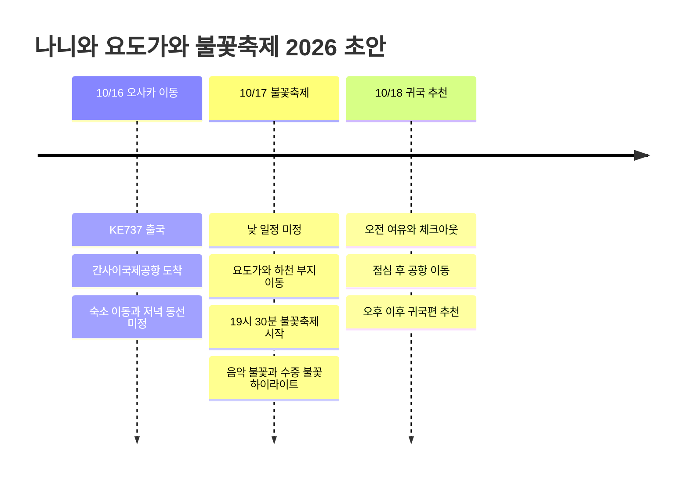

# 나니와 요도가와 불꽃축제 2026 오사카 초안

10월 16일 KE737로 오사카에 들어가고, 10월 17일 나니와 요도가와 불꽃축제를 보는 작업중 초안. 기본형은 2박 3일로 잡고, 10월 18일 오후 이후 귀국하는 쪽이 가장 무난하다. 숙소, 귀국편, 유료 관람석, 낮 일정은 아직 비워둔다.

## 확정/미정 메모

| 항목 | 상태 | 메모 |
|------|------|------|
| 출국편 | 확정 | 2026년 10월 16일 KE737 |
| 핵심 행사 | 확정 | 제38회 나니와 요도가와 불꽃축제, 2026년 10월 17일 |
| 행사 시간 | 확인 | 19시 30분 시작, 우천 결행·악천후 중지 안내 |
| 행사 위치 | 확인 | 신미도스지·신요도가와오하시에서 국도 2호선·요도가와오하시까지의 요도가와 하천 부지 |
| 관람 비용 | 확인 | 무료 관람 가능, 유료 좌석은 좌석별 금액 상이 |
| 숙소 | 초안 | 우메다 또는 니시나카지마미나미가타 쪽 우선. 축제장 접근과 다음날 공항 이동을 같이 고려 |
| 귀국편 | 초안 | 10/18 오후 이후 귀국 추천. 축제 다음날 오전은 피로와 이동 여유를 고려해 비워두기 |

## 기본 셋업 초안

| 항목 | 추천안 | 이유 |
|------|--------|------|
| 전체 박수 | 2박 3일 | 10/17 밤 행사 후 바로 귀국하지 않고 다음날 여유 있게 정리 가능 |
| 숙소 권역 | 우메다, 주소, 니시나카지마미나미가타 | 요도가와 접근과 오사카 시내 식사 동선을 같이 잡기 좋음 |
| 첫날 | 체크인 후 우메다나 난바 저녁 | 항공 이동일이라 무리하지 않고 다음날 축제 체력 확보 |
| 둘째 날 낮 | 늦은 브런치, 카페, 쇼핑 정도 | 밤 행사 중심이라 낮에 체력을 아끼는 쪽 |
| 둘째 날 저녁 | 16시 30분~17시쯤 행사장 방향 이동 | 19시 30분 시작 전 자리와 동선을 확보 |
| 귀국일 | 체크아웃, 점심, 공항 이동, 오후 이후 귀국 | 불꽃축제 다음날 오전을 너무 빡빡하게 만들지 않기 |

## 일정 요약

| 날짜 | 베이스 | 시간 배분 | 주요 일정 | 포인트 |
|------|--------|----------|----------|--------|
| 10/16 | 오사카 | 항공 이동, 체크인, 저녁 | KE737 출국, 간사이국제공항 도착, 숙소 이동, 첫날 저녁 | 무리하지 않고 축제 전날 세팅 |
| 10/17 | 오사카 | 낮 여유, 저녁 행사 | 늦은 브런치, 카페나 쇼핑, 요도가와 하천 부지 이동, 19시 30분 불꽃축제 | 음악과 싱크로되는 불꽃, 수중 불꽃 하이라이트 |
| 10/18 | 오사카, 공항 | 체크아웃, 점심, 공항 이동 | 오전 여유, 점심, 간사이국제공항 이동, 오후 이후 귀국 | 축제 다음날 회복 후 귀국 |

## 일정 타임라인

## 행사 메모

Osaka Metro NiNE 안내 기준으로 나니와 요도가와 불꽃축제 2026은 2026년 10월 17일 하루 열리고, 시작 시간은 19시 30분이다. 행사장은 요도가와 하천 부지이고, 미도스지선 니시나카지마미나미가타역 방면 접근이 안내되어 있다.

이 초안의 핵심은 전날 오사카에 들어가서 당일 체력 소모를 줄이고, 10/17 저녁에는 불꽃축제 하나에 집중하는 것이다. 10/18은 오전부터 공항으로 달리는 일정 대신, 체크아웃 후 점심을 먹고 오후 이후 귀국편으로 돌아오는 정도가 안정적이다. 유료 좌석을 잡을지, 무료 관람 구역에서 볼지는 다음 업데이트에서 결정한다.

## 다음에 채울 내용

- KE737 예약 기준 출도착 공항과 시간
- 숙소 후보와 체크인 위치
- 10/18 귀국편 후보와 실제 시간
- 유료 관람석 구매 여부
- 10/17 낮 일정과 저녁 식사 위치
- 축제 종료 후 혼잡 회피 동선

## 참고 링크

- [나니와 요도가와 불꽃축제 2026 - Osaka Metro NiNE](https://metronine.osaka/ko/event/yodogawa-fireworks/)
- [나니와 요도가와 불꽃축제 공식 웹사이트](https://www.yodohanabi.com/)
