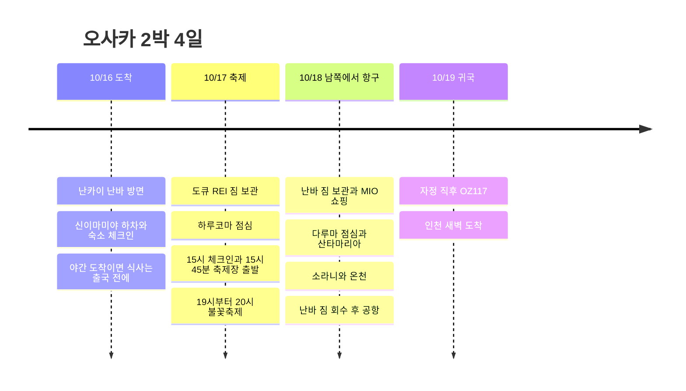

**17일은 우메다·덴마·불꽃축제, 18일은 남쪽 쇼핑·식사에서 항구·온천을 거쳐 공항**으로 움직인다. 숙소는 16일 CHECK inn 오사카 신세카이, 17일 오사카 도큐 REI다. 귀국 OZ117이 19일 자정 직후이므로 18일 밤에는 호텔이 아닌 공항으로 간다.

기존 출국 기록 **KE737의 조회 시간은 간사이 22:40 도착**이다. 이 편을 유지하면 첫날 다루마 영업시간에 맞출 수 없어 아래 기본 시간표는 **18일 점심 다루마**로 배치했다. 출국편이 더 이른 편이라면 첫날 체크인 후 다루마를 이용하고 18일 점심 구간만 비운다. 실제 출국편 답변 전까지 이 충돌을 임의로 확정하지 않는다. [KE737 조회](https://www.trip.com/flights/status-ke737/), [다루마 공식 시간](https://www.kushikatu-daruma.com/location/tsutenkaku).

시각은 일본 현지 기준이며, 식사·차량·체험의 시간표는 이동 여유를 포함한 목표다. 항공권을 제외한 좌석·패스·식당이 예약 완료되었다는 뜻은 아니다.

## 일정 요약

| 날짜 | 동선 | 고정할 시간 |
|---|---|---|
| 10/16 금 | 간사이 → 난카이 난바 방면·신이마미야 하차 → CHECK inn 신세카이 | 야간 도착이면 숙소 이동만. 이른 도착이면 체크인 후 다루마 |
| 10/17 토 | 신세카이 → 도큐 REI 짐 보관 → 하루코마 → 체크인 → 불꽃축제 → 호텔 | 10:45 하루코마 도착, 15:00 체크인, 15:45 축제장 출발 |
| 10/18 일 | 난바 짐 보관 → MIO → 다루마 → 산타마리아 → 소라니와 → 난바 → 공항 | 10:30 MIO, 13:30 선착장, 19:45 공항행 열차 목표 |
| 10/19 월 | OZ117 간사이 → 인천 | 공식 하계 시간표 00:15 출발·02:15 도착 |

## 일정 타임라인

## 10/16 금 · 공항에서 신세카이 숙소까지

간사이공항에서는 **난카이 난바 방면 열차를 타되 신이마미야에서 하차**한다. 난바까지 갔다가 숙소로 되돌아오는 구간을 없앴다. 숙소는 **CHECK inn Osaka Shinsekai, 1-9-5 Haginochaya** 기준이며, 동명에 가까운 CHECK inn Osaka Shin-Imamiya와 혼동하지 않는다. [난카이 공항 교통](https://www.howto-osaka.com/en/), [숙소 주소](https://www.hafh.com/en/properties/28089).

| 도착 조건 | 실제 움직일 순서 |
|---|---|
| KE737·22:40 도착 기준 | 입국·수하물 → 운행 중인 공항 교통 확인 → 신세카이 숙소 체크인. 저녁은 출국 전에 먹기 |
| 일찍 도착해 숙소에 20시 이전 도착 가능 | 체크인·짐 풀기 30분 → 다루마 쓰텐카쿠점 이동·대기·식사 → 주변 산책 |

다루마 쓰텐카쿠점은 **1-6-8 Ebisuhigashi**, 금요일 **11:00∼22:30**, 주문 마감은 22:00이고 예약을 받지 않는다. 숙소에서 도보 이동과 대기까지 배정해야 하므로 폐점 직전 방문은 기본 일정으로 잡지 않는다. [매장 공식 안내](https://www.kushikatu-daruma.com/location/tsutenkaku).

22:40 도착편은 입국 지연에 따라 난카이 막차를 놓칠 수 있다. **늦은 체크인 가능 여부·실제 도착일 공항 교통은 예약표와 호텔 안내로 반드시 맞춘다.** 막차가 끝났으면 [간사이공항 공식 심야 교통](https://www.kansai-airport.or.jp/en/access)을 확인하고, 운행하는 교통이 없으면 택시 등 별도 이동비가 필요하다. 존재하지 않는 심야 열차를 시간표에 넣지 않았다.

## 10/17 토 · 하루코마 점심, 충분히 쉬고 불꽃축제

| 현지 시간 | 할 일 | 이동·대기 배치 |
|---|---|---|
| 08:30∼09:15 | 아침·짐 정리 | 전날 늦은 도착을 고려해 간단히 먹기 |
| 09:15∼09:30 | CHECK inn 체크아웃 | 짐을 가지고 우메다로 이동 |
| 09:30∼10:15 | 도부쓰엔마에 → 미도스지선 우메다 → 도큐 REI | 역까지·호텔까지 도보 포함 45분 |
| 10:15∼10:30 | 도큐 REI 짐 보관 | 체크인은 오후 15시 |
| 10:30∼10:45 | 하루코마 본점으로 이동 | 도보 이동 목표. 짐은 호텔에 둠 |
| 10:45∼12:30 | 하루코마 줄 서기·점심 | 개점 전 대기 포함 1시간 45분 배정 |
| 12:30∼13:15 | 덴진바시스지 상점가 산책 | 다른 맛집 줄을 추가하지 않기 |
| 13:15∼14:30 | 우메다로 복귀·카페 휴식 | 축제 전 휴식과 간단한 저녁거리 구입 |
| 14:30∼15:00 | 호텔 복귀·체크인 대기 | 멀리 떨어진 관광지 추가하지 않기 |
| 15:00∼15:45 | 체크인·객실 휴식·화장실 | 현장에는 필요한 소지품만 가져가기 |
| 15:45∼17:15 | 호텔 → 우메다 → 니시나카지마미나미가타 → 지정 관람 구역 | 역 혼잡·도보·게이트 대기에 90분 |
| 17:15∼18:30 | 입장·자리 이동·일찍 저녁 | 좌석·무료 구역은 사전 확인한 곳 이용 |
| 19:00∼20:00 | 요도가와 불꽃축제 | 주최 측 공지 기준 |
| 20:00∼22:00 | 질서 퇴장·우메다 호텔 복귀 | 퇴장 통제와 역 대기 포함 최대 2시간 배정 |

[도큐 REI → 하루코마](https://www.google.com/maps/dir/?api=1&origin=Osaka+Tokyu+REI+Hotel&destination=Harukoma+5-5-2+Tenjinbashi&travelmode=walking) · [호텔 → 접근 역](https://www.google.com/maps/dir/?api=1&origin=Osaka+Tokyu+REI+Hotel&destination=Nishinakajima-Minamigata+Station&travelmode=transit).

하루코마는 **春駒 本店, 5-5-2 Tenjinbashi**다. 대기가 밀리면 상점가 산책·카페 시간을 줄이고 **15시 호텔 체크인은 유지**한다. 지도상 가까운 지점이더라도 본점과 지점을 구분한다. [하루코마 본점](https://www.hotpepper.jp/strJ000109465/). 도큐 REI는 체크인 전 짐 보관을 안내하며, **15시 체크인·10시 체크아웃**이다. [호텔 FAQ](https://www.tokyuhotels.co.jp/en/osaka-r/qa/index.html).

**축제는 10/17 19:00∼20:00이며 우메다 쪽 강변은 일반 출입·관람 금지**다. 미도스지선 니시나카지마미나미가타를 기본 접근 역으로 쓰되, 티켓 지정 게이트가 주소역 등 다른 역을 안내하면 그 경로를 따른다. 한큐 이용분은 메트로 620엔권에 포함되지 않는다. 17:15 도착이 무료 관람 자리 확보를 보장하지 않으므로 관람 구역·티켓을 정한 뒤 최종 접근을 맞춘다. [공식 행사 개요](https://www.yodohanabi.com/gaiyou.html), [관람 FAQ](https://www.yodohanabi.com/faq.html), [교통 규제](https://www.yodohanabi.com/kisei.html).

## 10/18 일 · MIO → 다루마 → 크루즈 → 온천 → 공항

**09:15에 체크아웃하고 짐은 난바에 둔다.** 우메다 호텔에 맡기고 저녁에 다시 올라가는 왕복을 없앴다. MIO 개점에 먼저 맞춘 뒤 다루마로 북서쪽으로 이동하면 식사 후 항구 방향으로 이어가기 좋다.

| 현지 시간 | 할 일 | 이동·대기 배치 |
|---|---|---|
| 08:00∼09:15 | 아침·짐 정리·체크아웃 | 호텔의 10시 마감보다 일찍 출발 |
| 09:15∼10:00 | 우메다 → 난바·짐 보관 | 미도스지선, 공항행 난카이 쪽으로 회수하기 쉬운 보관소 |
| 10:00∼10:30 | 난바 → 덴노지 MIO | 개점까지 이동·커피 여유 |
| 10:30∼11:15 | MIO 쿠폰 교환·쇼핑 | 목표 45분. 교환 창구는 구매 패스 안내에 따름 |
| 11:15∼11:30 | 덴노지 → 도부쓰엔마에 → 다루마 | 미도스지선 한 정거장 + 도보 |
| 11:30∼12:45 | 다루마 쓰텐카쿠점 점심 | 대기·식사 75분; 16일에 먹었다면 이 구간 생략 |
| 12:45∼13:30 | 도부쓰엔마에 → 혼마치 환승 → 오사카코 → 선착장 | 지하철·도보·환승에 45분 |
| 13:30∼14:00 | 산타마리아 표 교환·승선 대기 | 가이유칸 **서쪽 선착장** |
| 14:00∼14:45 | 산타마리아 데이크루즈 | 14시대 편을 목표로 예약·당일 운항 확인 |
| 14:45∼15:30 | 하선 → 오사카코 → 벤텐초 → 소라니와 | 하선·역 도보·온천 접수 포함 |
| 15:30∼17:45 | 소라니와 온천·휴식 | 착탈의 포함 2시간 15분 |
| 17:45∼18:30 | 벤텐초 → 혼마치 환승 → 난바 | 메트로권을 이용하는 경로 |
| 18:30∼19:15 | 난바에서 저녁·짐 회수 | 보관소 마감 확인. 식당 대기 대신 빠르게 먹기 |
| 19:15∼19:45 | 난카이 승차권 확인·승강장 이동 | 큰 역 안 이동과 열차 대기 30분 |
| 19:45∼21:00 | 공항행 열차·터미널 이동 | 실제 열차는 출발일 시간표로 선택, 21시 공항 목표 |
| 21:00∼00:15 | 항공 수속·출국 심사·탑승 | 10/19편 수속, 공항 도착 후 관광 추가 없음 |

[난바 → MIO](https://www.google.com/maps/dir/?api=1&origin=Namba+Station&destination=Tennoji+MIO&travelmode=transit) · [MIO → 다루마](https://www.google.com/maps/dir/?api=1&origin=Tennoji+MIO&destination=Kushikatsu+Daruma+Tsutenkaku&travelmode=transit) · [다루마 → 크루즈](https://www.google.com/maps/dir/?api=1&origin=Kushikatsu+Daruma+Tsutenkaku&destination=Santa+Maria+Cruise+Osaka&travelmode=transit) · [온천 → 난바](https://www.google.com/maps/dir/?api=1&origin=Solaniwa+Onsen&destination=Namba+Station&travelmode=transit).

MIO 쇼핑층은 공식 안내상 **10:30∼20:30**이다. 오전 개점에 맞춰 45분으로 제한해 크루즈 앞 쇼핑이 길어지지 않도록 했다. [MIO 영업시간](https://www.tennoji-mio.co.jp/access). 보관함이 꽉 차면 난바역 주변 예약 보관소를 이용하고 **19시 전후 회수 가능 여부**부터 확인한다.

산타마리아는 오사카코역에서 선착장까지 도보 약 10분, 데이크루즈는 약 45분이다. **14시대는 승선 목표이며 10/18 출항 확정 기록은 아니다.** [운영사 안내](https://suijo-bus.osaka/cruiselist/santamaria/), [최신 운항 캘린더](https://suijo-bus.osaka/wps/wp-content/uploads/2026/09/0901_time-santamaria.pdf). 소라니와는 벤텐초 Osaka Bay Tower에 있으며 통상 11∼23시 운영, 마지막 입장은 22시다. [온천 FAQ](https://solaniwa.com/en-us/faq/).

### 늦어졌을 때 줄일 순서

- **다루마 대기로 12:45 출발이 어려우면:** MIO 추가 쇼핑·식후 산책을 생략하고 선착장으로 이동한다. 14시편을 놓치면 운영 중인 15시대 편을 확인하고 온천을 16:30∼17:45로 줄인다.
- **첫날 다루마를 이미 먹었으면:** 18일 11:30에 바로 항구로 이동해 덴포잔에서 점심을 먹는다. 크루즈 교환 시간에 더 여유가 생긴다.
- **크루즈가 결항이면:** 선착장 대기를 늘리지 않고 소라니와로 바로 이동해 온천·휴식을 늘린다.
- **쇼핑·온천 모두 늦어져도:** 17:45 온천 출발과 19:45 공항행 열차 목표는 유지한다. 줄일 것은 온천 체류·저녁 대기이며 공항 여유가 아니다.

## 조이패스·메트로권 사용표

| 이용일 | 사용할 곳 | 적용 조건 |
|---|---|---|
| 10/18 10:30 | 덴노지 MIO | 조이패스 1,500엔 쿠폰 안내. 교환 창구·대상 점포는 구매 상품 기준 |
| 10/18 14시대 | 산타마리아 | 약 45분 데이크루즈. 트와일라이트와 구분 |
| 10/18 15:30 | 소라니와 온천 | 날짜 등급 차액·입욕세 별도 확인 |
| 10/17·18 | 오사카 메트로 주말 1일권 | 하루 620엔, 양일 이용하면 1,240엔. 난카이·JR·한큐 별도 |

조이패스는 **Have Fun in Kansai Pass 3시설형**을 기준으로 세 곳을 배치했다. 첫 시설 이용일부터 7일·각 시설 1회라는 판매 조건을 확인했다. MIO 쿠폰과 산타마리아는 포함 안내가 있으나 **현재 공식 시설 목록 접속이 되지 않아 10월 세 시설 동시 적용은 아직 확인하지 못했다.** 세 곳의 방문 동선은 그대로 이용할 수 있지만, 패스 구매 전 해당 상품의 최신 목록으로 대조해야 한다. [조이패스 판매 조건](https://www.kkday.com/ko/product/131268-kansai-1-week-free-pass), [JR 서일본 MIO 소개](https://www.westjr.co.jp/global/kr/ticket/cp/west_japan/pdf/e-brochures_kr.pdf), [산타마리아 포함 안내](https://experiences.travel.rakuten.com/experiences/41020).

소라니와는 2026년 판매 조건상 C·D·E 날짜에 각각 770·990·1,320엔 차액과 입욕세 150엔이 안내된다. **10/18의 날짜 등급은 아직 확인되지 않았다.** 산타마리아 일반 데이크루즈는 10월부터 성인 2,000엔으로 안내되어 있다. 위 비용은 결제 내역에 넣지 않았다. [온천 패스 조건](https://www.kkday.com/ko/product/131268-kansai-1-week-free-pass), [크루즈 요금](https://suijo-bus.osaka/cruiselist/santamaria/).

17일은 호텔 이동·축제 접근, 18일은 여러 구간에 메트로권을 쓴다. 17일 축제 접근을 한큐로 바꾸면 메트로권의 절약 폭은 줄어든다. [620엔권 공식 범위](https://subway-tr.osakametro.co.jp/guide/page/enjoy-eco.php).

## 시간 조절 범위

가장 촘촘한 날은 18일이다. 쇼핑·식당 대기가 길어지면 크루즈를 한 편 늦추는 대신 온천을 줄인다. 아래 최대 체류 시간을 모두 더하는 일정은 사용하지 않는다.

| 날짜·구간 | 조절 가능한 범위 | 유지할 경계·생략 순서 |
|---|---|---|
| 10/16 이른 도착 | 체크인 후 휴식 20∼40분, 다루마 대기·식사 60∼90분 | 숙소 도착이 늦으면 첫날 식사는 포기하고 18일 배치 유지 |
| 10/17 하루코마 | 대기·식사 90∼120분 | 12:45까지 식사를 마치는 목표. 늦으면 **상점가 → 카페 순서로 생략** |
| 10/17 호텔 휴식 | 15시 입실 후 20∼45분 | **15:45 축제장 출발** 유지. 지정 게이트가 더 멀면 카페를 먼저 줄여 출발을 앞당김 |
| 10/18 MIO | 30∼45분 | **11:15 MIO 출발** 목표. 먼저 쿠폰을 쓸 물건부터 사고 추가 쇼핑 생략 |
| 10/18 다루마 | 대기·식사 60∼75분 | **12:45 식당 출발** 목표. 대기가 45분을 넘으면 14시 크루즈에 맞추기 어려워져 아래 느슨한 안 적용 |
| 10/18 크루즈 | 14시대 기본, 운항·자리 확인 시 15시대까지 | 15시편이면 온천 시작을 16:30로 변경. **16시 이후 편까지 기다리지 않기** |
| 10/18 온천 | 전체 75∼135분 | 15:30 시작이면 135분, 16:30 시작이면 75분. 모두 **17:45 출발** 유지 |
| 10/18 난바 저녁 | 30∼45분 | 식당 줄이 길면 포장·공항 식사로 변경. **19:45 공항행 열차 목표** 유지 |

**18일을 더 느슨하게 쓰는 방법:** 첫날 다루마를 먹었다면 MIO만 마치고 바로 항구로 이동한다. 첫날 먹지 못했고 18일에도 줄이 길면 **다루마 식사를 우선할지, 크루즈 승선을 우선할지 한 가지를 선택**한다. 식사를 우선하면 크루즈를 빼고 온천으로, 크루즈를 우선하면 다루마 대신 빨리 먹을 수 있는 점심으로 바꾼다. 희망 장소를 전부 유지하면서 온천·공항 시간을 억지로 당기지 않는다.

**소라니와가 75분 미만으로 남는 경우:** 짧은 목욕만 원할 때 입장하고, 충분한 휴식이 목적이면 온천을 생략해 난바에서 저녁·휴식한다. 사용하지 않은 조이패스 시설을 억지로 채우는 것보다 공항 이동을 우선한다.

**변경할 수 없는 기준:** 축제 19:00∼20:00은 주최 측 일정, OZ117 00:15는 조회된 공식 하계 시간표다. 항공권의 시간이 다르면 **출발 약 3시간 전 공항 도착 + 난바에서 터미널까지 75분**을 기준으로 공항행을 다시 고른다. 실제 수속 권장 시간과 철도 운행이 우선이다.

## 10/19 월 · 자정 귀국과 비용

OZ117 공식 하계 시간표는 **00:15 간사이 → 02:15 인천**이다. 따라서 **18일 일요일 밤 공항 이동**, 숙소는 **16·17일 2박**, 달력상 **4일**이다. 실제 항공권 시각이 우선이며 인천 새벽 귀가 교통도 준비한다. [아시아나 공식 시간표](https://flyasiana.com/C/JP/KO/customer/notice/detail?id=CM202603060002528429).

| 항목 | 기록된 금액 |
|---|---:|
| OZ117 귀국 항공 | 190,000원 |
| 10/16 CHECK inn 오사카 신세카이 1박 | 23,000원 |
| 10/17 오사카 도큐 REI 1박 | 110,000원 |
| 원화 확인 부분 합계 | **323,000원** |
| 10/17 메트로권 이용 예정 | **620엔** |

출국 항공료·조이패스·난카이·18일 메트로권·식비·축제 좌석·보관료·온천 추가금은 별도다. 남은 예약 대조 항목은 **실제 출국편, 늦은 체크인, 축제 관람 구역·게이트, 구매할 조이패스 적용 시설, 공항행 열차·새벽 귀가 교통**이다. 조사 기준일 2026-09-06.
