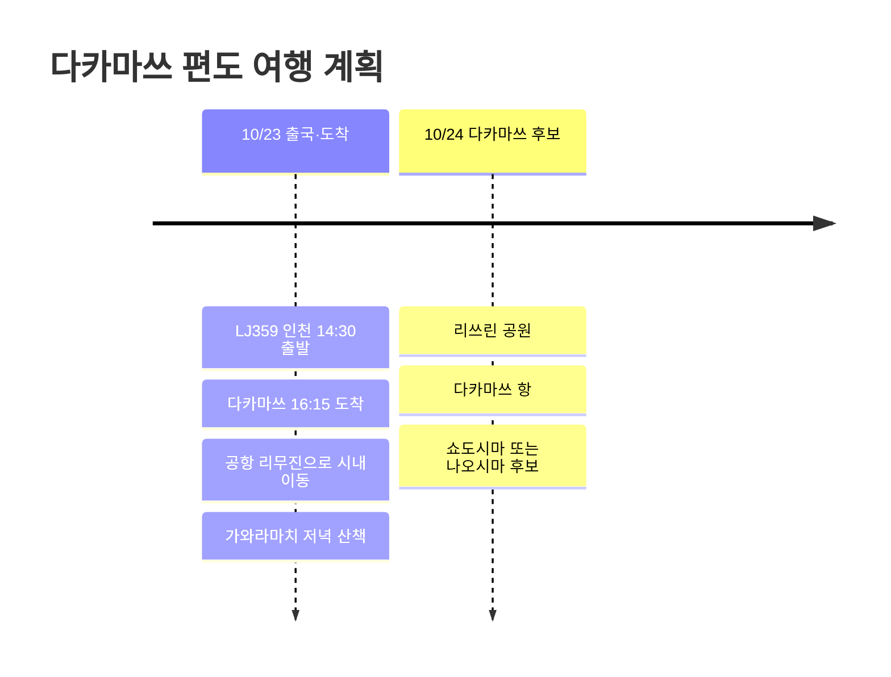

# 다카마쓰 편도 여행 계획

10월 23일, LJ359로 인천에서 다카마쓰로 들어가는 편도 일정. 돌아오는 편은 아직 없으니 이번 글은 도착일과 이어서 붙일 수 있는 다카마쓰 시내 후보 중심으로 정리한다.

## 여행 개요

- 날짜: 2026년 10월 23일
- 항공: LJ359 인천 → 다카마쓰
- 귀국편: 미정
- 메모: 다카마쓰 시내, 우동, 리쓰린 공원, 항구 기준 섬 일정 후보

## 일정 요약

| 날짜 | 지역 | 주요 일정 |
|------|------|----------|
| 10/23 | 인천, 다카마쓰 | LJ359 출국, 다카마쓰 공항 도착, 시내 이동, 가와라마치 저녁 |
| 10/24 | 다카마쓰 | 리쓰린 공원, 다카마쓰 항, 쇼도시마나 나오시마 후보 |

## 일정 타임라인

## 10/23 - 다카마쓰 도착

LJ359는 오후 출발이라 첫날은 도착 후 시내 적응 정도로 잡는 편이 좋다. 다카마쓰 공항에서 시내로 이동한 뒤, 다카마쓰역이나 가와라마치 주변에 짐을 두고 저녁을 먹는 흐름이 자연스럽다.

이번 일정은 귀국편이 아직 없으므로, 첫날에는 다음 일정의 방향을 열어두는 게 좋다. 시내에 계속 머물면 우동과 리쓰린 공원 중심으로 가볍고, 항구 쪽으로 잡으면 쇼도시마나 나오시마로 이어가기 쉽다.

## 10/24 - 다음 날 후보

다음 날은 리쓰린 공원을 오전에 넣고, 이후 다카마쓰 항으로 이동해 섬 일정 여부를 결정하는 구성이 무난하다. 이전 다카마쓰 여행에서 쇼도시마를 다녀온 기록이 있으니, 이번에는 나오시마나 테시마를 후보로 열어두는 것도 좋다.

귀국편이나 숙소가 확정되면 이 글에 항공편과 숙소, 교통비를 추가로 구조화하면 된다.
