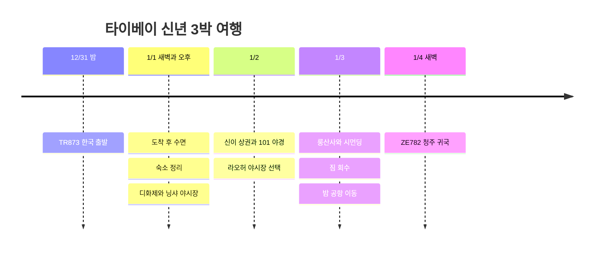

**12/31 한국 출발, 1/1 새벽 타이베이 도착, 1/4 새벽 청주행 비행기**다. 현지에서 쓸 수 있는 낮은 1/1∼1/3 사흘. 숙박은 **한 호텔 3박**과 **CU 1박＋저렴한 숙소 2박**을 비교 중이며 예약 완료로 표시하지 않았다.

조회 기준은 **2026-10-03**. 아래 방문 시각과 이동 여유는 계획값이며 항공권·호텔 예약 조건이 우선이다. 한국은 대만보다 1시간 빠르다.

## 일정 요약

| 날짜 | 동선 | 숙박·휴식 |
|---|---|---|
| 12/31 목 | 밤 TR873 출국 | 12/31부터 사용할 객실을 확보 |
| 1/1 금 | 새벽 도착 → 수면 → 숙소 이동 또는 연박 휴식 → 디화제 → 닝샤 야시장 | 첫날 오전 관광 생략 |
| 1/2 토 | 늦은 아침 → 신이·101 → 라오허 야시장 선택 | 같은 숙소 연박 |
| 1/3 일 | 체크아웃·짐 보관 → 룽산사 → 시먼딩 → 짐 회수 → 공항 MRT | 밤 22:30∼23:00 공항 도착 목표 |
| 1/4 월 | ZE782 타이베이 → 청주 | 아침 귀국 |

## 일정 타임라인

## 항공 시간과 신년 분위기

[TR873 날짜별 시간표](https://www.flight.info/TR873)는 **12/31 22:55 → 1/1 00:35**로, [다른 공개 시간표](https://zbordirect.com/en/tools/schedule?arrival_city=TPE&departure_city=SEL)는 **23:00 → 00:40**로 조회된다. 5분 차이는 항공권으로 확정하되, **두 자료 모두 자정 이후 공항 도착이어서 101 자정 카운트다운 현장 관람은 어렵다.**

[타이베이 공식 신년 행사 안내](https://www.travel.taipei/zh-tw/event-calendar/details/66403)는 **2026/12/1∼2027/1/1**을 행사 기간으로 안내한다. [공식 연간 행사표](https://www.travel.taipei/zh-cn/event-calendar/download)의 크리스마스 관련 행사는 **2027/1/31까지 잠정 일정**이다. 이 여행은 신이 거리의 연말 장식과 야경, 사찰 새해 인사, 야시장 분위기를 즐기는 구성이다. 1/2에도 카운트다운 공연이 열리는 것으로 해석하지 않으며, 설치물·점등 연장은 출발 전 공지로 확인한다. 디화제의 **춘절 연화대가**도 1월 1일 개최를 전제하지 않는다.

[ZE782 동계 공개 시간표](https://www.flight.info/ZE782)는 **1/4 02:35 출발 → 06:05 청주 도착**. **1/4 낮 관광이나 1/4 밤 공항 이동을 넣으면 안 된다.**

## 숙소 · 3박 연박과 1박＋2박 비교

| 선택 | 객실 예약 날짜 | 장점 | 비교할 점 |
|---|---|---|---|
| **한 호텔 3박 · 휴식 우선** | 12/31∼1/3, CU 또는 Twin Star Inn 중 총액·방 유형이 맞는 곳 | 새해 첫날 짐 이동·재체크인 없이 낮잠 가능 | 연말 첫날과 나머지 이틀의 총액, 취소 조건 비교 |
| **CU 1박＋Twin Star Inn 등 2박 · 절약안** | CU 12/31∼1/1, 두 번째 숙소 1/1∼1/3 | 비싼 날 1박만 쓰고 나머지를 저렴하게 구성 가능 | 퇴실∼다음 체크인 사이 객실 공백과 짐 이동 1회 |

**숙박 차액이 크지 않으면 3박 연박을 추천**한다. 새벽 도착 후 첫날 낮잠을 자고 싶을 수 있기 때문이다. 분리 숙박은 절약액에서 짐 이동 교통비를 뺀 뒤, 체크인 공백을 감수할 만할 때 선택한다. 실제 숙박료를 받기 전에는 어느 안이 더 싸다고 단정하지 않는다.

[CU 호텔](https://www.cuhotel.com.tw/en/taipei)은 **民生西路198號**, 닝샤 야시장 가까이 있다. [Twin Star Inn](https://www.tsitaipei.com/)은 **忠孝西路一段50號 B3**, 타이베이 메인역 앞이다. 공식 안내의 싱글룸은 **지하·창문 없음·공용 욕실**이고 24시간 셀프 체크인 기기가 있다. 개별 예약 객실 유형과 새벽 입실 절차를 확인한다.

**1/1 02∼03시경 실제 입실할 방은 12/31부터 예약**하고, 자정 이후 도착해도 객실을 유지해 달라고 전달한다. 입국 지연 시 호텔 연락 방법도 확보한다. 1/1 체크인 예약만으로 새벽 객실이 생기지는 않는다. 1/3 퇴실 후 저녁 짐 회수가 가능한지 확인하고, 불가하면 역의 보관함·유인 보관소를 이용한다.

## 1/1 · 수면 후 디화제와 닝샤 야시장

| 현지 목표 시간 | 일정·이동 여유 |
|---|---|
| 00:35∼02:00 | 입국·짐 수령. 오토게이트 등록이 있어도 수하물 대기 시간 확보 |
| 02:00∼03:15 | 택시·사전 예약 차량으로 숙소 이동·체크인. 공항 MRT 심야 운행을 전제하지 않음 |
| 03:15∼10:30 | 수면. 도착이 늦어지면 오후 관광을 더 줄임 |
| 10:30∼12:00 | 조식·정리. 분리 숙박이면 CU 예약상의 퇴실 시각 준수 |
| 12:00∼15:30 | 분리 숙박은 차량으로 짐 이동·점심·카페 후 다음 숙소 정규 체크인, 연박은 낮잠 |
| 15:30∼17:00 | 디화제와 샤하이 성황묘. 숙소에서 이동에 20∼30분 여유 |
| 17:00∼17:30 | 닝샤 방향으로 도보 15∼25분·자리 찾기 |
| 17:30∼19:00 | 야시장 저녁 → 숙소 복귀 |

[디화제 공식 소개](https://www.travel.taipei/immersive/zh-tw/a-0-1/)에 나오는 옛 상점가와 사찰을 한 구역으로 묶었다. 첫날은 전망대·근교 투어를 더하지 않는다. 호텔 이동이 길어지면 디화제를 줄이고 닝샤 저녁만 간다.

## 1/2 · 신이와 타이베이 101 야경

10:00∼11:00 늦은 아침 → 11:00∼12:00 MRT로 신이 이동 → 점심·쇼핑 → **14:30∼15:30 카페 휴식** → 16:00∼17:30 101 주변 해질녘 산책·야경 순서다. 전망대는 구름이 적고 가격이 예산에 맞을 때만 선택하며, 지상 산책만으로도 일정은 완성된다.

17:30∼18:00 라오허 방향 버스·차량 이동 후 **18:00∼19:30 야시장 저녁**. 두 야시장을 하루에 몰지 않았다. 환승이 번거롭거나 이미 많이 걸었으면 신이에서 저녁을 먹고 숙소로 돌아간다. 식당 대기가 **30분을 넘으면** 같은 구역의 다른 식당으로 바꾼다.

## 1/3 · 룽산사와 시먼딩 후 공항

10:00 전후 짐을 맡기고 체크아웃 → 11:00∼12:00 룽산사 → 12:00∼13:30 점심과 시먼딩 이동 → 13:30∼16:30 카페·쇼핑 → 17:00∼18:00 이른 저녁 → 18:00∼20:30 마사지 또는 실내 휴식 중 하나를 선택한다. 아종면선은 [완화구청 매장 안내](https://whdo.gov.taipei/News_Content.aspx?n=19CABBEF3F991E9E&s=C0811D8F9FC97E2E&sms=FE5F0DE8FA424CE8)의 **峨眉街8之1號** 지점으로 찾는다.

**20:30∼21:00 짐 회수, 21:30∼22:00 공항 MRT 출발, 22:30∼23:00 터미널 도착**을 목표로 한다. [급행 열차 자체 소요시간은 T1까지 약 35분](https://www.travel.taipei/en/information/taoyuanmetro)이지만 메인역 내 도보·대기·터미널 이동은 별도다. 출발 전 시간표와 항공권 터미널을 확인한다. 동선 지연 시 야식·쇼핑부터 줄이고 막차까지 기다리지 않는다.

## 재방문 추첨 · 첫 번째 신청

가오슝 방문 이력이 있으므로 재방문 조건을 확인해 신청한다. **e-Gate 등록은 자동출입국 절차이며 지원금 신청과 별개**다. [이민서 안내](https://www.immigration.gov.tw/5385/7445/7889/7892/50764/cp_news)에 따라 거류증이 없는 여행자는 등록 후에도 입국 전에 [TWAC](https://twac.immigration.gov.tw/?hl=ko-KR)를 작성한다.

[관광서 공식 규정](https://5000.taiwan.net.tw/campaign_rules_en.html) 기준 재방문상은 **NT$5,000 추첨**이다. 2023년 이후 등록 전날까지 입국 이력, 이번 체류 3∼90일 등 자격을 충족해야 한다. **이 여행 등록 기간은 대만 도착일 1/1 기준 2026/10/3∼12/25**. 매주 수요일 추첨에 참여하며 여행당 등록·당첨 각 1회다. 2월 여행은 별도로 등록하되 두 번 수령을 보장하지 않는다.

당첨 시 **입국 후 24시간 안에 이메일 링크로 귀국 항공권을 제출해 검증**하고, **검증 후 24시간 안에 여권과 교환 QR로 7-ELEVEN에서 수령**한다. 첫날 점심 전 처리 시간을 둔다. 예산 소진 시 종료될 수 있으며 당첨금을 확정 예산에 포함하지 않는다.

## 시간 조절 범위와 비용

| 상황 | 줄이거나 바꿀 일정 | 유지할 기준 |
|---|---|---|
| 새벽 도착 지연·수면 부족 | 1/1 디화제 생략, 닝샤 저녁만 | 객실과 수면 확보 |
| 비·강풍·저시정 | 101 전망대 대신 쇼핑몰·카페 | 같은 신이 구역 안에서 이동 |
| 야시장 혼잡 | 라오허 생략, 신이에서 저녁 | 한 끼를 위해 장시간 줄 서지 않기 |
| 숙소를 한 곳으로 결정 | 1/1 짐 이동·재체크인 삭제, 낮잠 추가 | 총 3박 |
| 마지막 날 피곤함 | 룽산사 또는 쇼핑 한 가지 생략 | 1/3 밤 공항 도착 |

항공료·숙박료는 아직 공유되지 않아 지출 합계에 넣지 않았다. 식비는 **하루 NT$400∼650를 계획 목표**로 두고, 숙박·교통·마사지·전망대는 별도 비교한다. 이 수치는 매장 가격표나 결제액이 아니다.

2월 재방문은 [시먼딩 맛집과 베이터우 힐링 일정](/posts/2027-02-26-taipei-healing-food/)으로 연결한다.
