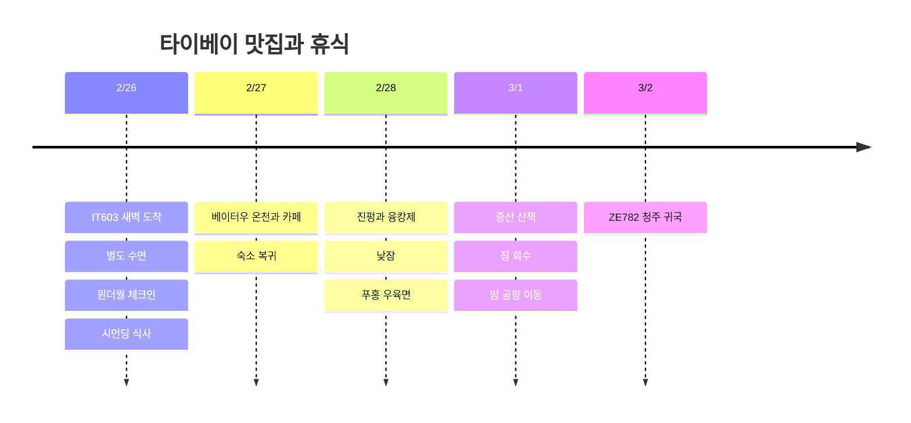

**원더월 시먼딩 2/26∼3/1 3박은 사용자 지정 일정**이다. 2/26 새벽 도착 직후 쓸 방은 별도로 필요하다. 첫 새벽은 추가 수면 숙소를 추천하고, 낮에는 가까운 맛집만 다닌다. 신년 여행에서 본 101·디화제에 다시 시간을 쓰기보다 **베이터우 하루와 숙소 근처 식사·휴식**에 집중한다.

**2026-10-03 조회 기준.** 식당·온천 방문은 추천이며 미예약, 시각은 여유를 포함한 계획값이다. 모든 현지 일정은 대만 시간이다.

## 일정 요약

| 날짜 | 동선 | 휴식 |
|---|---|---|
| 2/25 목 밤 | 인천공항 이동 | 2/26 자정 이후 출발 준비 |
| 2/26 금 | IT603 도착 → 별도 수면 숙소 → 점심 → 원더월 체크인 → 시먼딩 | 첫 새벽 수면＋체크인 후 낮잠 |
| 2/27 토 | 신베이터우 공원·카페·온천 → 시먼딩 | 먼 외출은 하루 한 구역 |
| 2/28 일 | 진펑 → 융캉제 → 숙소 휴식 → 푸홍 | 오후 2시간 이상 비우기 |
| 3/1 월 | 체크아웃·짐 보관 → 중산·츠펑제 → 짐 회수 → 공항 | 카페·마사지 중 하나로 저녁 휴식 |
| 3/2 화 | ZE782 청주 귀국 | 아침 도착 |

## 일정 타임라인

## 항공편과 숙박 날짜

[IT603 공개 시간표](https://www.flight.info/IT603)는 **2/26 00:30 인천 출발 → 02:15 타이베이 도착**이다. 공항에는 **2/25 밤**에 간다. [ZE782](https://www.flight.info/ZE782)는 **3/2 02:35 출발 → 06:05 청주 도착**으로 계획하고, 실제 항공권의 변경 안내를 우선한다.

| 구분 | 날짜 | 상태 |
|---|---|---|
| 원더월 시먼딩 | **2/26 체크인∼3/1 체크아웃, 3박** | 사용자 지정, 금액 미공유 |
| 첫 새벽 수면 후보 | **Twin Star Inn 2/25∼2/26, 추가 1박** | 추천·미예약. 실제 입실은 2/26 새벽 |
| 마지막 날 | 3/1 퇴실 후 밤 공항 이동 | 객실 추가 없이 짐 보관·실내 휴식 |

위 추가 객실을 선택하면 **원더월 3박＋새벽 수면용 1박으로 유료 객실은 총 4박**이다. 여행 카드의 3박은 현재 지정된 원더월 숙박 수를 표시한다. 원더월에 2/25 객실까지 연장하는 견적이 비슷하면 같은 호텔을 쓰는 편이 짐 이동을 줄인다. 2/26 예약의 무료 얼리 체크인만 기대하고 도착하지 않는다.

[Twin Star Inn 공식 안내](https://www.tsitaipei.com/)에는 **24시간 셀프 체크인 기기**, 지하 싱글룸·공용 욕실이 안내돼 있다. **2/26 04시경 도착·객실 유지·입실 코드·체크아웃 시간**을 확인한 뒤 예약하는 조건이다. 원더월 주소는 **西寧南路36號9樓之2**로 조회되며, 입구·객실 유형은 예약서와 대조한다. [원더월 위치 안내](https://newway-explore.com/b/wonderwall%E7%BE%8E%E5%A5%BD%E5%A2%83%E7%95%8C---%E5%8F%B0%E5%8C%97%E8%A5%BF%E9%96%80%E9%A4%A8)

공항 안에서 쉬고 싶다면 [CHO Stay](https://chostay.com/en/)는 **T2 남측 5층, 입국 후 이용하는 숙소** 후보지만, 공식 정규 체크인은 16:00 이후·체크아웃은 10:00 이전이다. 새벽 수용 여부를 확인하기 전에는 확정 수면 장소로 잡지 않는다. 추가 숙박비를 쓰지 않는 안은 공항 일반구역에서 대중교통 운행까지 쉬고 원더월에 짐을 맡기는 방식이지만, 침대 수면을 확보할 수 없어 힐링 목적의 기본안으로 추천하지 않는다.

## 2/26 · 수면 먼저, 시먼딩에서만 식사

| 현지 목표 시간 | 일정 |
|---|---|
| 02:15∼03:30 | 입국·수하물 수령 |
| 03:30∼04:45 | 택시·예약 차량으로 추가 수면 숙소 이동·입실 |
| 04:45∼11:00 | 수면, 숙소가 정한 퇴실 시각 준수 |
| 11:00∼12:00 | 짐 정리·원더월로 이동·보관 요청. 도보 부담이 있으면 차량 이용 |
| 12:00∼13:00 | 천천리에서 루러우판·계란·국 조합 또는 주변 식당 |
| 13:00∼15:00 | 카페에서 쉬고 원더월 예약서상의 체크인 시각에 맞춰 입실 |
| 체크인 후∼17:30 | 샤워·낮잠. 체크인이 늦어지면 저녁 산책을 줄임 |
| 18:00∼19:30 | 시먼딩 산책·가벼운 저녁 후 복귀 |

관광을 위해 6시간 수면을 줄이지 않는다. 첫날 점심 전에 당첨 검증과 수령을 처리할 시간도 둔다. 2/26 새벽 입국이면 다음 날 같은 시각까지라는 **24시간 기한**을 놓치지 않는다.

## 2/27 · 베이터우 반나절 온천

09:30∼10:30 아침 → 10:30∼11:30 **시먼→타이베이 메인역→베이터우→신베이터우** MRT 이동 → 11:30∼13:00 공원·점심 → 13:00∼14:30 온천 → 14:30∼15:30 차 한 잔 → 16:30 전후 숙소 복귀를 목표로 한다. 환승·도보까지 합쳐 편도 약 1시간을 계획 여유로 뒀다.

[타이베이 관광청은 베이터우를 온천·산책 지역으로 소개](https://www.travel.taipei/zh-tw/attraction/popular-area)한다. 온천은 **개인탕 60∼90분 또는 공동탕 중 하나**만 고르고, 실제 시설·요금·예약 가능 시간을 확인해 맞춘다. 박물관까지 모두 채우지 않고, 비가 오면 공원 대신 실내 카페 시간을 늘린다. **단수이·양명산을 같은 날 덧붙이지 않는다.**

## 2/28 · 중정기념당역에서 융캉제로

10:00 숙소 출발 → 11:00∼12:00 진펑 루러우판 → 12:00∼13:00 중정기념당 주변 짧은 산책 → 13:00∼15:00 둥먼·융캉제 카페와 디저트 → **15:30∼17:30 숙소 휴식** → 18:00∼19:00 푸홍 우육면 순서다. MRT 중정기념당→둥먼 한 정거장으로 연결하고, 숙소 근처에서 저녁을 해결한다.

2/28은 대만의 기념일과 겹치는 방문일이다. 해당 연도 행사·영업 공지가 나오면 방문 시간을 조정한다. 유료 행사나 특별 축제 개최를 확정하지 않았다.

## 가성비 식사 후보

| 매장·지역 | 주문 방향 | 일정에 넣는 방법 |
|---|---|---|
| **천천리 미식방 · 시먼딩** | 루러우판＋계란＋국 | 2/26 점심. 구청 안내 주소 漢中街32巷1號, 월요일은 피해서 배치 |
| **아종면선 · 시먼딩** | 작은 면선 한 그릇 | 숙소 주변에서 배고플 때 간식으로만 선택 |
| **진펑 루러우판 · 중정기념당역** | 작은 루러우판＋국·반찬 | 2/28 점심. 대기 20∼30분 넘으면 주변 식당으로 변경 |
| **푸홍 우육면 · 시먼딩 북쪽** | 우육면 한 그릇 | 2/28 저녁. 늦은 야식까지 추가하지 않음 |

주소 근거: [천천리 구청 소개](https://whdo.gov.taipei/News_Content.aspx?n=19CABBEF3F991E9E&s=EDF1F022618A79FC&sms=FE5F0DE8FA424CE8), [아종면선 완화구청 소개](https://whdo.gov.taipei/News_Content.aspx?n=19CABBEF3F991E9E&s=C0811D8F9FC97E2E&sms=FE5F0DE8FA424CE8), [진펑 매장 정보](https://tabelog.com/taiwan/A5403/A540307/54002578/), [푸홍 매장 정보](https://www.tripadvisor.com.tw/Restaurant_Review-g13806951-d8807417-Reviews-Fuhong_Beef_Noodles-Wanhua_Taipei.html). 메뉴 가격과 2027년 영업시간은 미확정이며, **식비 하루 NT$400∼650는 계획 목표**로만 잡는다. 온천·마사지·교통은 별도다.

## 3/1 · 중산 산책과 귀국 준비

오전 체크아웃·짐 보관 → 11:30∼14:00 중산역·츠펑제 점심과 카페 → 14:00∼16:00 쇼핑 → 시먼딩 복귀·이른 저녁 → 18:00∼20:30 카페 또는 마사지로 휴식한다. 체크아웃 이후 객실·샤워 이용은 포함된 것으로 가정하지 않는다.

**20:30∼21:00 짐 회수 → 21:30∼22:00 공항 MRT A1 출발 → 22:30∼23:00 공항 도착**. [급행 T1 이동 약 35분](https://www.travel.taipei/en/information/taoyuanmetro)에 역내 도보·대기 시간을 더한 계획이다. 시내 체크인 지원 여부는 확인되지 않아 공항 카운터 이용을 기본으로 한다. 3/2 02:35 출발까지 여유를 두며 마지막 날 근교 투어를 추가하지 않는다.

## 재방문 추첨 · 두 번째 신청

[공식 규정](https://5000.taiwan.net.tw/campaign_rules_en.html)의 여행별 등록 원칙에 따라, **2/26 도착분은 2026/11/28∼2027/2/19에 별도 등록**한다. 신년 여행 신청을 재사용하지 않는다. 가오슝에서 등록한 e-Gate와 추첨은 별개이며, **두 여행 모두 당첨돼야 두 번 수령**할 수 있다. 예산 소진·규정 변경도 확인한다.

당첨 시 입국 후 24시간 내 검증, 검증 후 24시간 내 수령 절차를 따른다. 상세 조건과 TWAC 링크는 [신년 여행의 재방문 안내](/posts/2026-12-31-taipei-new-year/#재방문-추첨--첫-번째-신청)를 함께 참고한다. 혜택이 없어도 가능한 식비·숙박 예산으로 계획한다.

## 시간 조절 범위

- **첫 새벽 침대 확보가 안 되면:** 2/26 관광을 모두 시먼딩에 한정하고 정규 체크인 이후 수면을 우선한다. 새벽 객실 예약을 추가하면 숙박 수·총액도 함께 갱신한다.
- **베이터우 예약이 비싸거나 매진이면:** 온천을 빼고 공원·카페만 다녀오거나 시먼딩 마사지·휴식으로 교체한다.
- **비·피로·식당 대기:** 그날 산책 1곳을 줄인다. 유명점 두 곳을 연속으로 기다리지 않는다.
- **마지막 날 짐 보관 불가:** 역 보관함·유인 보관소 운영시간을 확인해 짐 회수 동선을 먼저 정한다. 공항 이동 시각은 유지한다.

원더월 가격, 첫 새벽 추가 객실, 항공료와 온천·마사지 비용은 아직 미공유 또는 미예약으로 비용 합계에 넣지 않았다.
