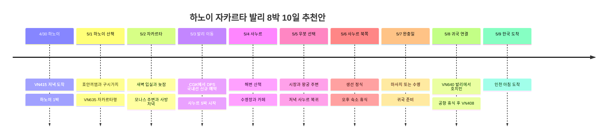

## 일정 요약

**2027년 4/30 출국, 5/8 발리에서 귀국편 탑승, 한국 도착은 5/9인 8박 10일 추천안**이다. 사용자 확인 루트는 **인천 → 하노이 → 자카르타 → 발리 → 호치민 → 인천**이다. 자카르타와 발리 사이 국내선 날짜·편명, 모든 숙소와 금액은 아직 미정이다.

하노이는 경유지 1박, 자카르타는 새벽 도착을 포함한 객실 2박, 발리는 사누르 한 숙소 5박으로 배치했다. 호텔 후보는 Accor 중심으로 골랐지만 예약 확정을 의미하지 않는다. 아래 이동 소요와 방문 시각은 여유를 둔 계획값이며 실제 교통·항공권에 따라 조정한다.

| 날짜 | 동선 | 수면·여유 |
|---|---|---|
| **4/30 금** | VN415 인천 → 하노이 → 숙소 | 하노이 1박, 도착 후 바로 휴식 |
| **5/1 토** | 호안끼엠·구시가지 → 짐 회수 → 하노이 공항 → VN635 | 자카르타 객실은 이날부터 예약 권장 |
| **5/2 일** | 자카르타 새벽 입실 → 늦잠 → 모나스 주변 → 사방 저녁 | 오후 수영·낮잠 2∼3시간 |
| **5/3 월** | 자카르타 → 발리 국내선 → 사누르 체크인 | 국내선 신규 예약 필요, 저녁은 숙소 근처 |
| **5/4 화** | 사누르 남쪽 해변 → 카페·젤라토 → 수영 | 숙소에서 쉬는 날 |
| **5/5 수** | 선택 우붓 왕궁 주변·시장·카페 → 사누르 | 장거리 외출은 이 날 하나만 |
| **5/6 목** | 사누르 북쪽 산책·생선 정식 → 숙소 휴식 | 우붓을 미뤘으면 이날과 교환 |
| **5/7 금** | 늦은 조식 → 마사지 또는 수영 → 짐 정리 | 완충일, 새 장거리 투어 추가는 선택 |
| **5/8 토** | 사누르 체크아웃 → DPS → VN640 → SGN → VN408 | 호치민 공항 환승 휴식·기내박 |
| **5/9 일** | 인천 도착 | 오전 이후 일정은 비워두기 |

## 일정 타임라인

## 항공편과 날짜 넘김

**시각은 2026-10-03 확인한 공개 시간표 기준이며 발권 내역이 우선**이다. 구조화 항공 기록에는 사용자 지정 날짜·편명·구간을 넣고, 조회 시각은 참고 메모로 남겼다. 하노이·자카르타·호치민은 UTC+7, 발리는 UTC+8, 한국은 UTC+9이므로 각 구간은 현지 시간으로 읽는다.

| 탑승일·편명 | 공개 시간표 참고 | 일정에 반영한 점 |
|---|---|---|
| 4/30 **VN415** | ICN 18:05 → HAN 20:35 | 하노이 첫날 야간 관광 생략 |
| 5/1 **VN635** | HAN 20:00 → **CGK 5/2 00:40** | 5/1 자카르타 숙박을 잡고 실제 새벽 도착을 호텔에 알리기 |
| **5/3 CGK → DPS 추천** | 편명·시각 미정, 별도 예약 필요 | 정오 전후 출발 후보 비교. 비행 약 2시간에 현지 시계는 1시간 추가 |
| 5/8 **VN640** | DPS 16:00 → SGN 18:40 | 발리 출발 공항은 DPS, 자카르타가 아님 |
| 5/8 **VN408** | SGN 23:45 → **ICN 5/9 06:40** | 종료일은 한국 도착일 5/9 |

조회 근거: [VN415](https://www.flight.info/VN415), [VN635](https://www.flight.info/VN635), [VN640](https://www.flight.info/VN640), [VN408](https://www.flight.info/VN408). 2027년 하계 시간표 구간을 참고했으며 추후 변경 가능하다.

**CGK → DPS 연결편 확보가 먼저다.** 이 구간은 기존 국제선에 포함됐다고 가정하지 않는다. 5/3 낮 항공편과 수하물 포함 총액을 비교하고 호텔 날짜를 맞춘다. 자카르타 출발 공항이 **CGK인지 HLP인지**도 확인한다. 이 추천안은 CGK 출발 기준이다.

## 숙소 배치 · 모두 미예약 후보

| 도시·추천 날짜 | 후보 | 선택 이유·예약할 때 확인 |
|---|---|---|
| 하노이 **4/30∼5/1 1박** | [Mercure Hanoi la Gare](https://all.accor.com/hotel/7049/index.en.shtml) | 94 Ly Thuong Kiet. 짧은 시내 체류용. 늦은 도착·다음 날 짐 보관 확인 |
| 자카르타 **5/1∼5/3 2박** | [Mercure Jakarta Sabang](https://all.accor.com/hotel/9414/index.en.shtml) | 사방 먹거리 거리와 모나스 인근, 수영장 있음. **5/2 새벽 도착**을 알려 5/1 예약이 노쇼 처리되지 않도록 확인 |
| 발리 **5/3∼5/8 5박** | [Mercure Resort Sanur](https://all.accor.com/hotel/5474/index.en.shtml) | 해변 접근과 수영장 2곳을 이용하는 휴식형 후보. 현재 공식 체크인 15:00·체크아웃 11:00 |

**추천 숙박 수는 1 + 2 + 5 = 8박**이며 귀국 기내박은 제외했다. 자카르타를 5/2 체크인으로만 예약하면 새벽 도착 즉시 입실이 보장되지 않는다. 5/1 밤 객실을 미리 확보하거나 확약된 유료 조기 입실 조건을 따로 받아야 한다.

Accor 플래티넘은 **2027년 투숙 시점의 등급·예약 조건·호텔별 제공 범위**로 확인한다. 조기 체크인, 레이트 체크아웃, 업그레이드나 라운지 이용을 확정 혜택으로 일정에 넣지 않았다. 호텔별 요금이 없어 현재는 비용 합계에 반영하지 않는다.

## 4/30∼5/1 · 하노이 스톱오버

4/30은 20:35 도착 참고 시각에서 입국·짐 수령과 공항 이동을 거쳐 **22:00∼23:00 숙소 도착 목표**로 잡는다. 지연 시 더 늦어질 수 있어 식당 예약은 두지 않는다.

5/1은 **09:00 체크아웃·짐 보관 → 09:30∼12:00 호안끼엠 호수 → 구시가지 산책**, 점심에 쌀국수나 분짜 한 끼, 오후에는 카페에서 쉬는 정도가 적당하다. 호수와 구시가지를 묶는 도보 동선은 [베트남 관광청 안내](https://vietnam.travel/things-to-do/explore-old-quarter-your-way)를 참고했다. 박물관·서호·외곽 투어까지 넓히지 않는다.

**15:00∼15:30 숙소로 돌아와 짐 회수 → 15:30∼16:00 공항 출발 → 17:00 공항 도착 목표**다. 공개 시간표상 20:00 국제선이므로 시내 점심을 길게 먹어도 공항 출발은 미루지 않는다. 4/30·5/1 연휴 수요와 도로 혼잡에 대비해 차량 도착 예상이 늦으면 더 일찍 출발한다.

## 5/2 · 자카르타에서 수면 회복

VN635가 00:40 도착하면 입국·짐·차량 이동 뒤 **02:00∼03:00경 호텔 도착을 계획상 여유로 둔다**. 고정 체크인 시각이나 공항 이동 보장이 아니다. 오전 일정은 비워 늦잠을 잔다.

**11:30 브런치 → 13:00∼14:00 모나스 주변 산책 → 14:00∼17:00 숙소 수영·낮잠 → 18:00∼20:00 잘란 사방 저녁**으로 숙소 중심에서 움직인다. 모나스 전망대는 대기·입장 가능 여부를 보고 선택한다. 전망대 대기가 길거나 더우면 주변 구경만 하고 돌아간다. 이날 코타투아와 남부 쇼핑몰까지 추가하면 차 안에서 보내는 시간이 늘어 기본안에서는 뺐다.

사방에서는 **사테 + 나시고렝**, 배가 남으면 마르타박을 고르는 식으로 두세 메뉴를 나눠 먹는다. [인도네시아 관광청](https://www.indonesia.travel/in/en/travel-ideas/gastronomy/explore-jakarta-s-street-food)이 사방 거리를 저녁 먹거리 지역으로 안내한다. 특정 가게에 긴 줄이 생기면 같은 거리의 가까운 가게로 바꾼다.

## 5/3 · 국내선 이동 후 사누르 한 곳에 정착

**CGK 12:00∼14:00 출발 항공편을 검색하는 것을 추천**한다. 이 시간은 예약된 비행편이 아니다. 확정되면 출발 2시간 전 공항 도착에 시내 이동 1∼2시간을 더해 호텔 출발을 역산한다. 자카르타와 발리의 시차를 포함하면 사누르 체크인은 오후 늦게 될 수 있다.

발리 공항에서 사누르까지 차량 이동은 **45∼90분을 계획 여유로 두고**, 교통 상황에 따라 더 늘릴 수 있다. 도착일은 체크인·해변 짧은 산책·근처 저녁까지만 진행한다. 우붓으로 먼저 올라갔다가 다시 사누르로 옮기는 숙소 이동은 기본안에 넣지 않았다.

## 5/4∼5/7 · 사누르 휴식과 하루짜리 우붓

| 날짜 | 오전 | 오후·저녁 | 조절 가능한 범위 |
|---|---|---|---|
| **5/4 화** | 08:00∼09:30 남쪽 해변 산책·조식 | 12:00∼15:00 실내 휴식 → 수영 → Massimo 젤라토 선택 | 첫날부터 북쪽 해변 끝까지 왕복하지 않기 |
| **5/5 수** | 08:30 차량 출발 → 우붓 왕궁 주변·시장 | 점심·카페 → **15:00∼15:30 사누르행 출발** | 왕복 이동 각 1.5∼2.5시간 계획. 논·폭포는 추가하지 않기 |
| **5/6 목** | 10:30 사누르 북쪽으로 차량 이동 → Mak Beng 점심 → 해변 | 14:00 전후 숙소 복귀·수영·낮잠 | 우붓 비 예보가 크면 5/5와 맞바꾸기 |
| **5/7 금** | 늦은 조식·자유 산책 | 마사지 또는 수영 → 짐 정리·이른 저녁 | 몸이 피곤하면 종일 숙소에서 쉬기 |

[사누르](https://www.indonesia.travel/id/en/destination/bali-nusa-tenggara/bali)는 일출을 볼 수 있는 해변이다. **일몰이 바다 너머로 지는 일정으로 잡지 않고**, 기상 시간이 맞으면 해 뜨기 전 산책을 선택한다. 해안 산책과 호텔 수영을 분리해 바다 상태가 좋지 않아도 휴식 일정이 유지되게 했다.

[우붓 시장](https://www.indonesia.travel/id/id/destination/bali-nusa-tenggara/bali/ubud-traditional-market)은 왕궁 주변과 묶어 걷고, 시장 쇼핑이 길어지면 카페 시간을 줄인다. 우붓 이동이 부담되면 당일 코스 전체를 취소해도 이후 숙박·비행 연결에는 영향이 없다. 누사페니다 등 배를 타는 종일 투어는 이 안에 더하지 않았다.

### 멀리 가지 않는 식사 후보

- **Warung Mak Beng:** 사누르 북쪽 Jalan Hang Tuah No.45. 생선튀김·생선탕·밥 구성으로 점심을 먹는 후보다. [인도네시아 관광청 소개](https://www.indonesia.travel/gb/en/travel-ideas/gastronomy/warung-mak-beng)를 근거로 넣었다. 남쪽 호텔에서 바로 걸어갈 가까운 식당은 아니므로 북쪽 해변에 가는 5/6에 묶고 차량을 이용한다.
- **Massimo:** Jalan Danau Tamblingan No.228. [공식 메뉴·주소 안내](https://www.massimobali.com/our-menus/)를 확인했다. 식사는 선택, 5/4 오후 젤라토 간식 정도로 넣는다. 이탈리안 식당이므로 현지식 가성비 식사와는 따로 생각한다.

영업시간과 가격은 2027년 방문 전에 다시 확인한다. 추천 식당·호텔은 방문 기록이나 결제 완료 항목으로 등록하지 않았다.

## 5/8∼5/9 · 발리 출발과 호치민 공항 환승

**08:00∼09:30 조식·마지막 산책 → 10:30 짐 정리 → 11:00 체크아웃 → 11:00∼11:30 공항 출발**로 잡는다. 목표는 **DPS 국제선 터미널에 13:00까지 도착**, 공개 시간표상 VN640 16:00 출발이다. 당일 차량 예상이 90분보다 길면 출발을 앞당긴다. 레이트 체크아웃이 가능하더라도 공항 출발 시간을 늦추는 용도로 쓰지 않는다.

호치민은 공개 시간표상 **18:40 도착 → 23:45 출발, 환승 간격 5시간 5분**이다. 수속과 탑승 전 대기를 빼면 시내 왕복보다 **공항 식사·휴식**이 잘 맞는다. 라운지는 이용 가능한 카드·항공권 조건이 있을 때만 선택하고 무료 이용을 가정하지 않는다.

발리에서 **인천까지 수하물 연결 여부와 VN408 탑승권 발급**을 확인한다. 두 편의 동일 예약·연결 발권 여부가 미공유이므로 베트남 입국 없이 환승이 된다고 단정하지 않는다. 별도 발권으로 짐 회수·재수속이 필요하면 베트남 입국 조건과 수속 동선을 항공사에 확인하고, 시내 외출은 생략한다. 도착 지연 시 다음 편 안내를 먼저 확인한다.

## 시간 조절 범위와 다음 확정 순서

| 상황 | 조절할 내용 | 유지할 내용 |
|---|---|---|
| 하노이 도착 지연·수면 부족 | 5/1 오전 산책을 점심 이후 1시간으로 축소 | 공항 17:00 도착 목표 |
| 자카르타에서 피곤함 | 모나스 생략, 호텔 수영·사방 저녁만 | 5/3 국내선 이동일 |
| 국내선 가격·시간이 좋지 않음 | 5/3 대신 5/4 이동도 가능, 자카르타 3박·발리 4박으로 교체 | 5/8은 반드시 DPS에서 출발 |
| 우붓 교통·날씨 부담 | 5/5와 5/6 교환하거나 우붓 전체 생략 | 사누르 연박과 귀국 전날 휴식 |
| 발리 귀국일 정체 | 마지막 해변 산책 생략, 공항 조기 출발 | VN640 수속·탑승 |

다음 순서는 **국제선 실제 시각·연결 발권 조건 확인 → CGK∼DPS 국내선 확보 → 새벽 입실 가능한 자카르타 숙소 → 발리·하노이 숙소**다. 호텔·국내선·이동·식비는 금액을 받으면 비용표에 추가한다.
