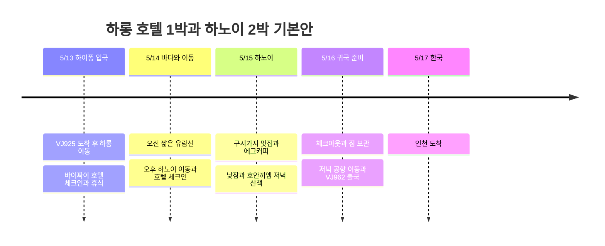

## 일정 요약

**하롱베이 1박 → 하노이 2박을 기본안**으로 잡는다. 아직 숙소를 고민 중이므로 여기서 하롱 1박은 **바이짜이 지역 호텔 숙박**으로 제안한다. 바다에서 자는 숙박 크루즈는 아래 대안과 비교해서 정하면 된다. 항공편·탑승일은 사용자 지정, 숙소·유람선·식당은 미예약 제안이다.

| 날짜 | 이동과 일정 | 숙박·확정 상태 |
|---|---|---|
| **5/13 목** | VJ925 하이퐁 도착 → 하롱 바이짜이 이동 → 체크인·낮잠 → 바닷가 산책·저녁 | 하롱 호텔 1박 후보 |
| **5/14 금** | 오전 4시간 유람선 → 짐 회수 → 오후 하노이 이동 → 호텔 휴식·호안끼엠 야경 | 하노이 1박째 후보 |
| **5/15 토** | 쌀국수·성요셉 성당 → 호수·에그커피 → 분짜 → 낮잠 → 구시가지 저녁 | 하노이 2박째 후보 |
| **5/16 일** | 늦은 조식 → 체크아웃·짐 보관 → 느긋한 식사·카페 → 공항 → VJ962 | 밤 출국·기내 이동 |
| **5/17 월** | 인천 도착 | 공개 시간표 기준 다음 날 도착 |

## 일정 타임라인

모든 시각은 해당 도시 현지 시간이다. 2026-10-03 확인한 2027년 하계 공개 시간표는 [VJ925 인천 07:15 → 하이퐁 09:55](https://www.flight.info/VJ925), [VJ962 하노이 23:15 → 인천 다음 날 05:30](https://www.flight.info/VJ962)다. **5/16은 베트남 출발일, 한국 도착은 5/17**로 계획한다. 실제 항공권·항공사 변경 안내가 우선이며, 숙박 수 3박에는 귀국 기내 이동을 포함하지 않았다.

## 숙박 배분과 크루즈 선택

| 안 | 5/13 | 5/14 | 5/15 | 선택 기준 |
|---|---|---|---|---|
| **기본안 · 하롱 1박 + 하노이 2박** | 하롱 호텔 | 하노이 호텔 | 하노이 호텔 | 첫날 비행 지연을 흡수하고 하노이에서 이틀 연속 쉬기 좋음. 5/14 오전 유람선 별도 |
| **바다 숙박 우선 대안** | 하롱 호텔 | 1박 크루즈 | 하노이 호텔 | 선상 일몰·아침을 보고 싶을 때. 하노이 숙박은 1박으로 줄고 5/15 오후 도착 |

도착 당일 숙박 크루즈 연결은 기본안에 넣지 않는다. [Indochine Premium은 11:30∼11:45 접수](https://www.indochinasails.com/en/tour/ha-long-indochine-premium-1-night.html), [Orchid는 11:00∼11:30 접수](https://www.orchidcruises.com/schedule/itinerary-2-days-1-night/)를 안내한다. 09:55 착륙 후 입국·수하물·육로 이동까지 고려하면 여유가 부족하다. 늦은 탑승을 받아 준다는 운영사의 명시적 확인 없이 연결 가능한 일정으로 보지 않는다.

호텔은 **하롱은 바이짜이, 하노이는 호안끼엠 주변 또는 하노이역 동쪽**으로 모으면 이동이 단순해진다. [노보텔 하롱베이](https://all.accor.com/hotel/6185/index.en.shtml)는 160 Ha Long Road의 바이짜이 숙소 후보, [머큐어 하노이 라 가르](https://all.accor.com/hotel/7049/index.en.shtml)는 94 Ly Thuong Kiet의 하노이 2박 후보로 둔다. 두 호텔 모두 미예약이며 최저가라고 단정하지 않는다. 같은 날짜의 조식 포함 총액·취소 조건을 구시가지 호텔과 비교한다. 플래티넘 회원 혜택도 호텔별 제공 시설과 당일 가능 여부를 확인하며 조기 입실·레이트 체크아웃을 확정 일정으로 계산하지 않는다.

## 5/13 목 · 하이퐁에서 하롱으로, 첫날은 휴식

| 계획 시간 | 일정 | 조절 범위 |
|---|---|---|
| 09:55∼11:30 | 하이퐁 도착·입국·수하물 수령 | 공개 도착 시각 기준의 계획 여유. 지연되면 이후 일정을 순서대로 미룸 |
| 11:30∼13:30 | 공항 → 하롱 바이짜이 숙소 | 차량 90∼120분을 확보하는 계획값. 실제 교통·차량 집결에 따라 변동 |
| 13:30∼15:00 | 짐 보관·점심·객실 준비 대기 | 체크인은 예약 조건에 따름 |
| 15:00∼17:00 | 체크인·샤워·낮잠 | 첫날 핵심 휴식 구간 |
| 17:00∼19:30 | 바이짜이 바닷가 짧은 산책·해산물 또는 편한 저녁 | 비가 오면 숙소 식사·카페로 대체 |

하이퐁 시내 식사나 관광을 먼저 끼우면 짐을 싣고 정차가 늘어난다. 이번에는 공항에서 하롱으로 바로 가고, 첫날 관광은 숙소 주변으로 한정한다. 공항 픽업은 목적지를 **바이짜이의 실제 숙소 주소**로 지정하고 통행료·대기료·차량 단독 이용 여부를 확인한다. 금액과 이동 시간은 견적을 받은 뒤 확정한다.

## 5/14 금 · 오전 바다, 오후 하노이

**08시대 출항 → 12시경 귀항하는 4시간 유람선**을 기준으로 잡는다. [Vivu Halong 상품](https://vivuhalong.com/en/tour/halong-bay-day-tour-4-hour-cruise/)은 바이짜이 호텔 07:00∼07:30 픽업, Ha Long International Port 출항, 티엔꿍 동굴·바항 구간, 선상 점심 후 11:50∼12:10 귀항을 안내한다. 이는 현재 판매 일정이며 **2027-05-14 운영·포함 항목·숙소 픽업은 예약 전에 확인**한다. 투안쩌우항에서 출발하는 다른 상품과 항구를 혼동하지 않는다.

| 계획 시간 | 일정 | 연결 조건 |
|---|---|---|
| 06:15∼07:00 | 간단한 조식·체크아웃·짐 보관 | 조식 시작 전이면 전날 간단한 먹거리 준비. 호텔과 짐 보관 합의 |
| 07:00∼12:30 | 픽업·4시간 유람선·숙소 복귀 | 카약은 선택, 피곤하면 선상 휴식. 짐은 호텔에 보관 |
| 12:30∼13:30 | 짐 회수·화장실·차량 탑승 여유 | 귀항 직후 촉박한 버스 연결을 피함 |
| 13:30∼17:00 | 하롱 → 하노이 호텔 | 정차·시내 진입 포함 3∼3.5시간 계획 여유, 실제 배차 확인 |
| 17:00∼18:30 | 호텔 체크인·휴식 | 도착이 늦으면 산책을 생략 |
| 18:30∼20:30 | 가까운 저녁·호안끼엠 호수 짧은 산책 | 종일 이동 후에는 한 구역만 방문 |

호텔 복귀 후 출발하는 차량을 고르면 짐을 선박에 싣는 문제를 줄일 수 있다. 합승 리무진은 숙소 픽업·하노이 하차 주소·짐 허용량을 확인하고, 해당 시간대 배차가 없으면 전용차 비용과 비교한다. **오전 상품이 운영되지 않아 6∼8시간 주간 크루즈로 바꾸면 하노이 도착을 저녁으로 늦추고 야경 일정을 삭제**한다.

## 5/15 토 · 하노이 구시가지 맛집과 낮잠

숙소 → **포 10 리꾸옥수 → 성요셉 성당 → 호수 서쪽·북쪽 → 카페 지앙 → 분짜 닥킴 → 숙소** 순서로 한 바퀴 돈다. 구시가지와 호안끼엠은 도보로 묶기 좋은 구역이다. [베트남 관광청 구시가지 안내](https://vietnam.travel/things-to-do/explore-old-quarter-your-way)

| 계획 시간 | 일정 | 가볍게 조절하기 |
|---|---|---|
| 08:30∼09:30 | 포 10 리꾸옥수 아침 | 숙소 조식을 충분히 먹으면 쌀국수는 다음 날로 이동 |
| 09:30∼10:45 | 성요셉 성당 외관 → 호수 주변 산책 | 그늘·카페 중심, 더우면 도보 구간 축소 |
| 10:45∼11:45 | 카페 지앙 에그커피 | 39 Nguyen Huu Huan 지점 기준 |
| 12:00∼13:00 | 분짜 닥킴 점심 | 대기가 길면 주변 분짜 식당으로 변경 |
| 13:30∼16:30 | 호텔 낮잠·휴식 | 오전 동선을 압축해도 이 구간은 유지 |
| 17:30∼20:30 | 구시가지 저녁·호수 야경 | 타히엔 거리 분위기 구경은 체력이 남으면 30∼60분만 추가 |

[포 10 리꾸옥수](https://guide.michelin.com/ph/en/ha-noi/ha-noi_2974158/restaurant/pho-10-ly-quoc-su)는 **10 Ly Quoc Su**의 쌀국수집, [분짜 닥킴](https://guide.michelin.com/us/en/ha-noi/ha-noi_2974158/restaurant/bun-cha-%C4%91ac-kim)은 **1 Hang Manh**의 분짜집이다. [카페 지앙 공식 안내](https://cafegiang.vn/pages/about-us)에 맞춰 **39 Nguyen Huu Huan** 지점을 선택했다. 식당 가격과 영업은 방문 전 다시 확인하고, 이름이 비슷한 다른 가게로 안내되지 않도록 주소를 함께 확인한다.

## 5/16 일 · 체크아웃 후 여유 있게 출국

아침부터 외곽 투어를 넣기보다 호안끼엠 주변에서 식사·카페·기념품 쇼핑을 마무리한다. **숙소 체크아웃과 짐 보관은 예약 조건대로**, 이후에는 쉴 곳이 필요하므로 14:00∼17:00에 카페 또는 별도 데이유스 객실을 선택할 수 있게 둔다. 레이트 체크아웃·체크아웃 후 샤워는 가능하다는 호텔 답변을 받았을 때만 사용한다.

| 계획 시간 | 일정 |
|---|---|
| 09:00∼12:00 | 조식·체크아웃·짐 보관, 놓친 쌀국수나 카페 한 곳 |
| 12:00∼17:00 | 점심·실내 휴식·가벼운 쇼핑, 필요하면 데이유스 |
| 17:00∼18:30 | 이른 저녁 → 숙소에서 짐 회수·정리 |
| **18:45∼19:00** | 숙소에서 공항으로 출발 목표 |
| **20:00∼20:15** | 노이바이 국제선 터미널 도착 목표 |
| 23:15 | VJ962 출발 참고 시각 → 5/17 인천 05:30 도착 참고 |

시내 → 공항은 교통과 픽업 대기를 포함해 **60∼90분 계획 여유**를 잡았다. 출국 당일 항공편 시각이 바뀌면 **출발 3시간 전 공항 도착**을 기준으로 역산한다. 공항 출발 전 마지막 일정을 외곽에 두지 않는다.

## 시간 조절 범위

| 상황 | 유지할 것 | 줄이거나 바꿀 것 |
|---|---|---|
| 첫날 도착 지연 | 하롱 숙소 이동·식사·수면 | 해변 산책 삭제, 크루즈 당일 연결 시도 안 함 |
| 선박 운항 취소·바다 상태 악화 | 숙소 휴식과 하노이 이동 | 유람선 취소 조건 확인 후 하노이 조기 이동 또는 실내 카페 |
| 오전 유람선 매진 | 하롱 1박·하노이 2박 | 긴 주간 크루즈와 하노이 저녁 도착을 선택하거나 유람선 생략 |
| 숙박 크루즈를 우선 | 5/14 크루즈 승선·5/15 하선 | 하노이 1박으로 변경, 5/15 맛집 도보 코스는 5/16 일부만 |
| 걷기 피곤하거나 더움 | 점심·오후 호텔 휴식 | 오전 식당·카페 중 1곳 생략, 구간 Grab 이동 |
| 귀국편 변경 | 공항 도착 여유 | 5/16 카페·쇼핑 시간을 먼저 축소 |

## 예약과 비용 상태

현재 공유된 항공권·호텔·크루즈 결제 금액이 없어 **비용 합계는 만들지 않았다**. 호텔도 아직 확정 예약으로 기록하지 않는다.

다음 결정을 하면 일정이 구체화된다. 먼저 **하롱 호텔 1박 + 하노이 2박**을 유지할지, **하롱 호텔 1박 + 숙박 크루즈 1박 + 하노이 1박**으로 바꿀지 정한다. 기본안을 택하면 5/14 오전 유람선 운항과 짐 보관, 13:30 이후 하노이 차량 연결을 함께 확인한다. 그다음 호텔 총액·조식·취소 조건, 공항 픽업과 크루즈의 포함 항목을 비교한다. 위 시간표는 예약 마감 시각을 제외하면 일정 배치를 위한 목표 시간이다.
